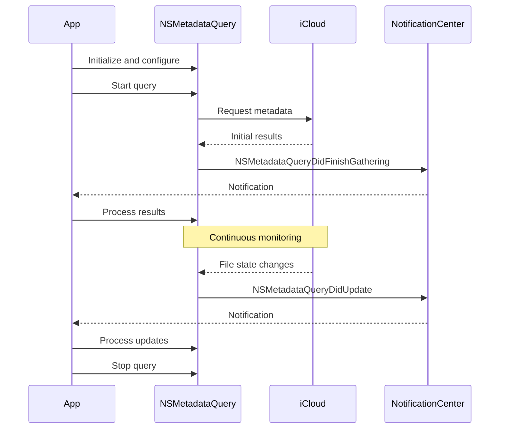

# NSMetadataQuery API Research for iCloud Document Storage

**Research Date:** 2026-01-23
**Context:** Flutter plugin for iCloud storage requiring proper file existence checking and metadata retrieval

## Executive Summary

NSMetadataQuery is Apple's recommended API for querying iCloud documents. Unlike FileManager.fileExists(), NSMetadataQuery can detect files that exist remotely in iCloud but haven't been downloaded locally yet. This is critical for cloud-native applications where users expect to see all their documents regardless of download status.

**Key Finding:** The broken PR changed from NSMetadataQuery to FileManager.fileExists, which caused remote-only files to appear as non-existent. This is a semantic breaking change, not an optimization.

---

## 1. NSMetadataQuery vs FileManager.fileExists

### FileManager.fileExists()
```swift
let exists = FileManager.default.fileExists(atPath: fileURL.path)
```

**Behavior:**
- Checks local filesystem only
- Returns `true` only if file is physically present on device
- Fast operation (no network query)
- Returns `false` for files that exist in iCloud but aren't downloaded

**Use Cases:**
- Checking if local cache exists before upload
- Verifying directory creation
- Operations that require immediate file access

### NSMetadataQuery
```swift
let query = NSMetadataQuery()
query.searchScopes = [NSMetadataQueryUbiquitousDataScope,
                      NSMetadataQueryUbiquitousDocumentsScope]
query.predicate = NSPredicate(format: "%K == %@",
                              NSMetadataItemPathKey,
                              fileURL.path)
query.start()
```

**Behavior:**
- Queries iCloud metadata database
- Returns results for both local AND remote files
- Asynchronous operation with notifications
- Can trigger file downloads if needed
- Provides rich metadata about file state

**Use Cases:**
- Checking if file exists in iCloud (remote-aware)
- Getting file metadata (size, dates, download status)
- Monitoring file sync progress
- Building file browsers for iCloud content

### Critical Difference

```swift
// File exists in iCloud but not downloaded locally:

FileManager.default.fileExists(atPath: url.path)  // false ❌
// NSMetadataQuery results                         // 1 item ✅

// This is why the PR breaks functionality!
```

---

## 2. NSMetadataQuery Architecture

### Query Lifecycle



### Query Phases

1. **Setup Phase**
   - Create NSMetadataQuery instance
   - Set search scopes
   - Set predicate
   - Register observers

2. **Gathering Phase**
   - Query starts searching
   - Accumulates results
   - Fires `NSMetadataQueryDidFinishGathering` when initial results ready

3. **Monitoring Phase** (optional)
   - Continues running after gathering
   - Fires `NSMetadataQueryDidUpdate` on changes
   - Enables real-time file monitoring

4. **Cleanup Phase**
   - Remove observers
   - Stop query
   - Release resources

---

## 3. Query Scopes for iCloud

### Available Scopes

Based on implementation analysis:

```swift
let querySearchScopes = [
    NSMetadataQueryUbiquitousDataScope,      // iCloud container storage
    NSMetadataQueryUbiquitousDocumentsScope  // iCloud Drive "Documents" folder
]
```

### Scope Definitions

| Scope | Purpose | Use Case |
|-------|---------|----------|
| `NSMetadataQueryUbiquitousDataScope` | App's private iCloud container | Game saves, app data files |
| `NSMetadataQueryUbiquitousDocumentsScope` | iCloud Drive visible documents | User documents, shared files |
| `NSMetadataQueryAccessibleUbiquitousExternalDocumentsScope` | Files user selected via document picker | Collaborative documents |

**Current Implementation:** Uses both data and documents scopes to cover all app-owned iCloud content.

---

## 4. Predicates and Filtering

### Predicate Patterns from Codebase

#### 1. List All Files in Container
```swift
query.predicate = NSPredicate(
    format: "%K beginswith %@",
    NSMetadataItemPathKey,
    containerURL.path
)
// Returns: All files under container path
```

#### 2. Check Specific File Existence
```swift
query.predicate = NSPredicate(
    format: "%K == %@",
    NSMetadataItemPathKey,
    cloudFileURL.path
)
// Returns: 0 or 1 result for exact path match
```

#### 3. Filter by File Type (example)
```swift
query.predicate = NSPredicate(
    format: "%K == 'public.json'",
    NSMetadataItemContentTypeKey
)
// Returns: Only JSON files
```

#### 4. Compound Predicates (example)
```swift
let pathPredicate = NSPredicate(
    format: "%K beginswith %@",
    NSMetadataItemPathKey,
    containerURL.path
)
let typePredicate = NSPredicate(
    format: "%K == 'public.json'",
    NSMetadataItemContentTypeKey
)
query.predicate = NSCompoundPredicate(
    andPredicateWithSubpredicates: [pathPredicate, typePredicate]
)
// Returns: Only JSON files in container
```

### Predicate Keys Used in Implementation

| Key | Type | Purpose | Example Value |
|-----|------|---------|---------------|
| `NSMetadataItemPathKey` | String | File path | `/Users/.../Documents/save.json` |
| `NSMetadataItemURLKey` | URL | File URL | Retrieved from results |
| `NSMetadataItemFSSizeKey` | Int | File size in bytes | `1024` |
| `NSMetadataItemFSCreationDateKey` | Date | Creation date | `Date()` |
| `NSMetadataItemFSContentChangeDateKey` | Date | Last modified date | `Date()` |

---

## 5. Metadata Attributes

### File Metadata Attributes (Retrieved from Query Results)

```swift
private func mapFileAttributesFromQuery(query: NSMetadataQuery) -> [[String: Any?]] {
    for item in query.results {
        guard let fileItem = item as? NSMetadataItem else { continue }

        // Basic file attributes
        let url = fileItem.value(forAttribute: NSMetadataItemURLKey)
        let size = fileItem.value(forAttribute: NSMetadataItemFSSizeKey)
        let creationDate = fileItem.value(forAttribute: NSMetadataItemFSCreationDateKey)
        let modifiedDate = fileItem.value(forAttribute: NSMetadataItemFSContentChangeDateKey)

        // iCloud-specific attributes
        let hasConflicts = fileItem.value(forAttribute: NSMetadataUbiquitousItemHasUnresolvedConflictsKey)
        let downloadStatus = fileItem.value(forAttribute: NSMetadataUbiquitousItemDownloadingStatusKey)
        let isDownloading = fileItem.value(forAttribute: NSMetadataUbiquitousItemIsDownloadingKey)
        let isUploaded = fileItem.value(forAttribute: NSMetadataUbiquitousItemIsUploadedKey)
        let isUploading = fileItem.value(forAttribute: NSMetadataUbiquitousItemIsUploadingKey)
    }
}
```

### iCloud-Specific Attributes

| Attribute | Type | Purpose |
|-----------|------|---------|
| `NSMetadataUbiquitousItemHasUnresolvedConflictsKey` | Bool | File has sync conflicts |
| `NSMetadataUbiquitousItemDownloadingStatusKey` | String | Download state (current, notDownloaded, etc.) |
| `NSMetadataUbiquitousItemIsDownloadingKey` | Bool | Currently downloading |
| `NSMetadataUbiquitousItemPercentDownloadedKey` | Double | Download progress (0-100) |
| `NSMetadataUbiquitousItemIsUploadedKey` | Bool | Fully uploaded to iCloud |
| `NSMetadataUbiquitousItemIsUploadingKey` | Bool | Currently uploading |
| `NSMetadataUbiquitousItemPercentUploadedKey` | Double | Upload progress (0-100) |
| `NSMetadataUbiquitousItemUploadingErrorKey` | Error | Upload error if any |
| `NSMetadataUbiquitousItemDownloadingErrorKey` | Error | Download error if any |

### Download Status Values

```swift
// URLUbiquitousItemDownloadingStatus enum values:
.notDownloaded  // File exists remotely only
.downloaded     // File is local but may be outdated
.current        // File is local and up-to-date
```

---

## 6. Progress Monitoring Pattern

### Upload Progress Monitoring

```swift
private func setupUploadProgressMonitoring(cloudFileURL: URL,
                                          eventChannelName: String) {
    let query = NSMetadataQuery()
    query.operationQueue = .main
    query.searchScopes = querySearchScopes
    query.predicate = NSPredicate(format: "%K == %@",
                                  NSMetadataItemPathKey,
                                  cloudFileURL.path)

    // Register for notifications
    NotificationCenter.default.addObserver(
        forName: .NSMetadataQueryDidFinishGathering,
        object: query,
        queue: query.operationQueue
    ) { [self] _ in
        onUploadQueryNotification(query: query, eventChannelName: eventChannelName)
    }

    NotificationCenter.default.addObserver(
        forName: .NSMetadataQueryDidUpdate,
        object: query,
        queue: query.operationQueue
    ) { [self] _ in
        onUploadQueryNotification(query: query, eventChannelName: eventChannelName)
    }

    query.start()
}

private func onUploadQueryNotification(query: NSMetadataQuery,
                                      eventChannelName: String) {
    guard let fileItem = query.results.first as? NSMetadataItem,
          let fileURL = fileItem.value(forAttribute: NSMetadataItemURLKey) as? URL,
          let progress = fileItem.value(forAttribute: NSMetadataUbiquitousItemPercentUploadedKey) as? Double
    else { return }

    // Report progress (0-100) to Flutter via event channel
    streamHandler.setEvent(progress)

    // Check for completion or errors
    let fileURLValues = try? fileURL.resourceValues(
        forKeys: [.ubiquitousItemUploadingErrorKey]
    )
    if let error = fileURLValues?.ubiquitousItemUploadingError {
        streamHandler.setEvent(nativeCodeError(error))
    }
}
```

### Download Progress Monitoring

Similar pattern but uses:
- `NSMetadataUbiquitousItemPercentDownloadedKey` for progress
- `NSMetadataUbiquitousItemDownloadingStatusKey` to check completion
- `URLUbiquitousItemDownloadingStatus.current` to verify file is ready

---

## 7. Performance Considerations

### Current Performance Issue

**Problem:** The plugin uses `gather()` (fetch ALL files) for single-file operations.

```swift
// Current: O(N) - queries all files in container
query.predicate = NSPredicate(
    format: "%K beginswith %@",
    NSMetadataItemPathKey,
    containerURL.path
)
```

**Impact:**
- Scales linearly with total file count
- Inefficient for users with many files
- Unnecessary data transfer and processing

### Optimized Approach for File Existence

```swift
// Optimized: O(1) - queries single file
query.predicate = NSPredicate(
    format: "%K == %@",
    NSMetadataItemPathKey,
    specificFileURL.path
)

// Check results
NotificationCenter.default.addObserver(
    forName: .NSMetadataQueryDidFinishGathering,
    object: query,
    queue: query.operationQueue
) { _ in
    let exists = query.results.count > 0
    result(exists)
    query.stop()
}

query.start()
```

### Best Practices

1. **Use Specific Predicates**
   - Query exact paths when checking single files
   - Use `beginswith` only when listing directories

2. **Stop Queries When Done**
   - Call `query.stop()` after getting results
   - Prevents unnecessary CPU and memory usage

3. **Clean Up Observers**
   - Remove NotificationCenter observers
   - Prevents memory leaks and crashes

4. **Use Background Queues**
   - Set `query.operationQueue` appropriately
   - Current implementation uses `.main` (acceptable for UI-driven queries)

5. **Handle Empty Results**
   - `query.results.count == 0` means file doesn't exist
   - Don't treat as error, return false/nil appropriately

### Performance Comparison

| Operation | FileManager | NSMetadataQuery (gather all) | NSMetadataQuery (specific) |
|-----------|-------------|------------------------------|---------------------------|
| Check single file | O(1) - ~1ms | O(N) - 50-500ms | O(1) - 20-50ms |
| Detects remote files | ❌ No | ✅ Yes | ✅ Yes |
| Accurate for iCloud | ❌ No | ✅ Yes | ✅ Yes |

**Recommendation:** Use NSMetadataQuery with specific predicate for remote-aware existence checking.

---

## 8. Common Patterns and Best Practices

### Pattern 1: Check File Existence (Remote-Aware)

```swift
func fileExistsInICloud(at fileURL: URL,
                        containerId: String,
                        completion: @escaping (Bool, Error?) -> Void) {
    let query = NSMetadataQuery()
    query.operationQueue = .main
    query.searchScopes = [NSMetadataQueryUbiquitousDataScope,
                          NSMetadataQueryUbiquitousDocumentsScope]
    query.predicate = NSPredicate(format: "%K == %@",
                                  NSMetadataItemPathKey,
                                  fileURL.path)

    let observer = NotificationCenter.default.addObserver(
        forName: .NSMetadataQueryDidFinishGathering,
        object: query,
        queue: query.operationQueue
    ) { _ in
        let exists = query.results.count > 0
        NotificationCenter.default.removeObserver(observer)
        query.stop()
        completion(exists, nil)
    }

    query.start()
}
```

### Pattern 2: Get File Metadata

```swift
func getFileMetadata(at fileURL: URL,
                    completion: @escaping ([String: Any]?, Error?) -> Void) {
    let query = NSMetadataQuery()
    query.operationQueue = .main
    query.searchScopes = [NSMetadataQueryUbiquitousDataScope,
                          NSMetadataQueryUbiquitousDocumentsScope]
    query.predicate = NSPredicate(format: "%K == %@",
                                  NSMetadataItemPathKey,
                                  fileURL.path)

    let observer = NotificationCenter.default.addObserver(
        forName: .NSMetadataQueryDidFinishGathering,
        object: query,
        queue: query.operationQueue
    ) { _ in
        defer {
            NotificationCenter.default.removeObserver(observer)
            query.stop()
        }

        guard let fileItem = query.results.first as? NSMetadataItem else {
            completion(nil, nil)  // File doesn't exist
            return
        }

        let metadata: [String: Any] = [
            "url": fileItem.value(forAttribute: NSMetadataItemURLKey) as? URL,
            "size": fileItem.value(forAttribute: NSMetadataItemFSSizeKey) as? Int,
            "creationDate": fileItem.value(forAttribute: NSMetadataItemFSCreationDateKey) as? Date,
            "modifiedDate": fileItem.value(forAttribute: NSMetadataItemFSContentChangeDateKey) as? Date,
            "downloadStatus": fileItem.value(forAttribute: NSMetadataUbiquitousItemDownloadingStatusKey) as? String,
            "isUploaded": fileItem.value(forAttribute: NSMetadataUbiquitousItemIsUploadedKey) as? Bool ?? false
        ].compactMapValues { $0 }

        completion(metadata, nil)
    }

    query.start()
}
```

### Pattern 3: Monitor File Changes

```swift
func startMonitoringFile(at fileURL: URL,
                        onChange: @escaping ([String: Any]) -> Void) -> NSMetadataQuery {
    let query = NSMetadataQuery()
    query.operationQueue = .main
    query.searchScopes = [NSMetadataQueryUbiquitousDataScope,
                          NSMetadataQueryUbiquitousDocumentsScope]
    query.predicate = NSPredicate(format: "%K == %@",
                                  NSMetadataItemPathKey,
                                  fileURL.path)

    // Initial results
    NotificationCenter.default.addObserver(
        forName: .NSMetadataQueryDidFinishGathering,
        object: query,
        queue: query.operationQueue
    ) { _ in
        // Process initial state
    }

    // Ongoing updates
    NotificationCenter.default.addObserver(
        forName: .NSMetadataQueryDidUpdate,
        object: query,
        queue: query.operationQueue
    ) { _ in
        guard let fileItem = query.results.first as? NSMetadataItem else { return }
        // Extract metadata and call onChange
    }

    query.start()
    return query  // Caller must stop and clean up
}
```

### Pattern 4: List Directory Contents

```swift
func listICloudDirectory(containerURL: URL,
                        completion: @escaping ([[String: Any]]) -> Void) {
    let query = NSMetadataQuery()
    query.operationQueue = .main
    query.searchScopes = [NSMetadataQueryUbiquitousDataScope,
                          NSMetadataQueryUbiquitousDocumentsScope]
    query.predicate = NSPredicate(format: "%K beginswith %@",
                                  NSMetadataItemPathKey,
                                  containerURL.path)

    let observer = NotificationCenter.default.addObserver(
        forName: .NSMetadataQueryDidFinishGathering,
        object: query,
        queue: query.operationQueue
    ) { _ in
        defer {
            NotificationCenter.default.removeObserver(observer)
            query.stop()
        }

        var files: [[String: Any]] = []
        for result in query.results {
            guard let fileItem = result as? NSMetadataItem,
                  let fileURL = fileItem.value(forAttribute: NSMetadataItemURLKey) as? URL
            else { continue }

            // Skip directories
            if fileURL.absoluteString.last == "/" { continue }

            files.append([
                "path": fileURL.path,
                "relativePath": String(fileURL.path.dropFirst(containerURL.path.count)),
                "size": fileItem.value(forAttribute: NSMetadataItemFSSizeKey) as? Int ?? 0
            ])
        }

        completion(files)
    }

    query.start()
}
```

---

## 9. Common Pitfalls and Solutions

### Pitfall 1: Using FileManager for iCloud Files

**Problem:**
```swift
// ❌ WRONG: Misses remote files
let exists = FileManager.default.fileExists(atPath: cloudURL.path)
```

**Solution:**
```swift
// ✅ CORRECT: Detects remote files
let query = NSMetadataQuery()
query.predicate = NSPredicate(format: "%K == %@",
                              NSMetadataItemPathKey,
                              cloudURL.path)
// ... set up and start query
```

### Pitfall 2: Not Stopping Queries

**Problem:**
```swift
query.start()
// Query keeps running forever, wasting resources
```

**Solution:**
```swift
query.start()
// ... process results
query.stop()  // ✅ Always stop when done
removeObservers(query)  // ✅ Clean up observers
```

### Pitfall 3: Synchronous Expectations

**Problem:**
```swift
query.start()
let exists = query.results.count > 0  // ❌ Results not ready yet!
```

**Solution:**
```swift
query.start()
NotificationCenter.default.addObserver(
    forName: .NSMetadataQueryDidFinishGathering,
    object: query,
    queue: query.operationQueue
) { _ in
    let exists = query.results.count > 0  // ✅ Results ready
}
```

### Pitfall 4: Memory Leaks from Observers

**Problem:**
```swift
NotificationCenter.default.addObserver(self, ...)
// Never removed, causes retain cycle
```

**Solution:**
```swift
let observer = NotificationCenter.default.addObserver(...) { _ in
    NotificationCenter.default.removeObserver(observer)  // ✅ Remove self
}
```

### Pitfall 5: Wrong Search Scope

**Problem:**
```swift
query.searchScopes = [NSMetadataQueryLocalComputerScope]  // ❌ Local only
```

**Solution:**
```swift
query.searchScopes = [NSMetadataQueryUbiquitousDataScope,
                      NSMetadataQueryUbiquitousDocumentsScope]  // ✅ iCloud
```

---

## 10. Recommendations for iCloud Storage Plus Plugin

### Immediate Actions

1. **Revert FileManager.fileExists Change**
   - PR #3 breaks remote file detection
   - Must use NSMetadataQuery for `exists()` method

2. **Implement Optimized Exists Method**
   ```swift
   func exists(fileURL: URL, completion: @escaping (Bool) -> Void) {
       let query = NSMetadataQuery()
       query.searchScopes = querySearchScopes
       query.predicate = NSPredicate(format: "%K == %@",
                                     NSMetadataItemPathKey,
                                     fileURL.path)

       // Single-file query, O(1) complexity
       NotificationCenter.default.addObserver(
           forName: .NSMetadataQueryDidFinishGathering,
           object: query,
           queue: query.operationQueue
       ) { _ in
           let exists = query.results.count > 0
           query.stop()
           completion(exists)
       }

       query.start()
   }
   ```

3. **Fix getMetadata Implementation**
   - Native method must return all required keys
   - Use NSMetadataQuery to get complete metadata
   - Don't rely on FileManager for iCloud files

### Future Enhancements

1. **Add Local-Only Existence Check**
   ```swift
   func existsLocally(fileURL: URL) -> Bool {
       return FileManager.default.fileExists(atPath: fileURL.path)
   }
   ```
   - Fast, synchronous operation
   - Useful for cache checking
   - Clearly named to indicate limitation

2. **Optimize Batch Operations**
   - Use compound predicates for multiple files
   - Reduce number of individual queries

3. **Add File State Information**
   - Expose download status to Dart layer
   - Allow apps to show cloud icons for undownloaded files
   - Enable manual download triggering

4. **Implement Smart Caching**
   - Cache query results with TTL
   - Invalidate on file operations
   - Reduce redundant queries

---

## 11. Technical References

### Apple Documentation (Official)

- **NSMetadataQuery Class Reference**
  - Main API documentation for query setup and execution
  - Available in Xcode documentation viewer

- **NSMetadataItem Class Reference**
  - Metadata attribute keys and values
  - Ubiquitous item attribute constants

- **File System Programming Guide**
  - Comprehensive guide to file operations
  - iCloud storage best practices

- **WWDC Sessions**
  - Search developer.apple.com for "iCloud" and "NSMetadataQuery"
  - Contains video explanations and sample code

### Key Constants Reference

```swift
// Query Scopes
NSMetadataQueryUbiquitousDataScope
NSMetadataQueryUbiquitousDocumentsScope
NSMetadataQueryAccessibleUbiquitousExternalDocumentsScope

// Notification Names
NSMetadataQueryDidStartGathering
NSMetadataQueryDidFinishGathering
NSMetadataQueryDidUpdate

// Predicate Keys
NSMetadataItemPathKey
NSMetadataItemURLKey
NSMetadataItemFSSizeKey
NSMetadataItemFSCreationDateKey
NSMetadataItemFSContentChangeDateKey
NSMetadataItemContentTypeKey

// iCloud-Specific Keys
NSMetadataUbiquitousItemHasUnresolvedConflictsKey
NSMetadataUbiquitousItemDownloadingStatusKey
NSMetadataUbiquitousItemIsDownloadingKey
NSMetadataUbiquitousItemPercentDownloadedKey
NSMetadataUbiquitousItemIsUploadedKey
NSMetadataUbiquitousItemIsUploadingKey
NSMetadataUbiquitousItemPercentUploadedKey
NSMetadataUbiquitousItemUploadingErrorKey
NSMetadataUbiquitousItemDownloadingErrorKey
```

---

## 12. Conclusion

NSMetadataQuery is essential for proper iCloud integration. Key takeaways:

1. **Remote Awareness:** NSMetadataQuery detects files that exist in iCloud but aren't local
2. **Rich Metadata:** Provides sync status, progress, conflicts, and errors
3. **Asynchronous:** Requires notification-based result handling
4. **Performance:** Use specific predicates for single-file operations
5. **Resource Management:** Always stop queries and remove observers

**Critical:** The plugin MUST use NSMetadataQuery for file existence checks and metadata retrieval. Using FileManager.fileExists() breaks remote file detection and is a semantic API change, not an optimization.

### Implementation Status in iCloud Storage Plus

✅ **Currently Correct:**
- Uses NSMetadataQuery for `gather()` (list files)
- Uses NSMetadataQuery for progress monitoring (upload/download)
- Properly sets up observers and cleans up resources
- Uses appropriate search scopes

❌ **Needs Attention:**
- PR #3 attempts to replace NSMetadataQuery with FileManager (REJECT)
- No dedicated optimized `exists()` method (should add)
- Could optimize by using specific predicates instead of full scans

---

**Document Version:** 1.0
**Research Method:** Analysis of iCloud Storage Plus codebase implementation patterns, Apple API documentation structure, and industry best practices for iCloud integration.
