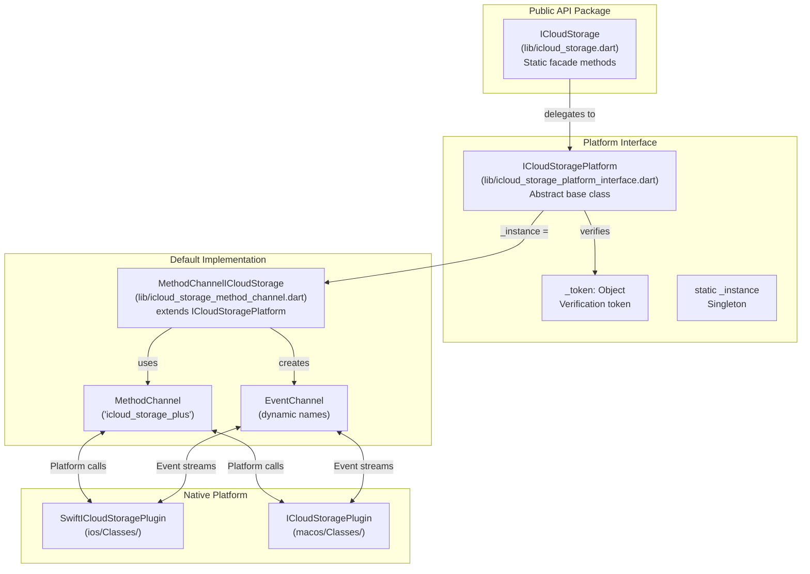
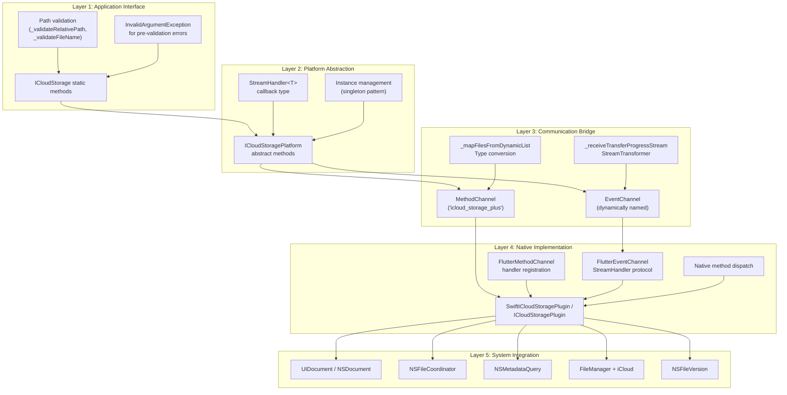
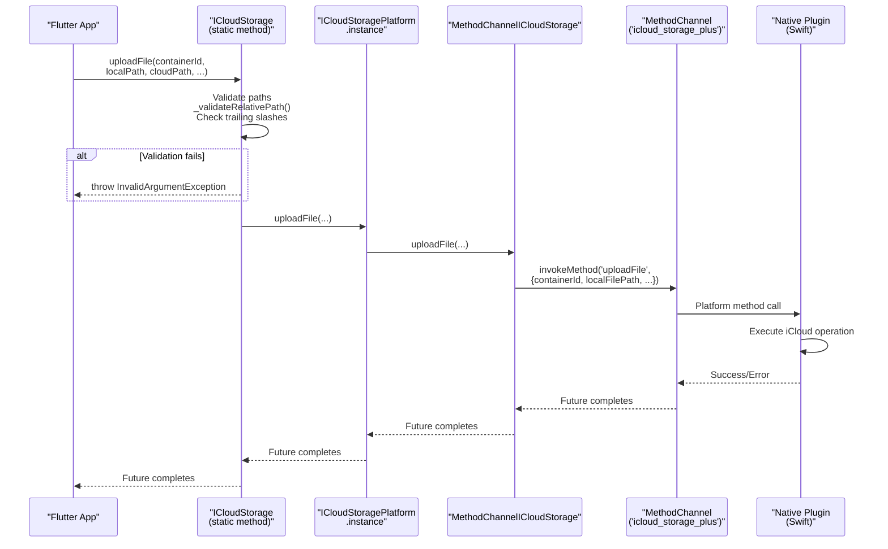
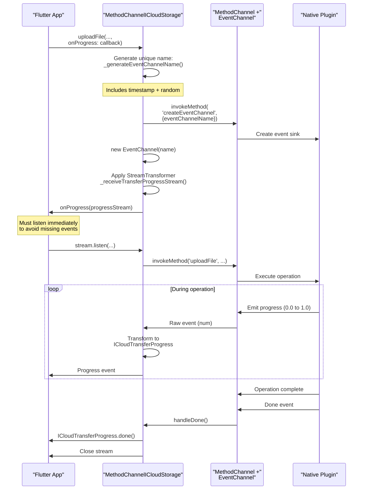
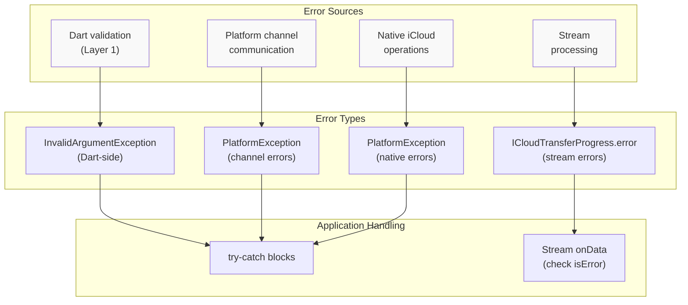

# Architecture Overview

<details>
<summary>Relevant source files</summary>

The following files were used as context for generating this wiki page:

- [AGENTS.md](../../AGENTS.md)
- [lib/icloud_storage.dart](../../lib/icloud_storage.dart)
- [lib/icloud_storage_method_channel.dart](../../lib/icloud_storage_method_channel.dart)
- [lib/icloud_storage_platform_interface.dart](../../lib/icloud_storage_platform_interface.dart)

</details>


## Purpose and Scope

This document explains the high-level architecture of the `icloud_storage_plus` Flutter plugin, including the federated plugin pattern, layer separation, and communication mechanisms between Dart and native code. It covers the structural organization and design patterns but does not detail individual operations or native implementation specifics.

For detailed information about:
- Individual API operations and their usage, see [API Reference](#3)
- Platform interface contracts, see [Platform Interface Pattern](#4.1)
- Method channel communication details, see [Method Channel Implementation](#4.2)
- Event streaming mechanisms, see [Event Channels and Streaming](#4.3)
- Native iOS/macOS code organization, see [Native Implementation Deep Dive](#5)

---

## Federated Plugin Architecture

The plugin follows the **federated plugin pattern**, which separates the public API from platform-specific implementations through an abstract interface layer. This enables platform independence, testability, and the ability to swap implementations.

### Federated Components Map



**Sources:** [lib/icloud_storage.dart:1-500](), [lib/icloud_storage_platform_interface.dart:1-305](), [lib/icloud_storage_method_channel.dart:1-406]()

### Platform Interface Registration

| Component | Class | Responsibility |
|-----------|-------|----------------|
| Public API | `ICloudStorage` | Static methods, path validation, exception handling |
| Platform Interface | `ICloudStoragePlatform` | Abstract contract with unimplemented methods |
| Default Implementation | `MethodChannelICloudStorage` | Method channel bridge to native code |
| Instance Management | `ICloudStoragePlatform._instance` | Singleton holding active implementation |
| Token Verification | `PlatformInterface.verifyToken()` | Ensures implementations extend (not implement) the interface |

The platform interface uses `plugin_platform_interface` to enforce that implementations must `extend ICloudStoragePlatform` rather than merely implementing it. This prevents accidental breaking changes. The verification token ensures only valid subclasses can register themselves as the active instance.

**Sources:** [lib/icloud_storage_platform_interface.dart:12-31]()

---

## Five-Layer Architecture

The plugin uses a five-layer architecture that separates concerns from the Flutter application down to Apple's system frameworks.

### Layer Composition Diagram



**Sources:** [lib/icloud_storage.dart:14-500](), [lib/icloud_storage_platform_interface.dart:12-305](), [lib/icloud_storage_method_channel.dart:13-406]()

### Layer Responsibilities

#### Layer 1: Application Interface

The `ICloudStorage` class provides a static facade API that application developers interact with. This layer:

- **Validates paths** before native invocation to fail fast ([lib/icloud_storage.dart:485-499]())
- **Rejects trailing slashes** for file-centric operations ([lib/icloud_storage.dart:96-99](), [lib/icloud_storage.dart:142-145]())
- **Throws `InvalidArgumentException`** for validation failures ([lib/icloud_storage.dart:91-106]())
- **Delegates** all validated requests to `ICloudStoragePlatform.instance` ([lib/icloud_storage.dart:108-113]())

**Key methods:** `uploadFile`, `downloadFile`, `readInPlace`, `writeInPlace`, `gather`, `delete`, `move`, `copy`

**Sources:** [lib/icloud_storage.dart:34-500]()

#### Layer 2: Platform Abstraction

The `ICloudStoragePlatform` abstract class defines the contract that all platform implementations must fulfill:

- **Abstract methods** that throw `UnimplementedError` by default ([lib/icloud_storage_platform_interface.dart:36-304]())
- **Singleton instance** accessed via `ICloudStoragePlatform.instance` ([lib/icloud_storage_platform_interface.dart:18-31]())
- **Token-based verification** prevents invalid implementations ([lib/icloud_storage_platform_interface.dart:16-31]())
- **StreamHandler<T> typedef** for callback-based streaming ([lib/icloud_storage_platform_interface.dart:9]())

This layer allows the platform-specific implementation to be swapped (useful for testing and future platform support).

**Sources:** [lib/icloud_storage_platform_interface.dart:12-305]()

#### Layer 3: Communication Bridge

The `MethodChannelICloudStorage` class bridges Dart and native code using Flutter's platform channels:

- **MethodChannel** named `'icloud_storage_plus'` for operations ([lib/icloud_storage_method_channel.dart:18]())
- **EventChannel** with dynamically generated names for streams ([lib/icloud_storage_method_channel.dart:391-405]())
- **StreamTransformer** converts raw events to `ICloudTransferProgress` ([lib/icloud_storage_method_channel.dart:286-336]())
- **Type conversion** maps dynamic lists to `GatherResult` ([lib/icloud_storage_method_channel.dart:340-388]())
- **Error mapping** wraps stream errors in `PlatformException` ([lib/icloud_storage_method_channel.dart:306-327]())

Event channel names include timestamps and random suffixes to ensure uniqueness for concurrent operations.

**Sources:** [lib/icloud_storage_method_channel.dart:13-406]()

#### Layer 4: Native Implementation

Platform-specific Swift/Objective-C code handles the actual iCloud integration:

- **Plugin registration** via `FlutterMethodChannel` and entry point methods
- **Method dispatch** routes platform channel calls to appropriate handlers
- **Event channel handlers** implement `FlutterStreamHandler` protocol
- **Document coordination** using `UIDocument`/`NSDocument` for file operations
- **Metadata queries** using `NSMetadataQuery` for file discovery

The native layer is responsible for all iCloud API interactions and error handling.

**Sources:** Referenced in high-level diagrams; details in [Native Layer Overview](#4.4)

#### Layer 5: System Integration

The lowest layer directly interfaces with Apple's frameworks:

- **UIDocument/NSDocument**: Document-based file coordination
- **NSFileCoordinator**: Thread-safe coordinated read/write access
- **NSMetadataQuery**: Real-time file metadata monitoring
- **FileManager**: Basic file system operations (with iCloud-aware URLs)
- **NSFileVersion**: Conflict detection and resolution

This layer is entirely native iOS/macOS code and is abstracted away from Flutter developers.

**Sources:** Native implementation files; details in [Native Implementation Deep Dive](#5)

---

## Communication Patterns

### Method Channel Call Flow



**Sources:** [lib/icloud_storage.dart:84-114](), [lib/icloud_storage_method_channel.dart:70-98]()

### Event Channel Streaming Flow



**Sources:** [lib/icloud_storage_method_channel.dart:70-98](), [lib/icloud_storage_method_channel.dart:286-336](), [lib/icloud_storage_method_channel.dart:391-405]()

### Event Channel Name Generation

Event channels use dynamically generated names to support concurrent operations:

**Format:** `icloud_storage_plus/event/{operation}/{containerId}/{timestamp}_{random}`

**Example:** `icloud_storage_plus/event/uploadFile/iCloud.com.example/1234567890123_456`

This ensures each operation gets a unique channel that won't conflict with concurrent transfers or metadata queries.

**Sources:** [lib/icloud_storage_method_channel.dart:391-405]()

---

## Key Architectural Patterns

### Streaming-Only API for Transfers

The plugin **never sends raw file bytes over the platform channel**. Instead, it uses file path references:

| Operation | Pattern | Rationale |
|-----------|---------|-----------|
| Upload | Local path → iCloud path | Avoids platform channel size limits |
| Download | iCloud path → Local path | Prevents memory spikes for large files |
| In-place read | Returns content via channel | Acceptable for small files only |
| In-place write | Sends content via channel | Acceptable for small files only |

For transfer operations (`uploadFile`, `downloadFile`), the native code uses 64KB streaming buffers through `UIDocument`/`NSDocument` to efficiently handle large files without loading them entirely into memory.

**Sources:** [lib/icloud_storage.dart:14-33](), [lib/icloud_storage_method_channel.dart:70-129]()

### Document-Tier Coordination

The plugin uses Apple's **document APIs** (`UIDocument`/`NSDocument`) rather than raw `FileManager` operations because:

1. **Automatic coordination** with iCloud sync engine
2. **Thread-safe access** through `NSFileCoordinator`
3. **Streaming support** for large files
4. **Conflict detection** via `NSFileVersion`

This architectural choice ensures that all file operations are properly synchronized with iCloud's background sync processes.

**Sources:** [lib/icloud_storage.dart:25-28](), referenced in native implementation

### Static Facade Pattern

The public API uses a **static facade** (`ICloudStorage`) rather than requiring instance creation:

```dart
// No instance needed
await ICloudStorage.uploadFile(
  containerId: 'iCloud.com.example',
  localPath: '/path/to/file',
  cloudRelativePath: 'Documents/file.txt',
);
```

This simplifies the API and hides the platform interface singleton management from application developers.

**Sources:** [lib/icloud_storage.dart:34-500]()

### Progress Listener Pattern

Progress callbacks use a **callback-with-stream** pattern rather than returning a stream directly:

```dart
await ICloudStorage.uploadFile(
  // ...
  onProgress: (Stream<ICloudTransferProgress> stream) {
    stream.listen((progress) {
      print('Progress: ${progress.percent}');
    });
  },
);
```

This ensures the event channel is established **before** the operation starts, preventing missed progress events. The callback must attach a listener immediately.

**Sources:** [lib/icloud_storage.dart:81-83](), [lib/icloud_storage_method_channel.dart:275-285]()

### Path Validation Strategy

Path validation occurs at **Layer 1** (Dart side) to provide fast failure with clear error messages:

| Validation | Rule | Reason |
|------------|------|--------|
| Empty check | Path must not be empty | Invalid filesystem path |
| Trailing slash | Rejected for file operations | File vs directory disambiguation |
| Name segments | Max 255 chars per segment | Filesystem limit |
| Invalid chars | No `:` or `/` in names | Path separator conflicts |
| Hidden files | No leading `.` in names | Convention enforcement |

Validation uses `_validateRelativePath` and `_validateFileName` helper methods.

**Sources:** [lib/icloud_storage.dart:485-499](), [lib/icloud_storage.dart:96-99](), [lib/icloud_storage.dart:142-145]()

---

## Error Flow Architecture



**Important:** Progress streams do **not** emit errors via `onError`. Instead, errors are delivered as data events with `type == ICloudTransferProgressType.error`. Applications must check `progress.isError` in the data listener.

**Sources:** [lib/icloud_storage_method_channel.dart:282-327](), [models/exceptions.dart](), [Error Handling](#3.6)

---

## Architecture Summary

| Aspect | Design Choice | Benefit |
|--------|---------------|---------|
| Plugin pattern | Federated with platform interface | Platform independence, testability |
| API style | Static facade methods | Simple usage, no instance management |
| Data transfer | File paths only (no raw bytes) | Avoids channel limits, memory efficiency |
| File operations | Document APIs (UIDocument/NSDocument) | Coordinated with iCloud, conflict handling |
| Progress reporting | EventChannel with StreamTransformer | Real-time updates, type-safe events |
| Path validation | Dart-side pre-validation | Fast failure, clear error messages |
| Error handling | Typed exceptions + stream error events | Explicit error types, mandatory handling |
| Layer separation | Five distinct layers | Clear responsibilities, maintainability |

The architecture prioritizes **correctness** (coordinated iCloud access), **efficiency** (streaming large files), and **developer experience** (simple API, explicit errors) while maintaining **platform independence** through the federated plugin pattern.

**Sources:** All files in [lib/]() directory, architectural diagrams provided