# Event Channels and Streaming

<details>
<summary>Relevant source files</summary>

The following files were used as context for generating this wiki page:

- [ios/Classes/iOSICloudStoragePlugin.swift](../../ios/Classes/iOSICloudStoragePlugin.swift)
- [lib/icloud_storage_method_channel.dart](../../lib/icloud_storage_method_channel.dart)
- [macos/Classes/macOSICloudStoragePlugin.swift](../../macos/Classes/macOSICloudStoragePlugin.swift)
- [test/icloud_storage_method_channel_test.dart](../../test/icloud_storage_method_channel_test.dart)

</details>


This document explains how the plugin uses Flutter's `EventChannel` mechanism to stream real-time data from native code to Dart, including progress updates for file transfers and live metadata changes during file system monitoring.

For the overall method channel communication architecture, see [Method Channel Implementation](#4.2). For specific details on progress monitoring behavior, see [Progress Monitoring](#6.1).

---

## Overview of Event Channel Usage

The plugin uses **dynamically created EventChannels** to stream two types of data:

1. **Transfer Progress** - Upload and download progress updates (0-100%) as operations execute
2. **Metadata Updates** - Real-time file list changes when using `gather()` with streaming enabled

Unlike the single static `MethodChannel` used for operations, EventChannels are created on-demand with unique names for each streaming operation. This allows multiple concurrent operations to each have their own progress stream without conflicts.

**Sources:** [lib/icloud_storage_method_channel.dart:27-58](), [lib/icloud_storage_method_channel.dart:69-129](), [ios/Classes/iOSICloudStoragePlugin.swift:5-8]()

---

## EventChannel Creation and Registration

### Dynamic Channel Name Generation

Each EventChannel receives a unique name generated from multiple components to prevent collisions:

| Component | Purpose | Example |
|-----------|---------|---------|
| Prefix | Fixed identifier | `icloud_storage_plus` |
| Type | Event category | `event` |
| Operation | Specific operation | `uploadFile`, `downloadFile`, `gather` |
| Container ID | Scope isolation | `iCloud.com.example.app` |
| Timestamp + Random | Uniqueness guarantee | `1234567890_123` |

**Example Generated Name:**
```
icloud_storage_plus/event/uploadFile/iCloud.com.example.app/1234567890_123
```

**Sources:** [lib/icloud_storage_method_channel.dart:390-405]()

---

### EventChannel Creation Flow

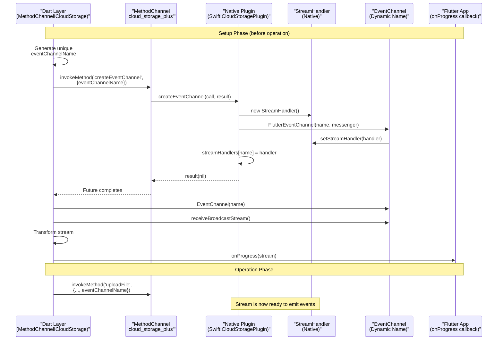

The critical ordering ensures:
1. **EventChannel exists before operation starts** - prevents missing early events
2. **StreamHandler is registered** - native code can look up handler by name
3. **Stream is passed to app** - caller can attach listener immediately

**Sources:** [lib/icloud_storage_method_channel.dart:78-90](), [ios/Classes/iOSICloudStoragePlugin.swift:1126-1146]()

---

## Native StreamHandler Implementation

### StreamHandler Class Structure

The `StreamHandler` class on the native side implements Flutter's `FlutterStreamHandler` protocol:

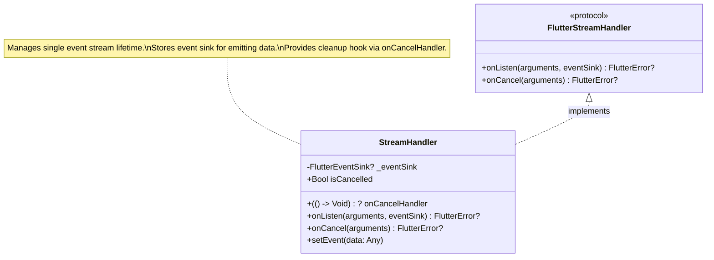

**Key Responsibilities:**

| Method | Purpose | When Called |
|--------|---------|-------------|
| `onListen` | Stores event sink, marks stream active | When Dart code calls `stream.listen()` |
| `onCancel` | Cleans up resources, invokes cancel handler | When Dart cancels subscription or stream closes |
| `setEvent` | Emits data to Dart stream | Throughout operation lifetime |

**Sources:** [ios/Classes/iOSICloudStoragePlugin.swift:1210-1237](), [macos/Classes/macOSICloudStoragePlugin.swift:1209-1236]()

---

### StreamHandler Lifecycle

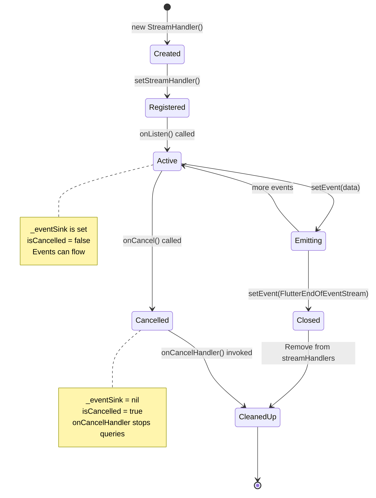

**Sources:** [ios/Classes/iOSICloudStoragePlugin.swift:1214-1236]()

---

## Progress Monitoring via EventChannels

### Upload Progress Flow

Upload progress monitoring uses `NSMetadataQuery` to track the file after it's written to the iCloud container:

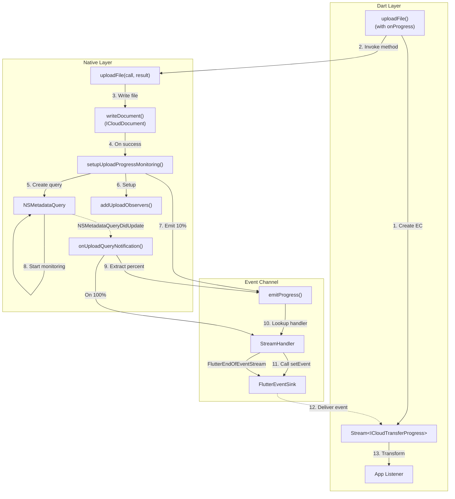

**Key Implementation Details:**

1. **Initial Progress** - 10% emitted immediately after file write completes [ios/Classes/iOSICloudStoragePlugin.swift:297]()
2. **Query Creation** - Predicate matches exact file path [ios/Classes/iOSICloudStoragePlugin.swift:292]()
3. **Observer Registration** - Listens to `DidFinishGathering` and `DidUpdate` notifications [ios/Classes/iOSICloudStoragePlugin.swift:309-328]()
4. **Progress Extraction** - `NSMetadataUbiquitousItemPercentUploadedKey` provides 0-100 value [ios/Classes/iOSICloudStoragePlugin.swift:363-364]()
5. **Monotonic Guarantee** - Progress can only increase, never decrease [ios/Classes/iOSICloudStoragePlugin.swift:1154-1160]()

**Sources:** [ios/Classes/iOSICloudStoragePlugin.swift:236-285](), [ios/Classes/iOSICloudStoragePlugin.swift:287-306](), [ios/Classes/iOSICloudStoragePlugin.swift:309-375]()

---

### Download Progress Flow

Download progress follows a similar pattern but monitors download status instead:

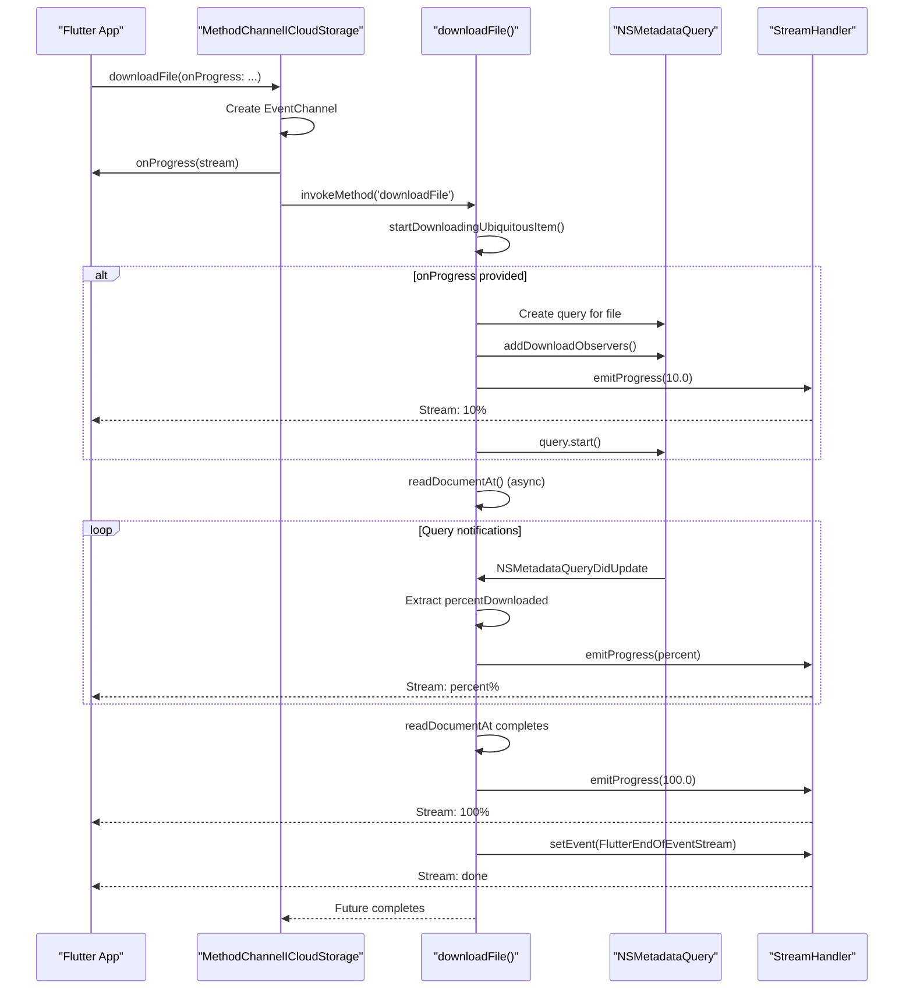

**Progress Attribute:** `NSMetadataUbiquitousItemPercentDownloadedKey` [ios/Classes/iOSICloudStoragePlugin.swift:723]()

**Sources:** [ios/Classes/iOSICloudStoragePlugin.swift:377-482](), [ios/Classes/iOSICloudStoragePlugin.swift:688-726]()

---

### Progress Emission Details

The `emitProgress` function enforces monotonic progress and prevents duplicate events:

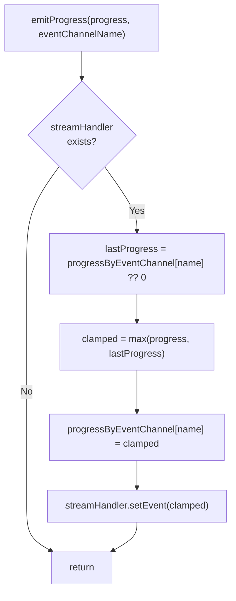

**Monotonic Progress Logic:**
- Stores last emitted progress per channel in `progressByEventChannel` dictionary
- New progress is clamped to `max(new, last)` to prevent backwards movement
- Protects against query race conditions or out-of-order notifications

**Sources:** [ios/Classes/iOSICloudStoragePlugin.swift:1154-1161]()

---

## Metadata Update Streaming

### Gather with Real-Time Updates

The `gather()` operation can optionally stream updates when files change in the container:

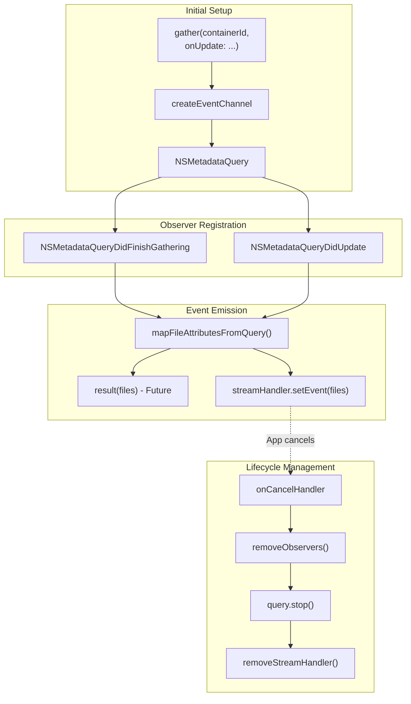

**Key Differences from Progress Monitoring:**

| Aspect | Progress Streams | Metadata Streams |
|--------|-----------------|------------------|
| **Data Type** | `Double` (0-100) | `List<Map>` (file metadata) |
| **Frequency** | On query updates | On file system changes |
| **Completion** | Automatic at 100% | Continues until cancelled |
| **Initial Event** | Via `result()` callback | Via `result()` callback |
| **Subsequent Events** | Via EventChannel | Via EventChannel |

**Sources:** [ios/Classes/iOSICloudStoragePlugin.swift:94-162](), [macos/Classes/macOSICloudStoragePlugin.swift:94-162]()

---

## Event Transformation on Dart Side

### Raw Event to ICloudTransferProgress

The Dart side transforms raw EventChannel data into type-safe `ICloudTransferProgress` objects:

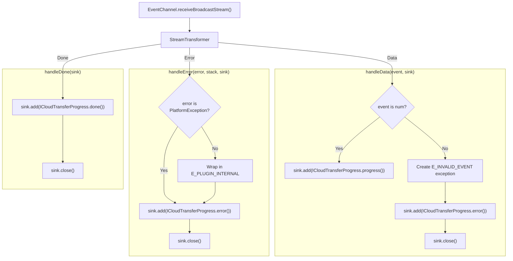

**Important:** Errors are delivered as **data events** with `type: error`, not as stream errors. This design choice ensures:
- Errors don't terminate the stream unexpectedly
- App can handle errors inline with progress updates
- Single listener pattern works correctly

**Sources:** [lib/icloud_storage_method_channel.dart:286-336]()

---

### ICloudTransferProgress Event Types

The transformed stream emits three types of events:

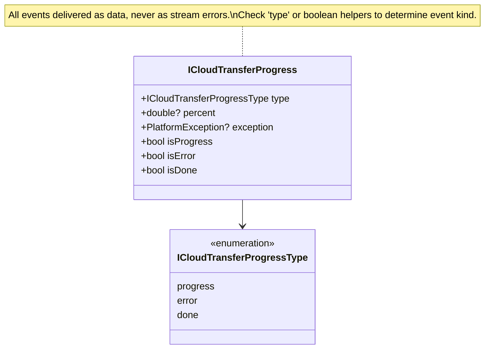

**Usage Pattern:**
```dart
onProgress: (stream) {
  stream.listen((event) {
    if (event.isProgress) {
      print('Progress: ${event.percent}%');
    } else if (event.isError) {
      print('Error: ${event.exception}');
    } else if (event.isDone) {
      print('Complete');
    }
  });
}
```

**Sources:** [lib/models/transfer_progress.dart](), [lib/icloud_storage_method_channel.dart:291-305]()

---

## Observer Management and Cleanup

### Observer Registration Pattern

The plugin tracks all notification observers per query to ensure proper cleanup:

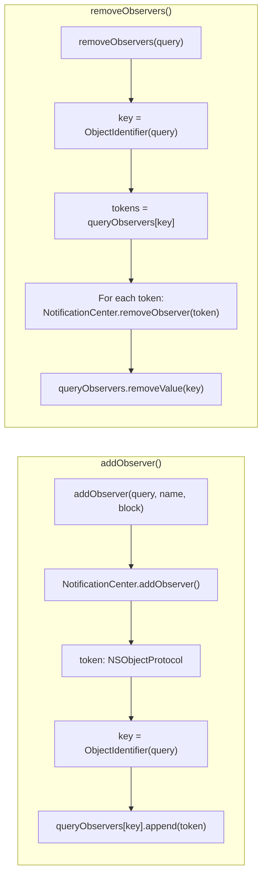

**Data Structure:**
- `queryObservers: [ObjectIdentifier: [NSObjectProtocol]]` - Maps query to its observer tokens
- Each query may have multiple observers (e.g., DidFinishGathering + DidUpdate)
- All observers removed atomically when query stops

**Sources:** [ios/Classes/iOSICloudStoragePlugin.swift:1098-1124](), [macos/Classes/macOSICloudStoragePlugin.swift:1097-1123]()

---

### Cancel Handler Flow

When a stream is cancelled, cleanup occurs through the cancel handler:

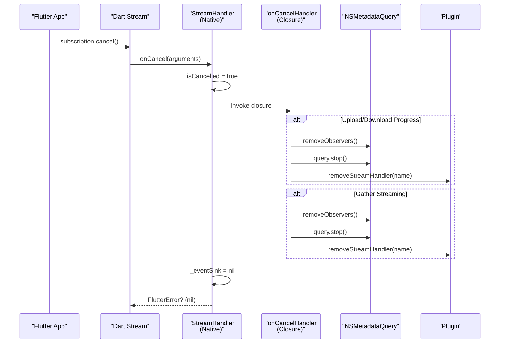

**Cancel Handler Setup Examples:**

**Upload Progress:** [ios/Classes/iOSICloudStoragePlugin.swift:298-302]()
```swift
uploadStreamHandler.onCancelHandler = { [self] in
  removeObservers(query)
  query.stop()
  removeStreamHandler(eventChannelName)
}
```

**Gather Streaming:** [ios/Classes/iOSICloudStoragePlugin.swift:127-131]()
```swift
streamHandler.onCancelHandler = { [self] in
  removeObservers(query)
  query.stop()
  removeStreamHandler(eventChannelName)
}
```

**Sources:** [ios/Classes/iOSICloudStoragePlugin.swift:1223-1229]()

---

## StreamHandler Dictionary Management

The plugin maintains a registry of active stream handlers:

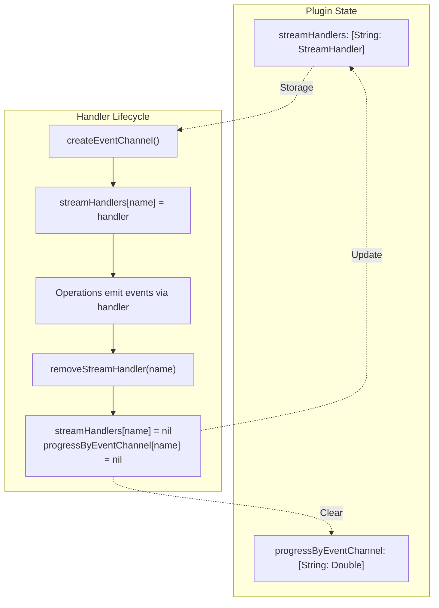

**Key Methods:**

| Method | Purpose | When Called |
|--------|---------|-------------|
| `createEventChannel()` | Creates and registers handler | Before operation starts |
| `removeStreamHandler()` | Removes handler and progress state | Operation completes or is cancelled |
| `emitProgress()` | Looks up handler to emit event | During operation |

**Sources:** [ios/Classes/iOSICloudStoragePlugin.swift:1126-1152](), [ios/Classes/iOSICloudStoragePlugin.swift:1148-1161]()

---

## Error Handling in Event Streams

### Native Error Emission

When errors occur during streaming operations, they're emitted as events:

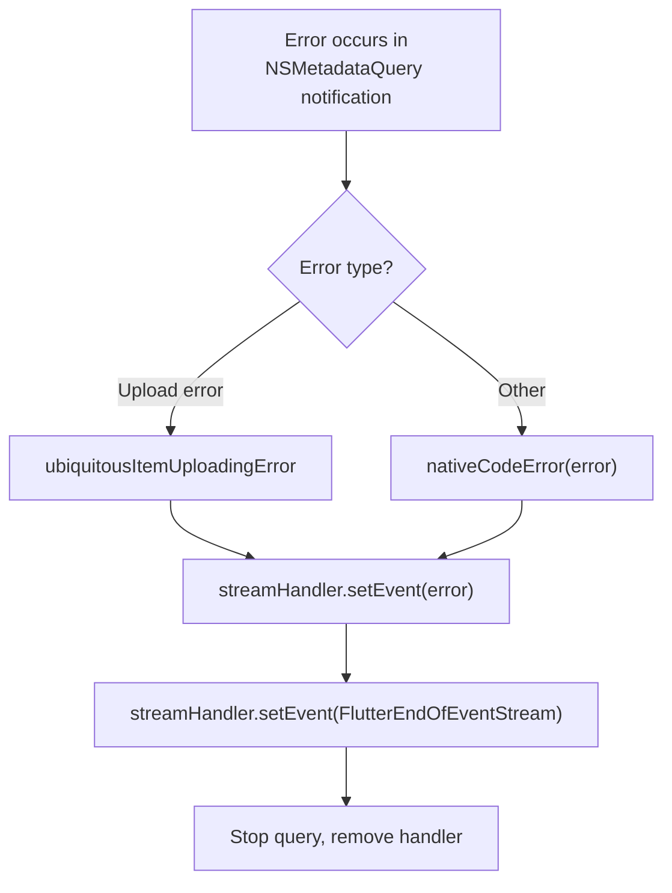

**Upload Error Example:** [ios/Classes/iOSICloudStoragePlugin.swift:351-360]()

**Download Error Example:** [ios/Classes/iOSICloudStoragePlugin.swift:460-470]()

**Sources:** [ios/Classes/iOSICloudStoragePlugin.swift:351-375](), [ios/Classes/iOSICloudStoragePlugin.swift:456-481]()

---

### Dart Error Transformation

Errors flow through the transformer and become error progress events:

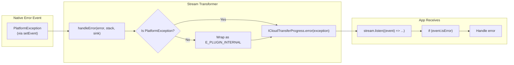

**Critical Design Decision:** Errors are data events, not stream errors, because:
1. Stream errors terminate the stream
2. Progress operations emit multiple events over time
3. App needs to handle errors without losing stream
4. Consistent with Flutter plugin patterns

**Sources:** [lib/icloud_storage_method_channel.dart:306-327]()

---

## Testing EventChannel Behavior

### Mock StreamHandler for Tests

The test suite uses `MockStreamHandler` to simulate native event emission:

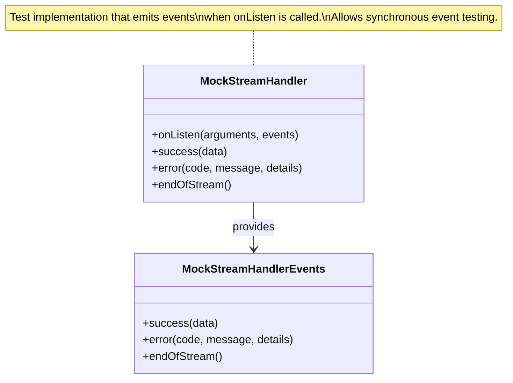

**Test Example - Progress Events:** [test/icloud_storage_method_channel_test.dart:297-325]()
```dart
mockStreamHandler = MockStreamHandler.inline(
  onListen: (arguments, events) {
    events
      ..success(0.25)
      ..success(1.0)
      ..endOfStream();
  },
);

await platform.uploadFile(
  containerId: containerId,
  localPath: '/dir/file',
  cloudRelativePath: 'dest',
  onProgress: (stream) {
    progressStream = stream;
  },
);

final events = await progressStream.toList();
expect(events[0].percent, 0.25);
expect(events[1].percent, 1.0);
expect(events[2].isDone, isTrue);
```

**Test Example - Error Events:** [test/icloud_storage_method_channel_test.dart:327-356]()

**Sources:** [test/icloud_storage_method_channel_test.dart:296-384]()

---

## Stream Subscription Timing

### Lazy Stream Creation

EventChannel streams use lazy subscription - events only flow when a listener attaches:

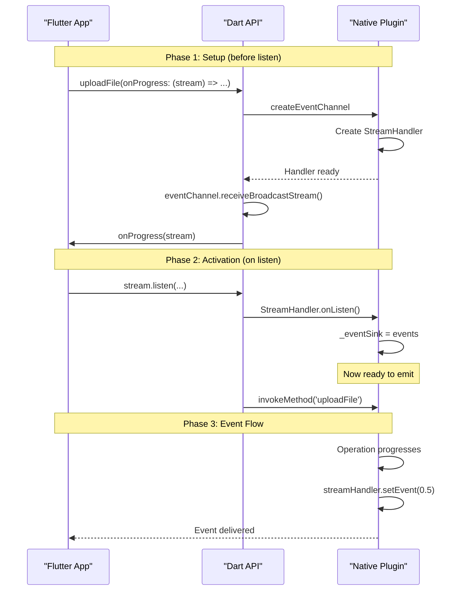

**Critical Timing Rule:** Apps must call `stream.listen()` in the `onProgress` callback to avoid race conditions:

❌ **Wrong:**
```dart
Stream<ICloudTransferProgress>? progressStream;

await ICloudStorage.uploadFile(
  onProgress: (stream) {
    progressStream = stream;  // Store for later
  },
);

// Listen after upload completes - MISSES EVENTS
progressStream?.listen(...);
```

✅ **Correct:**
```dart
await ICloudStorage.uploadFile(
  onProgress: (stream) {
    stream.listen((event) {  // Listen immediately
      print('Progress: ${event.percent}%');
    });
  },
);
```

**Sources:** [lib/icloud_storage_method_channel.dart:275-285]()

---

## Comparison: MethodChannel vs EventChannel

| Aspect | MethodChannel | EventChannel |
|--------|---------------|--------------|
| **Instance** | Single static channel | Dynamic per-operation |
| **Communication** | Bidirectional request/response | Unidirectional stream |
| **Lifecycle** | Plugin lifetime | Operation lifetime |
| **Data Flow** | Future-based (1 response) | Stream-based (multiple events) |
| **Concurrency** | Sequential method calls | Parallel streams |
| **Cleanup** | Not needed | Automatic on cancel |
| **Use Cases** | Operations, queries | Progress, updates |
| **Channel Name** | `icloud_storage_plus` | `icloud_storage_plus/event/...` |

**Sources:** [lib/icloud_storage_method_channel.dart:16-18](), [lib/icloud_storage_method_channel.dart:86](), [lib/icloud_storage_method_channel.dart:117]()

---

## Summary

The plugin's EventChannel architecture provides:

1. **Dynamic Isolation** - Each operation gets its own channel with unique name
2. **Type Safety** - Raw events transformed to typed `ICloudTransferProgress` objects
3. **Error Resilience** - Errors delivered as data events, not stream errors
4. **Resource Management** - Automatic cleanup via cancel handlers
5. **Monotonic Progress** - Progress only increases, never decreases
6. **Lazy Activation** - Streams only activate when listeners attach

This design enables multiple concurrent file operations with independent progress tracking while maintaining clean resource lifecycle management.

**Sources:** [lib/icloud_storage_method_channel.dart](), [ios/Classes/iOSICloudStoragePlugin.swift:1-1247](), [macos/Classes/macOSICloudStoragePlugin.swift:1-1246]()