# Document Classes

<details>
<summary>Relevant source files</summary>

The following files were used as context for generating this wiki page:

- [doc/notes/download_flow.md](../notes/download_flow.md)
- [ios/Classes/ICloudDocument.swift](../../ios/Classes/ICloudDocument.swift)
- [ios/Classes/iOSICloudStoragePlugin.swift](../../ios/Classes/iOSICloudStoragePlugin.swift)
- [macos/Classes/ICloudDocument.swift](../../macos/Classes/ICloudDocument.swift)
- [macos/Classes/macOSICloudStoragePlugin.swift](../../macos/Classes/macOSICloudStoragePlugin.swift)

</details>


## Purpose and Scope

This page documents the native iOS and macOS document classes that wrap Apple's `UIDocument` and `NSDocument` frameworks to provide coordinated, safe file access to iCloud storage. The plugin implements three specialized document subclasses: `ICloudDocument` for streaming I/O operations, `ICloudInPlaceDocument` for text-based in-place access, and `ICloudInPlaceBinaryDocument` for binary in-place access.

For information about the streaming I/O implementation used by `ICloudDocument`, see [5.3](#5.3). For file coordination patterns used across all document types, see [5.4](#5.4). For conflict resolution mechanisms, see [5.6](#5.6).

**Sources:** [ios/Classes/ICloudDocument.swift:1-533](), [macos/Classes/ICloudDocument.swift:1-480]()

---

## Document Class Architecture

The plugin defines three document classes on each platform (iOS and macOS), each optimized for different access patterns:

```mermaid
graph TB
    subgraph iOS["iOS Platform"]
        UIDoc["UIDocument<br/>(Apple Framework)"]
        ICD_iOS["ICloudDocument<br/>Streaming I/O"]
        ICDIP_iOS["ICloudInPlaceDocument<br/>Text Access"]
        ICDIPB_iOS["ICloudInPlaceBinaryDocument<br/>Binary Access"]
        
        UIDoc -->|"inherits"| ICD_iOS
        UIDoc -->|"inherits"| ICDIP_iOS
        UIDoc -->|"inherits"| ICDIPB_iOS
    end
    
    subgraph macOS["macOS Platform"]
        NSDoc["NSDocument<br/>(Apple Framework)"]
        ICD_macOS["ICloudDocument<br/>Streaming I/O"]
        ICDIP_macOS["ICloudInPlaceDocument<br/>Text Access"]
        ICDIPB_macOS["ICloudInPlaceBinaryDocument<br/>Binary Access"]
        
        NSDoc -->|"inherits"| ICD_macOS
        NSDoc -->|"inherits"| ICDIP_macOS
        NSDoc -->|"inherits"| ICDIPB_macOS
    end
    
    subgraph Operations["Operation Mapping"]
        Upload["uploadFile / downloadFile"]
        ReadText["readInPlace"]
        WriteText["writeInPlace"]
        ReadBinary["readInPlaceBytes"]
        WriteBinary["writeInPlaceBytes"]
    end
    
    Upload -.->|"uses"| ICD_iOS
    Upload -.->|"uses"| ICD_macOS
    
    ReadText -.->|"uses"| ICDIP_iOS
    WriteText -.->|"uses"| ICDIP_iOS
    ReadText -.->|"uses"| ICDIP_macOS
    WriteText -.->|"uses"| ICDIP_macOS
    
    ReadBinary -.->|"uses"| ICDIPB_iOS
    WriteBinary -.->|"uses"| ICDIPB_iOS
    ReadBinary -.->|"uses"| ICDIPB_macOS
    WriteBinary -.->|"uses"| ICDIPB_macOS
```

**Document Class Selection Matrix**

| Operation | Data Size | Class Used | iOS Base | macOS Base | Rationale |
|-----------|-----------|------------|----------|------------|-----------|
| `uploadFile` | Any | `ICloudDocument` | `UIDocument` | `NSDocument` | Streaming prevents memory issues |
| `downloadFile` | Any | `ICloudDocument` | `UIDocument` | `NSDocument` | Streaming prevents memory issues |
| `readInPlace` | Small | `ICloudInPlaceDocument` | `UIDocument` | `NSDocument` | UTF-8 text, loaded fully to memory |
| `writeInPlace` | Small | `ICloudInPlaceDocument` | `UIDocument` | `NSDocument` | UTF-8 text, written atomically |
| `readInPlaceBytes` | Small | `ICloudInPlaceBinaryDocument` | `UIDocument` | `NSDocument` | Binary data, loaded fully to memory |
| `writeInPlaceBytes` | Small | `ICloudInPlaceBinaryDocument` | `UIDocument` | `NSDocument` | Binary data, written atomically |

**Sources:** [ios/Classes/ICloudDocument.swift:1-10](), [macos/Classes/ICloudDocument.swift:1-10](), [ios/Classes/iOSICloudStoragePlugin.swift:236-285](), [ios/Classes/iOSICloudStoragePlugin.swift:484-539]()

---

## ICloudDocument (Streaming I/O)

`ICloudDocument` is a subclass of `UIDocument` (iOS) or `NSDocument` (macOS) designed for transferring files between local storage and iCloud using streaming I/O to avoid loading entire files into memory.

### Class Structure

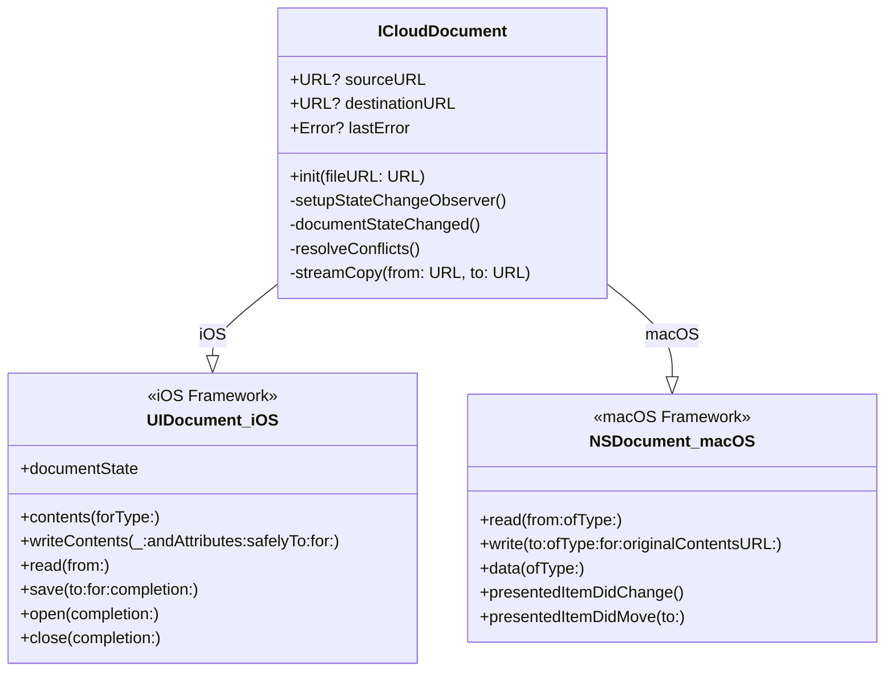

### Key Properties

| Property | Type | Purpose |
|----------|------|---------|
| `sourceURL` | `URL?` | Source file location for upload operations |
| `destinationURL` | `URL?` | Destination file location for download operations |
| `lastError` | `Error?` | Last error encountered during document operations |

### iOS Implementation

On iOS, `ICloudDocument` overrides three key `UIDocument` methods:

**contents(forType:)** - Returns streaming payload for writes
```swift
override func contents(forType typeName: String) throws -> Any {
    guard let sourceURL = sourceURL else {
        throw NSError(...)
    }
    return StreamPayload(sourceURL: sourceURL)
}
```
[ios/Classes/ICloudDocument.swift:21-30]()

**writeContents(_:andAttributes:safelyTo:for:)** - Performs streaming copy during save
```swift
override func writeContents(
    _ contents: Any,
    andAttributes attributes: [AnyHashable : Any]?,
    safelyTo url: URL,
    for saveOperation: UIDocument.SaveOperation
) throws {
    guard let payload = contents as? StreamPayload else {
        throw NSError(...)
    }
    try streamCopy(from: payload.sourceURL, to: url)
}
```
[ios/Classes/ICloudDocument.swift:32-52]()

**read(from:)** - Performs streaming copy during open
```swift
override func read(from url: URL) throws {
    guard let destinationURL = destinationURL else {
        throw NSError(...)
    }
    try streamCopy(from: url, to: destinationURL)
}
```
[ios/Classes/ICloudDocument.swift:54-69]()

### macOS Implementation

On macOS, `ICloudDocument` overrides different methods due to `NSDocument`'s API:

**read(from:ofType:)** - Downloads file content
```swift
override func read(from url: URL, ofType typeName: String) throws {
    guard let destinationURL = destinationURL else {
        throw NSError(...)
    }
    try streamCopy(from: url, to: destinationURL)
}
```
[macos/Classes/ICloudDocument.swift:16-30]()

**write(to:ofType:for:originalContentsURL:)** - Uploads file content
```swift
override func write(
    to url: URL,
    ofType typeName: String,
    for saveOperation: NSDocument.SaveOperationType,
    originalContentsURL: URL?
) throws {
    guard let sourceURL = sourceURL else {
        throw NSError(...)
    }
    try streamCopy(from: sourceURL, to: url)
}
```
[macos/Classes/ICloudDocument.swift:32-51]()

### Streaming Copy Implementation

Both platforms share the same streaming algorithm with 64KB buffer:

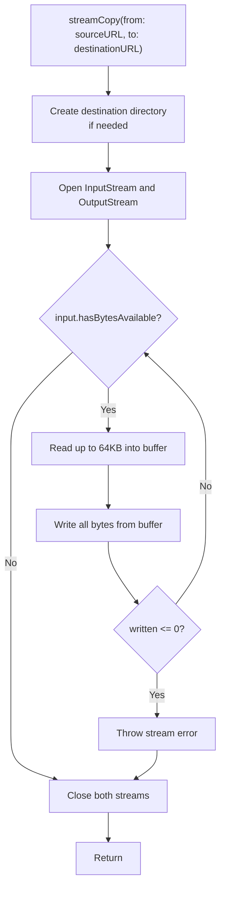

The streaming implementation includes safeguards against stalled writes:
- Write operations that return 0 bytes are treated as failures
- This prevents infinite loops when output streams stall
- Error handling distinguishes between read errors and write errors

[ios/Classes/ICloudDocument.swift:142-213](), [macos/Classes/ICloudDocument.swift:125-196]()

**Sources:** [ios/Classes/ICloudDocument.swift:1-141](), [macos/Classes/ICloudDocument.swift:1-124]()

---

## ICloudInPlaceDocument (Text Access)

`ICloudInPlaceDocument` provides coordinated in-place access for text files stored as UTF-8. Unlike streaming documents, this class loads the entire file content into memory as a string.

### Class Structure

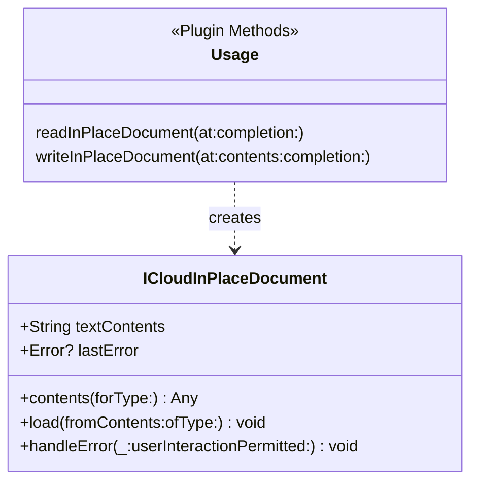

### Key Properties

| Property | Type | Purpose |
|----------|------|---------|
| `textContents` | `String` | UTF-8 decoded text content of the document |
| `lastError` | `Error?` | Captured error from document operations |

### iOS Implementation

**contents(forType:)** - Encodes text as UTF-8 data for writing
```swift
override func contents(forType typeName: String) throws -> Any {
    return textContents.data(using: .utf8) ?? Data()
}
```
[ios/Classes/ICloudDocument.swift:224-226]()

**load(fromContents:ofType:)** - Decodes data/FileWrapper to UTF-8 string
```swift
override func load(fromContents contents: Any, ofType typeName: String?) throws {
    if let data = contents as? Data {
        if data.isEmpty {
            textContents = ""
            return
        }
        guard let text = String(data: data, encoding: .utf8) else {
            throw NSError(...)
        }
        textContents = text
    }
    // Additional handling for FileWrapper and String types
}
```
[ios/Classes/ICloudDocument.swift:228-272]()

### macOS Implementation

The macOS version uses `NSDocument`'s simpler data-based API:

**data(ofType:)** - Returns text as UTF-8 Data
```swift
override func data(ofType typeName: String) throws -> Data {
    return textContents.data(using: .utf8) ?? Data()
}
```
[macos/Classes/ICloudDocument.swift:211-213]()

**read(from:ofType:)** - Reads and decodes UTF-8 data
```swift
override func read(from data: Data, ofType typeName: String) throws {
    if data.isEmpty {
        textContents = ""
        return
    }
    guard let text = String(data: data, encoding: .utf8) else {
        throw NSError(...)
    }
    textContents = text
}
```
[macos/Classes/ICloudDocument.swift:215-228]()

### Usage Pattern

The plugin's extension methods demonstrate the typical usage pattern:

1. **Read**: Create document → Open → Extract `textContents` → Close
2. **Write**: Create document → Set `textContents` → Save → Close

[ios/Classes/ICloudDocument.swift:426-447](), [macos/Classes/ICloudDocument.swift:366-422]()

**Sources:** [ios/Classes/ICloudDocument.swift:216-278](), [macos/Classes/ICloudDocument.swift:199-234]()

---

## ICloudInPlaceBinaryDocument (Binary Access)

`ICloudInPlaceBinaryDocument` provides coordinated in-place access for binary files. It loads entire file content into memory as `Data`.

### Class Structure

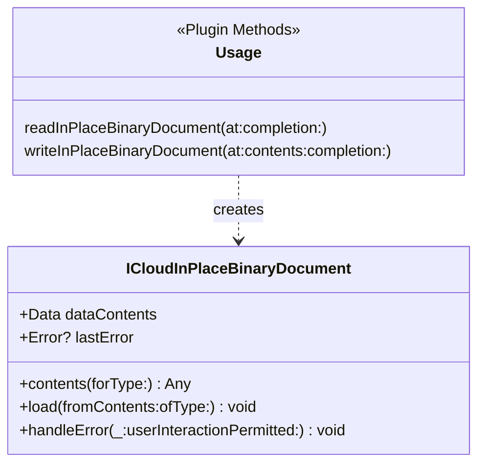

### Key Properties

| Property | Type | Purpose |
|----------|------|---------|
| `dataContents` | `Data` | Raw binary content of the document |
| `lastError` | `Error?` | Captured error from document operations |

### iOS Implementation

**contents(forType:)** - Returns binary data for writing
```swift
override func contents(forType typeName: String) throws -> Any {
    return dataContents
}
```
[ios/Classes/ICloudDocument.swift:288-290]()

**load(fromContents:ofType:)** - Loads binary data from contents
```swift
override func load(fromContents contents: Any, ofType typeName: String?) throws {
    if let data = contents as? Data {
        dataContents = data
        return
    }
    if let fileWrapper = contents as? FileWrapper,
       let data = fileWrapper.regularFileContents {
        dataContents = data
        return
    }
    throw NSError(...)
}
```
[ios/Classes/ICloudDocument.swift:292-309]()

### macOS Implementation

**data(ofType:)** - Returns binary data directly
```swift
override func data(ofType typeName: String) throws -> Data {
    return dataContents
}
```
[macos/Classes/ICloudDocument.swift:248-250]()

**read(from:ofType:)** - Loads binary data
```swift
override func read(from data: Data, ofType typeName: String) throws {
    dataContents = data
}
```
[macos/Classes/ICloudDocument.swift:252-254]()

**Sources:** [ios/Classes/ICloudDocument.swift:280-315](), [macos/Classes/ICloudDocument.swift:236-260]()

---

## Document Operation Methods

The plugin extends the main plugin class with helper methods that create, configure, and manage document instances. These methods provide the bridge between the platform channel handlers and the document classes.

### Operation Method Matrix

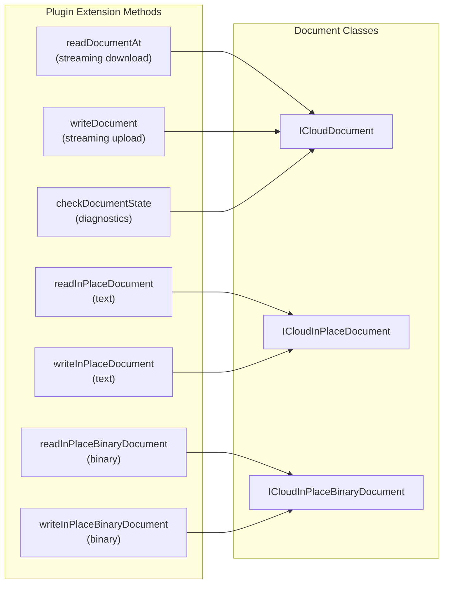

### Streaming Operations

**readDocumentAt(url:destinationURL:completion:)** - Downloads using `ICloudDocument`

iOS:
```swift
func readDocumentAt(
    url: URL,
    destinationURL: URL,
    completion: @escaping (Error?) -> Void
) {
    let document = ICloudDocument(fileURL: url)
    document.destinationURL = destinationURL
    
    document.open { success in
        if success {
            completion(nil)
            document.close { _ in
                DebugHelper.log("Document closed: \(url.lastPathComponent)")
            }
        } else {
            let error = document.lastError ?? NSError(...)
            completion(error)
        }
    }
}
```
[ios/Classes/ICloudDocument.swift:325-348]()

macOS (background queue):
```swift
func readDocumentAt(
    url: URL,
    destinationURL: URL,
    completion: @escaping (Error?) -> Void
) {
    let document = ICloudDocument()
    document.destinationURL = destinationURL
    
    DispatchQueue.global(qos: .userInitiated).async {
        defer { DispatchQueue.main.async { document.close() } }
        do {
            try document.read(from: url, ofType: "public.data")
            DispatchQueue.main.async {
                completion(nil)
            }
        } catch {
            DispatchQueue.main.async {
                completion(error)
            }
        }
    }
}
```
[macos/Classes/ICloudDocument.swift:266-287]()

**writeDocument(at:sourceURL:completion:)** - Uploads using `ICloudDocument`

iOS:
```swift
func writeDocument(
    at url: URL,
    sourceURL: URL,
    completion: @escaping (Error?) -> Void
) {
    let document = ICloudDocument(fileURL: url)
    document.sourceURL = sourceURL
    
    let saveOperation: UIDocument.SaveOperation =
        FileManager.default.fileExists(atPath: url.path)
        ? .forOverwriting
        : .forCreating
    
    document.save(to: url, for: saveOperation) { success in
        if success {
            document.close { _ in
                completion(nil)
            }
        } else {
            let error = document.lastError ?? NSError(...)
            completion(error)
        }
    }
}
```
[ios/Classes/ICloudDocument.swift:355-382]()

macOS (background queue with explicit save type):
```swift
func writeDocument(
    at url: URL,
    sourceURL: URL,
    completion: @escaping (Error?) -> Void
) {
    let document = ICloudDocument()
    document.sourceURL = sourceURL
    
    DispatchQueue.global(qos: .userInitiated).async {
        defer { DispatchQueue.main.async { document.close() } }
        do {
            try document.write(
                to: url,
                ofType: "public.data",
                for: FileManager.default.fileExists(atPath: url.path)
                    ? .saveOperation
                    : .saveAsOperation,
                originalContentsURL: nil
            )
            DispatchQueue.main.async {
                completion(nil)
            }
        } catch {
            DispatchQueue.main.async {
                completion(error)
            }
        }
    }
}
```
[macos/Classes/ICloudDocument.swift:289-318]()

### In-Place Text Operations

**readInPlaceDocument(at:completion:)** - Reads text using `ICloudInPlaceDocument`
[ios/Classes/ICloudDocument.swift:426-447](), [macos/Classes/ICloudDocument.swift:366-390]()

**writeInPlaceDocument(at:contents:completion:)** - Writes text using `ICloudInPlaceDocument`
[ios/Classes/ICloudDocument.swift:473-501](), [macos/Classes/ICloudDocument.swift:392-422]()

### In-Place Binary Operations

**readInPlaceBinaryDocument(at:completion:)** - Reads binary using `ICloudInPlaceBinaryDocument`
[ios/Classes/ICloudDocument.swift:449-471](), [macos/Classes/ICloudDocument.swift:424-446]()

**writeInPlaceBinaryDocument(at:contents:completion:)** - Writes binary using `ICloudInPlaceBinaryDocument`
[ios/Classes/ICloudDocument.swift:503-531](), [macos/Classes/ICloudDocument.swift:448-478]()

### Platform Threading Model

| Platform | Threading | Rationale |
|----------|-----------|-----------|
| iOS | Main thread via `open()`/`save()` callbacks | `UIDocument` manages its own background queue |
| macOS | Explicit `DispatchQueue.global()` | `NSDocument` operations are synchronous |

**Sources:** [ios/Classes/ICloudDocument.swift:319-532](), [macos/Classes/ICloudDocument.swift:264-479]()

---

## Conflict Resolution

Both iOS and macOS document classes implement automatic conflict resolution using Apple's `NSFileVersion` API. When multiple devices edit the same file simultaneously, iCloud creates conflict versions.

### Conflict Detection

**iOS (UIDocument)**
```swift
private func setupStateChangeObserver() {
    NotificationCenter.default.addObserver(
        self,
        selector: #selector(documentStateChanged),
        name: UIDocument.stateChangedNotification,
        object: self
    )
}

@objc private func documentStateChanged() {
    if documentState.contains(.inConflict) {
        resolveConflicts()
    }
}
```
[ios/Classes/ICloudDocument.swift:84-105]()

**macOS (NSDocument)**
```swift
override func presentedItemDidChange() {
    super.presentedItemDidChange()
    
    if let fileURL = fileURL,
       let conflictVersions = NSFileVersion.unresolvedConflictVersionsOfItem(at: fileURL),
       !conflictVersions.isEmpty {
        resolveConflicts()
    }
}
```
[macos/Classes/ICloudDocument.swift:75-83]()

### Resolution Strategy

The conflict resolution algorithm implements a **last-write-wins** strategy:

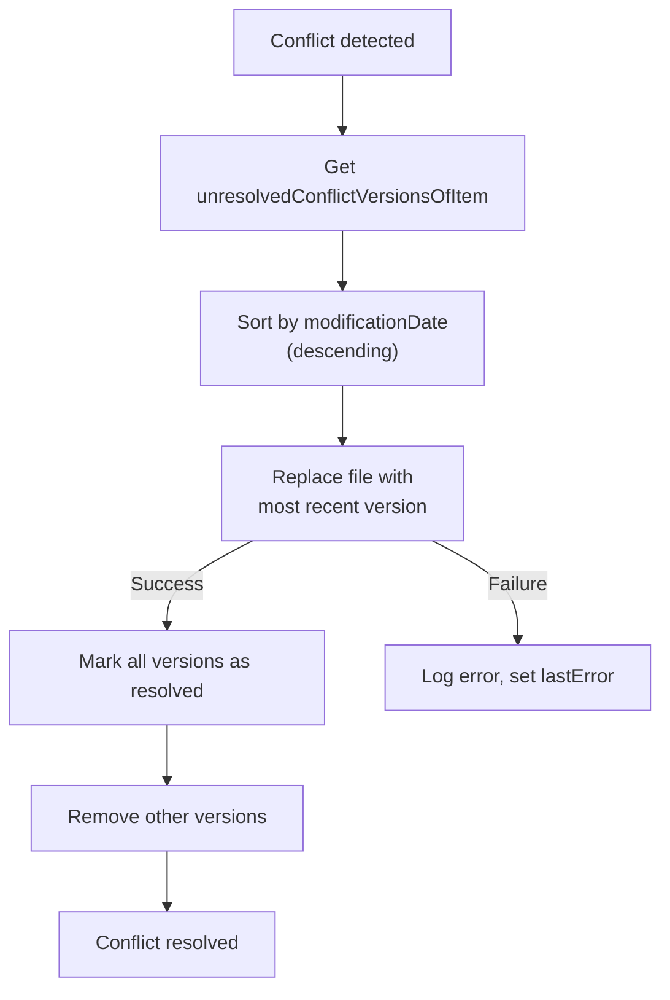

Implementation (shared across iOS/macOS):
```swift
private func resolveConflicts() {
    let fileURL = self.fileURL
    
    DebugHelper.log("Resolving conflicts for: \(fileURL.lastPathComponent)")
    
    if let conflictVersions = NSFileVersion.unresolvedConflictVersionsOfItem(at: fileURL),
       !conflictVersions.isEmpty {
        
        let sortedVersions = conflictVersions.sorted { version1, version2 in
            let date1 = version1.modificationDate ?? Date.distantPast
            let date2 = version2.modificationDate ?? Date.distantPast
            return date1 > date2
        }
        
        if let mostRecentVersion = sortedVersions.first {
            do {
                try mostRecentVersion.replaceItem(at: fileURL)
                
                for version in conflictVersions {
                    version.isResolved = true
                }
                
                try NSFileVersion.removeOtherVersionsOfItem(at: fileURL)
                
                DebugHelper.log(
                    "Conflicts resolved using version from: \(mostRecentVersion.modificationDate?.description ?? "unknown")"
                )
            } catch {
                DebugHelper.log("Failed to resolve conflicts: \(error.localizedDescription)")
                lastError = error
            }
        }
    }
}
```
[ios/Classes/ICloudDocument.swift:107-140](), [macos/Classes/ICloudDocument.swift:90-123]()

### Conflict Metadata

The plugin's `checkDocumentState` method can query conflict information:

iOS:
```swift
if let conflictVersions = NSFileVersion.unresolvedConflictVersionsOfItem(at: url) {
    stateInfo["conflictCount"] = conflictVersions.count
}
```
[ios/Classes/ICloudDocument.swift:407-409]()

macOS:
```swift
if let conflictVersions = NSFileVersion.unresolvedConflictVersionsOfItem(at: url) {
    stateInfo["hasConflicts"] = !conflictVersions.isEmpty
    stateInfo["conflictCount"] = conflictVersions.count
    
    let conflictDates = conflictVersions.compactMap { $0.modificationDate?.timeIntervalSince1970 }
    if !conflictDates.isEmpty {
        stateInfo["conflictDates"] = conflictDates
    }
}
```
[macos/Classes/ICloudDocument.swift:343-351]()

**Sources:** [ios/Classes/ICloudDocument.swift:84-140](), [macos/Classes/ICloudDocument.swift:75-123]()

---

## Platform Implementation Differences

While the document classes provide similar functionality on iOS and macOS, there are key implementation differences due to the underlying frameworks.

### Framework APIs

| Aspect | iOS (`UIDocument`) | macOS (`NSDocument`) |
|--------|-------------------|---------------------|
| Base class | `UIDocument` | `NSDocument` |
| Read method | `read(from: URL)` | `read(from: URL, ofType: String)` |
| Write method | `writeContents(_:andAttributes:safelyTo:for:)` + `contents(forType:)` | `write(to: URL, ofType: String, for: SaveOperationType, originalContentsURL: URL?)` |
| Threading | Async callbacks on main thread | Synchronous, requires manual dispatch |
| Initialization | `init(fileURL: URL)` with file | `init()` without file |
| State monitoring | `documentState` property + notifications | `presentedItemDidChange()` override |
| Conflict detection | `documentState.contains(.inConflict)` | Manual check via `NSFileVersion` |

### Threading Model Comparison

**iOS - Callback-based**
```swift
func readDocumentAt(...) {
    let document = ICloudDocument(fileURL: url)
    document.destinationURL = destinationURL
    
    document.open { success in
        // Already on appropriate queue
        if success {
            completion(nil)
            document.close { _ in }
        } else {
            completion(document.lastError)
        }
    }
}
```

**macOS - Dispatch-based**
```swift
func readDocumentAt(...) {
    let document = ICloudDocument()
    document.destinationURL = destinationURL
    
    DispatchQueue.global(qos: .userInitiated).async {
        defer { DispatchQueue.main.async { document.close() } }
        do {
            try document.read(from: url, ofType: "public.data")
            DispatchQueue.main.async {
                completion(nil)
            }
        } catch {
            DispatchQueue.main.async {
                completion(error)
            }
        }
    }
}
```

### Save Operation Type Mapping

| Scenario | iOS (`UIDocument.SaveOperation`) | macOS (`NSDocument.SaveOperationType`) |
|----------|----------------------------------|----------------------------------------|
| File exists | `.forOverwriting` | `.saveOperation` |
| New file | `.forCreating` | `.saveAsOperation` |

[ios/Classes/ICloudDocument.swift:363-366](), [macos/Classes/ICloudDocument.swift:304-306]()

### Error Handling

Both platforms capture errors in the `lastError` property:

**iOS**
```swift
override func handleError(_ error: Error, userInteractionPermitted: Bool) {
    lastError = error
    super.handleError(error, userInteractionPermitted: userInteractionPermitted)
}
```
[ios/Classes/ICloudDocument.swift:274-277]()

**macOS**
```swift
override func handleError(_ error: Error, userInteractionPermitted: Bool) {
    lastError = error
    super.handleError(error, userInteractionPermitted: userInteractionPermitted)
}
```
[macos/Classes/ICloudDocument.swift:230-233]()

### Autosave Configuration

**iOS** - Implicit via `UIDocument` behavior

**macOS** - Explicit override required:
```swift
override class var autosavesInPlace: Bool {
    return true
}
```
[macos/Classes/ICloudDocument.swift:71-73](), [macos/Classes/ICloudDocument.swift:207-209](), [macos/Classes/ICloudDocument.swift:244-246]()

**Sources:** [ios/Classes/ICloudDocument.swift:1-533](), [macos/Classes/ICloudDocument.swift:1-480]()

---

## Usage Examples in Plugin Code

The document classes are instantiated and managed by the plugin's platform-specific method handlers. Here are the key usage patterns:

### Upload Flow (uploadFile)

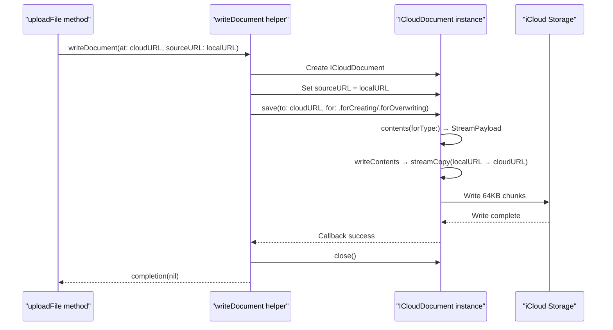

Called from: [ios/Classes/iOSICloudStoragePlugin.swift:268-281](), [macos/Classes/macOSICloudStoragePlugin.swift:268-281]()

### Download Flow (downloadFile)

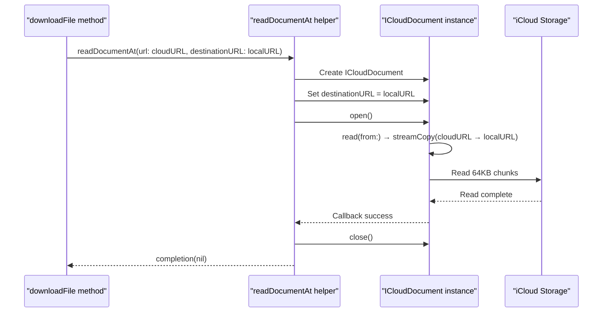

Called from: [ios/Classes/iOSICloudStoragePlugin.swift:456-481](), [macos/Classes/macOSICloudStoragePlugin.swift:456-481]()

### In-Place Read Flow (readInPlace)

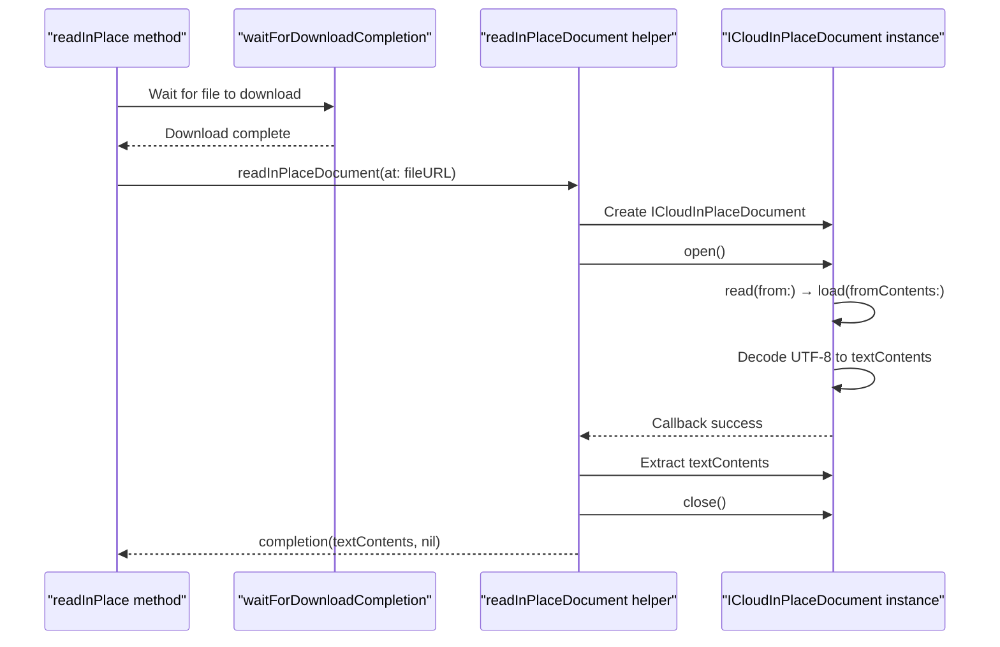

Called from: [ios/Classes/iOSICloudStoragePlugin.swift:529-537](), [macos/Classes/macOSICloudStoragePlugin.swift:529-537]()

### In-Place Write Flow (writeInPlace)

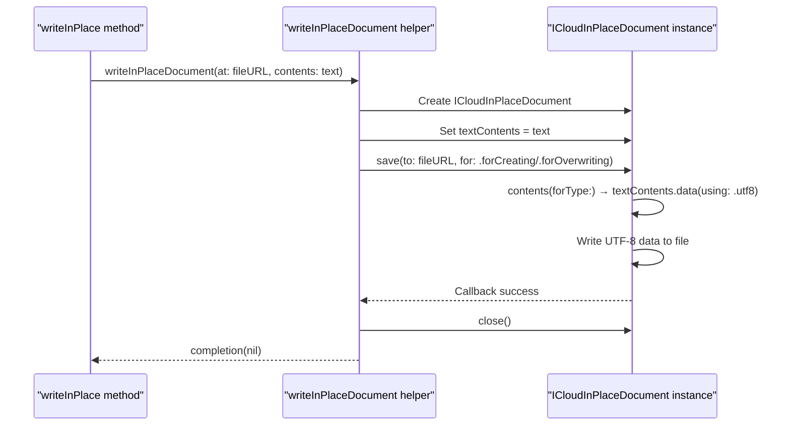

Called from: [ios/Classes/iOSICloudStoragePlugin.swift:574-581](), [macos/Classes/macOSICloudStoragePlugin.swift:574-581]()

**Sources:** [ios/Classes/iOSICloudStoragePlugin.swift:236-285](), [ios/Classes/iOSICloudStoragePlugin.swift:378-482](), [ios/Classes/iOSICloudStoragePlugin.swift:484-582]()
