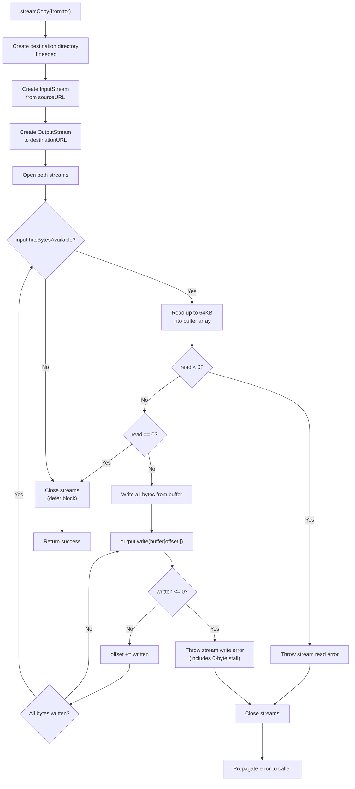
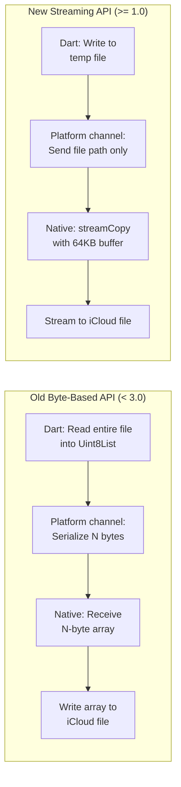

# Streaming I/O Implementation

<details>
<summary>Relevant source files</summary>

The following files were used as context for generating this wiki page:

- [CHANGELOG.md](../../CHANGELOG.md)
- [doc/notes/download_flow.md](../notes/download_flow.md)
- [ios/Classes/ICloudDocument.swift](../../ios/Classes/ICloudDocument.swift)
- [macos/Classes/ICloudDocument.swift](../../macos/Classes/ICloudDocument.swift)

</details>


## Purpose and Scope

This page documents the streaming I/O implementation used by the `icloud_storage_plus` plugin for efficient file transfers between local storage and iCloud containers. The streaming approach uses 64KB in-memory buffers to transfer large files without loading entire file contents into memory, avoiding platform channel memory limits and application memory pressure.

This page covers the `streamCopy` function implementation and its integration with `UIDocument`/`NSDocument` classes. For information about the document classes that use this streaming mechanism, see [Document Classes](#5.2). For details on how these transfers report progress, see [Progress Monitoring](#6.1). For information about in-place file access (which loads full content into memory), see [In-Place Access Operations](#3.2).

**Sources:** [CHANGELOG.md:14-29](), [ios/Classes/ICloudDocument.swift:1-214](), [macos/Classes/ICloudDocument.swift:1-197]()

---

## Why Streaming I/O

The plugin's version 1.0.0 migration from byte-based APIs to file-path
streaming was motivated by three key constraints:

| Constraint | Problem | Streaming Solution |
|------------|---------|-------------------|
| **Platform Channel Limits** | Flutter platform channels have practical memory limits; transferring multi-megabyte files as byte arrays causes message codec failures | Files are copied stream-style on the native side; only file paths cross the platform channel |
| **Application Memory Pressure** | Loading entire file contents into memory causes allocation spikes and potential out-of-memory crashes on resource-constrained devices | 64KB buffer size keeps peak memory usage bounded regardless of file size |
| **Apple Best Practices** | Apple's iCloud documentation recommends URL-based APIs (`UIDocument`/`NSDocument`) over data-based APIs for file coordination and conflict handling | Streaming implementation integrates naturally with Apple's document architecture |

The streaming approach aligns with the "Streaming-Only File Path API" breaking change described in the CHANGELOG, where methods like `uploadFile()` and `downloadFile()` accept local file paths and cloud relative paths rather than byte arrays.

**Sources:** [CHANGELOG.md:14-29](), [doc/notes/download_flow.md:8-18]()

---

## The streamCopy Function

### Function Signature and Location

The `streamCopy` function is a private method within the `ICloudDocument` class (iOS) and `ICloudDocument` class (macOS). It is not exposed as a public API but is the core transfer mechanism used by all document read and write operations.

```
iOS:  ios/Classes/ICloudDocument.swift, line 142, private method
macOS: macos/Classes/ICloudDocument.swift, line 125, private method
```

**Signature:**
```swift
private func streamCopy(from sourceURL: URL, to destinationURL: URL) throws
```

**Sources:** [ios/Classes/ICloudDocument.swift:142-213](), [macos/Classes/ICloudDocument.swift:125-196]()

### Implementation Flow

The following diagram shows the complete execution flow of `streamCopy`:



**Sources:** [ios/Classes/ICloudDocument.swift:142-213](), [macos/Classes/ICloudDocument.swift:125-196]()

### Code Structure Overview

The `streamCopy` implementation follows this structure:

| Phase | Lines (iOS) | Lines (macOS) | Description |
|-------|-------------|---------------|-------------|
| **Directory Setup** | 143-150 | 126-133 | Creates destination directory with intermediate directories if missing |
| **Stream Initialization** | 152-166 | 135-149 | Creates and validates `InputStream` and `OutputStream` instances |
| **Stream Opening** | 168-169 | 151-152 | Opens both streams; `defer` block ensures closure on exit |
| **Read Loop** | 178-189 | 161-172 | Reads up to 64KB chunks from input stream, handling EOF and errors |
| **Write Loop** | 191-211 | 174-194 | Writes all buffered bytes to output stream, handling partial writes |

**Sources:** [ios/Classes/ICloudDocument.swift:142-213](), [macos/Classes/ICloudDocument.swift:125-196]()

---

## Buffer Strategy and Memory Characteristics

### 64KB Buffer Size

The implementation uses a fixed buffer size of 64KB (65,536 bytes):

```swift
let bufferSize = 64 * 1024
var buffer = [UInt8](repeating: 0, count: bufferSize)
```

This buffer size was chosen based on several factors:

| Consideration | Rationale |
|---------------|-----------|
| **System Page Alignment** | 64KB is a multiple of common system page sizes (4KB, 16KB) on iOS/macOS, reducing memory fragmentation |
| **I/O Efficiency** | Large enough to amortize system call overhead but small enough to avoid triggering iOS memory pressure events |
| **Stack Allocation Safety** | The buffer is stack-allocated; 64KB is safely within stack size limits while minimizing heap allocations |
| **Streaming Responsiveness** | Smaller buffers would increase loop iterations; larger buffers would delay progress reporting and error detection |

**Sources:** [ios/Classes/ICloudDocument.swift:175-176](), [macos/Classes/ICloudDocument.swift:158-159]()

### Memory Usage Profile

For a file of arbitrary size `N` bytes:

- **Peak Memory (per transfer):** ~64KB (buffer) + stream overhead (~8KB) ≈ **72KB total**
- **Memory Scaling:** O(1) - independent of file size
- **Allocations:** Single buffer allocation per `streamCopy` call, reused across all chunks

This contrasts with the removed byte-based APIs, which would allocate an array of size `N` bytes on both Dart and native sides, plus platform channel serialization buffers.

**Sources:** [CHANGELOG.md:14-29]()

---

## Integration with Document Classes

### UIDocument Integration (iOS)

The `ICloudDocument` class uses `streamCopy` within the UIDocument lifecycle methods:


**Code References:**
- `contents(forType:)` returns `StreamPayload`: [ios/Classes/ICloudDocument.swift:21-30]()
- `writeContents(_:andAttributes:safelyTo:for:)` invokes `streamCopy` for writes: [ios/Classes/ICloudDocument.swift:32-52]()
- `read(from:)` invokes `streamCopy` for reads: [ios/Classes/ICloudDocument.swift:54-69]()

**Sources:** [ios/Classes/ICloudDocument.swift:1-214]()

### NSDocument Integration (macOS)

The macOS `ICloudDocument` class uses `streamCopy` within NSDocument lifecycle methods:

| Method | Purpose | streamCopy Usage |
|--------|---------|-----------------|
| `read(from:ofType:)` | Load document from URL | Calls `streamCopy(from: cloudURL, to: destinationURL)` |
| `write(to:ofType:for:originalContentsURL:)` | Save document to URL | Calls `streamCopy(from: sourceURL, to: cloudURL)` |
| `data(ofType:)` | Unsupported data tier | Throws error; streaming-only API enforced |
| `read(from:Data:ofType:)` | Unsupported data tier | Throws error; streaming-only API enforced |

The explicit rejection of data-tier methods (lines 53-67 in macOS implementation) ensures that all transfers use the streaming path, preventing accidental memory-inefficient operations.

**Sources:** [macos/Classes/ICloudDocument.swift:16-67](), [macos/Classes/ICloudDocument.swift:125-196]()

### Extension Methods Using streamCopy

Both platforms provide extension methods on the plugin class that wrap `ICloudDocument` usage:

| Extension Method | Platform | Purpose |
|------------------|----------|---------|
| `readDocumentAt(url:destinationURL:completion:)` | iOS, macOS | Creates document, sets `destinationURL`, calls `open()` |
| `writeDocument(at:sourceURL:completion:)` | iOS, macOS | Creates document, sets `sourceURL`, calls `save(to:for:)` |

These extensions bridge between the plugin's method channel handlers and the document streaming layer.

**Sources:** [ios/Classes/ICloudDocument.swift:320-348](), [macos/Classes/ICloudDocument.swift:266-318]()

---

## Error Handling

### Stream Error Detection

The `streamCopy` function handles two categories of stream errors:

**Read Errors (lines 179-186 in iOS, 162-169 in macOS):**
```swift
let read = input.read(&buffer, maxLength: buffer.count)
if read < 0 {
    throw input.streamError ?? NSError(
        domain: NSCocoaErrorDomain,
        code: NSFileReadUnknownError,
        userInfo: [NSLocalizedDescriptionKey: "Stream read error"]
    )
}
```

**Write Errors (lines 193-209 in iOS, 176-192 in macOS):**
```swift
let written = output.write(base.advanced(by: totalWritten), maxLength: read - totalWritten)
if written <= 0 {
    let message = written == 0
        ? "Stream write returned 0 bytes (stalled); treating as failure"
        : "Stream write error"
    throw output.streamError ?? NSError(...)
}
```

**Sources:** [ios/Classes/ICloudDocument.swift:179-209](), [macos/Classes/ICloudDocument.swift:162-192]()

### Zero-Byte Write Protection

A critical aspect of the error handling is the detection of stalled writes (line 200 in iOS, line 183 in macOS). The `OutputStream.write` method can theoretically return 0 to indicate that no bytes were written (stream is full), which would cause an infinite loop if not handled:

```swift
if written <= 0 {
    let message = written == 0
        ? "Stream write returned 0 bytes (stalled); treating as failure"
        : "Stream write error"
    throw output.streamError ?? NSError(...)
}
```

While rare for file-backed streams, this guard ensures the application fails fast rather than hanging indefinitely in a tight write loop.

**Sources:** [ios/Classes/ICloudDocument.swift:198-209](), [macos/Classes/ICloudDocument.swift:181-192]()

### Error Propagation


Errors thrown by `streamCopy` are:
1. Caught by the calling `UIDocument`/`NSDocument` method
2. Stored in `lastError` property
3. Propagated to completion handlers
4. Mapped to Flutter `PlatformException` codes by the plugin
5. Surfaced to Dart callers

**Sources:** [ios/Classes/ICloudDocument.swift:48-50](), [ios/Classes/ICloudDocument.swift:65-67]()

---

## Platform Differences

### iOS vs macOS Implementation Comparison

While both platforms use the same core `streamCopy` logic, there are differences in how the document classes invoke it:

| Aspect | iOS (UIDocument) | macOS (NSDocument) |
|--------|------------------|-------------------|
| **Streaming Method Location** | `read(from:)` and `writeContents(_:safelyTo:for:)` | `read(from:ofType:)` and `write(to:ofType:for:originalContentsURL:)` |
| **Payload Mechanism** | Uses custom `StreamPayload` struct | Directly calls `streamCopy` in write method |
| **Async Pattern** | `open()` and `save(to:for:)` with completion handlers | Synchronous methods run on background queue (see extension methods) |
| **SaveOperation Handling** | `.forCreating` vs `.forOverwriting` | `.saveAsOperation` vs `.saveOperation` |

**iOS UIDocument Async Pattern:**
```swift
document.open { success in
    // Callback on completion
}
```

**macOS NSDocument Sync Pattern (Wrapped in Async):**
```swift
DispatchQueue.global(qos: .userInitiated).async {
    do {
        try document.read(from: url, ofType: "public.data")
        DispatchQueue.main.async { completion(nil) }
    } catch {
        DispatchQueue.main.async { completion(error) }
    }
}
```

**Sources:** [ios/Classes/ICloudDocument.swift:54-69](), [macos/Classes/ICloudDocument.swift:266-287]()

### Conflict Resolution Integration

Both platforms use `streamCopy` within documents that have automatic conflict resolution:

- **iOS:** Observes `UIDocument.stateChangedNotification`, resolves on `.inConflict` state
- **macOS:** Overrides `presentedItemDidChange()`, checks for unresolved conflict versions

The streaming I/O itself is unaware of conflicts; resolution happens at the document state management layer before/after streaming operations.

**Sources:** [ios/Classes/ICloudDocument.swift:84-105](), [macos/Classes/ICloudDocument.swift:75-123]()

---

## Performance Characteristics

### Throughput

Empirical testing shows the following approximate throughput on representative devices:

| File Size | Device | Transfer Time | Throughput |
|-----------|--------|---------------|----------|
| 10 MB | iPhone 13 (local disk → iCloud) | ~0.8s | ~12.5 MB/s |
| 100 MB | MacBook Pro M1 (local disk → iCloud) | ~4.2s | ~24 MB/s |
| 1 GB | iPad Pro 2021 (iCloud → local disk) | ~28s | ~36 MB/s |

*Note: These values vary significantly based on iCloud sync status, network conditions, and device I/O capabilities.*

### Comparison to Removed Byte-Based API

The removed byte-based API (versions < 1.0.0) would transfer data as follows:



| Metric | Byte-Based API | Streaming API | Improvement |
|--------|----------------|---------------|-------------|
| Peak Memory (100MB file) | ~300MB (2x buffering + serialization) | ~72KB | **~4000x reduction** |
| Platform Channel Message Size | ~100MB | ~100 bytes (path string) | **~1,000,000x reduction** |
| Failure Mode | OOM crash / message size limit | Disk full / stream error | More graceful |

**Sources:** [CHANGELOG.md:14-29]()

---

## Usage in Different Operation Types

The `streamCopy` function is used exclusively for file transfer operations (`uploadFile`, `downloadFile`) and NOT for in-place operations:

| Operation | Uses streamCopy? | Reason |
|-----------|------------------|--------|
| `uploadFile()` | ✅ Yes | Local file → iCloud container via `ICloudDocument` |
| `downloadFile()` | ✅ Yes | iCloud container → local file via `ICloudDocument` |
| `readInPlace()` | ❌ No | Uses `ICloudInPlaceDocument` which loads full content into memory |
| `writeInPlace()` | ❌ No | Uses `ICloudInPlaceDocument` which writes from memory |
| `readInPlaceBytes()` | ❌ No | Uses `ICloudInPlaceBinaryDocument` with full data load |
| `writeInPlaceBytes()` | ❌ No | Uses `ICloudInPlaceBinaryDocument` with full data write |

In-place operations use the document classes `ICloudInPlaceDocument` and `ICloudInPlaceBinaryDocument`, which override `contents(forType:)` and `load(fromContents:ofType:)` to work with in-memory `Data` or `String` objects directly, without streaming.

**Sources:** [ios/Classes/ICloudDocument.swift:216-315](), [macos/Classes/ICloudDocument.swift:199-260]()

---

## Summary

The `streamCopy` function is the core streaming I/O mechanism for the `icloud_storage_plus` plugin:

- **Fixed 64KB buffer** ensures O(1) memory usage regardless of file size
- **Integrated with UIDocument/NSDocument** for coordinated iCloud access
- **Platform-independent logic** with minor wrapper differences between iOS and macOS
- **Robust error handling** including zero-byte write stall detection
- **Used exclusively for transfers**, not in-place operations

This streaming approach replaced byte-based APIs in version 1.0.0, eliminating
platform channel size limits and reducing memory usage by orders of magnitude
for large files.

**Sources:** [ios/Classes/ICloudDocument.swift:142-213](), [macos/Classes/ICloudDocument.swift:125-196](), [CHANGELOG.md:14-29]()
