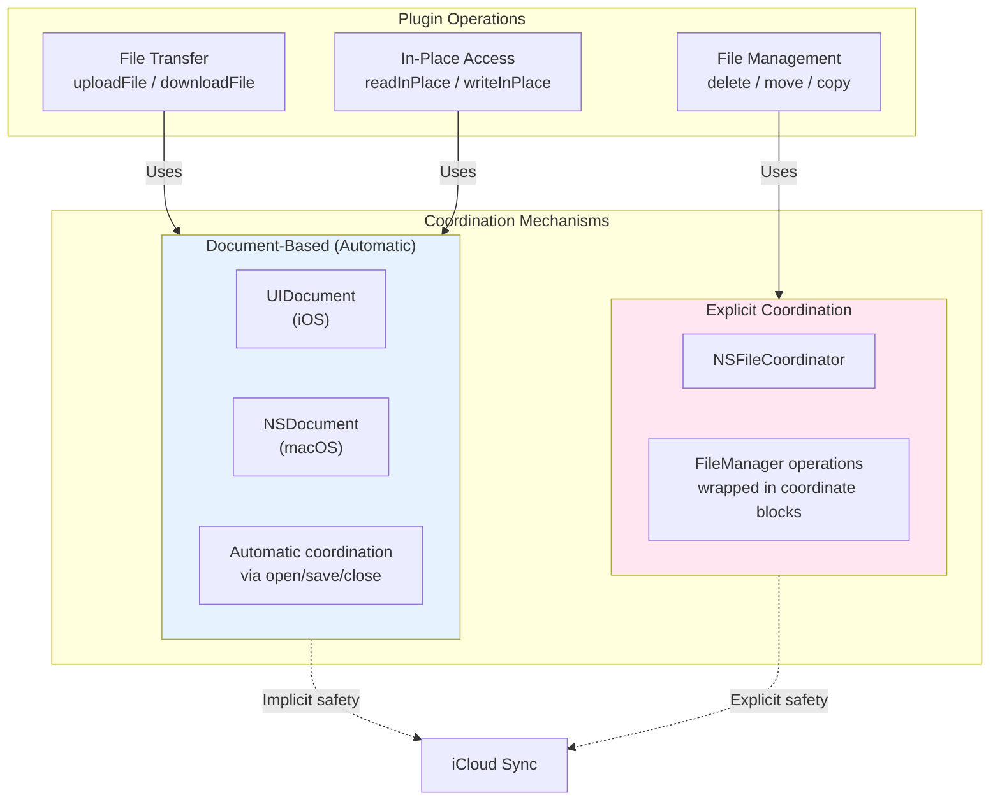
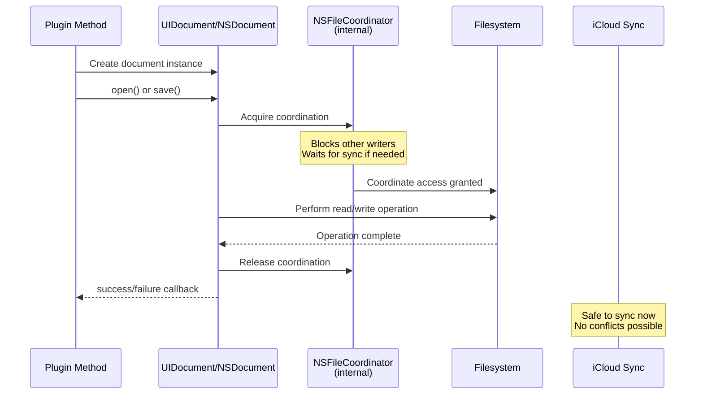
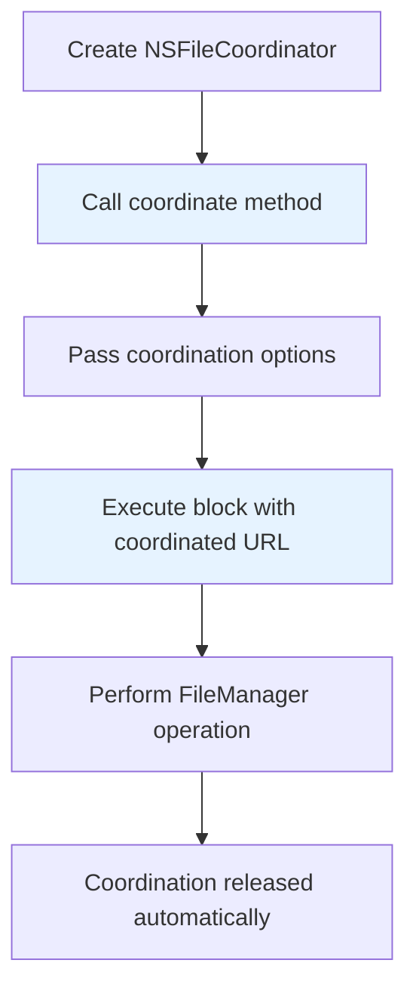
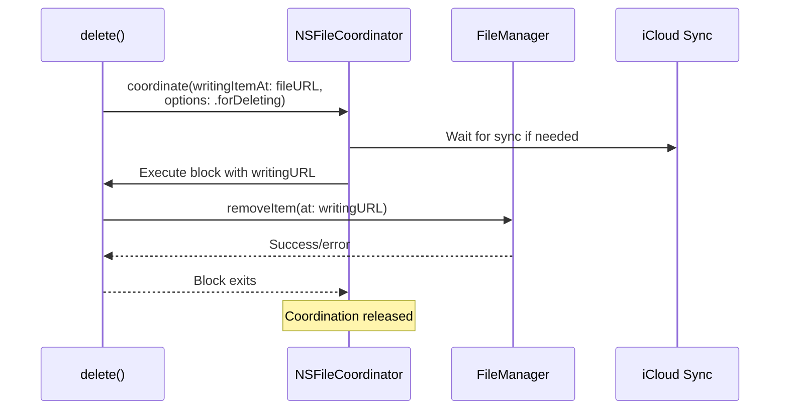
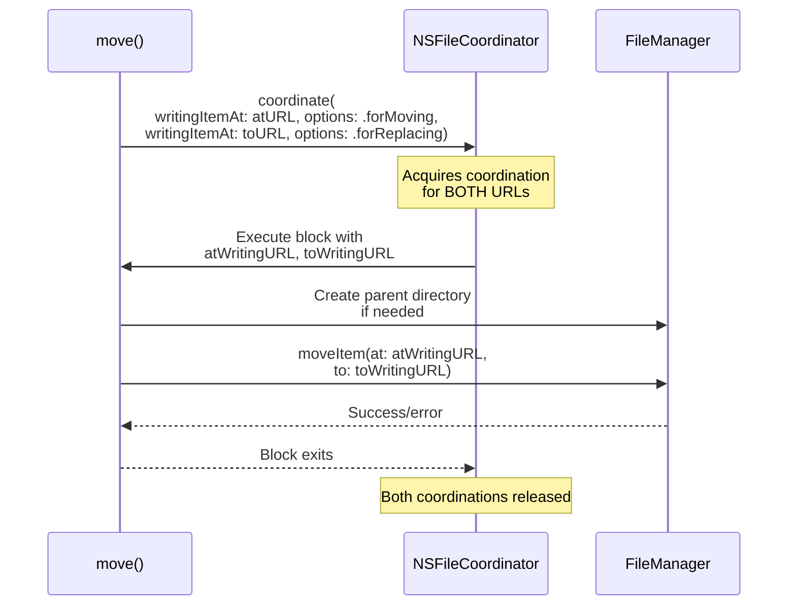
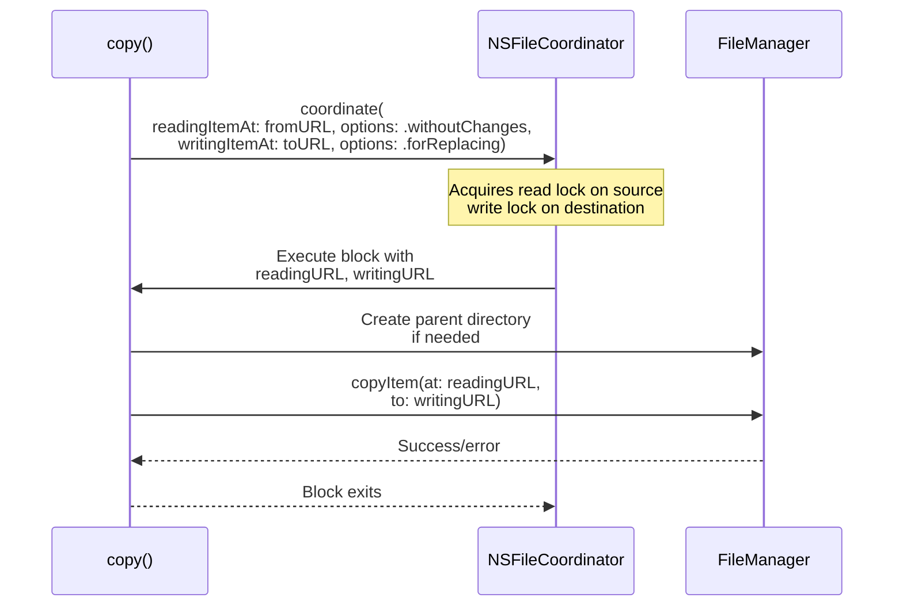

# File Coordination

<details>
<summary>Relevant source files</summary>

The following files were used as context for generating this wiki page:

- [README.md](../../README.md)
- [docs/notes/download_flow.md](../notes/download_flow.md)
- [ios/Classes/ICloudDocument.swift](../../ios/Classes/ICloudDocument.swift)
- [ios/Classes/iOSICloudStoragePlugin.swift](../../ios/Classes/iOSICloudStoragePlugin.swift)
- [macos/Classes/ICloudDocument.swift](../../macos/Classes/ICloudDocument.swift)
- [macos/Classes/macOSICloudStoragePlugin.swift](../../macos/Classes/macOSICloudStoragePlugin.swift)

</details>


## Purpose and Scope

This page documents how the `icloud_storage_plus` plugin uses Apple's file coordination APIs to ensure safe, concurrent access to iCloud files. File coordination prevents race conditions and "Operation not permitted" errors (NSCocoaErrorDomain Code=257) that occur when your app and iCloud's sync processes attempt to access the same file simultaneously.

The plugin employs two coordination strategies: automatic coordination through `UIDocument`/`NSDocument` for file content operations, and explicit `NSFileCoordinator` usage for file management operations. For streaming I/O implementation details, see [Streaming I/O Implementation](#5.3). For conflict resolution specifics, see [Conflict Resolution](#5.6).

**Sources:** [README.md:594-604](), [ios/Classes/iOSICloudStoragePlugin.swift:969-1067]()

---

## Why File Coordination is Required

### The Concurrent Access Problem

iCloud containers are shared resources accessed by multiple processes:
- Your application reading/writing files
- iCloud sync daemon downloading/uploading changes
- System processes managing file versions and conflicts
- Other instances of your app on different devices (indirectly via sync)

Without coordination, operations fail with permission errors when these processes collide.

### The Solution

Apple's coordination APIs establish temporary exclusive or shared access to files:
- **Writers** block other writers and readers during modification
- **Readers** allow concurrent reads but block writers
- Coordination respects iCloud sync boundaries, preventing data corruption

The plugin wraps all iCloud file access in coordinated operations to provide reliable, race-condition-free behavior.

**Sources:** [README.md:594-604](), [docs/notes/download_flow.md:1-17]()

---

## Coordination Mechanisms Overview



**Coordination Strategy by Operation Type**

| Operation Category | Coordination Mechanism | Implementation Class |
|-------------------|------------------------|---------------------|
| Upload (streaming) | `UIDocument`/`NSDocument` automatic | `ICloudDocument` |
| Download (streaming) | `UIDocument`/`NSDocument` automatic | `ICloudDocument` |
| Read in-place (text) | `UIDocument`/`NSDocument` automatic | `ICloudInPlaceDocument` |
| Read in-place (binary) | `UIDocument`/`NSDocument` automatic | `ICloudInPlaceBinaryDocument` |
| Write in-place (text) | `UIDocument`/`NSDocument` automatic | `ICloudInPlaceDocument` |
| Write in-place (binary) | `UIDocument`/`NSDocument` automatic | `ICloudInPlaceBinaryDocument` |
| Delete | `NSFileCoordinator` explicit | Direct in plugin |
| Move | `NSFileCoordinator` explicit | Direct in plugin |
| Copy | `NSFileCoordinator` explicit | Direct in plugin |

**Sources:** [ios/Classes/ICloudDocument.swift:1-533](), [ios/Classes/iOSICloudStoragePlugin.swift:947-1084](), [macos/Classes/ICloudDocument.swift:1-480]()

---

## Document-Based Coordination (Automatic)

### How UIDocument/NSDocument Provide Coordination

The plugin's document classes (`ICloudDocument`, `ICloudInPlaceDocument`, `ICloudInPlaceBinaryDocument`) inherit from `UIDocument` (iOS) or `NSDocument` (macOS). These base classes automatically coordinate all file access during their lifecycle:



**Document Lifecycle Methods with Implicit Coordination**

On **iOS** (`UIDocument`):
- [`open(completionHandler:)`](https://developer.apple.com/documentation/uikit/uidocument/1619974-open) - coordinates read access
- [`save(to:for:completionHandler:)`](https://developer.apple.com/documentation/uikit/uidocument/1619970-save) - coordinates write access
- [`read(from:)`](https://developer.apple.com/documentation/uikit/uidocument/1619977-read) - called within coordinated block
- [`writeContents(_:andAttributes:safelyTo:for:)`](https://developer.apple.com/documentation/uikit/uidocument/1619967-writecontents) - called within coordinated block

On **macOS** (`NSDocument`):
- [`read(from:ofType:)`](https://developer.apple.com/documentation/appkit/nsdocument/1515084-read) - coordinates read access
- [`write(to:ofType:for:originalContentsURL:)`](https://developer.apple.com/documentation/appkit/nsdocument/1515193-write) - coordinates write access

### Example: Upload File with Automatic Coordination

The `uploadFile` operation creates an `ICloudDocument` and calls its `save` method. Coordination happens automatically:


**Code Implementation:**

[ios/Classes/iOSICloudStoragePlugin.swift:268-281]() shows the upload implementation that delegates to document coordination:

```swift
writeDocument(at: cloudFileURL, sourceURL: localFileURL) { error in
  // Coordination is handled inside writeDocument
}
```

[ios/Classes/ICloudDocument.swift:355-382]() shows the `writeDocument` helper that uses `UIDocument.save`:

```swift
func writeDocument(at url: URL, sourceURL: URL, completion: @escaping (Error?) -> Void) {
    let document = ICloudDocument(fileURL: url)
    document.sourceURL = sourceURL
    document.save(to: url, for: saveOperation) { success in
        // UIDocument has coordinated all access automatically
    }
}
```

The actual write happens in [ios/Classes/ICloudDocument.swift:32-52]() during `writeContents`:

```swift
override func writeContents(_ contents: Any, andAttributes attributes: [AnyHashable : Any]?, 
                          safelyTo url: URL, for saveOperation: UIDocument.SaveOperation) throws {
    // This executes within a coordinated block established by UIDocument
    try streamCopy(from: payload.sourceURL, to: url)
}
```

**Sources:** [ios/Classes/ICloudDocument.swift:1-382](), [macos/Classes/ICloudDocument.swift:264-318](), [ios/Classes/iOSICloudStoragePlugin.swift:236-285]()

### In-Place Document Coordination

In-place operations use specialized document classes that load full file content into memory:

**Text Access** - `ICloudInPlaceDocument`:
- [ios/Classes/ICloudDocument.swift:216-278]() - iOS implementation
- [macos/Classes/ICloudDocument.swift:199-234]() - macOS implementation
- Coordinates UTF-8 text read/write operations

**Binary Access** - `ICloudInPlaceBinaryDocument`:
- [ios/Classes/ICloudDocument.swift:280-315]() - iOS implementation
- [macos/Classes/ICloudDocument.swift:236-260]() - macOS implementation  
- Coordinates raw `Data` read/write operations

The plugin methods that use these classes:
- [ios/Classes/iOSICloudStoragePlugin.swift:425-447]() - `readInPlaceDocument`
- [ios/Classes/iOSICloudStoragePlugin.swift:473-501]() - `writeInPlaceDocument`
- [ios/Classes/iOSICloudStoragePlugin.swift:449-471]() - `readInPlaceBinaryDocument`
- [ios/Classes/iOSICloudStoragePlugin.swift:503-531]() - `writeInPlaceBinaryDocument`

**Sources:** [ios/Classes/ICloudDocument.swift:216-531](), [macos/Classes/ICloudDocument.swift:199-479](), [ios/Classes/iOSICloudStoragePlugin.swift:425-531]()

---

## Explicit File Coordination

### When Explicit Coordination is Used

File management operations (`delete`, `move`, `copy`) use `FileManager` APIs directly rather than document classes. For these operations, the plugin explicitly creates `NSFileCoordinator` instances and wraps the `FileManager` calls in coordination blocks.

### NSFileCoordinator API Pattern

All explicit coordination follows this pattern:



The coordination block receives a potentially different URL than the one requested. iCloud may have moved or renamed the file during sync, so always use the coordinated URL provided in the block.

**Sources:** [ios/Classes/iOSICloudStoragePlugin.swift:947-1084](), [macos/Classes/macOSICloudStoragePlugin.swift:945-1096]()

---

## Coordination Patterns by Operation

### Delete Operation

Deletes require **write coordination** with the `.forDeleting` option:



**Implementation:**

[ios/Classes/iOSICloudStoragePlugin.swift:969-983]():

```swift
let fileCoordinator = NSFileCoordinator(filePresenter: nil)
fileCoordinator.coordinate(
    writingItemAt: fileURL,
    options: NSFileCoordinator.WritingOptions.forDeleting,
    error: nil
) { writingURL in
    do {
        try FileManager.default.removeItem(at: writingURL)
        result(nil)
    } catch {
        let mapped = mapFileNotFoundError(error) ?? nativeCodeError(error)
        result(mapped)
    }
}
```

**Key Details:**
- `filePresenter: nil` - No file presenter because this is a one-time operation
- `.forDeleting` option signals intent to delete to the coordination system
- The `writingURL` in the block may differ from `fileURL` if the file moved

**Sources:** [ios/Classes/iOSICloudStoragePlugin.swift:947-984](), [macos/Classes/macOSICloudStoragePlugin.swift:945-983]()

### Move Operation

Moves require **dual write coordination** - one for the source (moving) and one for the destination (replacing):



**Implementation:**

[ios/Classes/iOSICloudStoragePlugin.swift:1010-1033]():

```swift
let fileCoordinator = NSFileCoordinator(filePresenter: nil)
fileCoordinator.coordinate(
    writingItemAt: atURL,
    options: NSFileCoordinator.WritingOptions.forMoving,
    writingItemAt: toURL,
    options: NSFileCoordinator.WritingOptions.forReplacing,
    error: nil
) { atWritingURL, toWritingURL in
    do {
        let toDirURL = toWritingURL.deletingLastPathComponent()
        if !FileManager.default.fileExists(atPath: toDirURL.path) {
            try FileManager.default.createDirectory(
                at: toDirURL,
                withIntermediateDirectories: true,
                attributes: nil
            )
        }
        try FileManager.default.moveItem(at: atWritingURL, to: toWritingURL)
        result(nil)
    } catch {
        result(nativeCodeError(error))
    }
}
```

**Key Details:**
- Dual coordination prevents race conditions during the move
- `.forMoving` on source - signals the source will be removed
- `.forReplacing` on destination - allows overwriting existing files
- Parent directory creation happens within the coordinated block

**Sources:** [ios/Classes/iOSICloudStoragePlugin.swift:987-1034](), [macos/Classes/macOSICloudStoragePlugin.swift:985-1034]()

### Copy Operation

Copies require **read coordination** on source and **write coordination** on destination:



**Implementation:**

[ios/Classes/iOSICloudStoragePlugin.swift:1051-1067]():

```swift
let fileCoordinator = NSFileCoordinator(filePresenter: nil)
fileCoordinator.coordinate(
    readingItemAt: atURL,
    options: NSFileCoordinator.ReadingOptions.withoutChanges,
    writingItemAt: toURL,
    options: NSFileCoordinator.WritingOptions.forReplacing,
    error: nil
) { readingURL, writingURL in
    do {
        let toDirURL = writingURL.deletingLastPathComponent()
        if !FileManager.default.fileExists(atPath: toDirURL.path) {
            try FileManager.default.createDirectory(/*...*/)
        }
        try FileManager.default.copyItem(at: readingURL, to: writingURL)
        result(nil)
    } catch {
        result(nativeCodeError(error))
    }
}
```

**Key Details:**
- `.withoutChanges` on source - read-only access, no modifications expected
- `.forReplacing` on destination - allows overwriting existing files
- Read locks allow concurrent reads but block writers

**Sources:** [ios/Classes/iOSICloudStoragePlugin.swift:1036-1084](), [macos/Classes/macOSICloudStoragePlugin.swift:1036-1096]()

---

## Coordination Options Reference

### NSFileCoordinator.ReadingOptions

| Option | Purpose | Used In |
|--------|---------|---------|
| `.withoutChanges` | Read-only access, no modifications expected | `copy` operation |
| `.resolvesSymbolicLink` | Follow symbolic links (not used in plugin) | - |
| `.immediatelyAvailableMetadataOnly` | Don't trigger downloads (not used in plugin) | - |
| `.forUploading` | Prepare file for upload (not used in plugin) | - |

### NSFileCoordinator.WritingOptions

| Option | Purpose | Used In |
|--------|---------|---------|
| `.forDeleting` | Intent to delete the file | `delete` operation |
| `.forMoving` | Intent to move the file (source) | `move` operation |
| `.forReplacing` | Allow overwriting existing file (destination) | `move`, `copy` operations |
| `.forMerging` | Merge with existing content (not used in plugin) | - |
| `.contentIndependentMetadataOnly` | Modify metadata only (not used in plugin) | - |

**Sources:** [ios/Classes/iOSICloudStoragePlugin.swift:969-1084](), [macos/Classes/macOSICloudStoragePlugin.swift:969-1096]()

---

## Coordination with Metadata Operations

Operations like `documentExists`, `getMetadata`, and `gather` do **not** use explicit coordination. They read metadata and file attributes directly:

- **`documentExists`** - [ios/Classes/iOSICloudStoragePlugin.swift:870-887]() - Uses `FileManager.fileExists(atPath:)` without coordination
- **`getDocumentMetadata`** - [ios/Classes/iOSICloudStoragePlugin.swift:891-932]() - Uses `URL.resourceValues(forKeys:)` without coordination
- **`gather`** - [ios/Classes/iOSICloudStoragePlugin.swift:94-134]() - Uses `NSMetadataQuery` which has its own synchronization

These operations are read-only and use system APIs that handle their own thread safety. They may return stale information if called during active file modifications, but this is acceptable for metadata queries.

**Sources:** [ios/Classes/iOSICloudStoragePlugin.swift:870-932](), [macos/Classes/macOSICloudStoragePlugin.swift:869-931]()

---

## Error Handling and Coordination Failures

### Common Coordination Errors

When coordination fails, the plugin maps native errors to standardized codes:

| Error Type | Platform Exception Code | Cause |
|------------|------------------------|-------|
| File not found during delete | `E_FNF` or `E_FNF_WRITE` | File deleted by another process |
| File not found during move | `E_FNF` | Source file doesn't exist |
| Permission denied | `E_NAT` | iCloud sync conflict or permission issue |
| Timeout | (N/A for coordination) | Coordination blocks indefinitely |

**Error Mapping:**

[ios/Classes/iOSICloudStoragePlugin.swift:979-981]() shows error handling within coordinated blocks:

```swift
} catch {
    let mapped = mapFileNotFoundError(error) ?? nativeCodeError(error)
    result(mapped)
}
```

The `mapFileNotFoundError` function [ios/Classes/SwiftHelpers.swift:62-82]() distinguishes between different file-not-found scenarios:

- `NSFileNoSuchFileError` (Cocoa error 4) → `E_FNF`
- `NSFileReadNoSuchFileError` (Cocoa error 260) → `E_FNF_READ`
- `NSFileWriteNoSuchFileError` (Cocoa error 512) → `E_FNF_WRITE`

**Sources:** [ios/Classes/iOSICloudStoragePlugin.swift:947-1084](), [ios/Classes/SwiftHelpers.swift:62-82]()

### Coordination Blocking Behavior

`NSFileCoordinator.coordinate()` methods are **blocking calls**. They wait indefinitely until:
1. All conflicting operations complete
2. iCloud sync reaches a consistent state
3. The coordination can safely proceed

The plugin does not implement timeouts for coordination because:
- Short timeouts cause false failures during normal sync delays
- Long timeouts don't help if coordination is truly stuck
- The system eventually releases coordination when sync completes

For operations that may take time (like downloads), the plugin uses `NSMetadataQuery` with idle watchdog timers (see [Download Retry Logic](#6.2)) rather than coordination timeouts.

**Sources:** [docs/notes/download_flow.md:1-54](), [ios/Classes/iOSICloudStoragePlugin.swift:733-837]()

---

## Best Practices

### Always Use Coordinated URLs

Within coordination blocks, **always use the URL provided in the block**, not the original URL:

```swift
// ✅ CORRECT
fileCoordinator.coordinate(writingItemAt: fileURL, options: .forDeleting, error: nil) { writingURL in
    try FileManager.default.removeItem(at: writingURL)  // Use writingURL
}

// ❌ WRONG
fileCoordinator.coordinate(writingItemAt: fileURL, options: .forDeleting, error: nil) { writingURL in
    try FileManager.default.removeItem(at: fileURL)  // Don't use original fileURL
}
```

iCloud may have renamed or moved files during sync. The coordinated URL reflects the current location.

### Don't Nest Coordination

Never call another coordinated operation within a coordination block:

```swift
// ❌ WRONG - Potential deadlock
fileCoordinator.coordinate(writingItemAt: url1, options: .forDeleting, error: nil) { url1 in
    // This inner coordination might deadlock waiting for outer coordination to release
    anotherCoordinator.coordinate(writingItemAt: url2, options: .forDeleting, error: nil) { url2 in
        // ...
    }
}
```

The plugin avoids this by structuring operations to complete independently.

### Minimize Coordination Duration

Keep coordination blocks short. Don't perform slow operations like network requests:

```swift
// ✅ GOOD - Quick file operation
fileCoordinator.coordinate(writingItemAt: url, options: .forDeleting, error: nil) { writingURL in
    try FileManager.default.removeItem(at: writingURL)
}

// ❌ BAD - Slow operation blocks other access
fileCoordinator.coordinate(writingItemAt: url, options: .forDeleting, error: nil) { writingURL in
    try FileManager.default.removeItem(at: writingURL)
    sleep(10)  // Don't block coordination unnecessarily
    performNetworkRequest()  // Don't do this inside coordination
}
```

**Sources:** [ios/Classes/iOSICloudStoragePlugin.swift:947-1084]()

---

## Platform Differences

### iOS vs macOS Coordination Behavior

The coordination API is identical on iOS and macOS, but there are subtle behavioral differences:

| Aspect | iOS (`UIDocument`) | macOS (`NSDocument`) |
|--------|-------------------|---------------------|
| Coordination scope | Per-operation | Per-document lifecycle |
| Background execution | Documents close immediately | Documents may stay open |
| Conflict UI | No user interaction | System may show conflict UI |
| Autosave | Manual control via `save()` | Automatic via `autosavesInPlace` |

### Document Lifecycle Differences

**iOS Implementation** [ios/Classes/ICloudDocument.swift:320-382]():
- Documents are created per-operation
- `open()` and `save()` are explicit calls
- Document closes immediately after operation

**macOS Implementation** [macos/Classes/ICloudDocument.swift:264-318]():
- Documents created per-operation but may be kept open longer by system
- Operations run on background queue (`DispatchQueue.global(qos: .userInitiated)`)
- `close()` called explicitly but system may defer actual close

Both platforms achieve the same coordination guarantees despite these implementation differences.

**Sources:** [ios/Classes/ICloudDocument.swift:320-382](), [macos/Classes/ICloudDocument.swift:264-318](), [macos/Classes/macOSICloudStoragePlugin.swift:945-1096]()

---

## Summary

File coordination in `icloud_storage_plus` follows two patterns:

1. **Automatic coordination** via `UIDocument`/`NSDocument` for all content operations (uploads, downloads, in-place reads/writes)
2. **Explicit coordination** via `NSFileCoordinator` for file management operations (delete, move, copy)

This hybrid approach provides safety without requiring developers to understand coordination details. All iCloud file access is protected against concurrent modifications by the sync daemon, eliminating race conditions and permission errors.

The coordination layer is transparent to Dart code - it operates entirely in the native implementation. Developers using the plugin's public API receive the benefits of coordination automatically.

**Sources:** [README.md:594-604](), [ios/Classes/iOSICloudStoragePlugin.swift:947-1084](), [ios/Classes/ICloudDocument.swift:1-533](), [macos/Classes/ICloudDocument.swift:1-480]()
