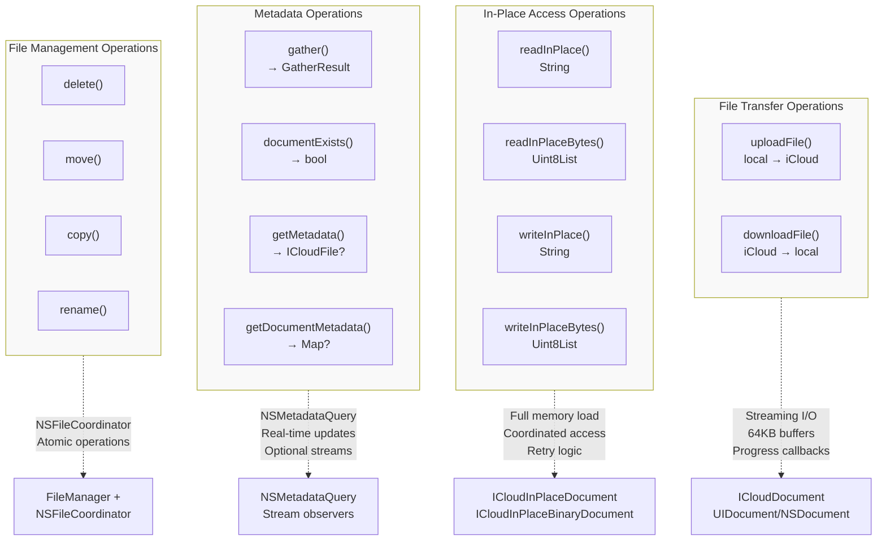
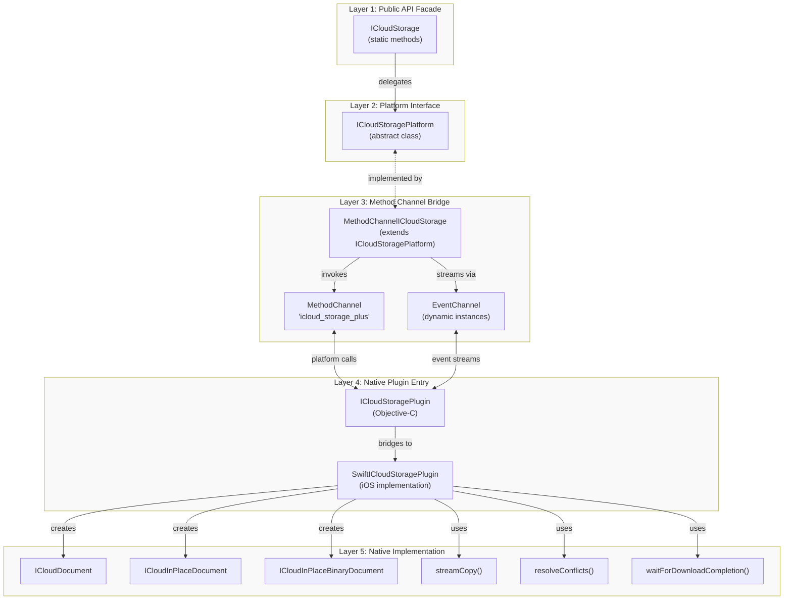
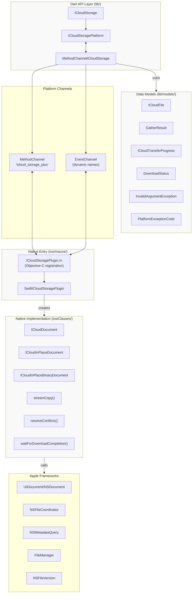
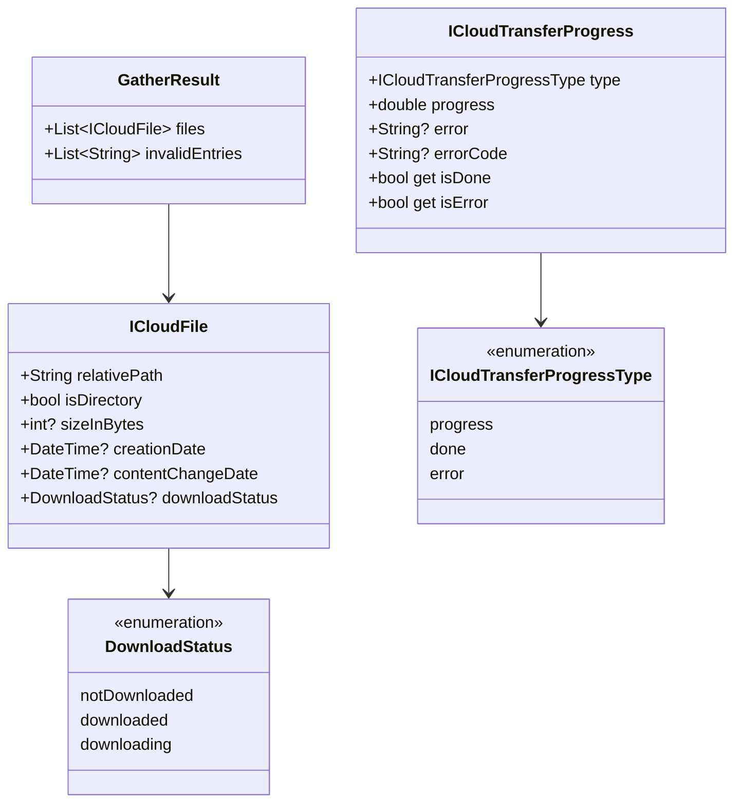
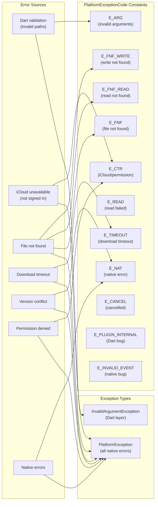

# Home

<details>
<summary>Relevant source files</summary>

The following files were used as context for generating this wiki page:

- [AGENTS.md](../../AGENTS.md)
- [README.md](../../README.md)
- [pubspec.yaml](../../pubspec.yaml)

</details>


This wiki documents the **icloud_storage_plus** Flutter plugin: a comprehensive guide to its architecture, API, implementation, and usage patterns. This page provides an overview of the plugin's capabilities and serves as the entry point for navigating the complete technical documentation.

**Scope**: This wiki covers the Dart API layer ([lib/]() directory), platform interface abstractions, native iOS/macOS implementations, data models, error handling, testing strategies, and advanced usage patterns. For initial setup and basic usage examples, see [Getting Started](#2). For detailed API documentation organized by operation type, see [API Reference](#3).

**Sources**: [README.md:1-671](), [pubspec.yaml:1-29](), [AGENTS.md:1-121]()

---

## What is icloud_storage_plus?

**icloud_storage_plus** is a Flutter plugin that provides safe, coordinated access to Apple's iCloud document storage for iOS (13.0+) and macOS (10.15+) applications. The plugin enables Flutter apps to:

- Store and sync files across devices using the user's iCloud account
- Access files with automatic conflict resolution and download management
- Integrate with the native Files app for user-visible documents
- Monitor file changes and sync progress in real-time
- Perform coordinated file operations without permission errors

The plugin wraps Apple's document storage APIs (`UIDocument`, `NSDocument`, `NSFileCoordinator`, `NSMetadataQuery`) in a Flutter-friendly interface with streaming support for large files and progress monitoring.

**Architecture Pattern**: The plugin follows Flutter's **federated plugin pattern** with a public Dart API facade (`ICloudStorage`), an abstract platform interface (`ICloudStoragePlatform`), and platform-specific implementations that communicate via `MethodChannel` and `EventChannel`.

**Sources**: [README.md:1-11](), [pubspec.yaml:2-4](), [pubspec.yaml:23-28]()

---

## Core Capabilities

The plugin organizes operations into four functional categories, each with distinct access patterns and use cases:



**Category Descriptions**:

| Category | Operations | Pattern | Use Case |
|----------|-----------|---------|----------|
| **File Transfer** | `uploadFile`, `downloadFile` | Copy-in/copy-out with streaming | Large files, user-initiated transfers |
| **In-Place Access** | `readInPlace*`, `writeInPlace*` | Coordinated direct access | Small JSON/text files, transparent sync |
| **Metadata** | `gather`, `documentExists`, `getMetadata` | Query-based monitoring | File listing, existence checks |
| **File Management** | `delete`, `move`, `copy`, `rename` | Coordinated operations | Organizing files, cleanup |

**Sources**: [README.md:12-19](), [README.md:342-483]()

---

## Plugin Architecture Overview

The plugin implements a **five-layer architecture** that separates concerns and enables platform independence:



**Layer Responsibilities**:

1. **Public API Facade** (`ICloudStorage`): Provides static methods with validation, type safety, and path normalization
2. **Platform Interface** (`ICloudStoragePlatform`): Defines abstract contract for platform implementations
3. **Method Channel Bridge** (`MethodChannelICloudStorage`): Transforms Dart calls to platform messages and events back to Dart streams
4. **Native Plugin Entry**: Objective-C registration that bridges to Swift implementation
5. **Native Implementation**: Swift classes implementing iCloud operations using Apple frameworks

**Sources**: [README.md:583-625](), [pubspec.yaml:23-28](), [AGENTS.md:22-31]()

---

## Key Components and Data Flow

This diagram maps the primary code entities and their relationships:



**Key Code Entities**:

| Component | File Path | Purpose |
|-----------|-----------|---------|
| `ICloudStorage` | [lib/icloud_storage.dart]() | Static facade API with 14+ methods |
| `ICloudStoragePlatform` | [lib/icloud_storage_platform_interface.dart]() | Abstract interface for platform implementations |
| `MethodChannelICloudStorage` | [lib/icloud_storage_method_channel.dart]() | Default implementation using platform channels |
| `ICloudFile` | [lib/models/icloud_file.dart]() | File metadata model with nullable fields |
| `GatherResult` | [lib/models/gather_result.dart]() | Container for file list + invalid entries |
| `ICloudTransferProgress` | [lib/models/icloud_transfer_progress.dart]() | Progress event model for transfers |
| `PlatformExceptionCode` | [lib/models/exceptions.dart]() | Error code constants |
| `SwiftICloudStoragePlugin` | [ios/Classes/SwiftICloudStoragePlugin.swift]() | iOS/macOS implementation entry point |
| `ICloudDocument` | [ios/Classes/ICloudDocument.swift]() | Streaming file transfer wrapper |
| `ICloudInPlaceDocument` | [ios/Classes/ICloudInPlaceDocument.swift]() | Text in-place access wrapper |
| `ICloudInPlaceBinaryDocument` | [ios/Classes/ICloudInPlaceBinaryDocument.swift]() | Binary in-place access wrapper |

**Sources**: [README.md:342-573](), [pubspec.yaml:23-28]()

---

## Quick Start Example

The following demonstrates the basic usage pattern for file upload with progress monitoring:

```dart
import 'dart:io';
import 'package:icloud_storage_plus/icloud_storage.dart';

// 1. Check availability
final available = await ICloudStorage.icloudAvailable();
if (!available) {
  throw Exception('iCloud not available');
}

// 2. Prepare local file
final localPath = '${Directory.systemTemp.path}/notes.txt';
await File(localPath).writeAsString('My notes');

// 3. Upload with progress monitoring
await ICloudStorage.uploadFile(
  containerId: 'iCloud.com.yourapp.container',
  localPath: localPath,
  cloudRelativePath: 'Documents/notes.txt',
  onProgress: (stream) {
    stream.listen((progress) {
      if (progress.type == ICloudTransferProgressType.progress) {
        print('Progress: ${(progress.progress * 100).toStringAsFixed(1)}%');
      } else if (progress.type == ICloudTransferProgressType.done) {
        print('Upload complete');
      }
    });
  },
);
```

**Operational Flow**:

1. **Availability Check**: `icloudAvailable()` verifies user is signed into iCloud
2. **Path Validation**: `uploadFile` validates paths (no trailing slashes for files)
3. **Event Channel Setup**: If `onProgress` provided, creates EventChannel before operation
4. **Method Invocation**: Invokes native method via `MethodChannel`
5. **Native Execution**: Creates `ICloudDocument`, performs streaming copy with `streamCopy()`
6. **Progress Streaming**: Progress events flow back through EventChannel
7. **Completion**: Future completes when copy finishes; iCloud sync continues in background

For in-place access patterns suitable for small JSON/text files, see [In-Place Access Operations](#3.2). For comprehensive API documentation, see [API Reference](#3).

**Sources**: [README.md:43-74](), [README.md:350-390]()

---

## Data Models

The plugin uses strongly-typed models for all data structures:



**Model Characteristics**:

- `ICloudFile`: Uses value equality via `equatable` package for predictable comparisons
- **Nullable fields** (since v1.0): `sizeInBytes`, `creationDate`,
  `contentChangeDate`, `downloadStatus` are null for directories or when
  metadata unavailable
- `GatherResult`: Separates valid files from malformed metadata entries for debugging
- `ICloudTransferProgress`: Progress events flow through EventChannel; `type` distinguishes progress updates from completion/error states

For detailed model documentation, see [Data Models](#3.5).

**Sources**: [README.md:196-256](), [README.md:502-516]()

---

## Error Handling

The plugin implements comprehensive error handling with standardized exception codes:



**Error Handling Strategy**:

1. **Dart Layer**: Pre-validates arguments and throws `InvalidArgumentException` for invalid paths, empty strings, or malformed input
2. **Platform Channel Layer**: Wraps all native errors in `PlatformException` with standardized codes from `PlatformExceptionCode`
3. **Native Layer**: Maps `NSError` instances to appropriate exception codes with descriptive messages

**Error Code Categories**:

| Category | Codes | Description |
|----------|-------|-------------|
| User Errors | `E_ARG` | Invalid arguments (empty paths, trailing slashes) |
| Environmental | `E_CTR`, `E_FNF*`, `E_TIMEOUT` | iCloud unavailable, file not found, timeout |
| Operation Failures | `E_READ`, `E_NAT`, `E_CANCEL` | Read errors, native errors, cancellation |
| Plugin Bugs | `E_PLUGIN_INTERNAL`, `E_INVALID_EVENT` | Internal errors requiring GitHub issue |

For comprehensive error handling patterns and examples, see [Error Handling](#3.6).

**Sources**: [README.md:518-573](), [README.md:627-657]()

---

## Platform Support and Requirements

**Supported Platforms**:

| Platform | Minimum Version | Plugin Class |
|----------|----------------|--------------|
| iOS | 13.0 | `ICloudStoragePlugin` |
| macOS | 10.15 | `ICloudStoragePlugin` |

**Flutter/Dart Requirements**:

- Dart SDK: `>=3.0.0 <4.0.0`
- Flutter: `>=3.10.0`

**Apple Configuration Requirements**:

1. **Apple Developer Portal**:
   - Create App ID
   - Create iCloud Container ID (e.g., `iCloud.com.yourapp.container`)
   - Enable iCloud for App ID and assign container

2. **Xcode Configuration**:
   - Add iCloud capability to target
   - Enable "iCloud Documents"
   - Select container

3. **Files App Integration** (optional):
   - Add `NSUbiquitousContainers` to `Info.plist`
   - Set `NSUbiquitousContainerIsDocumentScopePublic` to `true`
   - Files must use `Documents/` prefix to appear in Files app

For detailed configuration steps, see [Getting Started](#2). For Files app integration specifics, see [Files App Integration](#6.3).

**Sources**: [README.md:27-30](), [README.md:575-581](), [README.md:295-340](), [pubspec.yaml:6-8]()

---

## Wiki Navigation

This wiki is organized into the following sections:

| Section | Pages | Description |
|---------|-------|-------------|
| **Setup** | [Getting Started](#2) | Installation, configuration, prerequisites |
| **API** | [API Reference](#3)<br/>[File Transfer Operations](#3.1)<br/>[In-Place Access Operations](#3.2)<br/>[Metadata Operations](#3.3)<br/>[File Management Operations](#3.4)<br/>[Data Models](#3.5)<br/>[Error Handling](#3.6) | Complete Dart API documentation organized by operation type |
| **Architecture** | [Architecture Overview](#4)<br/>[Platform Interface Pattern](#4.1)<br/>[Method Channel Implementation](#4.2)<br/>[Event Channels and Streaming](#4.3)<br/>[Native Layer Overview](#4.4) | High-level design patterns and layer separation |
| **Implementation** | [Native Implementation Deep Dive](#5)<br/>[Plugin Registration](#5.1)<br/>[Document Classes](#5.2)<br/>[Streaming I/O](#5.3)<br/>[File Coordination](#5.4)<br/>[Metadata Queries](#5.5)<br/>[Conflict Resolution](#5.6) | iOS/macOS native code details |
| **Advanced** | [Advanced Topics](#6)<br/>[Progress Monitoring](#6.1)<br/>[Download Retry Logic](#6.2)<br/>[Files App Integration](#6.3)<br/>[Path Validation](#6.4) | In-depth coverage of specialized features |
| **Quality** | [Testing Guide](#7)<br/>[API Tests](#7.1)<br/>[Method Channel Tests](#7.2)<br/>[Example Application](#8) | Test suite documentation and example app tour |
| **Maintenance** | [Contributing](#9)<br/>[Version History and Migration](#10) | Development workflow and version migration guides |

**Recommended Reading Paths**:

- **New Users**: [Getting Started](#2) → [API Reference](#3) → [Example Application](#8)
- **Contributors**: [Architecture Overview](#4) → [Native Implementation Deep Dive](#5) → [Contributing](#9)
- **Advanced Users**: [Advanced Topics](#6) → [Testing Guide](#7)

**Sources**: [README.md:1-671](), [AGENTS.md:1-121]()

---

## Additional Resources

**External Documentation**:

- **GitHub Repository**: https://github.com/kingdomseed/icloud_storage_plus
- **pub.dev Package**: https://pub.dev/packages/icloud_storage_plus
- **Publisher**: jasonholtdigital.com

**Apple Documentation**:

- [NSMetadataQuery](https://developer.apple.com/documentation/foundation/nsmetadataquery)
- [UIDocument](https://developer.apple.com/documentation/uikit/uidocument)
- [NSDocument](https://developer.apple.com/documentation/appkit/nsdocument)
- [iCloud Document Storage](https://developer.apple.com/icloud/documentation/data-storage/)
- [Configuring iCloud Services](https://developer.apple.com/documentation/xcode/configuring-icloud-services)

**Testing Notes**:

- iCloud functionality is unreliable in iOS Simulator
- Use physical devices for testing sync behavior
- Multi-device sync requires multiple physical devices
- The Simulator's "Trigger iCloud Sync" feature is unreliable

**Sources**: [README.md:1-8](), [README.md:612-625](), [README.md:658-671]()
