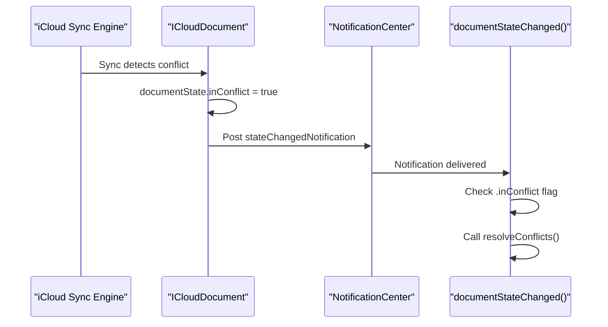
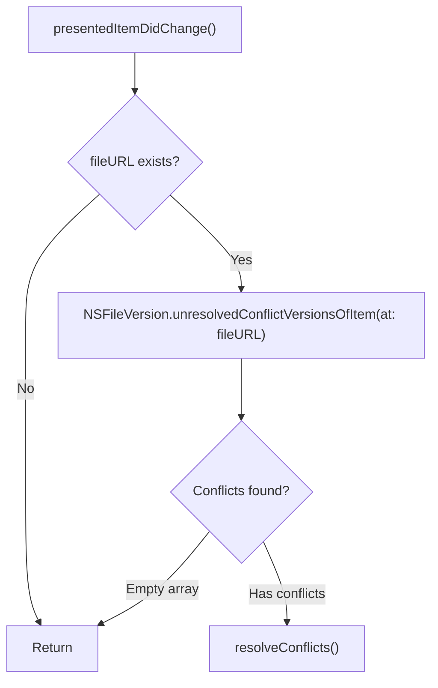
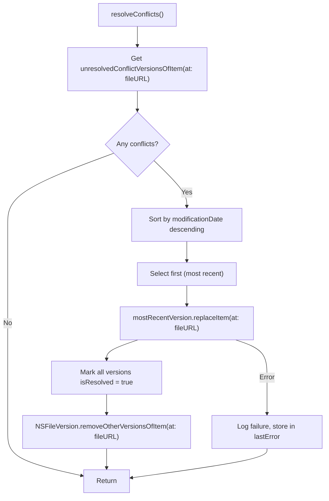
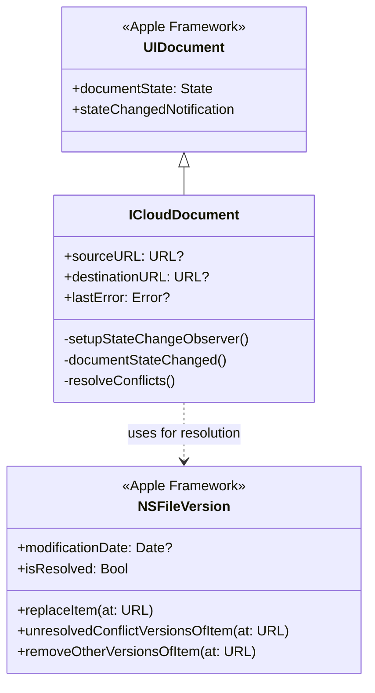
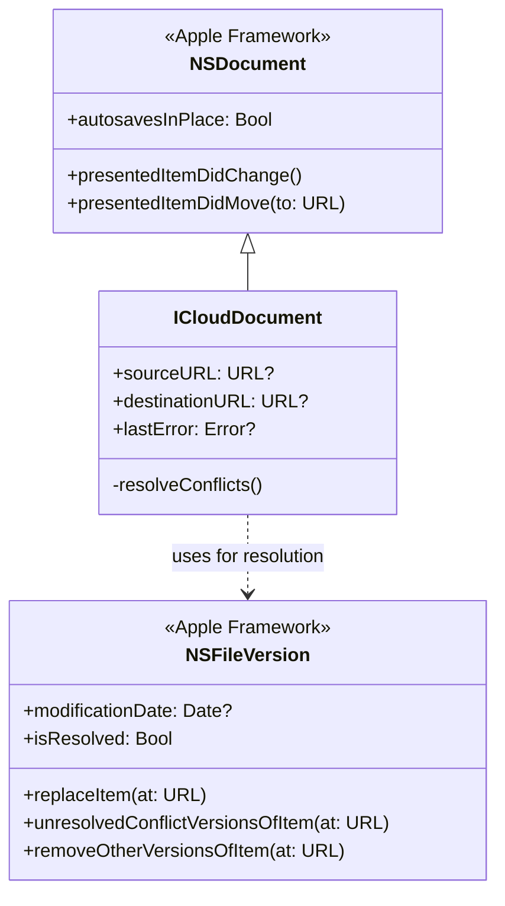
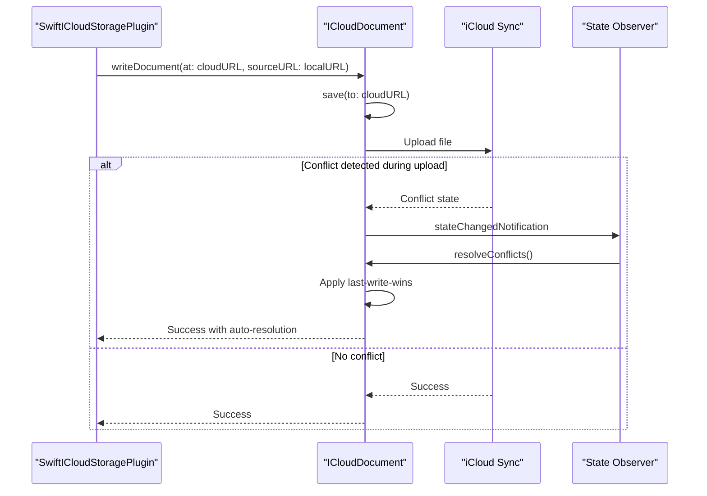
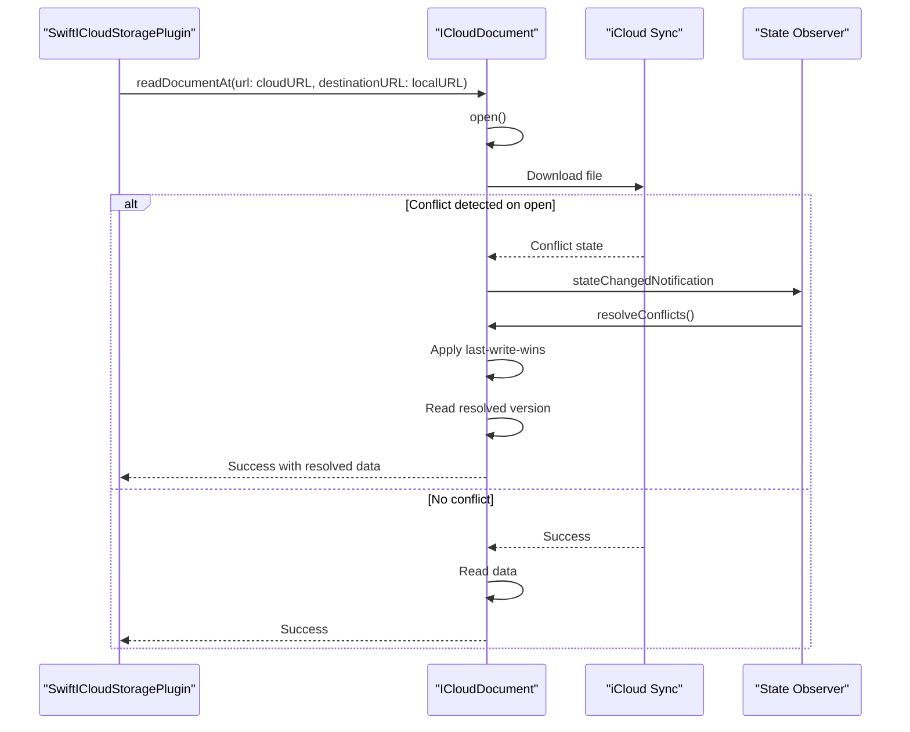
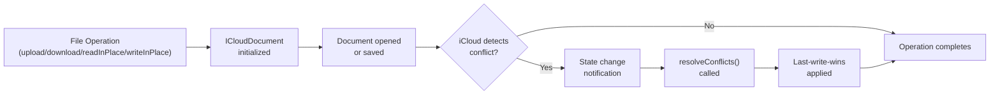
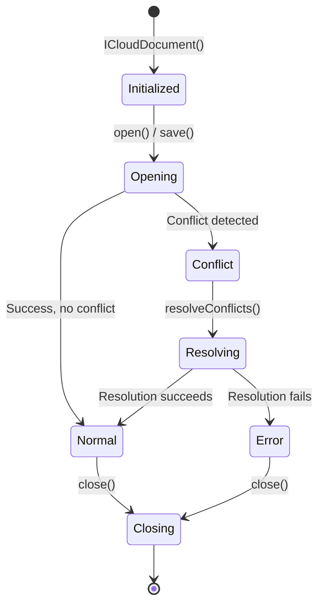

# Conflict Resolution

<details>
<summary>Relevant source files</summary>

The following files were used as context for generating this wiki page:

- [doc/notes/download_flow.md](../notes/download_flow.md)
- [ios/Classes/ICloudDocument.swift](../../ios/Classes/ICloudDocument.swift)
- [ios/Classes/iOSICloudStoragePlugin.swift](../../ios/Classes/iOSICloudStoragePlugin.swift)
- [macos/Classes/ICloudDocument.swift](../../macos/Classes/ICloudDocument.swift)
- [macos/Classes/macOSICloudStoragePlugin.swift](../../macos/Classes/macOSICloudStoragePlugin.swift)

</details>


## Purpose and Scope

This page documents how the `icloud_storage_plus` plugin automatically detects and resolves file version conflicts that occur when the same iCloud file is modified concurrently from multiple devices. The plugin implements a **last-write-wins** strategy using Apple's `NSFileVersion` API.

For information about general file coordination and safe concurrent access patterns, see [File Coordination](#5.4). For metadata monitoring that reports the `hasUnresolvedConflicts` flag, see [Metadata Queries](#5.5). For an overview of the document wrapper classes, see [Document Classes](#5.2).

---

## Understanding iCloud File Version Conflicts

### What Are Version Conflicts?

When iCloud synchronizes files across multiple devices, conflicts arise when:
1. Device A modifies a file while offline or before sync completes
2. Device B modifies the same file independently
3. Both devices sync to iCloud, creating divergent versions

iCloud preserves all conflicting versions rather than overwriting data. The application must then decide which version to keep.

### Conflict States

Apple's `NSFileVersion` API tracks three version categories:

| Version Type | Description |
|-------------|-------------|
| **Current Version** | The version currently visible in the filesystem |
| **Conflict Versions** | Alternative versions that diverged during concurrent editing |
| **Other Versions** | Historical versions (autosave, Time Machine, etc.) |

The `hasUnresolvedConflicts` flag in file metadata indicates when conflict versions exist.

**Sources:** [ios/Classes/ICloudDocument.swift:107-140](), [macos/Classes/ICloudDocument.swift:90-123]()

---

## Conflict Detection Mechanisms

### Document State Monitoring (iOS)

On iOS, `ICloudDocument` uses `UIDocument.stateChangedNotification` to monitor for conflicts:



The observer is registered during initialization at [ios/Classes/ICloudDocument.swift:84-91]():

- Listens for `UIDocument.stateChangedNotification`
- Checks if `documentState.contains(.inConflict)`
- Automatically triggers resolution when conflicts detected

**Sources:** [ios/Classes/ICloudDocument.swift:84-105]()

### Presented Item Monitoring (macOS)

On macOS, `ICloudDocument` overrides `NSDocument.presentedItemDidChange()`:



This callback is invoked by the file coordination system whenever the file changes externally.

**Sources:** [macos/Classes/ICloudDocument.swift:75-83]()

### Metadata Query Exposure

Both platforms expose conflict status through metadata queries. The `mapMetadataItem()` and `mapResourceValues()` functions include:

```swift
"hasUnresolvedConflicts": (item.value(forAttribute: NSMetadataUbiquitousItemHasUnresolvedConflictsKey) as? Bool) ?? false
```

This allows the Dart layer to detect conflicts without opening the document.

**Sources:** [ios/Classes/iOSICloudStoragePlugin.swift:190](), [macos/Classes/macOSICloudStoragePlugin.swift:190](), [ios/Classes/iOSICloudStoragePlugin.swift:212](), [macos/Classes/macOSICloudStoragePlugin.swift:212]()

---

## Automatic Resolution Strategy

### Last-Write-Wins Algorithm

The plugin implements an automatic resolution strategy that preserves the most recently modified version:



### Algorithm Steps

1. **Retrieve Conflicts**: Call `NSFileVersion.unresolvedConflictVersionsOfItem(at:)` to get all conflicting versions
2. **Sort by Timestamp**: Order versions by `modificationDate` (most recent first)
3. **Replace Current Version**: Call `replaceItem(at:)` on the winning version to update the filesystem
4. **Mark Resolved**: Set `isResolved = true` on all conflict versions to clear the conflict state
5. **Clean Up**: Call `removeOtherVersionsOfItem(at:)` to delete obsolete versions

**Sources:** [ios/Classes/ICloudDocument.swift:107-140](), [macos/Classes/ICloudDocument.swift:90-123]()

### Why Last-Write-Wins?

This strategy prioritizes:
- **Simplicity**: No user intervention required
- **Predictability**: Most recent edit always wins
- **Automation**: Conflicts resolve transparently during normal file operations

**Limitations**: If users expect manual conflict resolution or merging of changes, this strategy may not be appropriate. Applications requiring custom conflict resolution should handle conflicts at the application layer before writing to iCloud.

---

## Implementation Details (iOS)

### Class Structure



### Observer Setup

At initialization, `ICloudDocument` registers for state changes:

```swift
// ios/Classes/ICloudDocument.swift:84-91
private func setupStateChangeObserver() {
    NotificationCenter.default.addObserver(
        self,
        selector: #selector(documentStateChanged),
        name: UIDocument.stateChangedNotification,
        object: self
    )
}
```

### State Change Handler

The handler checks multiple state flags and delegates to resolution:

```swift
// ios/Classes/ICloudDocument.swift:93-105
@objc private func documentStateChanged() {
    if documentState.contains(.inConflict) {
        resolveConflicts()
    }
    
    if documentState.contains(.savingError) {
        DebugHelper.log("Document saving error: \(fileURL.lastPathComponent)")
    }
    
    if documentState.contains(.editingDisabled) {
        DebugHelper.log("Document editing disabled: \(fileURL.lastPathComponent)")
    }
}
```

### Resolution Implementation

The core resolution logic uses `NSFileVersion`:

```swift
// ios/Classes/ICloudDocument.swift:107-140
private func resolveConflicts() {
    let fileURL = self.fileURL
    DebugHelper.log("Resolving conflicts for: \(fileURL.lastPathComponent)")
    
    if let conflictVersions = NSFileVersion.unresolvedConflictVersionsOfItem(at: fileURL),
       !conflictVersions.isEmpty {
        
        let sortedVersions = conflictVersions.sorted { version1, version2 in
            let date1 = version1.modificationDate ?? Date.distantPast
            let date2 = version2.modificationDate ?? Date.distantPast
            return date1 > date2
        }
        
        if let mostRecentVersion = sortedVersions.first {
            do {
                try mostRecentVersion.replaceItem(at: fileURL)
                
                for version in conflictVersions {
                    version.isResolved = true
                }
                
                try NSFileVersion.removeOtherVersionsOfItem(at: fileURL)
                
                DebugHelper.log(
                    "Conflicts resolved using version from: \(mostRecentVersion.modificationDate?.description ?? "unknown")"
                )
            } catch {
                DebugHelper.log("Failed to resolve conflicts: \(error.localizedDescription)")
                lastError = error
            }
        }
    }
}
```

**Sources:** [ios/Classes/ICloudDocument.swift:73-140]()

---

## Implementation Details (macOS)

### Class Structure



### File Presentation Protocol

macOS uses the `NSFilePresenter` protocol (inherited from `NSDocument`) for change notifications:

```swift
// macos/Classes/ICloudDocument.swift:71-73
override class var autosavesInPlace: Bool {
    return true
}
```

Enabling autosave activates file presentation and triggers `presentedItemDidChange()` callbacks.

### Change Detection

The override checks for conflicts whenever iCloud updates the file:

```swift
// macos/Classes/ICloudDocument.swift:75-83
override func presentedItemDidChange() {
    super.presentedItemDidChange()
    
    if let fileURL = fileURL,
       let conflictVersions = NSFileVersion.unresolvedConflictVersionsOfItem(at: fileURL),
       !conflictVersions.isEmpty {
        resolveConflicts()
    }
}
```

### Resolution Implementation

The resolution logic is identical to iOS, using the same `NSFileVersion` API:

```swift
// macos/Classes/ICloudDocument.swift:90-123
private func resolveConflicts() {
    guard let fileURL = fileURL else { return }
    
    DebugHelper.log("Resolving conflicts for: \(fileURL.lastPathComponent)")
    
    if let conflictVersions = NSFileVersion.unresolvedConflictVersionsOfItem(at: fileURL),
       !conflictVersions.isEmpty {
        
        let sortedVersions = conflictVersions.sorted { version1, version2 in
            let date1 = version1.modificationDate ?? Date.distantPast
            let date2 = version2.modificationDate ?? Date.distantPast
            return date1 > date2
        }
        
        if let mostRecentVersion = sortedVersions.first {
            do {
                try mostRecentVersion.replaceItem(at: fileURL)
                
                for version in conflictVersions {
                    version.isResolved = true
                }
                
                try NSFileVersion.removeOtherVersionsOfItem(at: fileURL)
                
                DebugHelper.log(
                    "Conflicts resolved using version from: \(mostRecentVersion.modificationDate?.description ?? "unknown")"
                )
            } catch {
                DebugHelper.log("Failed to resolve conflicts: \(error.localizedDescription)")
                lastError = error
            }
        }
    }
}
```

**Sources:** [macos/Classes/ICloudDocument.swift:69-123]()

---

## Integration with Plugin Operations

### Upload Operations

When uploading files via `ICloudDocument.writeDocument()`:



**Sources:** [ios/Classes/ICloudDocument.swift:355-382](), [macos/Classes/ICloudDocument.swift:290-318]()

### Download Operations

When downloading via `ICloudDocument.readDocumentAt()`:



**Sources:** [ios/Classes/ICloudDocument.swift:325-348](), [macos/Classes/ICloudDocument.swift:266-287]()

### In-Place Operations

In-place reads and writes (`readInPlace`, `writeInPlace`) also use document classes with conflict resolution:

- `ICloudInPlaceDocument` inherits `UIDocument` (iOS) or `NSDocument` (macOS)
- These classes enable `autosavesInPlace` which activates file presentation
- Conflicts are detected through the same mechanisms
- However, these document subclasses do **not** include explicit `resolveConflicts()` methods
- They rely on the base class autosave behavior and iCloud's automatic resolution

**Sources:** [ios/Classes/ICloudDocument.swift:216-278](), [ios/Classes/ICloudDocument.swift:280-315](), [macos/Classes/ICloudDocument.swift:199-234](), [macos/Classes/ICloudDocument.swift:236-260]()

### Metadata Exposure

The `hasUnresolvedConflicts` flag is exposed in two ways:

1. **Metadata Queries** (`gather`, `getDocumentMetadata`): Include conflict status in returned dictionaries
2. **Resource Values**: Direct URL inspection includes `ubiquitousItemHasUnresolvedConflictsKey`

This allows Dart layer to:
- Display conflict status in UI
- Implement custom conflict handling before resolution
- Monitor conflict resolution progress

**Sources:** [ios/Classes/iOSICloudStoragePlugin.swift:177-198](), [ios/Classes/iOSICloudStoragePlugin.swift:200-218](), [macos/Classes/macOSICloudStoragePlugin.swift:177-198](), [macos/Classes/macOSICloudStoragePlugin.swift:200-218]()

---

## Resolution Timing and Lifecycle

### When Resolution Occurs



Resolution happens automatically during document operations:
1. **Immediately** when conflict detected during open/save
2. **Asynchronously** when iCloud sync notifies of external changes
3. **Before operation completes** ensuring consistent state is returned

### Document Lifecycle



The document is closed after operations complete, releasing file coordination locks.

**Sources:** [ios/Classes/ICloudDocument.swift:73-140](), [macos/Classes/ICloudDocument.swift:69-123]()

---

## Best Practices and Limitations

### Automatic Resolution Behavior

| Scenario | Plugin Behavior |
|----------|-----------------|
| Single device editing | No conflicts, normal operation |
| Concurrent edits (different timestamps) | Last-write-wins resolution, earlier changes lost |
| Concurrent edits (same timestamp) | Arbitrary version chosen (undefined sort order) |
| Conflict resolution failure | Error logged, `lastError` set, operation may fail |

### Application Considerations

**When Last-Write-Wins Is Appropriate:**
- Simple file formats (JSON, plain text, preferences)
- Single-user applications with occasional multi-device access
- Applications where latest data is always preferred

**When Custom Resolution Is Needed:**
- Collaborative editing applications
- Structured data requiring merging (e.g., databases, CRDTs)
- Applications requiring user intervention for conflicts

**Implementing Custom Resolution:**

To implement custom conflict resolution:

1. Monitor `hasUnresolvedConflicts` flag via `gather()` or `getDocumentMetadata()`
2. When conflicts detected, do NOT use the plugin's document operations
3. Access conflict versions directly using native code:
   ```swift
   let conflicts = NSFileVersion.unresolvedConflictVersionsOfItem(at: url)
   // Implement custom logic to choose or merge versions
   ```
4. After resolution, mark versions resolved and update the current version
5. Optionally, use plugin operations after manual resolution

The plugin's automatic resolution can be bypassed by handling conflicts before calling plugin methods.

**Sources:** [ios/Classes/ICloudDocument.swift:107-140](), [macos/Classes/ICloudDocument.swift:90-123]()

### Error Handling

Resolution errors are captured but do not fail the operation:

- Errors stored in `ICloudDocument.lastError` property
- Debug log messages emitted for troubleshooting
- Operation continues with best-effort resolution

If resolution fails, the conflict state may persist, but the file remains accessible with its current version.

**Sources:** [ios/Classes/ICloudDocument.swift:134-137](), [macos/Classes/ICloudDocument.swift:117-120]()

### Thread Safety

Conflict resolution runs on the document's coordination thread:

- **iOS**: Runs on main queue (via `NotificationCenter` delivery)
- **macOS**: Runs on file presenter queue (via `presentedItemDidChange()`)

All `NSFileVersion` operations are thread-safe and coordinated by the system.

---

## Summary

The `icloud_storage_plus` plugin provides transparent, automatic conflict resolution using Apple's `NSFileVersion` API:

1. **Detection**: `UIDocument` state notifications (iOS) or `NSDocument` presentation callbacks (macOS)
2. **Strategy**: Last-write-wins based on modification timestamps
3. **Execution**: Automatic replacement of current version with most recent conflict
4. **Cleanup**: Marking conflicts resolved and removing obsolete versions
5. **Visibility**: Exposing `hasUnresolvedConflicts` flag to Dart layer

This approach eliminates manual conflict handling for simple use cases while remaining extensible for applications requiring custom resolution strategies.

**Sources:** [ios/Classes/ICloudDocument.swift:1-533](), [macos/Classes/ICloudDocument.swift:1-480]()
