# Advanced Topics

<details>
<summary>Relevant source files</summary>

The following files were used as context for generating this wiki page:

- [CHANGELOG.md](../../CHANGELOG.md)
- [README.md](../../README.md)

</details>


This page provides in-depth coverage of advanced features and implementation patterns in the `icloud_storage_plus` plugin. The topics covered here go beyond basic API usage to explain sophisticated mechanisms like progress monitoring, retry logic, Files app integration, and path validation strategies.

For basic API usage, see [Getting Started](#2). For platform architecture details, see [Architecture Overview](#4). For native implementation specifics, see [Native Implementation Deep Dive](#5).

---

## Progress Monitoring Architecture

The plugin supports real-time progress monitoring for long-running file transfer operations through a listener-driven streaming mechanism. Progress updates are delivered as `ICloudTransferProgress` events through Flutter's `EventChannel`, enabling applications to provide responsive UI feedback during uploads and downloads.

### ICloudTransferProgress Event Flow

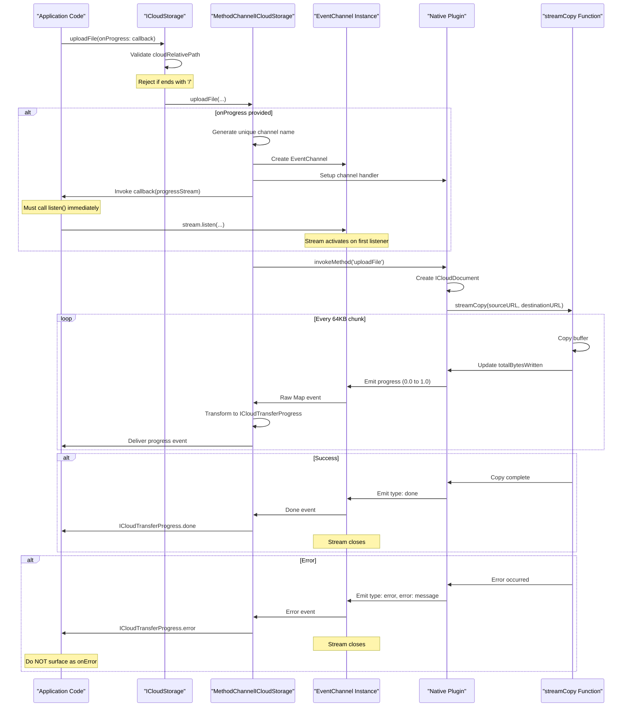

**Key Implementation Details:**

| Aspect | Implementation | Location |
|--------|---------------|----------|
| **Channel Creation** | Dynamic EventChannel with unique names | [lib/icloud_storage_method_channel.dart:164-178]() |
| **Listener Activation** | Streams are broadcast but start only when first listener attaches | [lib/icloud_storage_method_channel.dart:178-184]() |
| **Event Transformation** | Raw Map events transformed to `ICloudTransferProgress` | [lib/icloud_storage_method_channel.dart:187-225]() |
| **Progress Calculation** | `totalBytesWritten / totalBytes` (0.0 to 1.0) | [ios/Classes/ICloudDocument.swift:155-169]() |
| **Buffer Size** | 64KB chunks for memory efficiency | [ios/Classes/iOSICloudStoragePlugin.swift:674-676]() |
| **Error Delivery** | Errors delivered as data events, not stream errors | [lib/icloud_storage_method_channel.dart:209-225]() |

### Listener-Driven Event Channels

The plugin uses a **listener-driven pattern** where EventChannel instances are created before the operation starts, but native event handlers only activate when the first Dart listener attaches. This prevents missing early progress updates.

**Critical Timing Requirement:**

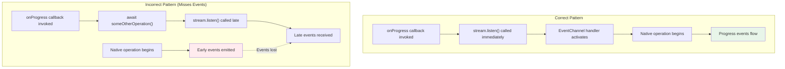

From [README.md:267-270](): Applications must attach listeners immediately inside the `onProgress` callback to avoid missing early events. Delaying the `listen()` call (e.g., by awaiting other operations) causes early progress updates to be dropped.

### ICloudTransferProgress States

The progress model has three terminal states:

| Type | Description | Stream Behavior | Fields |
|------|-------------|-----------------|--------|
| `progress` | Incremental update | Continues | `progressPercentage: double` (0.0-1.0) |
| `done` | Success completion | Closes after emission | None |
| `error` | Operation failure | Closes after emission | `error: String` |

**Error Handling Pattern:**

Progress failures are delivered as `ICloudTransferProgressType.error` events within the stream data, NOT as stream `onError` callbacks. This is documented in [README.md:386-389]() and [lib/icloud_storage_method_channel.dart:209-217]().

```dart
// From application perspective:
stream.listen(
  (progress) {
    switch (progress.type) {
      case ICloudTransferProgressType.progress:
        // Update UI with progress.progressPercentage
      case ICloudTransferProgressType.done:
        // Operation complete
      case ICloudTransferProgressType.error:
        // Handle failure: progress.error contains message
    }
  },
  onError: (error) {
    // This is ONLY for stream infrastructure errors,
    // NOT operation failures
  },
);
```

**Sources:** [lib/icloud_storage_method_channel.dart:164-225](), [README.md:267-270](), [README.md:386-389](), [ios/Classes/ICloudDocument.swift:100-169](), [CHANGELOG.md:148-151]()

---

## Download Retry Logic and Idle Watchdog

The in-place read operations (`readInPlace`, `readInPlaceBytes`) implement sophisticated retry logic to handle transient iCloud download failures. Unlike time-based timeouts, the plugin uses an **idle watchdog pattern** that only triggers when downloads stall, not based on absolute operation duration.

### waitForDownloadCompletion Architecture

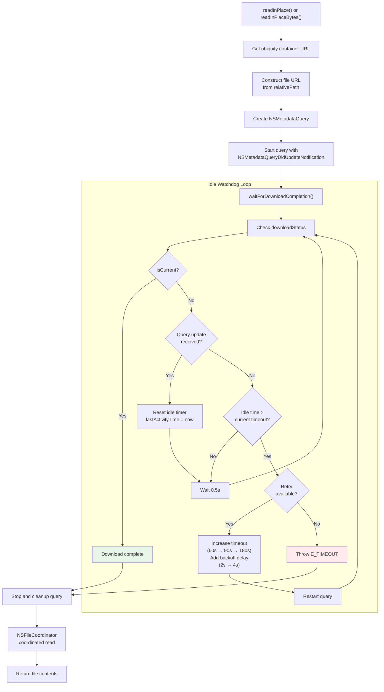

### Configuration Parameters

The retry mechanism uses three escalating timeout levels with exponential backoff:

| Attempt | Idle Timeout | Backoff Delay | Purpose |
|---------|--------------|---------------|---------|
| 1 | 60 seconds | 0 seconds | Initial attempt, handles quick syncs |
| 2 | 90 seconds | 2 seconds | First retry, gives more time for slow connections |
| 3 | 180 seconds | 4 seconds | Final retry, maximum patience for difficult syncs |

**Timeout Configuration Location:** [ios/Classes/iOSICloudStoragePlugin.swift:494-510]()

These values can be modified by editing the `timeouts` and `backoffDelays` arrays in the native implementation.

### Idle Watchdog Pattern

The "idle watchdog" pattern distinguishes between:
- **Active wait time**: Query is receiving updates (metadata syncing) — no timeout
- **Idle time**: No query updates received — timeout applies

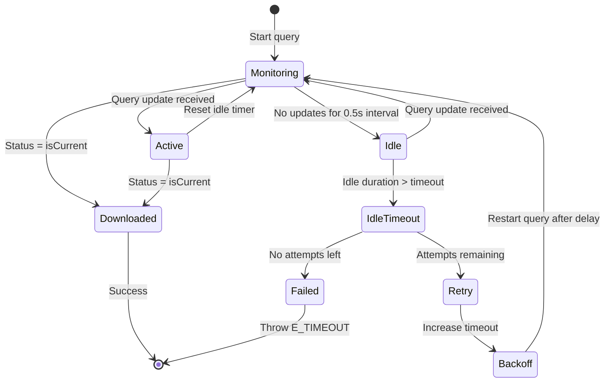

This approach is described in [CHANGELOG.md:83-84]() as surfacing `E_TIMEOUT` "if the download stalls" rather than based on absolute time. A large file that continuously receives metadata updates will never timeout, but a stalled download that stops receiving updates will timeout after the configured idle period.

### NSMetadataQuery Integration

The download waiting mechanism relies on `NSMetadataQuery` to monitor file status:

| Query Aspect | Implementation |
|--------------|----------------|
| **Scope** | Single file URL via `NSMetadataQueryUbiquitousDocumentsScope` |
| **Notification** | `NSMetadataQueryDidUpdateNotification` observer |
| **Status Check** | `NSMetadataUbiquitousItemDownloadingStatusKey` attribute |
| **Target Status** | `NSMetadataUbiquitousItemDownloadingStatusCurrent` |
| **Activity Detection** | Timestamp update on each notification |
| **Cleanup** | Observer and query stopped after completion/timeout |

**Implementation Reference:** [ios/Classes/iOSICloudStoragePlugin.swift:494-596]()

### Error Handling

Download retry failures surface as:
- **Error Code**: `E_TIMEOUT` (though removed from public docs per [CHANGELOG.md:112]())
- **Error Message**: "Download timeout waiting for file after X attempts"
- **Exception Type**: `PlatformException` at Dart layer
- **Cleanup**: All observers removed and query stopped

The retry logic prevents transient network issues from causing immediate failures while still providing bounded wait times to prevent indefinite hangs.

**Sources:** [ios/Classes/iOSICloudStoragePlugin.swift:494-596](), [CHANGELOG.md:83-84](), [CHANGELOG.md:112](), [README.md:80-85]()

---

## Files App Integration Configuration

Making iCloud documents visible in the iOS/macOS Files app requires specific `Info.plist` configuration and adherence to Apple's directory structure conventions. The plugin supports this through the `Documents/` path prefix pattern.

### NSUbiquitousContainers Configuration

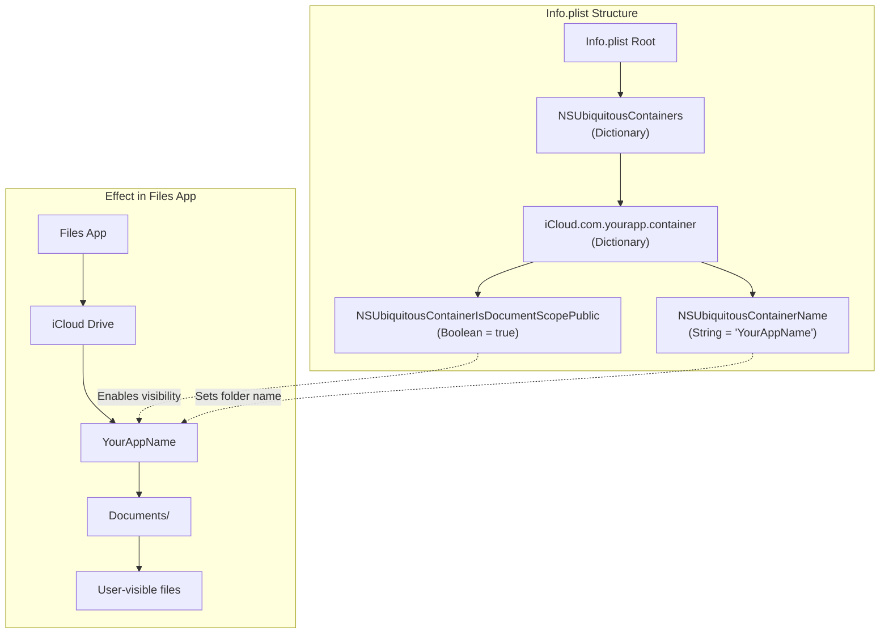

**Required Info.plist Entries:**

```xml
<key>NSUbiquitousContainers</key>
<dict>
    <key>iCloud.com.yourapp.container</key>
    <dict>
        <key>NSUbiquitousContainerIsDocumentScopePublic</key>
        <true/>
        <key>NSUbiquitousContainerName</key>
        <string>YourAppName</string>
    </dict>
</dict>
```

From [README.md:313-326]()

### Documents/ Directory Visibility Rules

The Files app only displays files stored under the `Documents/` subdirectory within the iCloud container. This is a requirement from Apple's document storage model.

| Path Pattern | Files App Visibility | Sync Behavior | Use Case |
|--------------|---------------------|---------------|----------|
| `Documents/notes.txt` | ✅ Visible | Syncs across devices | User-facing documents |
| `Documents/Photos/image.png` | ✅ Visible | Syncs across devices | Organized user content |
| `cache/temp.dat` | ❌ Hidden | Syncs across devices | Application cache |
| `config/settings.json` | ❌ Hidden | Syncs across devices | App configuration |
| `.metadata/index` | ❌ Hidden | Syncs across devices | Internal plugin data |

**Critical Points:**

1. **Case Sensitivity**: The directory name must be exactly `Documents/` (capital D)
2. **Path Prefix**: Only `cloudRelativePath` starting with `Documents/` are visible
3. **Sync Independence**: Files outside `Documents/` still sync but remain hidden
4. **First File Requirement**: The app folder appears in Files app only after at least one `Documents/` file exists

From [README.md:327-340]()

### Configuration Validation Diagram

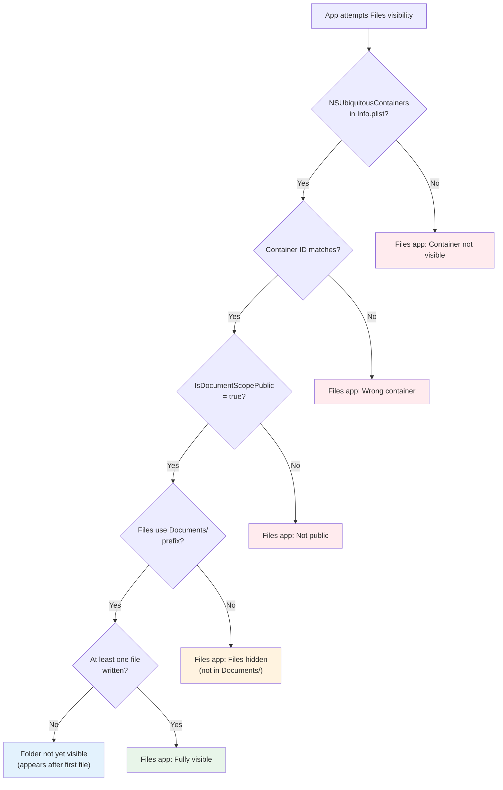

### API Usage Pattern

To ensure Files app visibility:

```dart
// Correct: Visible in Files app
await ICloudStorage.uploadFile(
  containerId: 'iCloud.com.yourapp.container',
  localPath: localFile,
  cloudRelativePath: 'Documents/notes.txt',  // ✅ Starts with Documents/
);

// Incorrect: Hidden from Files app (but still syncs)
await ICloudStorage.uploadFile(
  containerId: 'iCloud.com.yourapp.container',
  localPath: localFile,
  cloudRelativePath: 'cache/temp.txt',  // ❌ Not in Documents/
);
```

**Troubleshooting Steps:**

1. Verify `Info.plist` contains correct configuration ([README.md:313-326]())
2. Confirm `NSUbiquitousContainerIsDocumentScopePublic` is set to `true`
3. Check that container ID matches Xcode capabilities and code
4. Ensure paths use `Documents/` prefix (case-sensitive)
5. Write at least one file to trigger folder creation
6. Wait for sync (can take minutes on first run)

**Sources:** [README.md:313-340](), [README.md:645-650](), [CHANGELOG.md:83-84]()

---

## Path Validation and Directory Handling

The plugin implements strict path validation rules to distinguish between file and directory operations, prevent common errors, and ensure proper coordination with Apple's file APIs. Path validation occurs at multiple layers with different semantics.

### Validation Layers and Rules

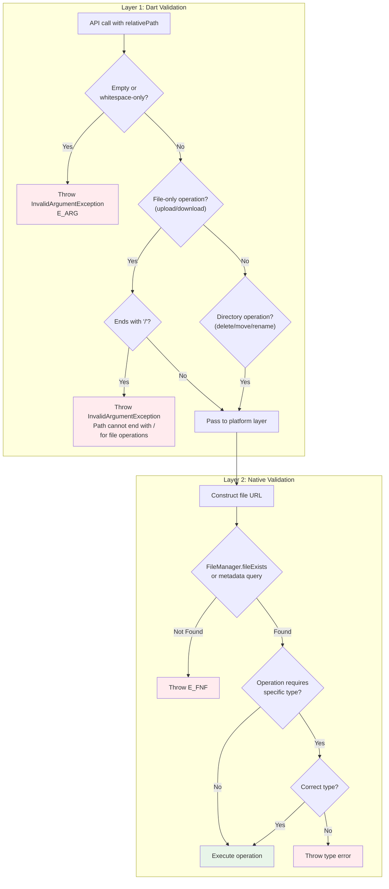

### Operation-Specific Path Requirements

| Operation | Trailing `/` Allowed? | Directory Support | Validation Location |
|-----------|----------------------|-------------------|---------------------|
| `uploadFile` | ❌ No | No (files only) | [lib/icloud_storage.dart:242-249]() |
| `downloadFile` | ❌ No | No (files only) | [lib/icloud_storage.dart:334-341]() |
| `readInPlace` | ❌ No | No (files only) | [lib/icloud_storage.dart:405-412]() |
| `writeInPlace` | ❌ No | No (files only) | [lib/icloud_storage.dart:464-471]() |
| `readInPlaceBytes` | ❌ No | No (files only) | [lib/icloud_storage.dart:536-543]() |
| `writeInPlaceBytes` | ❌ No | No (files only) | [lib/icloud_storage.dart:601-608]() |
| `delete` | ✅ Yes | Yes | [lib/icloud_storage.dart:653-660]() |
| `move` | ✅ Yes | Yes | [lib/icloud_storage.dart:694-708]() |
| `rename` | ✅ Yes | Yes | [lib/icloud_storage.dart:738-749]() |
| `copy` | ❌ No | No (files only) | [lib/icloud_storage.dart:779-792]() |
| `documentExists` | ✅ Yes | Yes | [lib/icloud_storage.dart:825-826]() |
| `getMetadata` | ✅ Yes | Yes | [lib/icloud_storage.dart:851-852]() |

### Directory Metadata Round-Trip Pattern

A significant change in version 1.0 allows directory paths with trailing
slashes to be used in metadata-returned paths:

**Scenario:**
1. `gather()` returns `ICloudFile` with `relativePath = "Documents/folder/"`
2. Application passes this path to `delete()` or `move()`
3. Path validation must accept the trailing slash

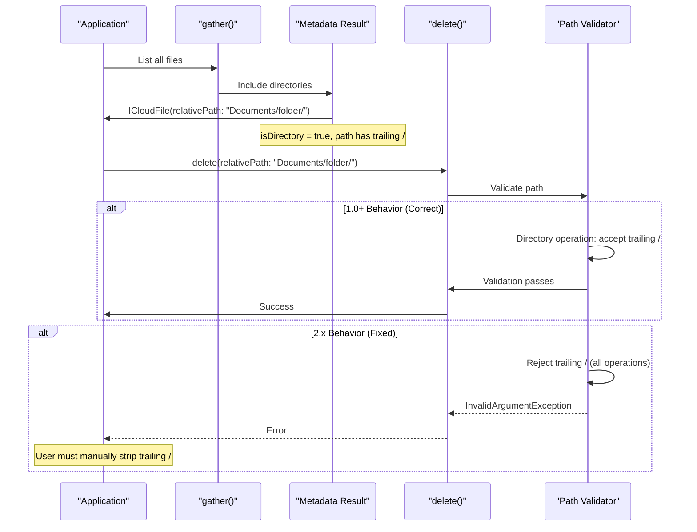

This fix is documented in [CHANGELOG.md:143-146]():

> "Dart relative-path validation now accepts trailing slashes so directory metadata from `gather()` or `getMetadata()` can be used directly in operations like `delete()`, `move()`, `rename()`, etc. Previously, directory paths like `Documents/folder/` would fail Dart validation when reused."

### File-Specific Operations Rationale

File transfer and in-place access operations reject directory paths because they use `UIDocument`/`NSDocument` APIs that are file-specific:

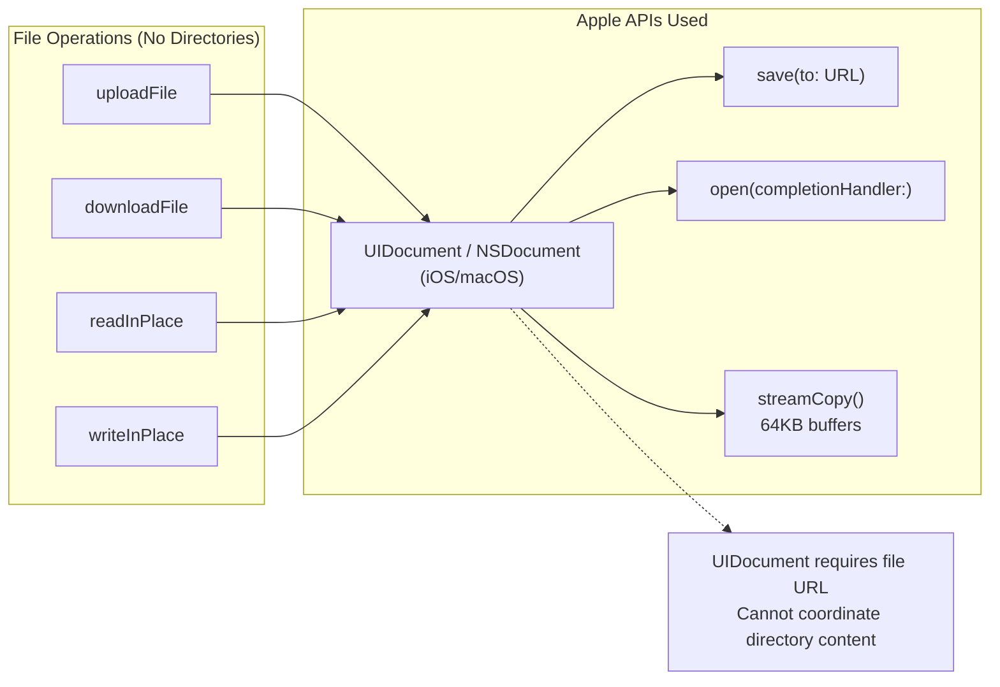

From [README.md:362-366]() and [README.md:376-381]():

> "`cloudRelativePath` must refer to a file and must not end with `/`. Directory paths with trailing slashes may appear in metadata and are accepted by directory-oriented operations like `delete`, `move`, and `getMetadata`. `uploadFile`/`downloadFile` reject directory paths because they use file-specific document coordination APIs."

### Directory Operations and NSFileCoordinator

Directory-capable operations use `NSFileCoordinator` instead of `UIDocument`:

| API | Coordination Method | Directory Support |
|-----|---------------------|-------------------|
| `uploadFile` | `ICloudDocument.save(to:)` | No |
| `downloadFile` | `ICloudDocument.open(completionHandler:)` | No |
| `delete` | `NSFileCoordinator.coordinate(writingItemAt:options:)` | Yes |
| `move` | `NSFileCoordinator.coordinate(writingItemAt:options:)` | Yes |
| `copy` | `NSFileCoordinator.coordinate(readingItemAt:writingItemAt:)` | Files only |

**Implementation Reference:** [ios/Classes/iOSICloudStoragePlugin.swift:329-453]() for coordinated FileManager operations.

### Validation Implementation Code Paths

The validation logic is implemented in [lib/icloud_storage.dart:149-178]() as private helper methods:

| Helper Method | Purpose | Error Code |
|--------------|---------|------------|
| `_requireNonEmptyPath` | Rejects empty/whitespace paths | `E_ARG` |
| `_rejectDirectoryPath` | Rejects trailing `/` for file operations | `E_ARG` |
| `_validateContainerId` | Ensures container ID is non-empty | `E_ARG` |

**Example Validation Flow for uploadFile:**

```dart
// From lib/icloud_storage.dart:242-249
_requireNonEmptyPath(cloudRelativePath, 'cloudRelativePath');
_rejectDirectoryPath(cloudRelativePath, 'cloudRelativePath');

// _rejectDirectoryPath implementation (lib/icloud_storage.dart:169-178)
if (path.endsWith('/')) {
  throw InvalidArgumentException(
    argumentName: argumentName,
    message: 'Path cannot end with / for file operations. '
             'Use file-specific paths without trailing slashes.',
  );
}
```

**Sources:** [lib/icloud_storage.dart:149-178](), [lib/icloud_storage.dart:242-249](), [lib/icloud_storage.dart:334-341](), [CHANGELOG.md:143-146](), [README.md:362-366](), [README.md:376-381](), [ios/Classes/iOSICloudStoragePlugin.swift:329-453]()

---

## Advanced Error Handling Patterns

The plugin implements sophisticated error handling across three layers, with specific error codes for different failure scenarios. Understanding these patterns helps applications provide appropriate user feedback and implement recovery strategies.

### Error Code Mapping and Recovery

```mermaid
graph TB
    subgraph "Error Sources and Codes"
        E1["Empty paths<br/>E_ARG"]
        E2["Trailing / in file ops<br/>E_ARG"]
        E3["iCloud unavailable<br/>E_CTR"]
        E4["Container access denied<br/>E_CTR"]
        E5["File not found (general)<br/>E_FNF"]
        E6["File not found (read)<br/>E_FNF_READ"]
        E7["File not found (write)<br/>E_FNF_WRITE"]
        E8["Download timeout<br/>E_TIMEOUT"]
        E9["Read failure<br/>E_READ"]
        E10["Operation cancelled<br/>E_CANCEL"]
        E11["Native error<br/>E_NAT"]
        E12["Plugin internal<br/>E_PLUGIN_INTERNAL"]
        E13["Invalid event<br/>E_INVALID_EVENT"]
    end
    
    subgraph "Recovery Strategies"
        R1["Validate before call"]
        R2["Check icloudAvailable()"]
        R3["Handle gracefully<br/>(create or skip)"]
        R4["Retry with backoff"]
        R5["Report to user"]
        R6["Allow cancellation"]
        R7["Report as bug"]
    end
    
    E1 --> R1
    E2 --> R1
    E3 --> R2
    E4 --> R2
    E5 --> R3
    E6 --> R3
    E7 --> R3
    E8 --> R4
    E9 --> R5
    E10 --> R6
    E11 --> R5
    E12 --> R7
    E13 --> R7
```

### PlatformExceptionCode Constants

The plugin provides constants for all error codes in `PlatformExceptionCode`:

| Constant | Error Code | Scenario | Dart Detection | Native Detection |
|----------|-----------|----------|----------------|------------------|
| `argumentError` | `E_ARG` | Invalid arguments | ✅ Pre-validation | ❌ |
| `iCloudConnectionOrPermission` | `E_CTR` | iCloud/container issues | ❌ | ✅ Container access |
| `fileNotFound` | `E_FNF` | General not found | ❌ | ✅ File operations |
| `fileNotFoundRead` | `E_FNF_READ` | Not found during read | ❌ | ✅ Read operations |
| `fileNotFoundWrite` | `E_FNF_WRITE` | Not found during write | ❌ | ✅ Write operations |
| `readError` | `E_READ` | Read failed | ❌ | ✅ Document read |
| `canceled` | `E_CANCEL` | User cancelled | ❌ | ✅ Operation abort |
| `nativeCodeError` | `E_NAT` | Underlying native error | ❌ | ✅ Various |
| `pluginInternal` | `E_PLUGIN_INTERNAL` | Dart-side bug | ✅ Stream errors | ❌ |
| `invalidEvent` | `E_INVALID_EVENT` | Native event bug | ✅ Event parsing | ❌ |

**Implementation Reference:** [lib/models/exceptions.dart:1-79]()

### Three-Layer Error Detection

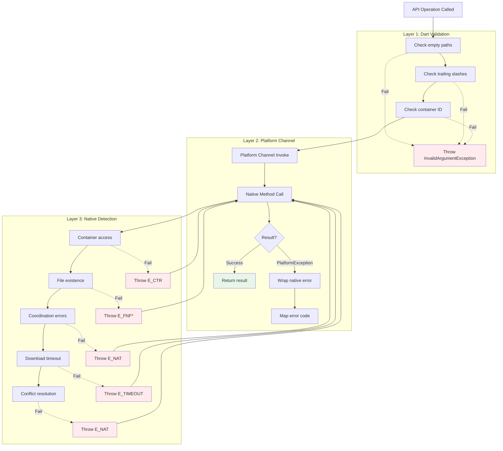

### Bug Detection Error Codes

Two error codes specifically indicate bugs in the plugin implementation:

| Error Code | Detection Layer | Meaning | Action |
|-----------|-----------------|---------|---------|
| `E_PLUGIN_INTERNAL` | Dart | Unexpected stream error during progress monitoring | Report issue |
| `E_INVALID_EVENT` | Dart | Native sent malformed event data | Report issue |

These are documented in [README.md:529-530]() and [README.md:564-567]() with explicit instructions to open GitHub issues.

**Implementation:**
- `E_PLUGIN_INTERNAL`: Thrown when EventChannel stream encounters unexpected errors ([lib/icloud_storage_method_channel.dart:218-225]())
- `E_INVALID_EVENT`: Thrown when native event payload has wrong structure ([lib/icloud_storage_method_channel.dart:209-217]())

### File-Not-Found Variants

The plugin distinguishes between file-not-found contexts:

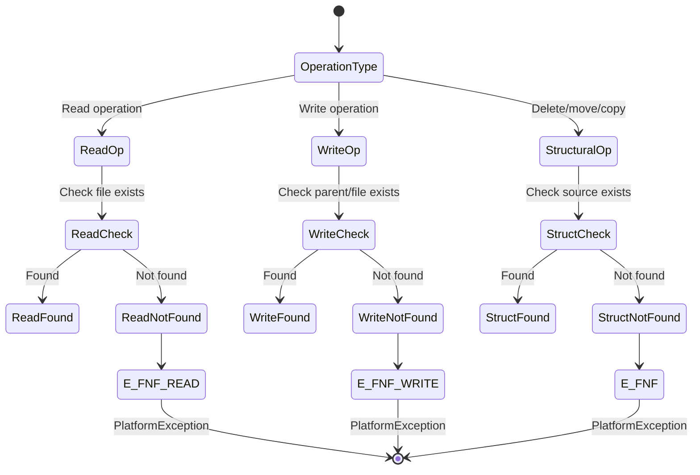

This distinction helps applications:
- **E_FNF_READ**: Show "File was deleted" or "Not yet synced"
- **E_FNF_WRITE**: Show "Cannot write to deleted file" or "Create first"
- **E_FNF**: Generic handling for structural operations

**Sources:** [lib/models/exceptions.dart:1-79](), [README.md:520-573](), [lib/icloud_storage_method_channel.dart:209-225](), [CHANGELOG.md:105-109]()

---

## Streaming Implementation Details

The plugin uses 64KB buffer streaming for file transfers to prevent memory issues with large files. Understanding the streaming architecture helps with performance optimization and troubleshooting.

### streamCopy Buffer Architecture

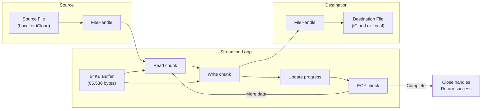

**Buffer Size Rationale:**

The 64KB buffer size is defined in [ios/Classes/iOSICloudStoragePlugin.swift:674-676]():

```swift
let bufferSize = 65536 // 64KB buffer for streaming
```

This size balances:
- **Memory efficiency**: Prevents loading entire files into memory
- **Performance**: Large enough for efficient I/O, small enough for responsive progress
- **Platform compatibility**: Works well with iOS/macOS file system block sizes

### UIDocument and NSDocument Coordination

File transfers use document classes that inherit from Apple's coordination APIs:

| Document Class | Platform | Base Class | Purpose |
|---------------|----------|------------|---------|
| `ICloudDocument` | iOS | `UIDocument` | Streaming upload/download with progress |
| `ICloudDocument` | macOS | `NSDocument` | Streaming upload/download with progress |
| `ICloudInPlaceDocument` | iOS/macOS | Same as above | Text in-place reads/writes |
| `ICloudInPlaceBinaryDocument` | iOS/macOS | Same as above | Binary in-place reads/writes |

**Streaming Flow:**

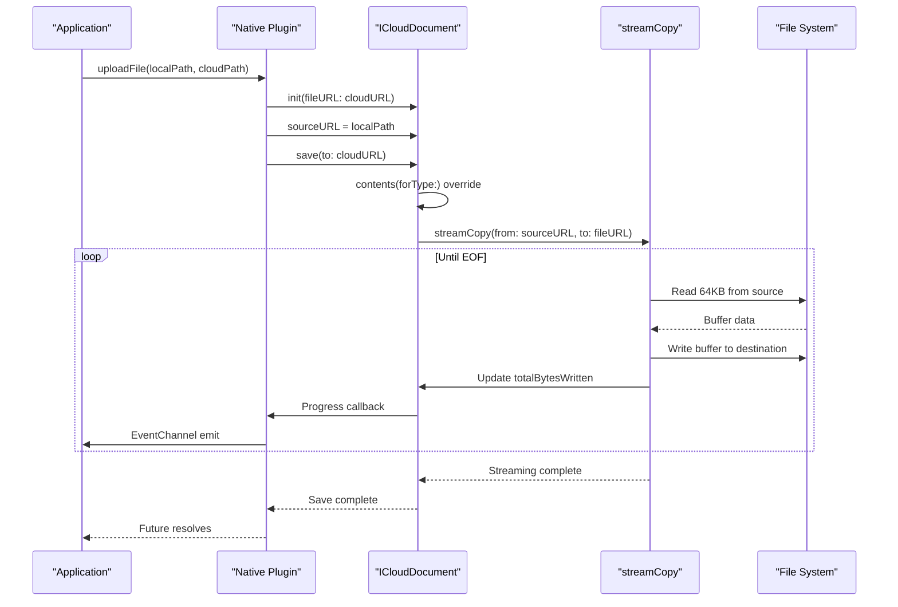

**Implementation Reference:** [ios/Classes/ICloudDocument.swift:100-169]() for document lifecycle and [ios/Classes/iOSICloudStoragePlugin.swift:674-718]() for `streamCopy` function.

### Progress Calculation Precision

Progress percentages are calculated with floating-point precision:

```swift
let progress = Double(totalBytesWritten) / Double(totalBytes)
```

- **Range**: 0.0 to 1.0
- **Frequency**: Updated after each 64KB chunk
- **Granularity**: For a 10MB file, approximately 160 progress updates
- **Final Value**: Always 1.0 before `done` event

**Large File Behavior:**
- 1MB file: ~16 progress events
- 10MB file: ~160 progress events
- 100MB file: ~1,600 progress events

Applications should throttle UI updates if receiving progress events too frequently.

**Sources:** [ios/Classes/iOSICloudStoragePlugin.swift:674-718](), [ios/Classes/ICloudDocument.swift:100-169](), [README.md:343-390]()

---

## Conflict Resolution Strategy

When multiple devices edit the same iCloud file simultaneously, version conflicts occur. The plugin implements automatic conflict resolution using a **last-write-wins** strategy through `NSFileVersion` APIs.

### Conflict Detection and Resolution Flow

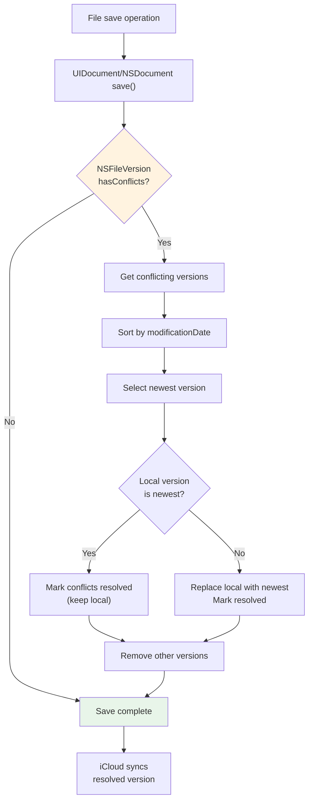

### NSFileVersion API Usage

The conflict resolution implementation in [ios/Classes/iOSICloudStoragePlugin.swift:720-784]() uses Apple's version management:

| API | Purpose | Usage in Plugin |
|-----|---------|-----------------|
| `NSFileVersion.unresolvedConflictVersionsOfItem(at:)` | Get conflicting versions | Initial detection |
| `version.modificationDate` | Determine recency | Sorting criterion |
| `version.isConflict` | Identify conflict markers | Filter conflicts |
| `version.isResolved` | Check resolution status | Skip already-resolved |
| `version.replaceItem(at:options:)` | Replace local file | Apply remote version |
| `version.removeAndReturnError()` | Delete version | Cleanup old versions |

### Last-Write-Wins Strategy Rationale

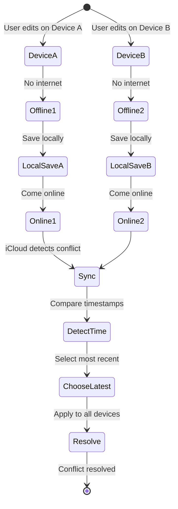

**Why Last-Write-Wins:**
1. **Simplicity**: No user intervention required for document operations
2. **Consistency**: Deterministic outcome across all devices
3. **User Expectation**: Most recent edit typically reflects user intent
4. **Automatic Recovery**: Works for unattended file operations

**Limitations:**
- **Data Loss**: Earlier edits may be discarded if timestamps differ
- **No Merge**: Conflicting content not merged
- **Timestamp Dependence**: Relies on accurate device clocks

For applications requiring different strategies, the conflict detection logic would need to be customized in [ios/Classes/iOSICloudStoragePlugin.swift:720-784]().

### Conflict Resolution Timing

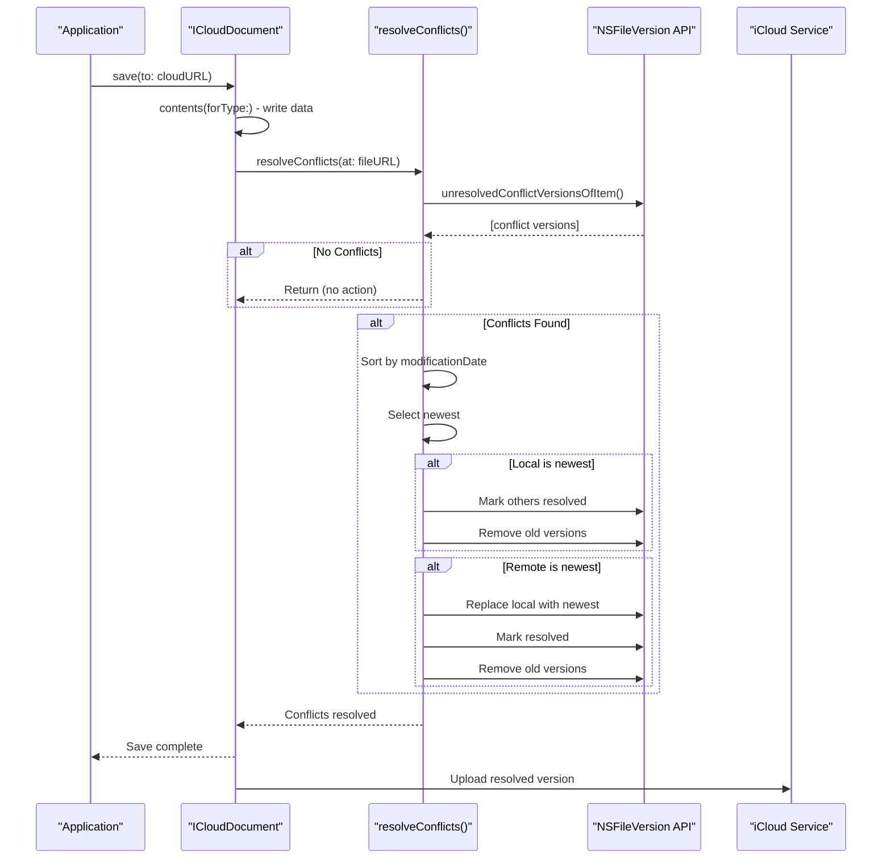

**Automatic Resolution Guarantee:**

Every save operation automatically resolves conflicts. Applications do not need to detect or handle conflicts explicitly. The resolution happens transparently during the document save lifecycle.

**Sources:** [ios/Classes/iOSICloudStoragePlugin.swift:720-784](), [README.md:586-604]()

---

This completes the advanced topics coverage. For operation-specific details, see [API Reference](#3). For native implementation of these patterns, see [Native Implementation Deep Dive](#5).
