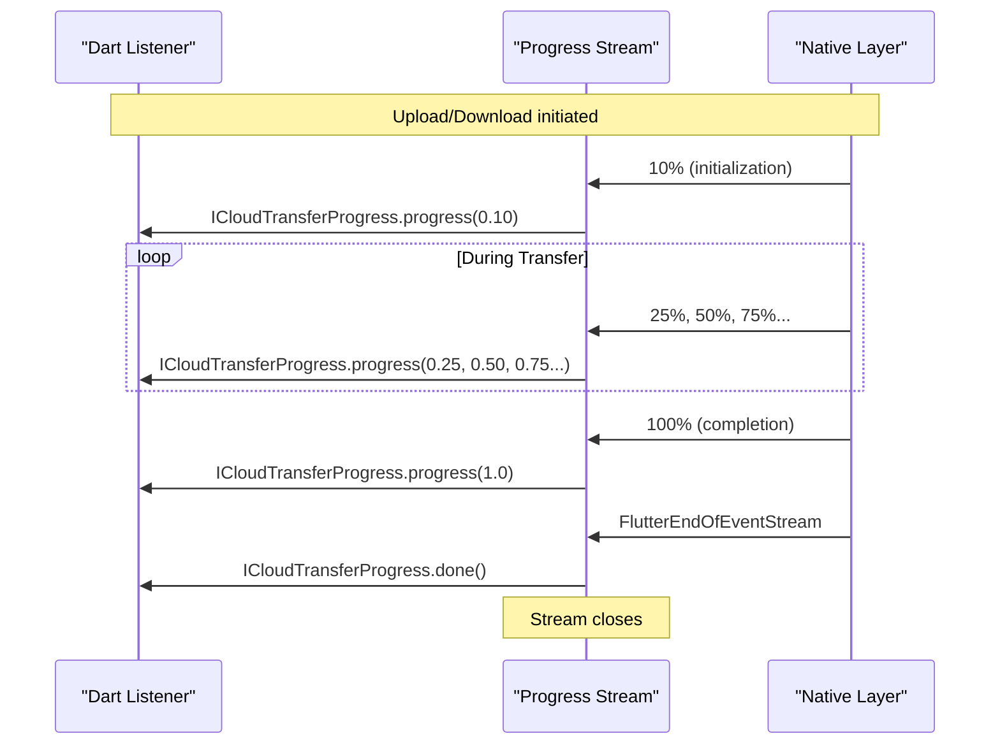
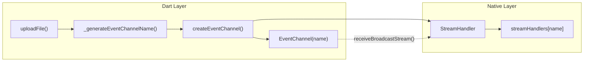
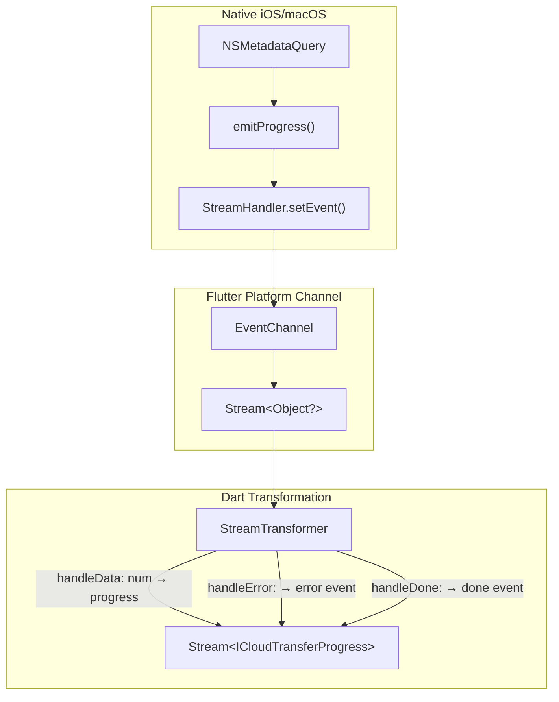
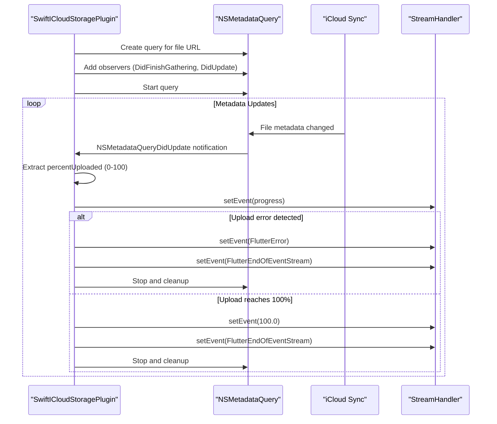
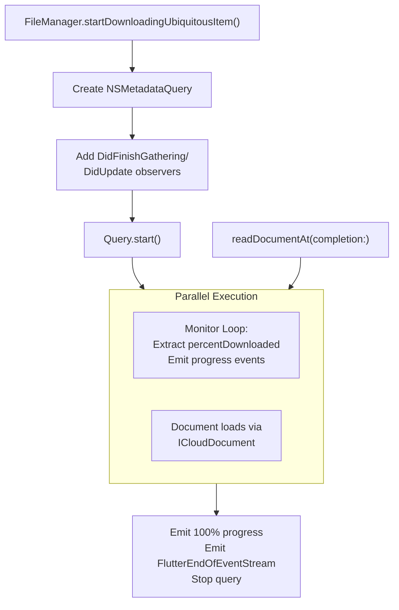

# Progress Monitoring

<details>
<summary>Relevant source files</summary>

The following files were used as context for generating this wiki page:

- [README.md](../../README.md)
- [example/lib/download.dart](../../example/lib/download.dart)
- [example/lib/upload.dart](../../example/lib/upload.dart)
- [ios/Classes/iOSICloudStoragePlugin.swift](../../ios/Classes/iOSICloudStoragePlugin.swift)
- [lib/icloud_storage_method_channel.dart](../../lib/icloud_storage_method_channel.dart)
- [macos/Classes/macOSICloudStoragePlugin.swift](../../macos/Classes/macOSICloudStoragePlugin.swift)

</details>


## Purpose and Scope

This page explains how progress monitoring works for file transfer operations (`uploadFile` and `downloadFile`) in the icloud_storage_plus plugin. It covers the `ICloudTransferProgress` data model, stream behavior, lifecycle management, and implementation details across the Dart-to-native boundary.

For general information about file transfer operations, see [File Transfer Operations](#3.1). For details on the underlying EventChannel mechanism, see [Event Channels and Streaming](#4.3).

---

## Overview

Progress monitoring provides real-time feedback during long-running file transfers. Both `uploadFile` and `downloadFile` accept an optional `onProgress` callback that receives a stream of `ICloudTransferProgress` events:

```dart
await ICloudStorage.uploadFile(
  containerId: 'iCloud.com.yourapp.container',
  localPath: '/path/to/local/file.txt',
  cloudRelativePath: 'Documents/file.txt',
  onProgress: (stream) {
    stream.listen((event) {
      // Handle progress events
    });
  },
);
```

**Sources:** [README.md:356-358](), [example/lib/upload.dart:34-56]()

---

## ICloudTransferProgress Data Model

The `ICloudTransferProgress` class represents a single progress event with three possible types:

| Type | Description | Fields |
|------|-------------|--------|
| `progress` | Incremental progress update | `percent` (0.0-1.0), `type == ICloudTransferProgressType.progress` |
| `done` | Transfer completed successfully | `type == ICloudTransferProgressType.done` |
| `error` | Transfer failed with an exception | `exception` (PlatformException), `type == ICloudTransferProgressType.error` |

The class provides convenience getters:
- `isProgress` - true for progress events
- `isDone` - true when transfer completes
- `isError` - true when transfer fails

**Sources:** [lib/models/transfer_progress.dart](), [README.md:386-389]()

---

## Stream Behavior and Lifecycle

### Listener-Driven Activation

Progress streams use **lazy subscription**: the underlying EventChannel only starts delivering events when a listener attaches. This design is critical for avoiding missed events:

```dart
onProgress: (stream) {
  // Attach listener IMMEDIATELY - before any await
  stream.listen((event) { /* ... */ });
  
  // ❌ WRONG: Delaying the listen() call risks missing early events
  // await someOtherOperation();
  // stream.listen(...);
}
```

The `onProgress` callback executes **before** the native operation starts, ensuring listeners are registered in time for the first progress event (typically 10% from native initialization).

**Sources:** [README.md:264-270](), [lib/icloud_storage_method_channel.dart:275-280]()

### Event Sequence

A typical progress stream emits events in this order:



**Sources:** [ios/Classes/iOSICloudStoragePlugin.swift:297-305](), [ios/Classes/iOSICloudStoragePlugin.swift:365-374]()

### Error Handling

**Critical:** Progress failures are delivered as **data events** with `type == ICloudTransferProgressType.error`, not as stream errors via `onError`:

```dart
stream.listen(
  (event) {
    switch (event.type) {
      case ICloudTransferProgressType.progress:
        // Update UI
        break;
      case ICloudTransferProgressType.done:
        // Complete
        break;
      case ICloudTransferProgressType.error:
        // Handle failure HERE - not in onError
        final exception = event.exception;
        break;
    }
  },
  onError: (error) {
    // This is NOT called for transfer failures
    // Only for unexpected plugin bugs
  },
);
```

This design allows errors to close the stream gracefully. After emitting an error event, the stream immediately closes.

**Sources:** [lib/icloud_storage_method_channel.dart:286-336](), [README.md:386-389]()

---

## Implementation Architecture

### EventChannel Creation and Naming

When `onProgress` is provided, the method channel layer dynamically creates a uniquely-named EventChannel:



Channel names follow the pattern:
```
icloud_storage_plus/event/{operation}/{containerId}/{timestamp}_{random}
```

This ensures uniqueness for concurrent operations.

**Sources:** [lib/icloud_storage_method_channel.dart:390-405](), [ios/Classes/iOSICloudStoragePlugin.swift:56-57]()

### Stream Transformation Pipeline

The raw EventChannel stream undergoes transformation to produce typed progress events:



The `StreamTransformer` handles three cases:

1. **Data (num):** Converts numeric percentage to `ICloudTransferProgress.progress()`
2. **Error:** Wraps exceptions as `ICloudTransferProgress.error()` and closes stream
3. **Done:** Emits `ICloudTransferProgress.done()` and closes stream

**Sources:** [lib/icloud_storage_method_channel.dart:286-336]()

---

## Native Progress Tracking

### Upload Progress Monitoring

The native layer uses `NSMetadataQuery` to track upload progress via the `NSMetadataUbiquitousItemPercentUploadedKey` attribute:



**Key Implementation Details:**

- Query predicate targets the specific file: `NSMetadataItemPathKey == cloudFileURL.path` ([ios/Classes/iOSICloudStoragePlugin.swift:292]())
- Initial 10% emitted immediately after document save completes ([ios/Classes/iOSICloudStoragePlugin.swift:297]())
- Progress extracted from `NSMetadataUbiquitousItemPercentUploadedKey` ([ios/Classes/iOSICloudStoragePlugin.swift:363]())
- Upload errors detected via `ubiquitousItemUploadingError` resource value ([ios/Classes/iOSICloudStoragePlugin.swift:351-361]())

**Sources:** [ios/Classes/iOSICloudStoragePlugin.swift:287-375](), [macos/Classes/macOSICloudStoragePlugin.swift:288-375]()

### Download Progress Monitoring

Download progress follows a similar pattern using `NSMetadataUbiquitousItemPercentDownloadedKey`:



**Important:** The download query runs concurrently with the actual document read operation. The query provides incremental progress updates, while `readDocumentAt()` performs the coordinated file access.

**Sources:** [ios/Classes/iOSICloudStoragePlugin.swift:445-482](), [ios/Classes/iOSICloudStoragePlugin.swift:688-726]()

### Progress Deduplication

The native layer maintains a `progressByEventChannel` dictionary to track the last emitted progress value per channel, preventing redundant updates:

```swift
private var progressByEventChannel: [String: Double] = [:]

private func emitProgress(_ progress: Double, eventChannelName: String) {
  let lastProgress = progressByEventChannel[eventChannelName] ?? -1.0
  if progress == lastProgress { return }
  
  progressByEventChannel[eventChannelName] = progress
  streamHandler?.setEvent(progress)
}
```

This optimization reduces stream noise while ensuring all meaningful progress changes are reported.

**Sources:** [ios/Classes/iOSICloudStoragePlugin.swift:8](), [shared/StreamHandler.swift]()

---

## Best Practices

### Immediate Listener Attachment

Always attach the stream listener immediately inside the `onProgress` callback:

```dart
// ✅ CORRECT
await ICloudStorage.uploadFile(
  // ... parameters ...
  onProgress: (stream) {
    stream.listen((event) { /* ... */ });
  },
);

// ❌ WRONG - may miss early events
StreamSubscription? subscription;
await ICloudStorage.uploadFile(
  // ... parameters ...
  onProgress: (stream) {
    // Storing for later use risks missing events
    subscription = stream.listen(...);
  },
);
```

**Sources:** [README.md:264-270]()

### Check Event Type

Always check `event.type` or use the convenience getters:

```dart
stream.listen((event) {
  if (event.isProgress) {
    final percent = event.percent;
    // Update progress UI
  } else if (event.isDone) {
    // Transfer complete
  } else if (event.isError) {
    final exception = event.exception;
    // Handle failure
  }
});
```

**Sources:** [example/lib/upload.dart:35-55](), [example/lib/download.dart:35-55]()

### Cancel Subscriptions

Store the subscription and cancel it in `dispose()` to prevent memory leaks:

```dart
class _UploadState extends State<Upload> {
  StreamSubscription<ICloudTransferProgress>? _progressListener;
  
  Future<void> _handleUpload() async {
    await ICloudStorage.uploadFile(
      // ... parameters ...
      onProgress: (stream) {
        _progressListener = stream.listen((event) { /* ... */ });
      },
    );
  }
  
  @override
  void dispose() {
    _progressListener?.cancel();
    super.dispose();
  }
}
```

Cancelling the subscription triggers the native layer's `onCancelHandler`, which stops the metadata query and cleans up resources.

**Sources:** [example/lib/upload.dart:19](), [example/lib/upload.dart:74](), [ios/Classes/iOSICloudStoragePlugin.swift:298-302]()

### Terminal Events

Both `done` and `error` events are **terminal** - the stream closes immediately after emitting them. Do not expect further events:

```dart
stream.listen(
  (event) {
    if (event.isDone || event.isError) {
      // Stream will close after this handler returns
      // Clean up UI state here
    }
  },
  onDone: () {
    // Called after terminal event is processed
  },
);
```

**Sources:** [lib/icloud_storage_method_channel.dart:328-332](), [README.md:386-389]()

---

## Common Progress Patterns

### Simple Progress Display

```dart
String? _progressText;

onProgress: (stream) {
  stream.listen((event) {
    setState(() {
      if (event.isProgress) {
        _progressText = 'Progress: ${(event.percent * 100).toStringAsFixed(1)}%';
      } else if (event.isDone) {
        _progressText = 'Complete!';
      } else if (event.isError) {
        _progressText = 'Error: ${event.exception?.message}';
      }
    });
  });
}
```

**Sources:** [example/lib/upload.dart:26-42]()

### Progress Bar Integration

```dart
double _progress = 0.0;

onProgress: (stream) {
  stream.listen((event) {
    setState(() {
      if (event.isProgress) {
        _progress = event.percent; // 0.0 to 1.0
      } else if (event.isDone) {
        _progress = 1.0;
      }
    });
  });
}

// In build():
LinearProgressIndicator(value: _progress)
```

### Handling All Three States

```dart
enum TransferState { idle, inProgress, complete, error }

TransferState _state = TransferState.idle;
double _progress = 0.0;
String? _errorMessage;

onProgress: (stream) {
  stream.listen((event) {
    setState(() {
      switch (event.type) {
        case ICloudTransferProgressType.progress:
          _state = TransferState.inProgress;
          _progress = event.percent;
          _errorMessage = null;
          break;
        case ICloudTransferProgressType.done:
          _state = TransferState.complete;
          _progress = 1.0;
          break;
        case ICloudTransferProgressType.error:
          _state = TransferState.error;
          _errorMessage = event.exception?.message ?? 'Unknown error';
          break;
      }
    });
  });
}
```

**Sources:** [example/lib/download.dart:23-64]()

---

## Summary Table

| Aspect | Details |
|--------|---------|
| **Supported Operations** | `uploadFile`, `downloadFile` |
| **Stream Type** | `Stream<ICloudTransferProgress>` broadcast stream |
| **Event Types** | `progress` (0.0-1.0), `done`, `error` |
| **Activation** | Lazy - starts when listener attaches |
| **Error Delivery** | As data events, not stream errors |
| **Terminal Events** | `done` and `error` close the stream |
| **Native Tracking** | `NSMetadataQuery` monitoring iCloud metadata |
| **Progress Source** | `NSMetadataUbiquitousItemPercentUploadedKey` / `...DownloadedKey` |
| **Cleanup** | Automatic via subscription cancellation |

**Sources:** [lib/models/transfer_progress.dart](), [lib/icloud_storage_method_channel.dart:70-129](), [ios/Classes/iOSICloudStoragePlugin.swift:287-482]()