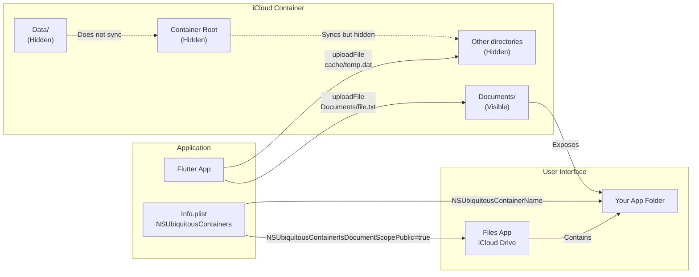
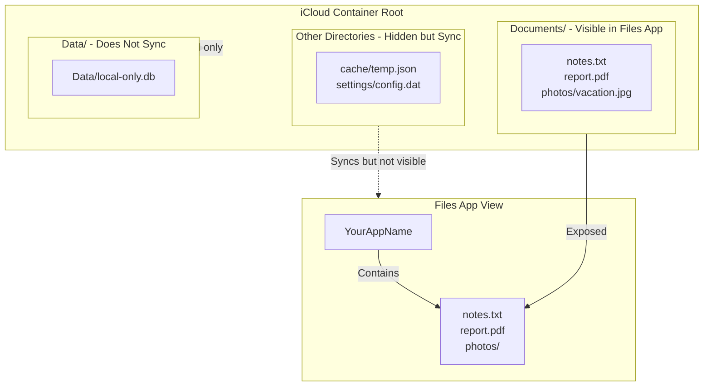
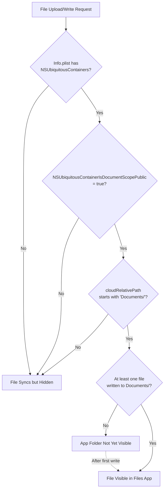
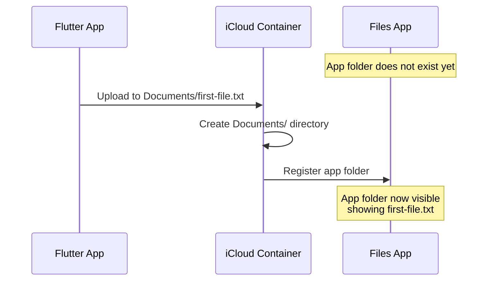

# Files App Integration

<details>
<summary>Relevant source files</summary>

The following files were used as context for generating this wiki page:

- [README.md](../../README.md)
- [lib/icloud_storage.dart](../../lib/icloud_storage.dart)

</details>


## Purpose and Scope

This document explains how to configure the icloud_storage_plus plugin to make files visible in Apple's Files app under the iCloud Drive section. Files app integration allows users to browse, manage, and share iCloud files using the system's native file browser.

This page covers Info.plist configuration, directory requirements, and visibility rules. For general iCloud setup and capabilities configuration, see [Getting Started](#2). For file transfer operations that copy files into the container, see [File Transfer Operations](#3.1). For path validation rules, see [Path Validation and Directory Handling](#6.4).

**Sources:** [README.md:311-340](), [README.md:10-19](), [README.md:644-650]()

---

## Configuration Overview

Files app integration requires two components: correct Info.plist configuration and proper directory structure. The plugin uses Apple's `NSUbiquitousContainers` framework to expose specific directories to the Files app.



**Sources:** [README.md:311-327](), [lib/icloud_storage.dart:30-39]()

---

## Info.plist Configuration

The Info.plist file must include the `NSUbiquitousContainers` dictionary to enable Files app integration. This configuration tells iOS/macOS which container to expose and what name to display.

### Required Keys

| Key | Type | Purpose |
|-----|------|---------|
| `NSUbiquitousContainers` | Dictionary | Root configuration for container visibility |
| Container ID (e.g., `iCloud.com.yourapp.container`) | Dictionary | Configuration for specific container |
| `NSUbiquitousContainerIsDocumentScopePublic` | Boolean | When `true`, exposes Documents/ to Files app |
| `NSUbiquitousContainerName` | String | Display name shown in Files app |

### Configuration Example

Add this to your app's `ios/Runner/Info.plist` and `macos/Runner/Info.plist`:

```xml
<key>NSUbiquitousContainers</key>
<dict>
    <key>iCloud.com.yourapp.container</key>
    <dict>
        <key>NSUbiquitousContainerIsDocumentScopePublic</key>
        <true/>
        <key>NSUbiquitousContainerName</key>
        <string>YourAppName</string>
    </dict>
</dict>
```

The container ID key must match:
- Your Apple Developer Portal container ID
- Your Xcode capabilities configuration
- The `containerId` parameter in API calls

**Sources:** [README.md:313-327]()

---

## Directory Structure and Visibility

The plugin defines three special directory names that control sync and visibility behavior:



### Directory Constants

The `ICloudStorage` class defines constants for these special directories:

| Constant | Value | Behavior |
|----------|-------|----------|
| `ICloudStorage.documentsDirectory` | `"Documents"` | Syncs and visible in Files app |
| `ICloudStorage.dataDirectory` | `"Data"` | App-private, should not sync |

**Sources:** [lib/icloud_storage.dart:30-39](), [README.md:328-337]()

---

## Path Requirements

Files become visible in the Files app only when their path begins with the `Documents/` prefix. The prefix is **case-sensitive**.

### Visible Path Examples

```dart
// These files will appear in Files app
await ICloudStorage.uploadFile(
  containerId: 'iCloud.com.yourapp.container',
  localPath: '/path/to/notes.txt',
  cloudRelativePath: 'Documents/notes.txt',
);

await ICloudStorage.uploadFile(
  containerId: 'iCloud.com.yourapp.container',
  localPath: '/path/to/photo.jpg',
  cloudRelativePath: 'Documents/Photos/vacation.jpg',
);
```

### Hidden Path Examples

```dart
// These files sync but remain hidden from Files app
await ICloudStorage.uploadFile(
  containerId: 'iCloud.com.yourapp.container',
  localPath: '/path/to/cache.json',
  cloudRelativePath: 'cache/temp.json',
);

await ICloudStorage.uploadFile(
  containerId: 'iCloud.com.yourapp.container',
  localPath: '/path/to/settings.dat',
  cloudRelativePath: 'settings/config.dat',
);
```

### Path Validation

File transfer operations (`uploadFile` and `downloadFile`) reject paths with trailing slashes because they use document-based coordination that requires file paths:

```dart
// Valid - file path
cloudRelativePath: 'Documents/file.txt'

// Invalid - trailing slash indicates directory
cloudRelativePath: 'Documents/file.txt/'  // Throws InvalidArgumentException
```

Other operations like `delete`, `move`, and `getMetadata` accept trailing slashes because they can operate on directories using `FileManager`.

**Sources:** [README.md:328-337](), [lib/icloud_storage.dart:84-114](), [lib/icloud_storage.dart:130-160]()

---

## Visibility Determination Flow

The following diagram shows how the plugin determines whether a file will be visible in the Files app:



**Sources:** [README.md:311-340](), [README.md:644-650]()

---

## App Folder Appearance

The app's folder in the Files app does not appear immediately after configuration. Apple's iCloud framework creates the folder only after the first successful write to the `Documents/` directory.

### Initial State



### Timing Considerations

| Event | Files App State |
|-------|----------------|
| Info.plist configured | No app folder visible |
| First write to `Documents/` starts | No app folder visible |
| First write to `Documents/` completes | App folder appears |
| Subsequent writes | Files appear immediately |

**Sources:** [README.md:339-340](), [README.md:644-650]()

---

## Common Usage Patterns

### Creating User-Visible Files

```dart
// Write a file that users can see and share
final localFile = File('${Directory.systemTemp.path}/report.pdf');
await localFile.writeAsBytes(reportBytes);

await ICloudStorage.uploadFile(
  containerId: 'iCloud.com.yourapp.container',
  localPath: localFile.path,
  cloudRelativePath: 'Documents/Reports/monthly-report.pdf',
);
```

### Storing Hidden Configuration

```dart
// Write configuration that syncs but stays hidden
await ICloudStorage.writeInPlace(
  containerId: 'iCloud.com.yourapp.container',
  relativePath: 'config/settings.json',
  contents: jsonEncode(settings),
);
```

### Checking File Visibility

```dart
bool isVisibleInFilesApp(String cloudRelativePath) {
  return cloudRelativePath.startsWith('Documents/');
}

// Usage
final path = 'Documents/notes.txt';
if (isVisibleInFilesApp(path)) {
  print('This file will appear in Files app');
}
```

**Sources:** [README.md:54-73](), [README.md:328-337]()

---

## Integration with Plugin Operations

All plugin operations work identically whether files are in `Documents/` or elsewhere. The `Documents/` prefix only affects Files app visibility.

### Operation Compatibility

| Operation | Documents/ Required | Notes |
|-----------|-------------------|-------|
| `uploadFile` | No | Files app visibility depends on path prefix |
| `downloadFile` | No | Downloads work regardless of location |
| `readInPlace` | No | Reads work regardless of location |
| `writeInPlace` | No | Writes work regardless of location |
| `gather` | No | Returns all files, including Documents/ |
| `delete` | No | Deletes work regardless of location |
| `move` | No | Can move files into/out of Documents/ |

### Moving Files to/from Documents/

```dart
// Make a hidden file visible
await ICloudStorage.move(
  containerId: 'iCloud.com.yourapp.container',
  fromRelativePath: 'drafts/article.txt',
  toRelativePath: 'Documents/Published/article.txt',
);

// Hide a visible file
await ICloudStorage.move(
  containerId: 'iCloud.com.yourapp.container',
  fromRelativePath: 'Documents/old-data.csv',
  toRelativePath: 'archive/old-data.csv',
);
```

**Sources:** [lib/icloud_storage.dart:344-370](), [README.md:143-148]()

---

## Troubleshooting

### App Folder Not Appearing

**Symptom:** Files app shows no folder for your app under iCloud Drive.

**Checklist:**

1. Verify Info.plist configuration:
   - `NSUbiquitousContainers` dictionary exists
   - Container ID matches Apple Developer Portal and code
   - `NSUbiquitousContainerIsDocumentScopePublic` is `true`
   - `NSUbiquitousContainerName` is set

2. Verify at least one file written to `Documents/`:
   ```dart
   final result = await ICloudStorage.gather(
     containerId: 'iCloud.com.yourapp.container',
   );
   
   final hasDocuments = result.files.any(
     (file) => file.relativePath.startsWith('Documents/'),
   );
   
   if (!hasDocuments) {
     print('No files in Documents/ yet');
   }
   ```

3. Restart Files app or wait for iCloud sync

**Sources:** [README.md:644-650]()

---

### Files Not Appearing After Upload

**Symptom:** Uploaded files don't appear in Files app even though they're in `Documents/`.

**Debugging steps:**

1. Verify the path prefix is exactly `Documents/` (case-sensitive):
   ```dart
   // Correct
   'Documents/file.txt'
   
   // Wrong - case matters
   'documents/file.txt'
   'DOCUMENTS/file.txt'
   ```

2. Check file was successfully written:
   ```dart
   final exists = await ICloudStorage.documentExists(
     containerId: 'iCloud.com.yourapp.container',
     relativePath: 'Documents/file.txt',
   );
   print('File exists: $exists');
   ```

3. Wait for iCloud sync - new files may take a few seconds to appear

4. Force iCloud sync by opening Files app

**Sources:** [README.md:644-650](), [README.md:328-337]()

---

### Wrong Folder Name in Files App

**Symptom:** Files app shows incorrect name for app folder.

**Solution:** The folder name comes from `NSUbiquitousContainerName` in Info.plist:

```xml
<key>NSUbiquitousContainerName</key>
<string>YourAppName</string>  <!-- This appears in Files app -->
```

After changing this value:
1. Clean build folder in Xcode
2. Rebuild and reinstall the app
3. The new name should appear after next iCloud sync

**Sources:** [README.md:313-327]()

---

### Files Visible on One Platform Only

**Symptom:** Files appear in iOS Files app but not macOS Finder (or vice versa).

**Solution:** Both platforms need identical Info.plist configuration:
- iOS: `ios/Runner/Info.plist`
- macOS: `macos/Runner/Info.plist`

Verify both files have the same `NSUbiquitousContainers` configuration.

**Sources:** [README.md:295-310]()

---

## Summary

Files app integration requires:

1. **Info.plist configuration** with `NSUbiquitousContainers` and `NSUbiquitousContainerIsDocumentScopePublic=true`
2. **Documents/ path prefix** for files that should be visible
3. **At least one successful write** to `Documents/` before folder appears

Files outside `Documents/` still sync across devices but remain hidden from the Files app, useful for application data that users shouldn't directly access.

**Sources:** [README.md:311-340](), [README.md:644-650](), [lib/icloud_storage.dart:30-39]()