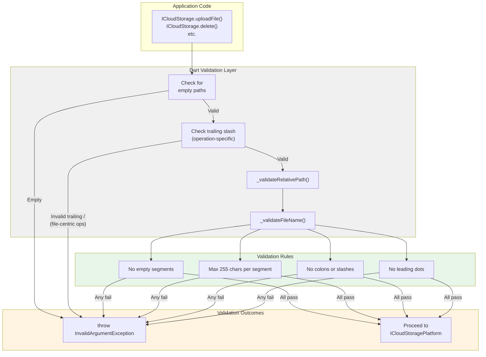
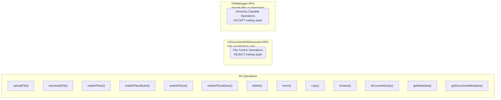
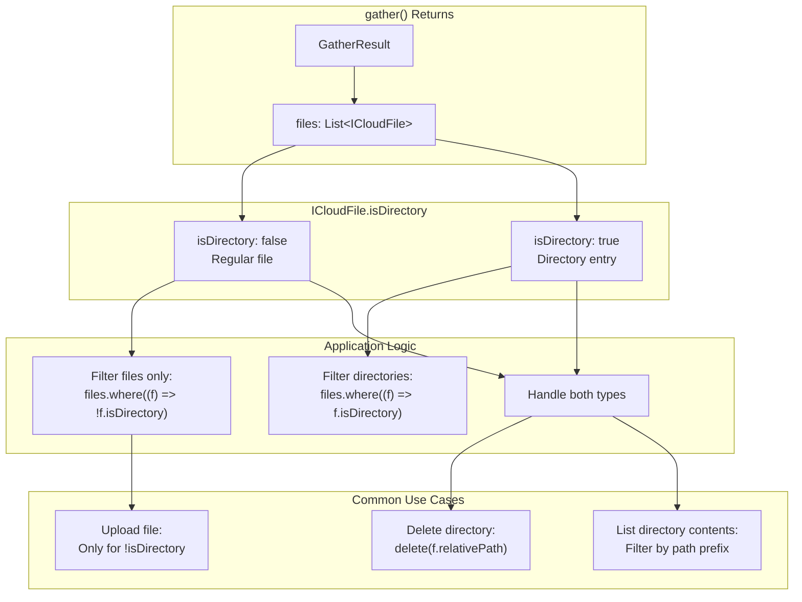
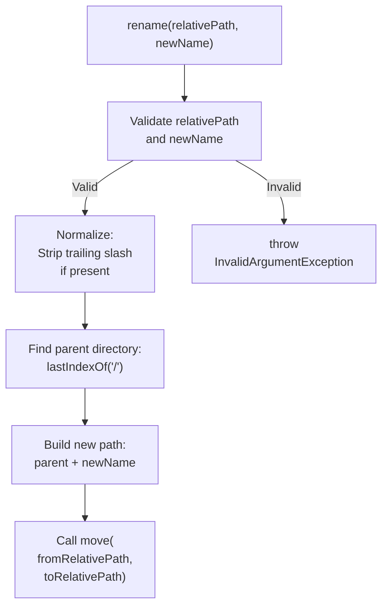
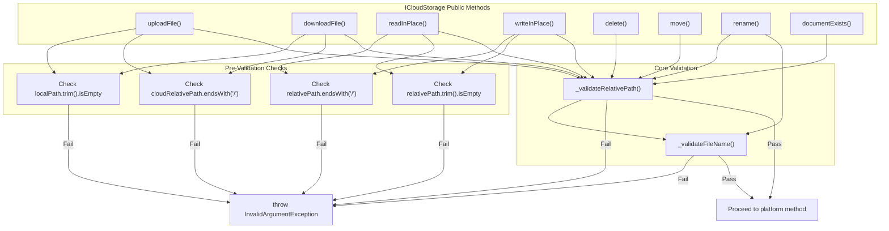

# Path Validation and Directory Handling

<details>
<summary>Relevant source files</summary>

The following files were used as context for generating this wiki page:

- [CHANGELOG.md](../../CHANGELOG.md)
- [lib/icloud_storage.dart](../../lib/icloud_storage.dart)
- [test/icloud_storage_test.dart](../../test/icloud_storage_test.dart)

</details>


This page describes how the `icloud_storage_plus` plugin validates path arguments and handles the distinction between files and directories. It covers the validation rules enforced at the Dart layer, the semantics of trailing slashes, and how different operations categorize paths as file-centric or directory-capable.

For information about specific file operations, see [File Transfer Operations](#3.1), [In-Place Access Operations](#3.2), and [File Management Operations](#3.4). For error handling related to invalid paths, see [Error Handling](#3.6).

## Overview

The plugin performs **client-side path validation** in the Dart layer before any platform channel communication. This provides fast failure with clear error messages and prevents invalid paths from reaching the native layer. Path validation distinguishes between:

1. **File-centric operations** (upload, download, in-place reads/writes) that reject trailing slashes because they use `UIDocument`/`NSDocument` APIs
2. **Directory-capable operations** (delete, move, copy, metadata queries) that accept trailing slashes because they use `FileManager` APIs

This design ensures that directory metadata returned by `gather()` can be passed directly to management operations without manual path manipulation.

**Sources:** [lib/icloud_storage.dart:84-160](), [CHANGELOG.md:143-154]()

---

## Path Validation Architecture



**Figure 1: Path Validation Flow**

The validation process occurs entirely in Dart before invoking platform methods. Each operation performs appropriate checks based on whether it is file-centric or directory-capable.

**Sources:** [lib/icloud_storage.dart:84-114](), [lib/icloud_storage.dart:485-499]()

---

## Path Validation Rules

The plugin enforces the following rules for all path segments (file and directory names):

| Rule | Description | Example Invalid Path | Reason |
|------|-------------|---------------------|--------|
| Non-empty | No segment can be empty | `Documents//file.txt` | Double slash creates empty segment |
| Length limit | Max 255 characters per segment | `Documents/a{256 chars}.txt` | Filesystem limits |
| No colons | Cannot contain `:` | `Documents/file:name.txt` | Reserved on macOS/iOS |
| No slashes | Cannot contain `/` in names | Not applicable | Path separator |
| No leading dots | Cannot start with `.` | `Documents/.hidden.txt` | Hidden file convention |

These rules are implemented in two functions:

### `_validateRelativePath(String path)`

Splits the path by `/` and validates each segment using `_validateFileName()`. Handles trailing slashes by removing the resulting empty segment before validation.

[lib/icloud_storage.dart:485-494]()

```dart
static bool _validateRelativePath(String path) {
  final fileOrDirNames = path.split('/');
  if (fileOrDirNames.isEmpty) return false;

  if (fileOrDirNames.length > 1 && fileOrDirNames.last.isEmpty) {
    fileOrDirNames.removeLast();
  }

  return fileOrDirNames.every(_validateFileName);
}
```

### `_validateFileName(String name)`

Validates individual file or directory names using a regular expression that matches invalid patterns.

[lib/icloud_storage.dart:497-499]()

```dart
static bool _validateFileName(String name) => !(name.isEmpty ||
    name.length > 255 ||
    RegExp(r'([:/]+)|(^[.].*$)').hasMatch(name));
```

The regex pattern `([:/]+)|(^[.].*$)` matches:
- `([:/]+)` - One or more colons or slashes
- `(^[.].*$)` - Any string starting with a dot

**Sources:** [lib/icloud_storage.dart:485-499]()

---

## Trailing Slash Semantics

Trailing slashes (`/`) indicate directory paths in filesystem conventions. The plugin handles them differently based on operation type:



**Figure 2: Trailing Slash Handling by Operation Type**

### File-Centric Operations (Reject Trailing Slash)

These operations use `UIDocument`/`NSDocument` for coordinated file access and streaming I/O. They **reject** paths ending with `/`:

- `uploadFile()` - [lib/icloud_storage.dart:96-100]()
- `downloadFile()` - [lib/icloud_storage.dart:142-146]()
- `readInPlace()` - [lib/icloud_storage.dart:190-192]()
- `readInPlaceBytes()` - [lib/icloud_storage.dart:235-237]()
- `writeInPlace()` - [lib/icloud_storage.dart:272-274]()
- `writeInPlaceBytes()` - [lib/icloud_storage.dart:307-309]()

Example rejection:
```dart
// This throws InvalidArgumentException
await ICloudStorage.uploadFile(
  containerId: 'com.example.app',
  localPath: '/local/file.txt',
  cloudRelativePath: 'Documents/folder/', // ❌ Trailing slash
);
```

### Directory-Capable Operations (Accept Trailing Slash)

These operations use `FileManager` with `NSFileCoordinator` for atomic filesystem operations. They **accept** paths ending with `/`:

- `delete()` - [lib/icloud_storage.dart:330-342]()
- `move()` - [lib/icloud_storage.dart:348-370]()
- `copy()` - [lib/icloud_storage.dart:408-430]()
- `rename()` - [lib/icloud_storage.dart:376-402]()
- `documentExists()` - [lib/icloud_storage.dart:435-447]()
- `getMetadata()` - [lib/icloud_storage.dart:452-465]()
- `getDocumentMetadata()` - [lib/icloud_storage.dart:470-482]()

Example acceptance:
```dart
// This works correctly for directories
await ICloudStorage.delete(
  containerId: 'com.example.app',
  relativePath: 'Documents/folder/', // ✓ Trailing slash allowed
);
```

**Sources:** [lib/icloud_storage.dart:84-482](), [CHANGELOG.md:143-154]()

---

## Directory vs File Path Handling

The plugin provides `ICloudFile.isDirectory` to distinguish between files and directories in metadata results. This field enables applications to filter or handle directories appropriately.

### Directory Detection



**Figure 3: Directory Handling in Application Code**

### Example: Filtering Directories

```dart
final result = await ICloudStorage.gather(containerId: containerId);

// Get only regular files (exclude directories)
final files = result.files.where((f) => !f.isDirectory).toList();

// Get only directories
final directories = result.files.where((f) => f.isDirectory).toList();

// Delete a directory (trailing slash preserved from metadata)
for (final dir in directories) {
  await ICloudStorage.delete(
    containerId: containerId,
    relativePath: dir.relativePath, // May include trailing slash
  );
}
```

**Sources:** [lib/icloud_storage.dart:46-58](), [CHANGELOG.md:37-46]()

---

## Special Case: `rename()` Operation

The `rename()` operation handles both files and directories but normalizes trailing slashes internally to derive the parent directory.

### Rename Implementation Flow



**Figure 4: Rename Operation Path Handling**

### Rename Code Implementation

[lib/icloud_storage.dart:389-401]()

```dart
final normalizedPath = relativePath.endsWith('/')
    ? relativePath.substring(0, relativePath.length - 1)
    : relativePath;

final lastSlash = normalizedPath.lastIndexOf('/');
final directory =
    lastSlash == -1 ? '' : normalizedPath.substring(0, lastSlash + 1);

await move(
  containerId: containerId,
  fromRelativePath: relativePath,
  toRelativePath: '$directory$newName',
);
```

### Example: Renaming Directories

```dart
// Works for directories with trailing slash
await ICloudStorage.rename(
  containerId: 'com.example.app',
  relativePath: 'Documents/oldFolder/', // Trailing slash from metadata
  newName: 'newFolder',
);
// Result: Documents/newFolder (no trailing slash in output)

// Works for files without trailing slash
await ICloudStorage.rename(
  containerId: 'com.example.app',
  relativePath: 'Documents/file.txt',
  newName: 'renamed.txt',
);
// Result: Documents/renamed.txt
```

**Sources:** [lib/icloud_storage.dart:376-402](), [test/icloud_storage_test.dart:425-441]()

---

## Validation Error Examples

The following table shows common validation errors and their causes:

| Input Path | Operation | Error | Reason |
|------------|-----------|-------|--------|
| `""` | Any | `InvalidArgumentException` | Empty path |
| `"Documents/folder/"` | `uploadFile()` | `InvalidArgumentException` | Trailing slash in file operation |
| `"Documents/folder/"` | `delete()` | ✓ Valid | Trailing slash allowed in management ops |
| `"Documents//file.txt"` | Any | `InvalidArgumentException` | Empty segment (double slash) |
| `"Documents/file:name.txt"` | Any | `InvalidArgumentException` | Colon in filename |
| `"Documents/.hidden"` | Any | `InvalidArgumentException` | Leading dot |
| `"Documents/a{300 chars}.txt"` | Any | `InvalidArgumentException` | Segment exceeds 255 chars |

### Test Coverage

The test suite verifies these validation rules:

- Trailing slash rejection: [test/icloud_storage_test.dart:228-237](), [test/icloud_storage_test.dart:274-283]()
- Trailing slash acceptance: [test/icloud_storage_test.dart:451-465]()
- Empty path rejection: [test/icloud_storage_test.dart:239-248]()
- Invalid segment rejection: [test/icloud_storage_test.dart:250-259]()
- Rename normalization: [test/icloud_storage_test.dart:425-432]()

**Sources:** [test/icloud_storage_test.dart:217-497]()

---

## Implementation Details

### Path Validation Call Sites



**Figure 5: Validation Check Distribution Across Operations**

### Key Code Locations

| Component | File | Lines |
|-----------|------|-------|
| Core validation functions | `lib/icloud_storage.dart` | 485-499 |
| Upload validation | `lib/icloud_storage.dart` | 90-106 |
| Download validation | `lib/icloud_storage.dart` | 136-152 |
| Read in-place validation | `lib/icloud_storage.dart` | 189-200 |
| Write in-place validation | `lib/icloud_storage.dart` | 271-282 |
| Delete validation | `lib/icloud_storage.dart` | 334-336 |
| Move validation | `lib/icloud_storage.dart` | 353-363 |
| Rename validation | `lib/icloud_storage.dart` | 381-387 |
| Metadata operation validation | `lib/icloud_storage.dart` | 439-441, 456-458, 474-476 |

**Sources:** [lib/icloud_storage.dart:84-499]()

---

## Design Rationale

### Why Different Trailing Slash Rules?

The plugin's trailing slash handling reflects the underlying iOS/macOS APIs:

1. **UIDocument/NSDocument APIs** (file-centric operations):
   - Designed for coordinated file access
   - Operate on file URLs, not directory URLs
   - Cannot stream directory contents
   - Rejecting trailing slashes prevents ambiguous operations

2. **FileManager APIs** (directory-capable operations):
   - Handle both files and directories
   - `fileExists(atPath:)` works for both types
   - Delete/move/copy operations handle directories recursively
   - Accepting trailing slashes enables direct use of `gather()` results

### Migration from Version 2.x

In version 2.x, all operations rejected trailing slashes. Version 1.0
introduced directory support and relaxed validation for management operations
to improve ergonomics:

```dart
// Version 2.x: Required manual stripping
final result = await ICloudStorage.gather(containerId: containerId);
for (final file in result.files) {
  final path = file.relativePath.endsWith('/')
      ? file.relativePath.substring(0, file.relativePath.length - 1)
      : file.relativePath;
  await ICloudStorage.delete(containerId: containerId, relativePath: path);
}

// Version 1.0: Direct use of metadata
final result = await ICloudStorage.gather(containerId: containerId);
for (final file in result.files) {
  await ICloudStorage.delete(
    containerId: containerId,
    relativePath: file.relativePath, // No manual stripping needed
  );
}
```

**Sources:** [CHANGELOG.md:143-146](), [lib/icloud_storage.dart:327-342]()

---

## Summary

The path validation system in `icloud_storage_plus`:

1. **Validates early** at the Dart layer to provide fast, clear error messages
2. **Enforces filesystem rules** (no colons, no leading dots, length limits) universally
3. **Distinguishes operation types** with different trailing slash semantics:
   - File-centric operations reject trailing slashes (UIDocument/NSDocument)
   - Directory-capable operations accept trailing slashes (FileManager)
4. **Enables direct metadata reuse** for management operations without path manipulation
5. **Provides clear directory detection** via `ICloudFile.isDirectory`

Applications should filter by `isDirectory` when necessary and understand which operations accept trailing slashes to avoid validation errors.

**Sources:** [lib/icloud_storage.dart:84-499](), [CHANGELOG.md:143-154](), [test/icloud_storage_test.dart:217-497]()
