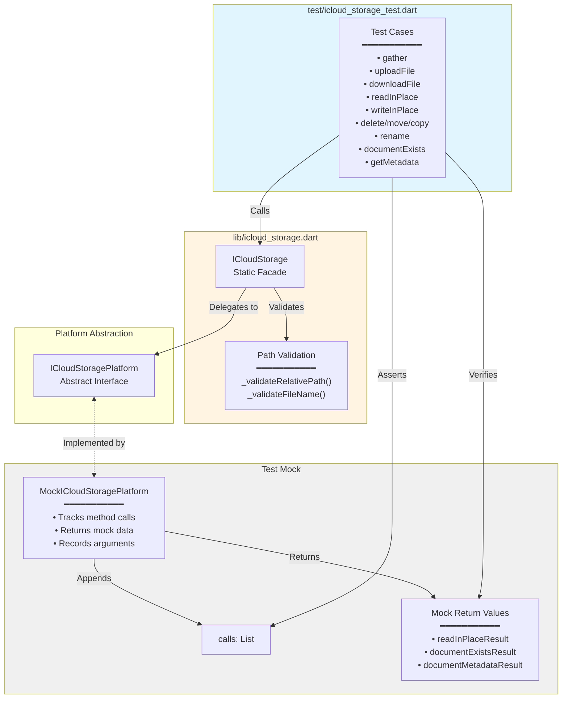
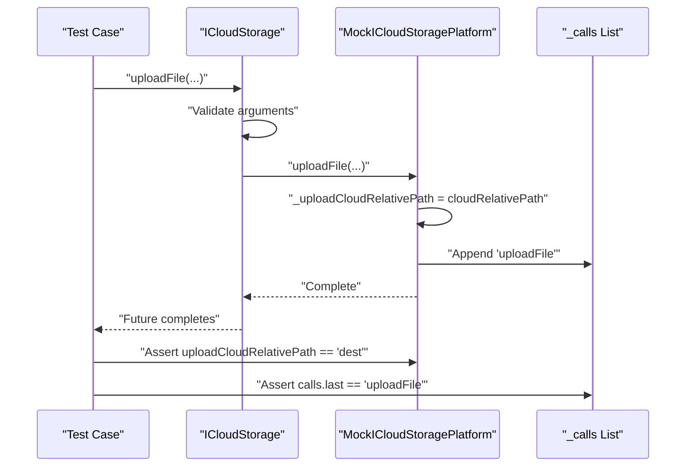
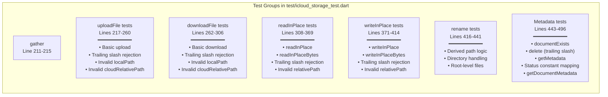
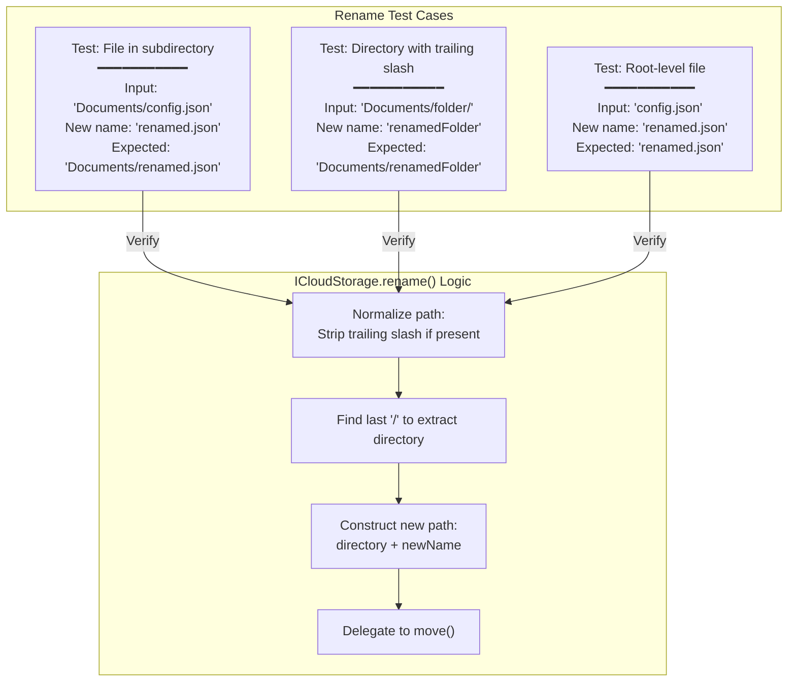

# API Tests

<details>
<summary>Relevant source files</summary>

The following files were used as context for generating this wiki page:

- [lib/icloud_storage.dart](../../lib/icloud_storage.dart)
- [test/icloud_storage_test.dart](../../test/icloud_storage_test.dart)

</details>


This page documents the Dart-side unit tests for the `ICloudStorage` public API located in [test/icloud_storage_test.dart](). These tests verify the static facade methods, path validation logic, and data model transformations without requiring native platform code. For information about native platform method channel tests, see [Method Channel Tests](#7.2).

**Sources:** [test/icloud_storage_test.dart:1-499]()

---

## Test Architecture

The API tests use a mock platform implementation to isolate the Dart layer from native code. This allows fast, deterministic testing of argument validation, path normalization, and method delegation.



**Test Isolation Strategy:** Tests replace `ICloudStoragePlatform.instance` with `MockICloudStoragePlatform` to verify that:
1. `ICloudStorage` validates arguments before delegating to the platform
2. Method calls reach the platform layer with correct parameters
3. Return values are properly transformed (e.g., `getMetadata` converting maps to `ICloudFile`)

**Sources:** [test/icloud_storage_test.dart:9-182](), [test/icloud_storage_test.dart:184-198]()

---

## MockICloudStoragePlatform Implementation

The `MockICloudStoragePlatform` class implements `ICloudStoragePlatform` using the `MockPlatformInterfaceMixin` from `plugin_platform_interface`. This ensures the mock satisfies the platform interface contract.

### Key Components

| Component | Type | Purpose |
|-----------|------|---------|
| `_calls` | `List<String>` | Records method names in invocation order |
| `_moveToRelativePath` | `String` | Captures destination path for move operations |
| `_uploadCloudRelativePath` | `String` | Captures cloud path for upload operations |
| `_downloadCloudRelativePath` | `String` | Captures cloud path for download operations |
| `_downloadLocalPath` | `String` | Captures local path for download operations |
| `_readInPlaceRelativePath` | `String` | Captures file path for read operations |
| `_writeInPlaceRelativePath` | `String` | Captures file path for write operations |
| `_writeInPlaceContents` | `String` | Captures content for write operations |
| `readInPlaceResult` | `String?` | Configurable return value for reads |
| `documentExistsResult` | `bool` | Configurable return value for existence checks |
| `documentMetadataResult` | `Map<String, dynamic>?` | Configurable metadata response |

**Sources:** [test/icloud_storage_test.dart:9-48]()

### Call Tracking Pattern



Each mock method follows this pattern:
1. Store relevant arguments in instance fields
2. Append method name to `_calls` list
3. Return configured mock data or complete successfully

**Sources:** [test/icloud_storage_test.dart:71-91](), [test/icloud_storage_test.dart:217-226]()

---

## Test Coverage Overview

The test suite organizes tests by operation category, matching the structure described in [API Reference](#3).



**Sources:** [test/icloud_storage_test.dart:191-497]()

---

## Path Validation Tests

A critical responsibility of the `ICloudStorage` facade is to reject invalid paths before they reach native code. The tests verify this early validation for different operation types.

### Trailing Slash Semantics

Different operations have different trailing slash requirements based on whether they operate on files or directories:

| Operation Category | Trailing Slash Behavior | Rationale |
|-------------------|------------------------|-----------|
| File transfers (`uploadFile`, `downloadFile`) | **Rejected** | Uses `UIDocument`/`NSDocument` which are file-centric; trailing slash indicates directory |
| In-place access (`readInPlace*`, `writeInPlace*`) | **Rejected** | Coordinated file I/O requires file paths, not directory paths |
| File management (`delete`, `move`, `copy`) | **Allowed** | Metadata may include directory paths with trailing slashes |
| Metadata operations (`getMetadata`, `documentExists`) | **Allowed** | Queries can target both files and directories |

**Test Examples:**

```dart
// Upload rejects trailing slash
test('uploadFile rejects trailing slash cloudRelativePath', () async {
  expect(
    () async => ICloudStorage.uploadFile(
      containerId: containerId,
      localPath: '/dir/file',
      cloudRelativePath: 'Documents/folder/',  // INVALID
    ),
    throwsA(isA<InvalidArgumentException>()),
  );
});
```
[test/icloud_storage_test.dart:228-237]()

```dart
// Delete accepts trailing slash (directory operation)
test('delete accepts trailing slash', () async {
  await ICloudStorage.delete(
    containerId: containerId,
    relativePath: 'Documents/folder/',  // VALID
  );
  expect(fakePlatform.calls.last, 'delete');
});
```
[test/icloud_storage_test.dart:451-457]()

**Sources:** [lib/icloud_storage.dart:94-100](), [lib/icloud_storage.dart:189-192](), [lib/icloud_storage.dart:329-342](), [test/icloud_storage_test.dart:228-283](), [test/icloud_storage_test.dart:330-368](), [test/icloud_storage_test.dart:451-465]()

### Invalid Path Pattern Tests

The validation logic rejects paths with:
- Empty or whitespace-only segments
- Double slashes (`//`)
- Segments starting with dot (`.` or `..`)
- Colons (`:`) in segment names
- Segments exceeding 255 characters

```dart
test('uploadFile with invalid cloudRelativePath', () async {
  expect(
    () async => ICloudStorage.uploadFile(
      containerId: containerId,
      localPath: '/dir/file',
      cloudRelativePath: 'dir//file',  // Double slash invalid
    ),
    throwsA(isA<InvalidArgumentException>()),
  );
});
```
[test/icloud_storage_test.dart:250-259]()

**Validation Implementation:** The validation is performed by `_validateRelativePath()` and `_validateFileName()` helper functions in [lib/icloud_storage.dart:485-499]().

**Sources:** [lib/icloud_storage.dart:485-499](), [test/icloud_storage_test.dart:250-259](), [test/icloud_storage_test.dart:296-305](), [test/icloud_storage_test.dart:340-348](), [test/icloud_storage_test.dart:404-413]()

---

## Rename Operation Tests

The `rename()` method is implemented as a wrapper around `move()` that derives the destination path. Tests verify the path derivation logic handles various cases correctly.



**Implementation Details:**

The rename logic performs these steps [lib/icloud_storage.dart:389-401]():
1. Normalize the path by removing trailing slash if present
2. Find the last `/` to identify the parent directory
3. Construct new path as `parentDirectory + newName`
4. Call `move()` with original and new paths

**Test Coverage:**

```dart
test('rename uses move with derived path', () async {
  await ICloudStorage.rename(
    containerId: containerId,
    relativePath: 'Documents/config.json',
    newName: 'renamed.json',
  );
  expect(fakePlatform.moveToRelativePath, 'Documents/renamed.json');
});
```
[test/icloud_storage_test.dart:416-423]()

```dart
test('rename on directory strips trailing slash for parent', () async {
  await ICloudStorage.rename(
    containerId: containerId,
    relativePath: 'Documents/folder/',
    newName: 'renamedFolder',
  );
  expect(fakePlatform.moveToRelativePath, 'Documents/renamedFolder');
});
```
[test/icloud_storage_test.dart:425-432]()

**Sources:** [lib/icloud_storage.dart:372-402](), [test/icloud_storage_test.dart:416-441]()

---

## Metadata Transformation Tests

The `getMetadata()` method transforms raw platform metadata maps into typed `ICloudFile` objects. Tests verify this transformation handles various metadata formats.

### Download Status Constant Mapping

Apple's frameworks use different constant prefixes for download status across different APIs. The plugin normalizes both:

| Native Constant Prefix | Mapped Enum Value |
|-----------------------|-------------------|
| `NSMetadataUbiquitousItemDownloadingStatus*` | `DownloadStatus.*` |
| `NSURLUbiquitousItemDownloadingStatus*` | `DownloadStatus.*` |

```dart
test('getMetadata maps NSURL download status constants', () async {
  fakePlatform.documentMetadataResult = {
    'relativePath': 'Documents/test.pdf',
    'isDirectory': false,
    'downloadStatus': 'NSURLUbiquitousItemDownloadingStatusCurrent',
  };

  final metadata = await ICloudStorage.getMetadata(
    containerId: containerId,
    relativePath: 'Documents/test.pdf',
  );

  expect(metadata?.downloadStatus, DownloadStatus.current);
});
```
[test/icloud_storage_test.dart:475-488]()

**Supported Download Status Values:**
- `current` - File is fully downloaded and up-to-date
- `downloaded` - File is downloaded but may not be current
- `notDownloaded` - File exists in iCloud but not downloaded locally

**Sources:** [test/icloud_storage_test.dart:475-488](), [test/icloud_storage_test.dart:467-473]()

### Metadata Field Coverage

The mock metadata includes all fields that `ICloudFile` expects:

```dart
documentMetadataResult = {
  'relativePath': 'Documents/test.pdf',
  'isDirectory': false,
  'sizeInBytes': 1024,
  'creationDate': 1638288000.0,
  'contentChangeDate': 1638374400.0,
  'downloadStatus': 'NSMetadataUbiquitousItemDownloadingStatusCurrent',
  'hasUnresolvedConflicts': false,
};
```
[test/icloud_storage_test.dart:39-47]()

Tests verify both the raw map access and the typed object construction:

```dart
test('getMetadata returns ICloudFile', () async {
  final metadata = await ICloudStorage.getMetadata(
    containerId: containerId,
    relativePath: 'Documents/test.pdf',
  );
  expect(metadata?.relativePath, 'Documents/test.pdf');
});
```
[test/icloud_storage_test.dart:467-473]()

```dart
test('getDocumentMetadata returns raw map', () async {
  final metadata = await ICloudStorage.getDocumentMetadata(
    containerId: containerId,
    relativePath: 'Documents/test.pdf',
  );
  expect(metadata?['relativePath'], 'Documents/test.pdf');
});
```
[test/icloud_storage_test.dart:490-496]()

**Sources:** [lib/icloud_storage.dart:452-465](), [lib/icloud_storage.dart:470-482](), [test/icloud_storage_test.dart:39-47](), [test/icloud_storage_test.dart:467-496]()

---

## Test Setup and Execution

### Platform Instance Management

The test suite saves the initial platform instance and replaces it with the mock for test execution:

```dart
void main() {
  final initialPlatform = ICloudStoragePlatform.instance;

  test('$MethodChannelICloudStorage is the default instance', () {
    expect(initialPlatform, isInstanceOf<MethodChannelICloudStorage>());
  });

  group('ICloudStorage static functions:', () {
    const containerId = 'containerId';
    final fakePlatform = MockICloudStoragePlatform();
    ICloudStoragePlatform.instance = fakePlatform;
    // ... tests ...
  });
}
```
[test/icloud_storage_test.dart:184-194]()

### Mock State Reset

Each test begins with a `setUp()` block that resets mock return values to default states:

```dart
setUp(() {
  fakePlatform
    ..documentExistsResult = true
    ..documentMetadataResult = { /* default metadata */ }
    ..readInPlaceResult = 'contents';
});
```
[test/icloud_storage_test.dart:196-209]()

This ensures tests are isolated and do not affect each other through shared mock state.

**Sources:** [test/icloud_storage_test.dart:184-209]()

---

## Summary of Test Coverage

The API test suite provides comprehensive coverage of:

| Category | Coverage |
|----------|----------|
| **Argument Validation** | All operations tested for invalid paths, empty strings, double slashes, and operation-specific restrictions (e.g., trailing slashes) |
| **Method Delegation** | All 14+ public API methods verified to reach the platform layer |
| **Parameter Passing** | Mock captures and verifies that arguments are passed correctly |
| **Path Derivation** | Rename operation's path construction logic validated for subdirectories, root files, and directories |
| **Data Transformation** | Metadata map-to-object conversion verified, including download status constant normalization |
| **Return Values** | Configurable mock responses allow testing of success paths with various data shapes |

**What Is NOT Tested Here:**
- Native platform channel communication (see [Method Channel Tests](#7.2))
- Actual file I/O and iCloud integration (requires integration tests)
- Progress streaming mechanics (covered in method channel tests)
- Native error handling and exception mapping

**Sources:** [test/icloud_storage_test.dart:1-499]()