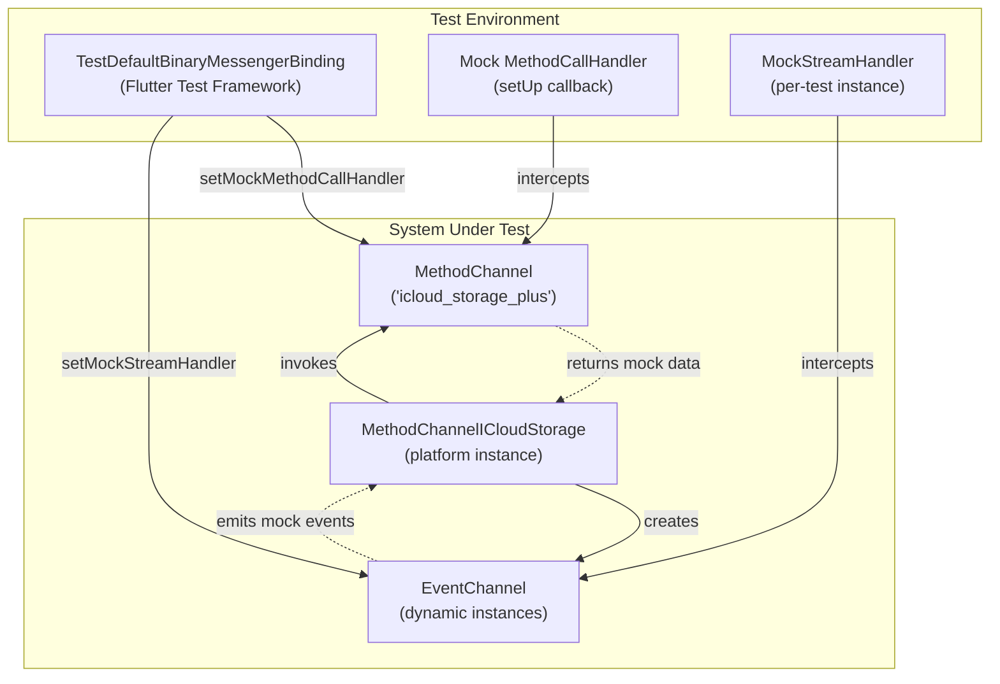
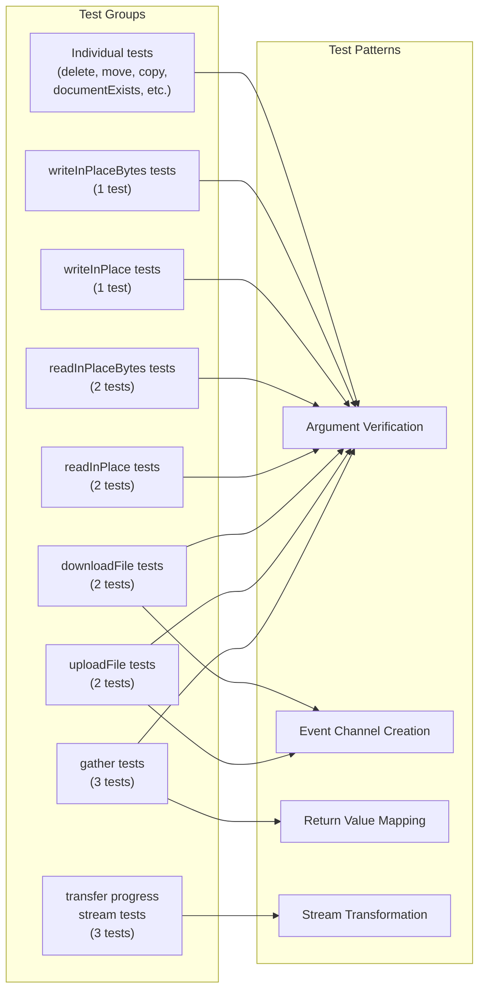
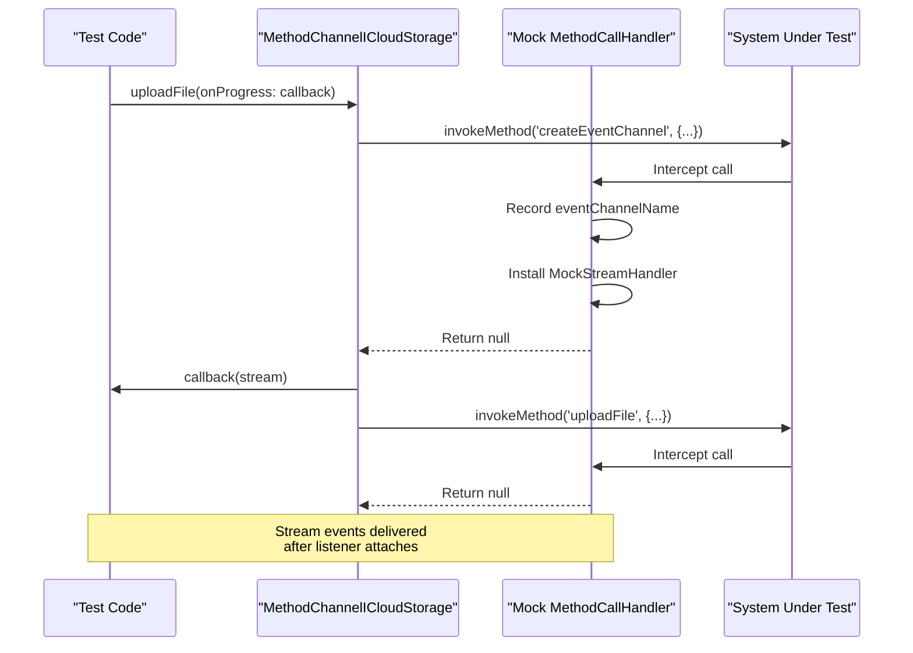
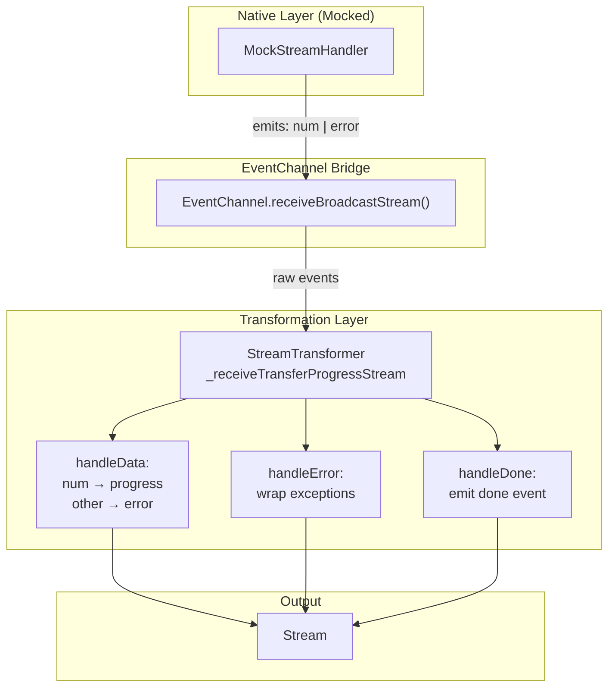

# Method Channel Tests

<details>
<summary>Relevant source files</summary>

The following files were used as context for generating this wiki page:

- [lib/icloud_storage_method_channel.dart](../../lib/icloud_storage_method_channel.dart)
- [test/icloud_storage_method_channel_test.dart](../../test/icloud_storage_method_channel_test.dart)

</details>


This page documents the test suite for the `MethodChannelICloudStorage` class, which implements the platform interface using Flutter's platform channels. These tests verify that the Dart-to-native communication layer correctly invokes platform methods, passes arguments, creates event channels, and transforms streamed events.

For tests of the public `ICloudStorage` API using mock implementations, see [API Tests](#7.1). For native layer testing considerations, see [Native Implementation Deep Dive](#5).

**Sources:** [test/icloud_storage_method_channel_test.dart:1-440]()

---

## Test Scope and Coverage

The method channel tests validate the `MethodChannelICloudStorage` implementation without requiring actual iOS/macOS native code execution. They verify:

| Test Category | What is Verified |
|---------------|------------------|
| **Method Invocation** | Correct method names are called on the `MethodChannel` |
| **Argument Passing** | Parameters are correctly serialized and passed to native code |
| **Event Channel Creation** | Event channels are created with unique names when progress callbacks are provided |
| **Return Value Mapping** | Native responses are correctly deserialized into Dart objects |
| **Stream Transformation** | Progress events are transformed into `ICloudTransferProgress` objects |
| **Error Handling** | Platform exceptions are properly wrapped and delivered |

The tests use Flutter's `TestDefaultBinaryMessengerBinding` to intercept and mock platform channel calls, allowing verification without native execution.

**Sources:** [test/icloud_storage_method_channel_test.dart:7-84](), [lib/icloud_storage_method_channel.dart:13-18]()

---

## Test Infrastructure

### Test Setup and Teardown

The test file establishes a mock environment in the `setUp` and `tearDown` blocks that intercepts all platform channel communication.



**Diagram: Mock Infrastructure Setup**

The `setUp` block [test/icloud_storage_method_channel_test.dart:19-72]() installs a mock method call handler that:

1. Captures the `MethodCall` in the `mockMethodCall` variable for assertion
2. Returns mock data based on the method name (e.g., file lists for `gather`, `true` for `documentExists`)
3. Registers `MockStreamHandler` instances when `createEventChannel` is called

The `tearDown` block [test/icloud_storage_method_channel_test.dart:74-84]() cleans up by removing all mock handlers and resetting state variables.

**Sources:** [test/icloud_storage_method_channel_test.dart:19-84]()

---

### Mock Method Call Handler

The mock handler uses a `switch` statement to simulate native responses for each operation:

| Method Name | Mock Return Value | Purpose |
|-------------|-------------------|---------|
| `createEventChannel` | `null` | Records event channel name and sets up stream handler |
| `gather` | List of file maps | Simulates file metadata from iCloud |
| `downloadFile` | `null` | Acknowledges download request |
| `documentExists` | `true` | Simulates file existence check |
| `getDocumentMetadata` | Map with metadata | Simulates single file metadata |
| `getContainerPath` | `'/container/path'` | Simulates container URL |
| `readInPlace` | `'contents'` | Simulates text file read |
| `readInPlaceBytes` | `Uint8List([1, 2, 3])` | Simulates binary file read |
| `writeInPlace`, `writeInPlaceBytes` | `null` | Acknowledges write operations |

The handler implementation [test/icloud_storage_method_channel_test.dart:23-70]() also demonstrates the expected data format for each operation, serving as documentation for the platform interface contract.

**Sources:** [test/icloud_storage_method_channel_test.dart:23-70]()

---

## Test Organization

The test suite organizes tests into groups by operation type, mirroring the structure of the `MethodChannelICloudStorage` class:



**Diagram: Test Organization and Patterns**

Each group tests a specific operation type, typically with one test for the basic invocation and additional tests for optional parameters or streaming features.

**Sources:** [test/icloud_storage_method_channel_test.dart:86-440]()

---

## Method Call Verification Pattern

Most tests follow a standard pattern for verifying method calls:

1. **Invoke** the method on the `platform` instance
2. **Capture** arguments from `mockMethodCall`
3. **Assert** that arguments match expected values

### Example: Basic Argument Verification

The `uploadFile` test [test/icloud_storage_method_channel_test.dart:149-160]() demonstrates this pattern:

```dart
await platform.uploadFile(
  containerId: containerId,
  localPath: '/dir/file',
  cloudRelativePath: 'dest',
);
final args = mockArguments();
expect(args['containerId'], containerId);
expect(args['localFilePath'], '/dir/file');
expect(args['cloudRelativePath'], 'dest');
expect(args['eventChannelName'], '');
```

The test verifies that:
- The correct `containerId` is passed
- Local and cloud paths are correctly mapped to `localFilePath` and `cloudRelativePath` arguments
- Without an `onProgress` callback, `eventChannelName` is an empty string

**Sources:** [test/icloud_storage_method_channel_test.dart:149-160](), [lib/icloud_storage_method_channel.dart:70-98]()

---

### Optional Parameter Transformation

Several tests verify that optional parameters are correctly transformed before passing to native code. The `readInPlace` timeout test [test/icloud_storage_method_channel_test.dart:216-233]() demonstrates this:

```dart
await platform.readInPlace(
  containerId: containerId,
  relativePath: 'Documents/test.json',
  idleTimeouts: const [
    Duration(seconds: 60),
    Duration(seconds: 90),
    Duration(seconds: 180),
  ],
  retryBackoff: const [
    Duration(seconds: 2),
    Duration(seconds: 4),
  ],
);
final args = mockArguments();
expect(args['idleTimeoutSeconds'], [60, 90, 180]);
expect(args['retryBackoffSeconds'], [2, 4]);
```

The test verifies that `Duration` objects are converted to integer seconds before transmission, as documented in [lib/icloud_storage_method_channel.dart:143-151](). This transformation reduces the data size and simplifies the native implementation.

**Sources:** [test/icloud_storage_method_channel_test.dart:216-233](), [lib/icloud_storage_method_channel.dart:143-151]()

---

## Event Channel Testing

### Event Channel Creation Verification

Operations that support progress callbacks or live updates must create event channels before the operation begins. The tests verify this two-phase setup:



**Diagram: Event Channel Creation Flow**

The test for `uploadFile` with progress [test/icloud_storage_method_channel_test.dart:162-173]() verifies this pattern:

```dart
await platform.uploadFile(
  containerId: containerId,
  localPath: '/dir/file',
  cloudRelativePath: 'dest',
  onProgress: (stream) => {},
);
final args = mockArguments();
final eventChannelName = args['eventChannelName'] as String?;
expect(eventChannelName, isNotNull);
expect(eventChannelName, isNotEmpty);
```

The implementation [lib/icloud_storage_method_channel.dart:78-90]() creates a unique event channel name using `_generateEventChannelName` [lib/icloud_storage_method_channel.dart:391-405](), which includes timestamps and random numbers to prevent conflicts.

**Sources:** [test/icloud_storage_method_channel_test.dart:162-173](), [lib/icloud_storage_method_channel.dart:78-90](), [lib/icloud_storage_method_channel.dart:391-405]()

---

### Event Channel Name Generation

The `_generateEventChannelName` method produces unique identifiers by combining:

- Plugin name: `'icloud_storage_plus'`
- Event type: `'event'`
- Operation name: e.g., `'uploadFile'`, `'downloadFile'`, `'gather'`
- Container ID: user-provided identifier
- Optional additional identifier
- Timestamp and random suffix: `${millisecondsSinceEpoch}_${random(0-999)}`

Example generated name: `icloud_storage_plus/event/uploadFile/myContainerId/1699885432765_247`

This naming scheme ensures that concurrent operations don't interfere with each other's event streams.

**Sources:** [lib/icloud_storage_method_channel.dart:391-405]()

---

## Progress Stream Testing

The `transfer progress stream tests` group [test/icloud_storage_method_channel_test.dart:296-384]() verifies the transformation of raw event channel data into `ICloudTransferProgress` objects.

### Stream Transformation Architecture



**Diagram: Progress Stream Transformation Pipeline**

The implementation [lib/icloud_storage_method_channel.dart:286-336]() uses a `StreamTransformer` with three handlers:

1. **handleData**: Converts numeric events to `ICloudTransferProgress.progress`, wraps unexpected types as errors
2. **handleError**: Wraps `PlatformException` and unexpected errors into `ICloudTransferProgress.error`
3. **handleDone**: Emits `ICloudTransferProgress.done` when the stream completes

**Sources:** [lib/icloud_storage_method_channel.dart:286-336]()

---

### Progress Event Mapping Test

The test [test/icloud_storage_method_channel_test.dart:297-325]() verifies the happy path:

```dart
mockStreamHandler = MockStreamHandler.inline(
  onListen: (arguments, events) {
    events
      ..success(0.25)
      ..success(1.0)
      ..endOfStream();
  },
);

late Stream<ICloudTransferProgress> progressStream;

await platform.uploadFile(
  containerId: containerId,
  localPath: '/dir/file',
  cloudRelativePath: 'dest',
  onProgress: (stream) {
    progressStream = stream;
  },
);

final events = await progressStream.toList();
expect(events, hasLength(3));
expect(events[0].isProgress, isTrue);
expect(events[0].percent, 0.25);
expect(events[1].isProgress, isTrue);
expect(events[1].percent, 1.0);
expect(events[2].isDone, isTrue);
```

The test:
1. Configures `MockStreamHandler` to emit numeric progress values (0.25, 1.0) and then complete
2. Invokes `uploadFile` with an `onProgress` callback that captures the stream
3. Collects all events and verifies they are correctly mapped to `ICloudTransferProgress` objects
4. Confirms that stream completion produces a `done` event

**Sources:** [test/icloud_storage_method_channel_test.dart:297-325]()

---

### Error Event Mapping Test

The test [test/icloud_storage_method_channel_test.dart:327-356]() verifies error handling:

```dart
mockStreamHandler = MockStreamHandler.inline(
  onListen: (arguments, events) {
    events.error(
      code: 'E_TEST',
      message: 'Boom',
      details: 'details',
    );
  },
);

late Stream<ICloudTransferProgress> progressStream;

await platform.downloadFile(
  containerId: containerId,
  cloudRelativePath: 'file',
  localPath: '/tmp/file',
  onProgress: (stream) {
    progressStream = stream;
  },
);

final events = await progressStream.toList();
expect(events, hasLength(1));
final event = events.first;
expect(event.isError, isTrue);
expect(event.exception?.code, 'E_TEST');
expect(event.exception?.message, 'Boom');
expect(event.exception?.details, 'details');
```

This test confirms that:
- `PlatformException` errors from the event channel are wrapped in `ICloudTransferProgress.error`
- The stream closes after emitting an error
- Error details are preserved in the wrapped exception

The implementation behavior is documented in [lib/icloud_storage_method_channel.dart:281-285](), noting that errors are delivered as data events, not through the stream's error channel.

**Sources:** [test/icloud_storage_method_channel_test.dart:327-356](), [lib/icloud_storage_method_channel.dart:281-285]()

---

## Data Model Mapping Tests

### Gather Result Mapping

The `gather` tests verify that raw platform data is correctly deserialized into `ICloudFile` objects. The primary mapping test [test/icloud_storage_method_channel_test.dart:87-106]() checks all fields:

```dart
final result = await platform.gather(containerId: containerId);
final file = result.files.last;
expect(file.relativePath, 'relativePath');
expect(file.isDirectory, false);
expect(file.sizeInBytes, 100);
expect(
  file.creationDate,
  DateTime.fromMillisecondsSinceEpoch(1000),
);
expect(
  file.contentChangeDate,
  DateTime.fromMillisecondsSinceEpoch(1000),
);
expect(file.isDownloading, true);
expect(file.downloadStatus, DownloadStatus.notDownloaded);
expect(file.isUploading, false);
expect(file.isUploaded, false);
expect(file.hasUnresolvedConflicts, false);
```

The mock data [test/icloud_storage_method_channel_test.dart:34-48]() includes all fields that native code would return, ensuring the `ICloudFile.fromMap` constructor [lib/icloud_storage_platform_interface.dart]() handles the full schema.

**Sources:** [test/icloud_storage_method_channel_test.dart:87-106](), [test/icloud_storage_method_channel_test.dart:34-48]()

---

### Directory Path Preservation

A specific test [test/icloud_storage_method_channel_test.dart:108-133]() verifies that directory paths retain trailing slashes:

```dart
TestDefaultBinaryMessengerBinding.instance.defaultBinaryMessenger
    .setMockMethodCallHandler(channel, (methodCall) async {
  if (methodCall.method == 'gather') {
    return [
      {
        'relativePath': 'Documents/folder/',
        'isDirectory': true,
        'sizeInBytes': null,
      }
    ];
  }
  return null;
});

final result = await platform.gather(containerId: containerId);
final directory = result.files.first;

expect(directory.isDirectory, true);
expect(directory.relativePath, 'Documents/folder/');
expect(
  directory.relativePath.endsWith('/'),
  true,
  reason: 'Directory paths may include trailing slashes',
);
```

This behavior aligns with the path validation rules documented in [Path Validation and Directory Handling](#6.4), where trailing slashes distinguish directory operations from file operations.

**Sources:** [test/icloud_storage_method_channel_test.dart:108-133]()

---

## Individual Operation Tests

### File Management Operations

The test file includes individual tests for file management operations [test/icloud_storage_method_channel_test.dart:386-418]():

| Operation | Test Focus | Key Assertions |
|-----------|------------|----------------|
| `delete` | Path and container ID passed correctly | `relativePath` and `containerId` arguments |
| `move` | Source and destination paths mapped | `atRelativePath` → `fromRelativePath`, `toRelativePath` |
| `copy` | Source and destination paths mapped | `fromRelativePath`, `toRelativePath` |
| `documentExists` | Boolean return value handling | Result defaults to `false` if null |

Note that the `move` operation uses `atRelativePath` in the native interface [test/icloud_storage_method_channel_test.dart:404]() but the Dart API uses `fromRelativePath` [lib/icloud_storage_method_channel.dart:221-230](). This is an implementation detail of the platform interface contract.

**Sources:** [test/icloud_storage_method_channel_test.dart:386-418](), [lib/icloud_storage_method_channel.dart:210-256]()

---

### Metadata Operations

The tests for metadata retrieval [test/icloud_storage_method_channel_test.dart:420-439]() verify:

**`documentExists`**: Returns boolean indicating file presence
```dart
final exists = await platform.documentExists(
  containerId: containerId,
  relativePath: 'file',
);
expect(exists, true);
```

**`getDocumentMetadata`**: Returns map with file metadata or null
```dart
final metadata = await platform.getDocumentMetadata(
  containerId: containerId,
  relativePath: 'file',
);
expect(metadata?['relativePath'], 'meta.txt');
```

**`getContainerPath`**: Returns absolute path to container
```dart
final path = await platform.getContainerPath(containerId: containerId);
expect(path, '/container/path');
```

The implementation [lib/icloud_storage_method_channel.dart:259-273]() includes special handling to convert dynamic maps to properly typed `Map<String, dynamic>`, which is necessary due to platform channel serialization.

**Sources:** [test/icloud_storage_method_channel_test.dart:420-439](), [lib/icloud_storage_method_channel.dart:259-273]()

---

## Test Patterns Summary

The method channel tests employ several key patterns:

### 1. Argument Verification Pattern
- Invoke method with known parameters
- Access `mockMethodCall.arguments` via `mockArguments()` helper
- Assert each argument key and value

### 2. Event Channel Setup Pattern
- Provide `onProgress` or `onUpdate` callback
- Verify `eventChannelName` is generated and passed
- Confirm callback receives a stream

### 3. Stream Event Pattern
- Configure `MockStreamHandler` with expected events
- Capture stream in callback
- Collect events with `stream.toList()`
- Verify event sequence and transformations

### 4. Return Value Mapping Pattern
- Mock handler returns expected data structure
- Invoke method and capture result
- Assert result matches expected Dart type

These patterns provide comprehensive coverage of the platform channel communication layer without requiring actual native code execution.

**Sources:** [test/icloud_storage_method_channel_test.dart:1-440]()

---

## Running the Tests

The method channel tests run as standard Flutter unit tests:

```bash
flutter test test/icloud_storage_method_channel_test.dart
```

They execute quickly (typically < 1 second) because they use mocks instead of actual platform channels. This makes them suitable for continuous integration and pre-commit checks.

For integration testing that exercises actual native code, developers must run the example app on a physical iOS or macOS device with iCloud enabled.

**Sources:** [test/icloud_storage_method_channel_test.dart:17]()