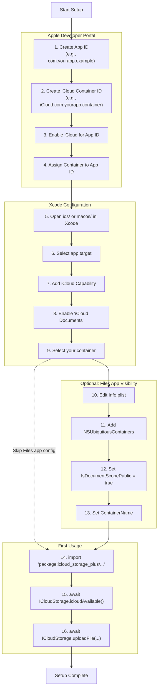
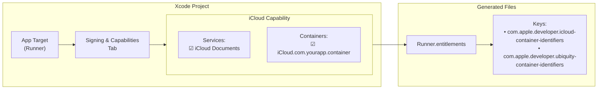
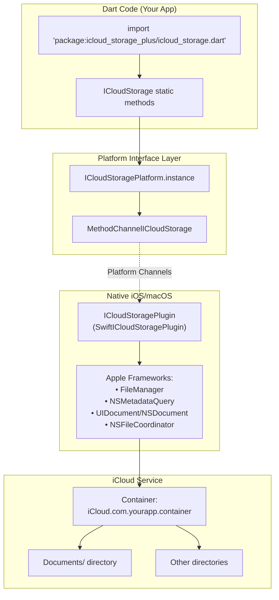
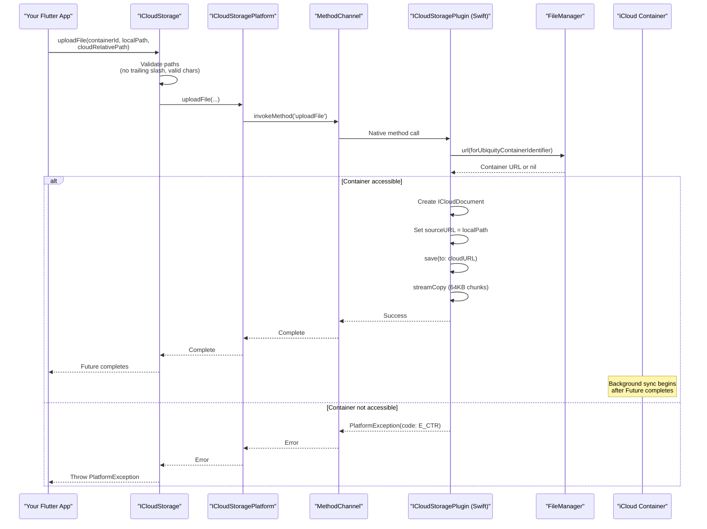

# Getting Started

<details>
<summary>Relevant source files</summary>

The following files were used as context for generating this wiki page:

- [README.md](../../README.md)
- [lib/icloud_storage.dart](../../lib/icloud_storage.dart)
- [pubspec.yaml](../../pubspec.yaml)

</details>


This page covers installation, configuration, and initial setup for the `icloud_storage_plus` Flutter plugin. It includes prerequisites, Apple Developer account setup, Xcode configuration, and basic usage examples to get your app reading and writing iCloud documents.

For detailed API documentation of all operations, see [API Reference](#3). For advanced configuration like progress monitoring and Files app integration, see [Advanced Topics](#6).

---

## Prerequisites

Before installing the plugin, ensure your development environment meets these requirements:

| Requirement | Version |
|-------------|---------|
| Dart SDK | `>=3.0.0 <4.0.0` |
| Flutter | `>=3.10.0` |
| iOS | `>=13.0` |
| macOS | `>=10.15` |

**Additional Requirements:**
- **Apple Developer Account**: Required to create iCloud containers and App IDs
- **Physical Device for Testing**: iCloud sync is unreliable in iOS Simulator. Use real devices for testing upload/download operations and multi-device sync
- **iCloud Account**: Test device must be signed into iCloud with iCloud Drive enabled

**Sources:** [README.md:27-30](), [README.md:577-580](), [README.md:612-617](), [pubspec.yaml:6-8]()

---

## Installation

Add the plugin to your Flutter project:

```bash
flutter pub add icloud_storage_plus
```

This adds the dependency to your `pubspec.yaml`:

```yaml
dependencies:
  icloud_storage_plus: ^1.0.0
```

Verify the installation by importing the package in your Dart code:

```dart
import 'package:icloud_storage_plus/icloud_storage.dart';
```

**Plugin Registration:** The plugin registers automatically via the federated plugin architecture. The `ICloudStoragePlugin` class (Objective-C/Swift) is declared in `pubspec.yaml` and Flutter registers it on both iOS and macOS platforms.

**Sources:** [README.md:21-25](), [pubspec.yaml:22-28]()

---

## Setup Workflow



This diagram shows the complete setup sequence from Apple Developer Portal through Xcode configuration to first API call. Steps 10-13 are optional but recommended for Files app integration.

**Sources:** [README.md:295-341]()

---

## Apple Developer Portal Setup

### Step 1: Create an App ID

1. Log into [Apple Developer Portal](https://developer.apple.com/account/)
2. Navigate to **Certificates, Identifiers & Profiles**
3. Select **Identifiers** → **App IDs**
4. Click **+** to create a new App ID
5. Enter your Bundle ID (e.g., `com.yourcompany.yourapp`)

### Step 2: Create an iCloud Container

1. In **Identifiers**, select **iCloud Containers**
2. Click **+** to create a new container
3. Enter a container identifier: `iCloud.com.yourcompany.yourapp` (must start with `iCloud.`)
4. Enter a description for reference
5. Click **Continue** and **Register**

**Container ID Naming Convention:** The container ID is independent of your App ID, but conventionally uses the same reversed domain. Multiple apps can share the same container.

### Step 3: Enable iCloud for App ID

1. Return to **App IDs** and select your App ID
2. In **Capabilities**, enable **iCloud**
3. Click **Edit** next to iCloud
4. Select **Include CloudKit support** (optional, not required for document storage)
5. Assign your iCloud Container to this App ID
6. Click **Save**

**Sources:** [README.md:297-302]()

---

## Xcode Configuration



This diagram shows how Xcode capabilities translate to entitlement files that authorize iCloud access.

### Step 1: Open Project in Xcode

```bash
# For iOS
open ios/Runner.xcworkspace

# For macOS
open macos/Runner.xcworkspace
```

**Important:** Always open the `.xcworkspace` file (not `.xcodeproj`) if you use CocoaPods.

### Step 2: Configure Signing & Capabilities

1. In Xcode, select the **Runner** target in the project navigator
2. Select the **Signing & Capabilities** tab
3. Click **+ Capability**
4. Search for and add **iCloud**

### Step 3: Configure iCloud Capability

1. In the iCloud section, enable **iCloud Documents**
2. Under **Containers**, click **+ Container**
3. Select **Use Custom Container** if your container ID isn't auto-detected
4. Enter your container ID: `iCloud.com.yourapp.container` (must match Apple Developer Portal)
5. Verify the checkbox next to your container is checked

**Verification:** After configuration, Xcode creates/updates `ios/Runner/Runner.entitlements` (or `macos/Runner/Runner.entitlements`) with your container identifiers.

**Sources:** [README.md:303-310]()

---

## Files App Integration (Optional)

To make your iCloud documents visible in the iOS/macOS Files app, configure `NSUbiquitousContainers` in `Info.plist`:

### Configuration

Edit `ios/Runner/Info.plist` (or `macos/Runner/Info.plist`):

```xml
<key>NSUbiquitousContainers</key>
<dict>
    <key>iCloud.com.yourapp.container</key>
    <dict>
        <key>NSUbiquitousContainerIsDocumentScopePublic</key>
        <true/>
        <key>NSUbiquitousContainerName</key>
        <string>My App Name</string>
    </dict>
</dict>
```

**Key Explanations:**
- `NSUbiquitousContainerIsDocumentScopePublic`: Set to `true` to expose the container in Files app
- `NSUbiquitousContainerName`: The display name shown in Files app under iCloud Drive

### Path Requirements

Only files under the `Documents/` directory appear in Files app:

```dart
// ✓ Visible in Files app
await ICloudStorage.uploadFile(
  containerId: 'iCloud.com.yourapp.container',
  localPath: localPath,
  cloudRelativePath: 'Documents/notes.txt',
);

// ✗ Hidden from Files app (still syncs)
await ICloudStorage.uploadFile(
  containerId: 'iCloud.com.yourapp.container',
  localPath: localPath,
  cloudRelativePath: 'cache/temp.dat',
);
```

**First Appearance:** Your app's folder won't appear in Files app until you write at least one file under `Documents/`.

For more details on Files app integration, see [Files App Integration](#6.3).

**Sources:** [README.md:311-341](), [lib/icloud_storage.dart:34-39]()

---

## Basic Usage

### Configuration Overview



This diagram shows the complete path from your Dart code to iCloud storage, mapping code entities to system components.

**Sources:** [lib/icloud_storage.dart:1-8](), Architecture diagrams

### Step 1: Check iCloud Availability

Always verify iCloud is available before performing operations:

```dart
import 'package:icloud_storage_plus/icloud_storage.dart';

final available = await ICloudStorage.icloudAvailable();
if (!available) {
  // User is not signed into iCloud, or iCloud Drive is disabled
  print('iCloud is not available');
  return;
}
```

The `icloudAvailable()` method returns `false` if:
- User is not signed into iCloud
- iCloud Drive is disabled in Settings
- Container ID is invalid or not configured

**Sources:** [README.md:47-52](), [lib/icloud_storage.dart:42-44]()

### Step 2: Upload a File (Copy-In Pattern)

Upload a local file to iCloud:

```dart
import 'dart:io';
import 'package:icloud_storage_plus/icloud_storage.dart';

// Prepare local file
final localPath = '${Directory.systemTemp.path}/notes.txt';
await File(localPath).writeAsString('My notes content');

// Copy into iCloud container
await ICloudStorage.uploadFile(
  containerId: 'iCloud.com.yourapp.container',
  localPath: localPath,
  cloudRelativePath: 'Documents/notes.txt',
);
```

**Semantics:** `uploadFile` copies the local file into the iCloud container. After the copy completes, iCloud automatically uploads the file in the background. This is a copy-in operation, not in-place access.

**Path Validation:** The `cloudRelativePath` must not end with `/` because `uploadFile` uses file-specific document coordination APIs (`UIDocument`/`NSDocument`). The validation happens at [lib/icloud_storage.dart:96-100]().

**Sources:** [README.md:54-64](), [lib/icloud_storage.dart:84-114]()

### Step 3: Download a File (Copy-Out Pattern)

Download a file from iCloud to a local path:

```dart
// Download from iCloud and copy to local destination
final downloadPath = '${Directory.systemTemp.path}/notes-downloaded.txt';
await ICloudStorage.downloadFile(
  containerId: 'iCloud.com.yourapp.container',
  cloudRelativePath: 'Documents/notes.txt',
  localPath: downloadPath,
);

// Read the downloaded file
final content = await File(downloadPath).readAsString();
print(content); // "My notes content"
```

**Semantics:** `downloadFile` triggers iCloud to download the container file if needed, then copies the fully downloaded file to the local destination. This is a download-then-copy-out operation.

**Sources:** [README.md:65-74](), [lib/icloud_storage.dart:130-160]()

### Step 4: In-Place Access (Recommended for Sync)

For small text or JSON files, use coordinated in-place access to read/write directly in the container:

```dart
// Read directly from iCloud with coordination
final contents = await ICloudStorage.readInPlace(
  containerId: 'iCloud.com.yourapp.container',
  relativePath: 'Documents/settings.json',
);

// Write directly to iCloud with coordination
await ICloudStorage.writeInPlace(
  containerId: 'iCloud.com.yourapp.container',
  relativePath: 'Documents/settings.json',
  contents: '{"theme": "dark", "version": 2}',
);
```

**In-Place vs. Transfer:** In-place operations (`readInPlace`/`writeInPlace`) load the full file into memory and coordinate access using `UIDocument`/`NSDocument`. Transfer operations (`uploadFile`/`downloadFile`) stream data in 64KB chunks. Use in-place for small files that need transparent sync; use transfer for large files.

**Binary Files:** Use `readInPlaceBytes` and `writeInPlaceBytes` for non-text files like images or PDFs:

```dart
// Read binary file
final bytes = await ICloudStorage.readInPlaceBytes(
  containerId: 'iCloud.com.yourapp.container',
  relativePath: 'Documents/image.png',
);

// Write binary file
await ICloudStorage.writeInPlaceBytes(
  containerId: 'iCloud.com.yourapp.container',
  relativePath: 'Documents/image.png',
  contents: imageBytes,
);
```

**Sources:** [README.md:76-115](), [lib/icloud_storage.dart:183-324]()

---

## First Operation Flow



This sequence diagram shows the complete flow of your first `uploadFile` call, from Dart validation through native execution to iCloud storage.

**Sources:** [lib/icloud_storage.dart:84-114](), Architecture Diagram 5

---

## Verification Steps

### 1. Verify Entitlements

Check that Xcode generated the correct entitlements:

**iOS:** `ios/Runner/Runner.entitlements`
```xml
<key>com.apple.developer.icloud-container-identifiers</key>
<array>
    <string>iCloud.com.yourapp.container</string>
</array>
<key>com.apple.developer.ubiquity-container-identifiers</key>
<array>
    <string>iCloud.com.yourapp.container</string>
</array>
```

**macOS:** `macos/Runner/Runner.entitlements` (same structure)

### 2. Test iCloud Availability

Run this code on a physical device:

```dart
final available = await ICloudStorage.icloudAvailable();
print('iCloud available: $available');
```

**Expected Result:** `true` if configuration is correct and user is signed into iCloud.

### 3. Test File Upload

```dart
try {
  final testPath = '${Directory.systemTemp.path}/test.txt';
  await File(testPath).writeAsString('Test content');
  
  await ICloudStorage.uploadFile(
    containerId: 'iCloud.com.yourapp.container',
    localPath: testPath,
    cloudRelativePath: 'Documents/test.txt',
  );
  
  print('Upload successful!');
} on PlatformException catch (e) {
  print('Upload failed: ${e.code} - ${e.message}');
}
```

**Expected Result:** "Upload successful!" with no exceptions.

### 4. Verify in Files App (Optional)

If you configured Files app integration:

1. Open **Files** app on iOS/macOS
2. Navigate to **iCloud Drive**
3. Look for your app's folder (uses `NSUbiquitousContainerName`)
4. Verify `test.txt` appears in the folder

**Note:** The folder only appears after uploading the first file to `Documents/`.

**Sources:** [README.md:627-657]()

---

## Common Setup Issues

### Issue: `icloudAvailable()` returns false

**Possible Causes:**
- User not signed into iCloud
- iCloud Drive disabled in Settings → [Apple ID] → iCloud → iCloud Drive
- Container ID mismatch between code, Xcode, and Apple Developer Portal
- Entitlements not properly configured

**Solution:** Verify all three locations use the same container ID:
1. Your Dart code: `containerId: 'iCloud.com.yourapp.container'`
2. Xcode: Signing & Capabilities → iCloud → Containers
3. Apple Developer Portal: App ID → iCloud capability

### Issue: `E_CTR` (iCloud container/permission error)

**Possible Causes:**
- Invalid `containerId` parameter
- Container not assigned to App ID in Apple Developer Portal
- Missing iCloud capability in Xcode
- Testing on simulator instead of physical device

**Solution:**
1. Double-check container ID spelling (case-sensitive)
2. Verify iCloud capability is enabled in Xcode for the correct target
3. Test on a physical device signed into iCloud
4. Clean build: `flutter clean && flutter pub get`

### Issue: Files not syncing between devices

**Possible Causes:**
- Testing on iOS Simulator (unreliable)
- Network connectivity issues
- Devices signed into different iCloud accounts
- Sync delayed by iOS on cellular connections

**Solution:**
- **Always use physical devices for sync testing**
- Verify both devices are signed into the same iCloud account
- Check Settings → [Apple ID] → iCloud → iCloud Drive is enabled
- Wait several minutes for initial sync (can take time on first upload)
- Force sync by toggling Settings → iCloud → iCloud Drive off and on

### Issue: Files not visible in Files app

**Possible Causes:**
- Path doesn't start with `Documents/`
- `NSUbiquitousContainers` not configured in `Info.plist`
- `NSUbiquitousContainerIsDocumentScopePublic` is `false`
- No files uploaded yet to `Documents/` directory

**Solution:**
1. Verify `Info.plist` contains `NSUbiquitousContainers` configuration
2. Ensure paths use `Documents/` prefix (case-sensitive)
3. Upload at least one file to `Documents/` to trigger folder creation
4. Wait a few seconds for Files app to refresh

**Sources:** [README.md:627-657]()

---

## Next Steps

After completing setup and verification:

1. **Explore the API:** See [API Reference](#3) for all available operations
2. **Learn File Operations:** See [File Management Operations](#3.4) for delete, move, copy, and rename
3. **Add Progress Monitoring:** See [Progress Monitoring](#6.1) for upload/download progress callbacks
4. **Handle Errors:** See [Error Handling](#3.6) for exception types and error codes
5. **Review Examples:** See [Example Application](#8) for a complete working app

For production apps, review [Advanced Topics](#6) covering retry logic, download timeouts, and path validation.

**Sources:** README.md, Table of Contents
