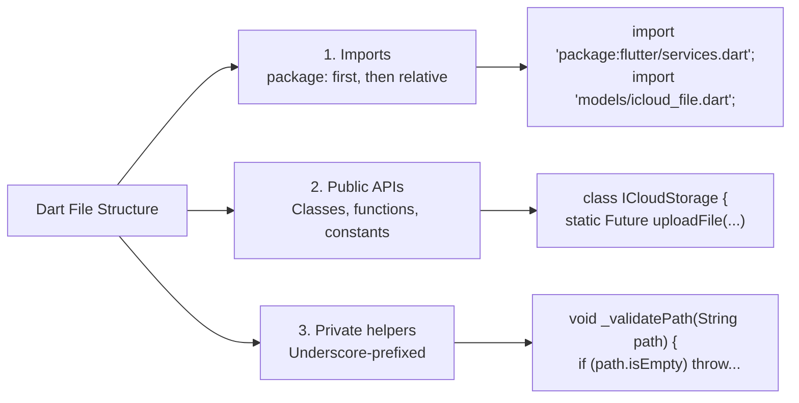
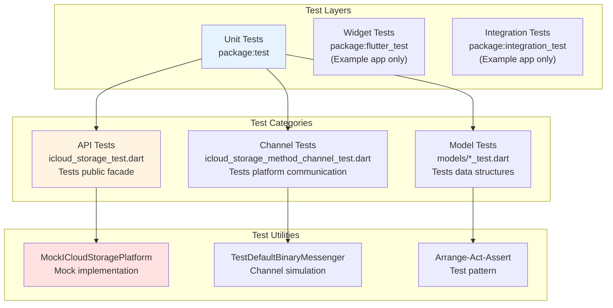
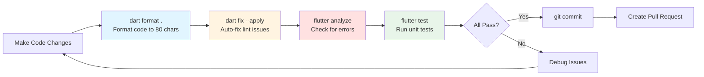
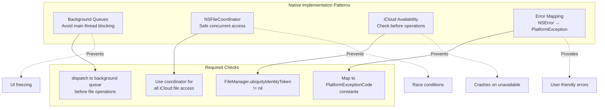
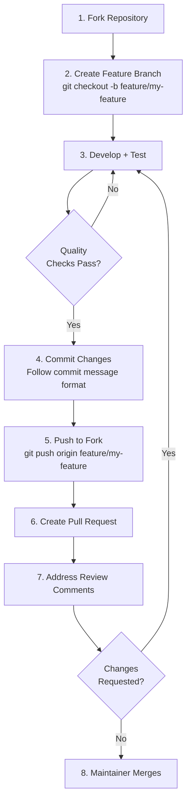
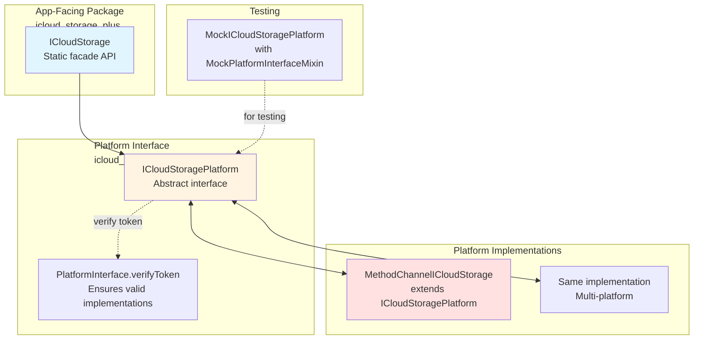

# Contributing

<details>
<summary>Relevant source files</summary>

The following files were used as context for generating this wiki page:

- [AGENTS.md](../../AGENTS.md)
- [coverage/lcov.info](../../coverage/lcov.info)
- [test/models/icloud_file_test.dart](../../test/models/icloud_file_test.dart)

</details>


This page provides comprehensive guidelines for contributing to the icloud_storage_plus plugin, including development setup, coding standards, testing requirements, and submission procedures. For architectural overview, see [Architecture Overview](#4). For information on running the example application, see [Example Application](#8).

---

## Development Environment Setup

### Prerequisites

The following tools are required for plugin development:

| Tool | Purpose | Installation |
|------|---------|-------------|
| Flutter SDK | Core framework | https://flutter.dev/doc/get-started/install |
| Xcode | iOS/macOS development | Mac App Store (macOS only) |
| CocoaPods | iOS/macOS dependency management | `sudo gem install cocoapods` |
| Dart SDK | Included with Flutter | - |

### Initial Setup

1. **Clone the repository**
   ```bash
   git clone https://github.com/kingdomseed/icloud_storage_plus.git
   cd icloud_storage_plus
   ```

2. **Install dependencies**
   ```bash
   flutter pub get
   ```

3. **Verify installation**
   ```bash
   flutter analyze
   flutter test
   ```

4. **Configure example app** (iOS/macOS testing)
   - Open `example/ios/Runner.xcworkspace` in Xcode
   - Enable iCloud capability with container identifier
   - Configure signing team

**Sources:** [AGENTS.md:44-51]()

---

## Codebase Structure

```mermaid
graph TB
    subgraph "lib/" 
        API["icloud_storage.dart<br/>Public API facade"]
        Interface["icloud_storage_platform_interface.dart<br/>Abstract platform interface"]
        Channel["icloud_storage_method_channel.dart<br/>MethodChannel implementation"]
        
        subgraph "models/"
            ICloudFile["icloud_file.dart<br/>File metadata model"]
            Progress["transfer_progress.dart<br/>Progress tracking"]
            Exceptions["exceptions.dart<br/>Error types"]
            GatherResult["gather_result.dart<br/>List operation result"]
        end
    end
    
    subgraph "ios/Classes/"
        iOSPlugin["iOSICloudStoragePlugin.swift<br/>iOS entry point"]
        ICloudDoc["ICloudDocument.swift<br/>Streaming I/O"]
        InPlaceDoc["ICloudInPlaceDocument.swift<br/>Text/binary access"]
    end
    
    subgraph "macos/Classes/"
        macOSPlugin["ICloudStoragePlugin.swift<br/>macOS entry point"]
        macOSDoc["Same document classes<br/>via darwin/ sharing"]
    end
    
    subgraph "test/"
        APITest["icloud_storage_test.dart<br/>Public API tests"]
        ChannelTest["icloud_storage_method_channel_test.dart<br/>Platform channel tests"]
        ModelTest["models/icloud_file_test.dart<br/>Data model tests"]
    end
    
    API --> Interface
    Interface --> Channel
    API --> models/
    Channel --> models/
    
    Channel -.->|"Platform channels"| iOSPlugin
    Channel -.->|"Platform channels"| macOSPlugin
    
    APITest -.->|"Tests"| API
    ChannelTest -.->|"Tests"| Channel
    ModelTest -.->|"Tests"| ICloudFile

    style lib/ fill:#f9f9f9
    style "ios/Classes/" fill:#f9f9f9
    style "macos/Classes/" fill:#f9f9f9
    style test/ fill:#f9f9f9
```

### Key Directories

| Directory | Purpose | Language |
|-----------|---------|----------|
| `lib/` | Public Dart API and platform interface | Dart |
| `lib/models/` | Data models and exceptions | Dart |
| `ios/Classes/` | iOS native implementation | Swift |
| `macos/Classes/` | macOS native implementation | Swift |
| `test/` | Dart unit tests | Dart |
| `example/` | Demo application | Dart + Swift |

**Sources:** [AGENTS.md:22-30]()

---

## Coding Standards

### Dart Code Style

#### File Organization



#### Naming Conventions

| Element | Convention | Example |
|---------|-----------|---------|
| Classes | PascalCase | `ICloudStorage`, `InvalidArgumentException` |
| Methods/Variables | camelCase | `uploadFile`, `containerId` |
| Constants | camelCase | `methodChannelName` |
| Private members | Leading underscore | `_validatePath`, `_eventChannels` |
| Files | snake_case | `icloud_storage.dart`, `transfer_progress.dart` |

#### Code Quality Rules

- **Line length**: Maximum 80 characters [AGENTS.md:59]()
- **Function length**: Strive for less than 20 lines [AGENTS.md:61]()
- **Null safety**: Use sound null safety; avoid `!` operator unless guaranteed non-null [AGENTS.md:78]()
- **Comments**: Document all public APIs with `///` doc comments [AGENTS.md:72]()
- **Error handling**: Use typed exceptions with `try-catch` blocks [AGENTS.md:82-83]()

**Example from codebase:**

```dart
// From lib/icloud_storage.dart
/// Uploads a file from local storage to iCloud.
///
/// [containerId] iCloud container identifier (e.g., "iCloud.com.example.app")
/// [localFilePath] Absolute path to the local file
/// [cloudFileName] Relative path in iCloud (e.g., "Documents/file.txt")
/// [onProgress] Optional callback for upload progress updates
static Future<void> uploadFile({...}) async {
  _validatePath(cloudFileName, allowDirectory: false);
  // Implementation...
}
```

**Sources:** [AGENTS.md:53-85](), [lib/icloud_storage.dart:68-86]()

---

### Swift Code Style

#### Platform-Specific Rules

1. **Background queues**: Never block main thread [AGENTS.md:39]()
2. **Error propagation**: Surface all native errors as Dart exceptions [AGENTS.md:40]()
3. **Dual implementation**: Update both iOS and macOS when adding features [AGENTS.md:41]()
4. **iCloud availability**: Check availability before operations [AGENTS.md:42]()

#### File Coordination Pattern

```swift
// Pattern used throughout native code
let fileManager = FileManager.default
let coordinator = NSFileCoordinator()

var coordinatorError: NSError?
coordinator.coordinate(
    readingItemAt: url,
    options: .withoutChanges,
    error: &coordinatorError
) { url in
    // Perform file operation
}
```

**Sources:** [AGENTS.md:32-42]()

---

## Testing Requirements

### Test Architecture



### Coverage Requirements

Current test coverage from [coverage/lcov.info]():

| File | Lines Hit | Lines Found | Coverage |
|------|-----------|-------------|----------|
| `icloud_storage_method_channel.dart` | 69 | 97 | 71.1% |
| `models/icloud_file.dart` | 39 | 42 | 92.9% |
| `models/transfer_progress.dart` | 10 | 10 | 100% |
| `icloud_storage.dart` | 49 | 71 | 69.0% |
| `icloud_storage_platform_interface.dart` | 6 | 26 | 23.1% |

**Target**: Aim for >80% coverage on public API layer (lib/icloud_storage.dart) and data models.

### Running Tests

```bash
# Run all tests
flutter test

# Run with coverage
flutter test --coverage

# Run specific test file
flutter test test/icloud_storage_test.dart

# Run tests with verbose output
flutter test --verbose
```

### Writing Tests

**Arrange-Act-Assert Pattern** [AGENTS.md:118]():

```dart
// From test/models/icloud_file_test.dart
test('files with identical properties are equal', () {
  // Arrange
  final file1 = ICloudFile.fromMap(const {
    'relativePath': 'Documents/test.txt',
    'sizeInBytes': 1024,
  });
  final file2 = ICloudFile.fromMap(const {
    'relativePath': 'Documents/test.txt',
    'sizeInBytes': 1024,
  });
  
  // Act & Assert
  expect(file1, equals(file2));
  expect(file1.hashCode, equals(file2.hashCode));
});
```

**Mock Usage** [AGENTS.md:119]():

```dart
// Use MockPlatformInterfaceMixin for platform interface mocks
class MockICloudStoragePlatform extends Mock
    with MockPlatformInterfaceMixin
    implements ICloudStoragePlatform {}
```

**Sources:** [AGENTS.md:110-121](), [test/models/icloud_file_test.dart:1-450](), [coverage/lcov.info:1-280]()

---

## Development Workflow

### Toolchain Execution Order



### Pre-Commit Checklist

| Step | Command | Purpose |
|------|---------|---------|
| 1. Format | `dart format .` | Enforce 80-char lines and style |
| 2. Fix | `dart fix --apply` | Auto-fix common lint issues |
| 3. Analyze | `flutter analyze` | Static analysis and lint checks |
| 4. Test | `flutter test` | Run all unit tests |
| 5. Example | Build example app on iOS/macOS | Verify native integration |

**Sources:** [AGENTS.md:18-21]()

---

## Code Quality Tools

### Analysis Options

The project uses `flutter_lints` with additional rules configured in `analysis_options.yaml` [AGENTS.md:87-99]():

```yaml
include: package:flutter_lints/flutter.yaml

linter:
  rules:
    # Project follows these rules:
    # - 80 character line length
    # - Null safety without ! operator
    # - Comprehensive doc comments
    # - Typed exception handling
```

### Package Management

#### Adding Dependencies

```bash
# Regular dependency
flutter pub add <package_name>

# Development dependency
flutter pub add dev:<package_name>

# Dependency override
flutter pub add override:<package_name>:1.0.0

# Remove dependency
dart pub remove <package_name>
```

#### Searching for Packages

When adding functionality requiring external packages [AGENTS.md:46-50]():
1. Use `pub_dev_search` tool (if available)
2. Otherwise, search pub.dev for stable, well-maintained packages
3. Explain benefits when suggesting new dependencies

**Sources:** [AGENTS.md:44-51](), [AGENTS.md:87-99]()

---

## Platform-Specific Guidelines

### iOS and macOS Development

#### Shared Darwin Source

Consider using `sharedDarwinSource: true` for shared iOS/macOS code [AGENTS.md:38]():

```
darwin/
  ├── Classes/
  │   ├── ICloudStoragePlugin.swift
  │   ├── ICloudDocument.swift
  │   └── ...
```

#### Key Native Patterns



#### iCloud Existence Checks

**Important**: Use `FileManager.fileExists(atPath:)` on the container URL for existence checks. **Do not use `NSMetadataQuery` for existence** [AGENTS.md:64-66]().

```swift
// Correct
let containerURL = fileManager.url(forUbiquityContainerIdentifier: nil)
let fileURL = containerURL?.appendingPathComponent(relativePath)
let exists = fileManager.fileExists(atPath: fileURL.path)

// Incorrect - do not use for existence checks
let query = NSMetadataQuery() // Only for monitoring changes
```

**Sources:** [AGENTS.md:32-42](), [AGENTS.md:64-66]()

---

## Pull Request Guidelines

### Submission Process



### Commit Message Format

```
<type>: <short description>

<detailed explanation if needed>

<footer with issue references>
```

**Types:**
- `feat`: New feature
- `fix`: Bug fix
- `docs`: Documentation changes
- `test`: Test additions/modifications
- `refactor`: Code refactoring
- `chore`: Build/tooling changes

**Example:**
```
feat: add support for in-place binary file access

Implements readInPlaceBytes and writeInPlaceBytes operations
using coordinated access with NSFileCoordinator.

Closes #42
```

### Pull Request Checklist

- [ ] All tests pass (`flutter test`)
- [ ] Code formatted (`dart format .`)
- [ ] Lint issues resolved (`flutter analyze`)
- [ ] Coverage maintained or improved
- [ ] Documentation updated (if public API changed)
- [ ] Example app tested on iOS/macOS (if native changes)
- [ ] Both iOS and macOS implementations updated (if applicable)
- [ ] Changelog entry added (for user-facing changes)

**Sources:** [AGENTS.md:1-121]()

---

## Federated Plugin Architecture

### Platform Interface Pattern

The plugin follows the **federated plugin architecture** [AGENTS.md:34]():



### Implementation Rules

1. **Extend, don't implement**: Platform implementations must `extend` (not `implement`) the platform interface [AGENTS.md:35]()
2. **Verify tokens**: Call `PlatformInterface.verifyToken` to ensure valid implementations [AGENTS.md:35]()
3. **Mock mixin**: Use `MockPlatformInterfaceMixin` in tests that mock the interface [AGENTS.md:35]()

**Example:**

```dart
// Correct
class MethodChannelICloudStorage extends ICloudStoragePlatform {
  @visibleForTesting
  final methodChannel = const MethodChannel('icloud_storage_plus');
  
  MethodChannelICloudStorage() : super(token: _token);
  
  static final Object _token = Object();
}

// Test mock
class MockICloudStoragePlatform extends Mock
    with MockPlatformInterfaceMixin
    implements ICloudStoragePlatform {}
```

**Sources:** [AGENTS.md:34-36]()

---

## Additional Resources

### Documentation Links

- [Flutter Plugin Development](https://flutter.dev/doc/development/packages-and-plugins/developing-packages)
- [Effective Dart Style Guide](https://dart.dev/effective-dart)
- [Apple iCloud Documentation](https://developer.apple.com/icloud/)
- [NSFileCoordinator Reference](https://developer.apple.com/documentation/foundation/nsfilecoordinator)

### Related Wiki Pages

- [Getting Started](#2) - Installation and initial setup
- [Architecture Overview](#4) - High-level design patterns
- [Testing Guide](#7) - Comprehensive testing documentation
- [Example Application](#8) - Demo app walkthrough

**Sources:** [AGENTS.md:69]()