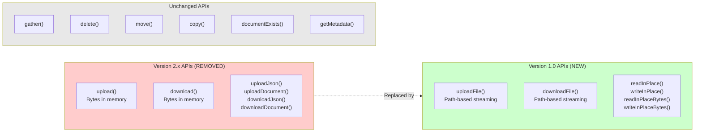
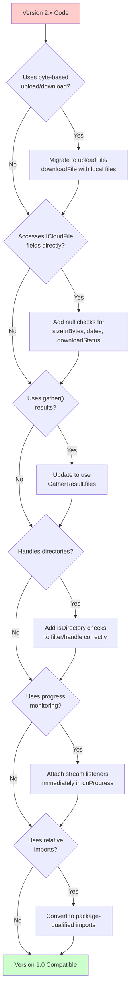
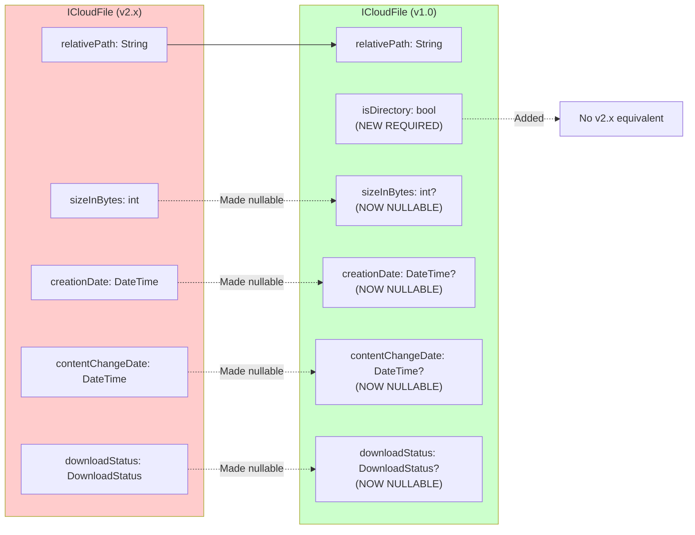

# Version History and Migration

<details>
<summary>Relevant source files</summary>

The following files were used as context for generating this wiki page:

- [CHANGELOG.md](../../CHANGELOG.md)
- [README.md](../../README.md)

</details>


This document provides a comprehensive guide to the version history of the icloud_storage_plus plugin and migration instructions for upgrading between major versions. It covers breaking changes, deprecated APIs, and practical migration patterns.

For detailed API usage and current method signatures, see [API Reference](#3). For implementation details about the current architecture, see [Architecture Overview](#4).

---

## Purpose and Scope

This page documents:
- Major version releases and their feature sets
- Breaking changes between versions
- Step-by-step migration guides with code examples
- API evolution and deprecation timelines
- Data model changes and compatibility considerations

---

## Version Overview

| Version | Release Date | Status | Key Features |
|---------|--------------|--------|--------------|
| 1.0.0 | 2026-02-04 | Current | Streaming-only file path API, coordinated in-place access, directory support, nullable metadata fields |
| 2.x.x | Previous | Deprecated | Byte-based APIs, non-nullable metadata, no directory detection |

**Sources:** [CHANGELOG.md:1-177]()

---

## Version 1.0.0 Breaking Changes

Version 1.0.0 represents a major architectural shift toward streaming file
operations and coordinated access patterns. The release removes all byte-based
APIs in favor of file-path methods that align with Apple's document storage
tier.

### API Surface Changes



**Diagram:** API surface evolution from version 2.x to 1.0

**Sources:** [CHANGELOG.md:14-29](), [README.md:193-293]()

### Breaking Change 1: Streaming-Only File Path API

All byte-based APIs have been removed. The plugin now exclusively uses file-path methods that stream data through native document classes without loading full content into platform channel memory.

**Removed APIs:**
- `upload()` - accepted `Uint8List` data parameter
- `download()` - returned `Uint8List?`
- `uploadJson()` - helper for JSON encoding
- `downloadJson()` - helper for JSON decoding
- `uploadDocument()` - helper for structured documents
- `downloadDocument()` - helper for structured documents

**New APIs:**
- `uploadFile()` - streams from `localPath` to `cloudRelativePath`
- `downloadFile()` - streams from `cloudRelativePath` to `localPath`
- `readInPlace()` - coordinated read returning `String`
- `writeInPlace()` - coordinated write accepting `String`
- `readInPlaceBytes()` - coordinated read returning `Uint8List`
- `writeInPlaceBytes()` - coordinated write accepting `Uint8List`

**Rationale:** The byte-based APIs caused memory spikes for large files as all data passed through platform channels. The streaming approach used by [ios/Classes/ICloudDocument.swift:1-295]() processes files in 64KB chunks via `streamCopy()`, preventing memory issues.

**Sources:** [CHANGELOG.md:14-29](), [README.md:38-115]()

### Breaking Change 2: ICloudFile Nullable Fields

Four `ICloudFile` fields are now nullable to accurately represent metadata states where information is unavailable:

| Field | Type (2.x) | Type (1.0) | Null When |
|-------|-----------|-----------|-----------|
| `sizeInBytes` | `int` | `int?` | Directories, undownloaded remote files |
| `creationDate` | `DateTime` | `DateTime?` | Metadata unavailable or file system limitations |
| `contentChangeDate` | `DateTime` | `DateTime?` | Metadata unavailable or file system limitations |
| `downloadStatus` | `DownloadStatus` | `DownloadStatus?` | Local-only files, unknown platform status codes |

The model is defined in [lib/models/icloud_file.dart:1-78]().

**Sources:** [CHANGELOG.md:30-36](), [README.md:197-237]()

### Breaking Change 3: Directory Detection

The `ICloudFile` model now includes a required `isDirectory: bool` field. Operations like `documentExists()`, `getMetadata()`, and `gather()` return true/non-null results for directories.

**Version 2.x behavior:**
- `documentExists()` returned `false` for directories
- `getMetadata()` returned `null` for directories
- No way to distinguish files from directories

**Version 1.0 behavior:**
- `documentExists()` returns `true` for both files and directories
- `getMetadata()` returns `ICloudFile` with `isDirectory` field
- Applications must check `isDirectory` to filter directories

**Sources:** [CHANGELOG.md:37-42](), [README.md:239-256]()

### Breaking Change 4: gather() Returns GatherResult

The `gather()` method now returns a `GatherResult` object instead of a raw list. This exposes malformed metadata entries that were previously silently dropped.

**Version 2.x:**
```dart
final List<ICloudFile> files = await ICloudStorage.gather(...);
```

**Version 1.0:**
```dart
final GatherResult result = await ICloudStorage.gather(...);
final List<ICloudFile> files = result.files;
final List<dynamic> invalid = result.invalidEntries;
```

The `GatherResult` class is defined in [lib/models/gather_result.dart:1-29]().

**Sources:** [CHANGELOG.md:75-97](), [README.md:211-231]()

### Breaking Change 5: Import Path Requirements

All imports must use package-qualified paths. Relative imports are no longer supported.

**Version 2.x:**
```dart
import 'models/icloud_file.dart';
```

**Version 1.0:**
```dart
import 'package:icloud_storage_plus/models/icloud_file.dart';
```

**Sources:** [CHANGELOG.md:48-60]()

### Breaking Change 6: Platform Requirements

Minimum deployment targets increased to align with Flutter 3.10+ requirements:

| Platform | Version 2.x | Version 1.0 |
|----------|-------------|-------------|
| iOS | 9.0+ | 13.0+ |
| macOS | 10.11+ | 10.15+ |

**Sources:** [CHANGELOG.md:62-67](), [README.md:577-580]()

### Breaking Change 7: Progress Stream Behavior

Transfer progress streams in `uploadFile()` and `downloadFile()` are now listener-driven. The stream setup occurs before the operation starts, but events only flow when a listener is attached.

**Key behavior:** Applications must call `listen()` immediately inside the `onProgress` callback. Delaying listener attachment may result in missed progress events.

**Sources:** [CHANGELOG.md:147-150](), [README.md:265-270]()

---

## Migration Guide: 2.x to 1.0.0

### Migration Strategy Overview



**Diagram:** Step-by-step migration decision tree

**Sources:** [CHANGELOG.md:161-170]()

### Pattern 1: Byte-Based Upload Migration

**Before (2.x):**
```dart
// Write data directly via upload() method
final jsonData = jsonEncode({'key': 'value'});
final bytes = utf8.encode(jsonData);

await ICloudStorage.upload(
  containerId: 'iCloud.com.yourapp.container',
  relativePath: 'Documents/data.json',
  data: Uint8List.fromList(bytes),
);
```

**After (1.0):**
```dart
// Write to local file first, then uploadFile()
final jsonData = jsonEncode({'key': 'value'});
final localPath = '${Directory.systemTemp.path}/data.json';
await File(localPath).writeAsString(jsonData);

await ICloudStorage.uploadFile(
  containerId: 'iCloud.com.yourapp.container',
  localPath: localPath,
  cloudRelativePath: 'Documents/data.json',
);
```

**Alternative for small files (1.0):**
```dart
// Use in-place write for direct access
final jsonData = jsonEncode({'key': 'value'});

await ICloudStorage.writeInPlace(
  containerId: 'iCloud.com.yourapp.container',
  relativePath: 'Documents/data.json',
  contents: jsonData,
);
```

The `uploadFile()` implementation uses [ios/Classes/ICloudDocument.swift:47-106]() which streams via `streamCopy()`. The in-place write uses [ios/Classes/ICloudInPlaceDocument.swift:1-79]() which loads full content into memory.

**Sources:** [README.md:276-293](), [CHANGELOG.md:24-28]()

### Pattern 2: Byte-Based Download Migration

**Before (2.x):**
```dart
// Download bytes directly
final bytes = await ICloudStorage.download(
  containerId: 'iCloud.com.yourapp.container',
  relativePath: 'Documents/data.json',
);

if (bytes != null) {
  final jsonString = utf8.decode(bytes);
  final data = jsonDecode(jsonString);
}
```

**After (1.0):**
```dart
// Download to local file, then read
final localPath = '${Directory.systemTemp.path}/data.json';

await ICloudStorage.downloadFile(
  containerId: 'iCloud.com.yourapp.container',
  cloudRelativePath: 'Documents/data.json',
  localPath: localPath,
);

final jsonString = await File(localPath).readAsString();
final data = jsonDecode(jsonString);
```

**Alternative for small files (1.0):**
```dart
// Use in-place read for direct access
final jsonString = await ICloudStorage.readInPlace(
  containerId: 'iCloud.com.yourapp.container',
  relativePath: 'Documents/data.json',
);

final data = jsonDecode(jsonString);
```

The `downloadFile()` implementation uses [ios/Classes/ICloudDocument.swift:108-173]() which streams via `streamCopy()`. The in-place read uses [ios/Classes/ICloudInPlaceDocument.swift:1-79]() with download retry logic from [ios/Classes/iOSICloudStoragePlugin.swift:574-655]().

**Sources:** [README.md:276-293](), [CHANGELOG.md:24-28]()

### Pattern 3: Metadata Field Access Migration

**Before (2.x):**
```dart
final metadata = await ICloudStorage.getMetadata(
  containerId: 'iCloud.com.yourapp.container',
  relativePath: 'Documents/notes.txt',
);

// Fields were always non-null
final size = metadata.sizeInBytes;
final modified = metadata.contentChangeDate;
```

**After (1.0):**
```dart
final metadata = await ICloudStorage.getMetadata(
  containerId: 'iCloud.com.yourapp.container',
  relativePath: 'Documents/notes.txt',
);

if (metadata != null) {
  // Check for directory before accessing file-specific fields
  if (!metadata.isDirectory) {
    final size = metadata.sizeInBytes ?? 0;
    final modified = metadata.contentChangeDate ?? DateTime.now();
  }
}
```

**Sources:** [README.md:197-237](), [CHANGELOG.md:30-36]()

### Pattern 4: gather() Results Migration

**Before (2.x):**
```dart
final files = await ICloudStorage.gather(
  containerId: 'iCloud.com.yourapp.container',
);

for (final file in files) {
  print(file.relativePath);
}
```

**After (1.0):**
```dart
final result = await ICloudStorage.gather(
  containerId: 'iCloud.com.yourapp.container',
);

// Access files through result.files
for (final file in result.files) {
  print(file.relativePath);
}

// Optional: handle invalid entries
if (result.invalidEntries.isNotEmpty) {
  debugPrint('Skipped ${result.invalidEntries.length} invalid entries');
  for (final invalid in result.invalidEntries) {
    debugPrint('Invalid: ${invalid['error']}');
  }
}
```

The `gather()` method is implemented in [lib/icloud_storage_method_channel.dart:205-264]() and returns `GatherResult` from [lib/models/gather_result.dart:1-29]().

**Sources:** [README.md:211-231](), [CHANGELOG.md:75-97]()

### Pattern 5: Directory Handling Migration

**Before (2.x):**
```dart
// documentExists() returned false for directories
final exists = await ICloudStorage.documentExists(
  containerId: 'iCloud.com.yourapp.container',
  relativePath: 'Documents/Folder',
);
// exists == false for directories
```

**After (1.0):**
```dart
// documentExists() returns true for directories
final exists = await ICloudStorage.documentExists(
  containerId: 'iCloud.com.yourapp.container',
  relativePath: 'Documents/Folder',
);
// exists == true for both files and directories

// Use getMetadata() to distinguish
final metadata = await ICloudStorage.getMetadata(
  containerId: 'iCloud.com.yourapp.container',
  relativePath: 'Documents/Folder',
);

if (metadata != null) {
  if (metadata.isDirectory) {
    // Handle directory
  } else {
    // Handle file
  }
}
```

**Sources:** [README.md:239-256](), [CHANGELOG.md:43-46]()

### Pattern 6: Progress Monitoring Migration

**Before (2.x):**
```dart
await ICloudStorage.uploadFile(
  containerId: 'iCloud.com.yourapp.container',
  localPath: localPath,
  cloudRelativePath: 'Documents/file.dat',
  onProgress: (stream) async {
    // Could delay listener attachment
    await someSetup();
    stream.listen((progress) {
      print('Progress: ${progress.percentComplete}');
    });
  },
);
```

**After (1.0):**
```dart
await ICloudStorage.uploadFile(
  containerId: 'iCloud.com.yourapp.container',
  localPath: localPath,
  cloudRelativePath: 'Documents/file.dat',
  onProgress: (stream) {
    // Attach listener IMMEDIATELY - no await before listen()
    stream.listen((progress) {
      print('Progress: ${progress.percentComplete}');
    });
  },
);
```

The stream setup in [lib/icloud_storage_method_channel.dart:114-148]() creates the event channel before invoking the operation, but event flow only begins when a listener attaches.

**Sources:** [README.md:265-270](), [CHANGELOG.md:147-150]()

---

## Data Model Evolution

### ICloudFile Schema Changes



**Diagram:** Schema evolution showing field type changes and additions

**Sources:** [lib/models/icloud_file.dart:1-78](), [CHANGELOG.md:30-42]()

### Field Nullability Semantics

| Field | Null Scenario | Recommended Fallback |
|-------|---------------|---------------------|
| `sizeInBytes` | Directory or undownloaded remote file | `0` or skip size calculations |
| `creationDate` | Metadata unavailable | `DateTime.now()` or omit timestamp |
| `contentChangeDate` | Metadata unavailable | `DateTime.now()` or omit timestamp |
| `downloadStatus` | Local-only file or unknown status code | Assume `DownloadStatus.downloaded` |

**Sources:** [lib/models/icloud_file.dart:25-53]()

---

## New Features in 1.0.0

### Coordinated In-Place Access APIs

Version 1.0 introduces four new methods for direct coordinated access to files
within the iCloud container, without copying to/from local storage:

| Method | Parameters | Returns | Use Case |
|--------|-----------|---------|----------|
| `readInPlace()` | `containerId`, `relativePath` | `String` | Small text/JSON files |
| `writeInPlace()` | `containerId`, `relativePath`, `contents: String` | `void` | Small text/JSON files |
| `readInPlaceBytes()` | `containerId`, `relativePath` | `Uint8List` | Binary files (images, PDFs) |
| `writeInPlaceBytes()` | `containerId`, `relativePath`, `contents: Uint8List` | `void` | Binary files (images, PDFs) |

These methods load full file contents into memory and coordinate access via [ios/Classes/ICloudInPlaceDocument.swift:1-79]() and [ios/Classes/ICloudInPlaceBinaryDocument.swift:1-79](). They include:
- Automatic download completion waiting with retry backoff
- Idle watchdog timeout detection (surfaces `E_TIMEOUT`)
- Conflict resolution via `resolveConflicts()` in [ios/Classes/iOSICloudStoragePlugin.swift:657-687]()

**Sources:** [README.md:76-115](), [CHANGELOG.md:80-84]()

### GatherResult with Invalid Entry Tracking

The `gather()` method now returns `GatherResult` which includes both valid files and invalid metadata entries that failed parsing:

```dart
class GatherResult {
  final List<ICloudFile> files;
  final List<dynamic> invalidEntries;
}
```

Invalid entries are malformed metadata dictionaries that couldn't be converted to `ICloudFile` instances. This allows applications to:
- Debug metadata parsing issues
- Track data quality problems
- Surface sync conflicts or corruption to users

Implementation in [lib/models/gather_result.dart:1-29]() with parsing logic in [lib/icloud_storage_method_channel.dart:205-264]().

**Sources:** [CHANGELOG.md:75-97](), [lib/models/gather_result.dart:1-29]()

### Enhanced Error Codes

Version 1.0 adds standardized error code constants via `PlatformExceptionCode`
class:

| Constant | Code String | Meaning |
|----------|-------------|---------|
| `argumentError` | `E_ARG` | Invalid arguments |
| `iCloudConnectionOrPermission` | `E_CTR` | iCloud unavailable or permission denied |
| `fileNotFound` | `E_FNF` | File not found (general) |
| `fileNotFoundRead` | `E_FNF_READ` | File not found during read |
| `fileNotFoundWrite` | `E_FNF_WRITE` | File not found during write |
| `readError` | `E_READ` | Read operation failed |
| `nativeCodeError` | `E_NAT` | Native code error |
| `canceled` | `E_CANCEL` | Operation canceled |
| `pluginInternal` | `E_PLUGIN_INTERNAL` | Dart-side plugin bug |
| `invalidEvent` | `E_INVALID_EVENT` | Native event parsing bug |

Defined in [lib/models/exceptions.dart:15-63]().

**Sources:** [CHANGELOG.md:105-109](), [README.md:519-573]()

---

## Internal Changes

### Method Channel Rename

The native method channel name changed from `icloud_storage` to `icloud_storage_plus` to match the package name. This affects:
- [lib/icloud_storage_method_channel.dart:20]() - Dart channel initialization
- [ios/Classes/iOSICloudStoragePlugin.swift:11]() - iOS plugin registration
- [macos/Classes/ICloudStoragePlugin.swift:11]() - macOS plugin registration

**Sources:** [CHANGELOG.md:69-71]()

### Linting Package Change

Dependency changed from `flutter_lints` to `very_good_analysis` for stricter
code quality standards. Applications migrating to 1.0 may encounter new lint
warnings.

**Sources:** [CHANGELOG.md:73-98]()

### Resource Leak Fix in gather()

Version 1.0 fixes a resource leak where `NSMetadataQuery` observers were
registered before verifying the event channel handler exists. The fix ensures
handler validation occurs before observer registration in
[ios/Classes/iOSICloudStoragePlugin.swift:368-375]().

**Sources:** [CHANGELOG.md:135-138]()

---

## Version Compatibility Matrix

| Feature | 2.x | 1.0 | Migration Required |
|---------|-----|-----|-------------------|
| Byte-based upload/download | ✓ | ✗ | Yes - use `uploadFile`/`downloadFile` |
| File-path streaming | ✗ | ✓ | No - new feature |
| In-place access | ✗ | ✓ | No - new feature |
| Non-nullable metadata fields | ✓ | ✗ | Yes - add null checks |
| Directory detection | ✗ | ✓ | Yes - check `isDirectory` |
| `gather()` returns list | ✓ | ✗ | Yes - use `result.files` |
| Progress stream lazy init | ✗ | ✓ | Yes - listen immediately |
| Package-qualified imports | ✗ | ✓ | Yes - update imports |
| iOS 9.0+ support | ✓ | ✗ | No - platform requirement |
| iOS 13.0+ support | ✓ | ✓ | N/A |
| macOS 10.11+ support | ✓ | ✗ | No - platform requirement |
| macOS 10.15+ support | ✓ | ✓ | N/A |

**Sources:** [CHANGELOG.md:1-177](), [README.md:193-293]()

---

## Migration Checklist

Use this checklist when upgrading from 2.x to 1.0.0:

- [ ] Replace all `upload()` calls with `uploadFile()` using local file paths
- [ ] Replace all `download()` calls with `downloadFile()` using local file paths
- [ ] Remove usage of `uploadJson()`, `downloadJson()`, `uploadDocument()`, `downloadDocument()`
- [ ] Add null checks for `sizeInBytes`, `creationDate`, `contentChangeDate`, `downloadStatus`
- [ ] Update `gather()` usage to extract `result.files`
- [ ] Optionally handle `result.invalidEntries` for debugging
- [ ] Add `isDirectory` checks when filtering file lists
- [ ] Update `documentExists()` and `getMetadata()` handling for directories
- [ ] Convert relative imports to package-qualified imports
- [ ] Attach progress stream listeners immediately in `onProgress` callbacks
- [ ] Verify iOS deployment target is 13.0+ in `ios/Podfile`
- [ ] Verify macOS deployment target is 10.15+ in `macos/Podfile`
- [ ] Run `flutter pub upgrade` to update dependencies
- [ ] Run `flutter analyze` to check for `very_good_analysis` lint issues
- [ ] Test on physical devices (iCloud sync unreliable in simulator)
- [ ] Update error handling to use `PlatformExceptionCode` constants

**Sources:** [CHANGELOG.md:161-170]()

---

## Common Migration Issues

### Issue 1: Memory Usage with Large Files

**Problem:** Version 2.x byte-based APIs loaded entire files into memory, causing crashes for large files.

**Solution:** Version 1.0 streaming APIs process files in 64KB chunks via
[ios/Classes/iOSICloudStoragePlugin.swift:689-738]() `streamCopy()` function.

### Issue 2: Missing Progress Updates

**Problem:** Delayed listener attachment misses early progress events.

**Solution:** Call `stream.listen()` immediately inside `onProgress` callback without awaiting anything first.

### Issue 3: Null Pointer Exceptions

**Problem:** Direct access to nullable fields crashes without null checks.

**Solution:** Use null-aware operators (`??`, `?.`) or explicit null checks for `sizeInBytes`, dates, and `downloadStatus`.

### Issue 4: Directory Path Rejection

**Problem:** `uploadFile()`/`downloadFile()` reject paths ending with `/`.

**Solution:** Paths for file operations must not have trailing slashes. Use `delete()`, `move()`, etc. for directory operations.

### Issue 5: Import Resolution Failures

**Problem:** Relative imports fail after migration.

**Solution:** Replace all relative imports with package-qualified imports like `package:icloud_storage_plus/models/icloud_file.dart`.

**Sources:** [CHANGELOG.md:133-159]()

---

This migration guide provides comprehensive coverage of version 1.0.0 breaking
changes and practical migration patterns. For questions or issues during
migration, refer to the [Contributing](#9) page for support channels.
