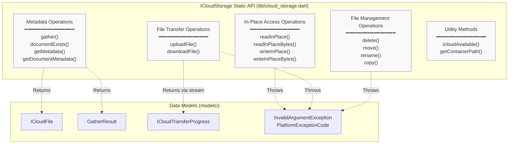
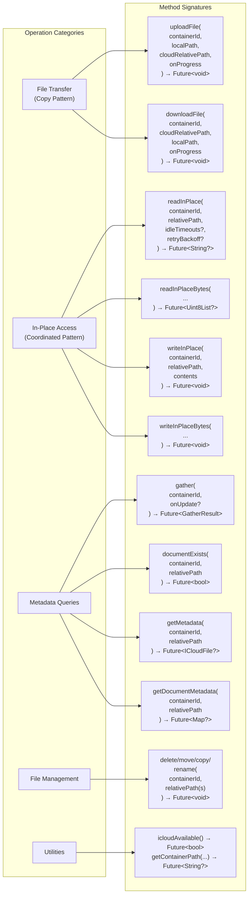
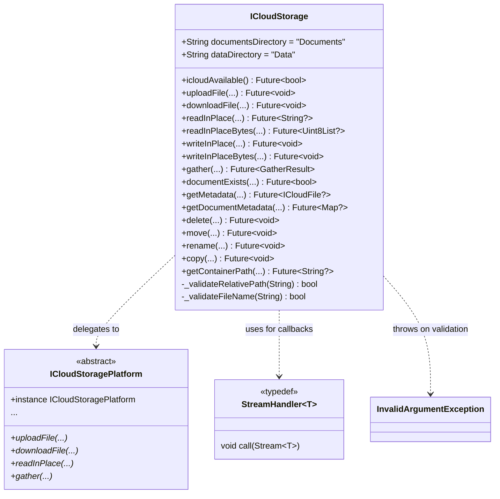
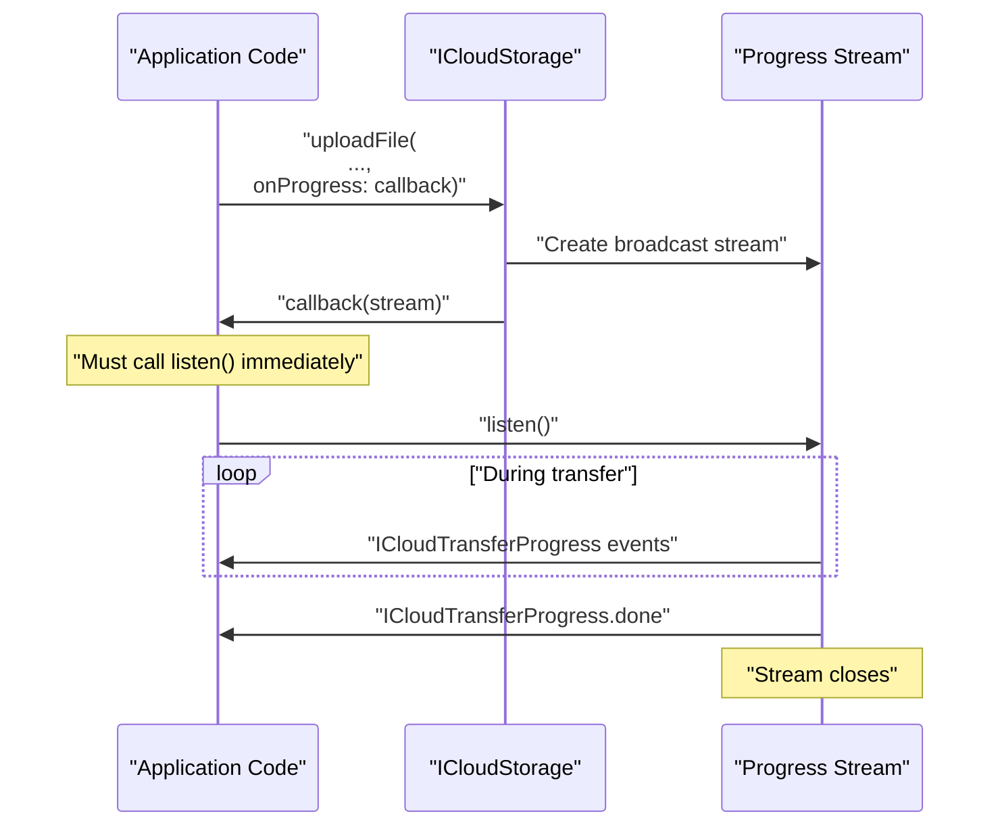

# API Reference

Relevant source files

The following files were used as context for generating this wiki page:

- [README.md](../../README.md)
- [lib/icloud_storage.dart](../../lib/icloud_storage.dart)

This page provides a comprehensive overview of the public Dart API exposed by the `icloud_storage_plus` plugin. The API consists of static methods on the `ICloudStorage` class, organized into four functional categories: file transfer, in-place access, metadata operations, and file management.

For detailed native implementation details, see [Native Implementation Deep Dive](#5). For testing patterns, see [Testing Guide](#7).

**Sources:** [lib/icloud_storage.dart:1-500](), [README.md:342-574]()

---

## API Surface Overview

The `ICloudStorage` class serves as the main entry point for all plugin operations. All methods are static and operate on iCloud containers identified by their container ID (e.g., `iCloud.com.yourapp.container`). The class never passes raw file bytes through the platform channel—all operations use file paths to avoid memory overhead and IPC limitations.

**Sources:** [lib/icloud_storage.dart:14-34](), [lib/icloud_storage.dart:1-12]()

---

## Operation Categories and Method Mapping

The following diagram maps natural language operation categories to specific method signatures, showing parameter patterns and return types:

**Sources:** [lib/icloud_storage.dart:84-160](), [lib/icloud_storage.dart:183-324](), [lib/icloud_storage.dart:326-482]()

---

## ICloudStorage Class Structure

The `ICloudStorage` class provides a static facade over the platform interface. All path validation occurs at this layer before delegation:

**Sources:** [lib/icloud_storage.dart:34-500](), [lib/icloud_storage.dart:485-499]()

---

## Operation Categories

### File Transfer Operations

Operations that copy files into or out of the iCloud container using streaming I/O. These methods never load file contents into memory, instead using file paths and coordinated document access.

**Key Methods:**
- `uploadFile()` - Copy local file into iCloud container (copy-in pattern)
- `downloadFile()` - Download and copy iCloud file to local path (copy-out pattern)

**Characteristics:**
- Use `UIDocument`/`NSDocument` for coordinated streaming
- Support optional progress callbacks via `StreamHandler<ICloudTransferProgress>`
- Reject trailing slashes (file-centric operations)
- Transfer occurs in 64KB chunks natively

For detailed documentation, see [File Transfer Operations](#3.1).

**Sources:** [lib/icloud_storage.dart:69-160](), [README.md:163-192]()

---

### In-Place Access Operations

Operations that read or write files directly within the iCloud container using coordinated access. These load full file contents into memory and are suitable for small text/JSON files.

**Key Methods:**
- `readInPlace()` - Read file as UTF-8 string with download retry logic
- `readInPlaceBytes()` - Read file as binary `Uint8List`
- `writeInPlace()` - Write string contents with conflict resolution
- `writeInPlaceBytes()` - Write binary contents

**Characteristics:**
- Use `UIDocument`/`NSDocument` for coordinated access
- Full contents in memory (not streaming)
- Configurable idle timeouts and retry backoff
- Automatically wait for downloads to complete
- Text operations use UTF-8 encoding

For detailed documentation, see [In-Place Access Operations](#3.2).

**Sources:** [lib/icloud_storage.dart:162-324](), [README.md:76-115]()

---

### Metadata Operations

Operations that query file and directory information without downloading content. These use `NSMetadataQuery` for real-time monitoring.

**Key Methods:**
- `gather()` - List all files/directories with optional real-time updates
- `documentExists()` - Check existence without downloading
- `getMetadata()` - Get typed `ICloudFile` metadata
- `getDocumentMetadata()` - Get raw metadata map

**Characteristics:**
- Use `NSMetadataQuery` for efficient monitoring
- Support optional update streams via `StreamHandler<GatherResult>`
- Return nullable fields for incomplete metadata
- Distinguish files from directories via `isDirectory` flag

For detailed documentation, see [Metadata Operations](#3.3).

**Sources:** [lib/icloud_storage.dart:46-482](), [README.md:117-161]()

---

### File Management Operations

Operations that modify file system structure using coordinated `NSFileCoordinator` access.

**Key Methods:**
- `delete()` - Remove file or directory
- `move()` - Move/rename to different path
- `rename()` - Rename in place (convenience wrapper for `move()`)
- `copy()` - Duplicate file

**Characteristics:**
- Use `NSFileCoordinator` for safe concurrent access
- Support both files and directories
- Accept trailing slashes for directory paths from metadata
- Atomic operations with automatic conflict handling

For detailed documentation, see [File Management Operations](#3.4).

**Sources:** [lib/icloud_storage.dart:326-430](), [README.md:117-161]()

---

## Common API Patterns

### Path Validation

All operations validate paths before platform invocation using `_validateRelativePath()` and `_validateFileName()`:

| Rule | Description | Affected Operations |
|------|-------------|-------------------|
| No empty segments | Path components cannot be empty | All |
| Max 255 chars per segment | File/directory names ≤ 255 chars | All |
| No colons or slashes | Cannot contain `:` or `/` in names | All |
| No dot prefixes | Cannot start with `.` | All |
| No trailing slashes | File operations reject `/` suffix | Transfer, In-Place Access |
| Trailing slashes allowed | Directory operations accept `/` suffix | Metadata, File Management |

**Sources:** [lib/icloud_storage.dart:484-499](), [lib/icloud_storage.dart:90-106]()

---

### Progress Monitoring Pattern

File transfer operations support optional progress callbacks that receive a broadcast stream:

**Pattern Requirements:**
- Streams are listener-driven, not buffered
- Must call `listen()` immediately in callback to avoid missing events
- Progress events use `ICloudTransferProgressType` enum
- Errors delivered as `error` type events, not stream errors
- Stream closes after `done` or `error` event

**Sources:** [lib/icloud_storage.dart:81-88](), [README.md:264-270]()

---

### Container ID Format

All operations require a valid iCloud container identifier:

**Format:** `iCloud.<reverse-domain>.<container-name>`

**Example:** `iCloud.com.yourapp.container`

The container must be:
1. Created in Apple Developer portal
2. Enabled in Xcode capabilities
3. Associated with your App ID

**Sources:** [README.md:297-310](), [lib/icloud_storage.dart:50-67]()

---

## Quick Reference Table

| Operation | Method | Parameters | Return Type | Progress | Streaming |
|-----------|--------|------------|-------------|----------|-----------|
| Upload file | `uploadFile()` | containerId, localPath, cloudRelativePath, onProgress? | `Future<void>` | Yes | Yes |
| Download file | `downloadFile()` | containerId, cloudRelativePath, localPath, onProgress? | `Future<void>` | Yes | Yes |
| Read text in-place | `readInPlace()` | containerId, relativePath, idleTimeouts?, retryBackoff? | `Future<String?>` | No | No |
| Read bytes in-place | `readInPlaceBytes()` | containerId, relativePath, idleTimeouts?, retryBackoff? | `Future<Uint8List?>` | No | No |
| Write text in-place | `writeInPlace()` | containerId, relativePath, contents | `Future<void>` | No | No |
| Write bytes in-place | `writeInPlaceBytes()` | containerId, relativePath, contents | `Future<void>` | No | No |
| List files | `gather()` | containerId, onUpdate? | `Future<GatherResult>` | Optional | No |
| Check exists | `documentExists()` | containerId, relativePath | `Future<bool>` | No | No |
| Get metadata | `getMetadata()` | containerId, relativePath | `Future<ICloudFile?>` | No | No |
| Get raw metadata | `getDocumentMetadata()` | containerId, relativePath | `Future<Map?>` | No | No |
| Delete | `delete()` | containerId, relativePath | `Future<void>` | No | No |
| Move | `move()` | containerId, fromRelativePath, toRelativePath | `Future<void>` | No | No |
| Rename | `rename()` | containerId, relativePath, newName | `Future<void>` | No | No |
| Copy | `copy()` | containerId, fromRelativePath, toRelativePath | `Future<void>` | No | No |
| Check availability | `icloudAvailable()` | (none) | `Future<bool>` | No | No |
| Get container path | `getContainerPath()` | containerId | `Future<String?>` | No | No |

**Sources:** [lib/icloud_storage.dart:34-500](), [README.md:342-574]()

---

## Files App Visibility

Files must use the `Documents/` prefix to appear in the Files app. This is configured via `NSUbiquitousContainers` in `Info.plist`:

**Visible:** `Documents/notes.txt`  
**Hidden:** `cache/temp.dat`

The `ICloudStorage` class provides constants for common directories:
- `ICloudStorage.documentsDirectory` = `"Documents"`
- `ICloudStorage.dataDirectory` = `"Data"`

**Sources:** [lib/icloud_storage.dart:35-39](), [README.md:311-341]()

---

## Related Documentation

- **[File Transfer Operations](#3.1)** - Detailed documentation for upload/download
- **[In-Place Access Operations](#3.2)** - Detailed documentation for coordinated read/write
- **[Metadata Operations](#3.3)** - Detailed documentation for queries and monitoring
- **[File Management Operations](#3.4)** - Detailed documentation for delete/move/copy
- **[Data Models](#3.5)** - Complete reference for `ICloudFile`, `GatherResult`, `ICloudTransferProgress`
- **[Error Handling](#3.6)** - Exception types and `PlatformExceptionCode` constants
- **[Platform Interface Pattern](#4.1)** - How the API delegates to platform implementations
- **[Advanced Topics](#6)** - Progress monitoring, retry logic, path validation