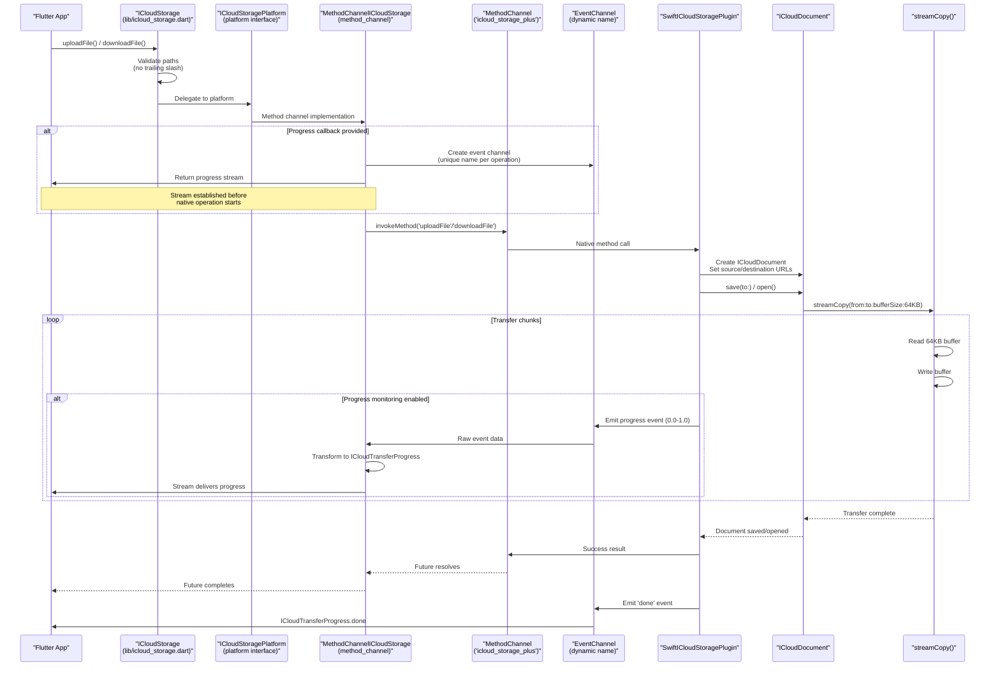
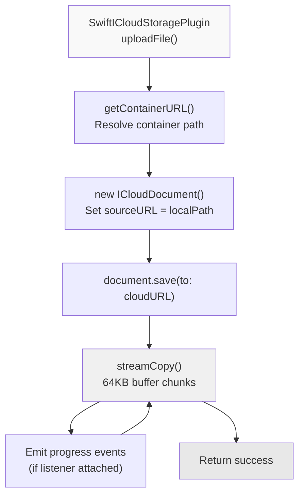
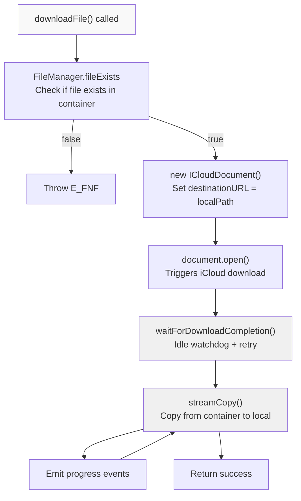
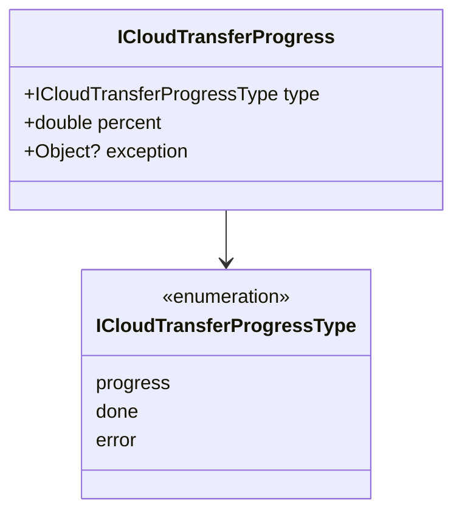
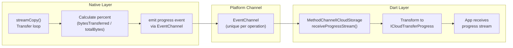

# File Transfer Operations

<details>
<summary>Relevant source files</summary>

The following files were used as context for generating this wiki page:

- [CHANGELOG.md](../../CHANGELOG.md)
- [README.md](../../README.md)
- [example/lib/download.dart](../../example/lib/download.dart)
- [example/lib/upload.dart](../../example/lib/upload.dart)
- [lib/icloud_storage.dart](../../lib/icloud_storage.dart)

</details>


## Purpose and Scope

This page documents the file transfer operations provided by the `icloud_storage_plus` plugin: `uploadFile` and `downloadFile`. These operations implement a **copy-in/copy-out pattern** for moving files between local storage and iCloud containers using streaming I/O.

File transfer operations are distinct from other access patterns:
- For coordinated direct access to files in the iCloud container, see [In-Place Access Operations](#3.2)
- For querying file metadata without transferring content, see [Metadata Operations](#3.3)
- For moving, copying, or deleting files within iCloud, see [File Management Operations](#3.4)

**Sources:** [README.md:163-192](), [lib/icloud_storage.dart:69-160]()

---

## Transfer Pattern Overview

The file transfer operations use a **copy-based pattern** rather than providing direct access to iCloud container paths. This design avoids permission errors and coordinates safely with iCloud's sync processes.

### Copy Semantics

| Operation | Direction | Semantics | Background Behavior |
|-----------|-----------|-----------|---------------------|
| `uploadFile` | Local → iCloud | Copy-in: copies local file into container | iCloud uploads in background after copy completes |
| `downloadFile` | iCloud → Local | Download-then-copy-out: downloads from iCloud, then copies to local path | Download waits for iCloud sync before copying |

### Key Characteristics

- **Streaming I/O**: Uses 64KB buffers to handle large files without memory spikes
- **File-Centric**: Operates only on files, not directories (trailing slashes rejected)
- **No Platform Channel Bytes**: File paths cross the platform channel, not file contents
- **Document Coordination**: Uses `UIDocument` (iOS) and `NSDocument` (macOS) for coordinated access
- **Optional Progress**: Supports progress callbacks via event streams

**Sources:** [README.md:163-192](), [CHANGELOG.md:14-28](), [lib/icloud_storage.dart:14-33]()

---

## Architecture: Transfer Flow



**Sources:** [lib/icloud_storage.dart:84-160](), [lib/icloud_storage_method_channel.dart](), [ios/Classes/iOSICloudStoragePlugin.swift]()

---

## uploadFile Operation

### Method Signature

```dart
static Future<void> uploadFile({
  required String containerId,
  required String localPath,
  required String cloudRelativePath,
  StreamHandler<ICloudTransferProgress>? onProgress,
})
```

Defined at [lib/icloud_storage.dart:84-114]()

### Parameters

| Parameter | Type | Description | Constraints |
|-----------|------|-------------|-------------|
| `containerId` | `String` | iCloud container identifier (e.g., `iCloud.com.app.container`) | Must match Xcode configuration |
| `localPath` | `String` | Absolute path to local file to upload | Must exist and be readable |
| `cloudRelativePath` | `String` | Relative path within iCloud container | Must not end with `/`, use `Documents/` for Files app visibility |
| `onProgress` | `StreamHandler<ICloudTransferProgress>?` | Optional callback receiving progress stream | Attach listener immediately |

### Validation Rules

The method performs validation before invoking native code:

1. **Non-empty local path** - [lib/icloud_storage.dart:90-92]()
2. **No trailing slash** - File-centric operation, directories not supported [lib/icloud_storage.dart:96-100]()
3. **Valid relative path segments** - No colons, leading dots, or invalid characters [lib/icloud_storage.dart:102-106]()

### Native Implementation Flow



**Key Native Classes:**
- `SwiftICloudStoragePlugin.uploadFile(_:)` - Entry point [ios/Classes/iOSICloudStoragePlugin.swift]()
- `ICloudDocument` - Document wrapper for coordinated I/O [ios/Classes/ICloudDocument.swift]()
- `streamCopy(from:to:bufferSize:progressHandler:)` - Streaming transfer logic [ios/Classes/ICloudDocument.swift]()

### Example Usage

```dart
// Basic upload without progress
await ICloudStorage.uploadFile(
  containerId: 'iCloud.com.yourapp.container',
  localPath: '/path/to/local/file.txt',
  cloudRelativePath: 'Documents/file.txt',
);

// Upload with progress monitoring
await ICloudStorage.uploadFile(
  containerId: 'iCloud.com.yourapp.container',
  localPath: '/path/to/local/large_file.pdf',
  cloudRelativePath: 'Documents/reports/report.pdf',
  onProgress: (stream) {
    stream.listen((progress) {
      switch (progress.type) {
        case ICloudTransferProgressType.progress:
          print('Upload: ${progress.percent * 100}%');
          break;
        case ICloudTransferProgressType.done:
          print('Upload complete');
          break;
        case ICloudTransferProgressType.error:
          print('Upload failed: ${progress.exception}');
          break;
      }
    });
  },
);
```

**Sources:** [lib/icloud_storage.dart:84-114](), [README.md:59-63](), [example/lib/upload.dart:23-64]()

---

## downloadFile Operation

### Method Signature

```dart
static Future<void> downloadFile({
  required String containerId,
  required String cloudRelativePath,
  required String localPath,
  StreamHandler<ICloudTransferProgress>? onProgress,
})
```

Defined at [lib/icloud_storage.dart:130-160]()

### Parameters

| Parameter | Type | Description | Constraints |
|-----------|------|-------------|-------------|
| `containerId` | `String` | iCloud container identifier | Must match Xcode configuration |
| `cloudRelativePath` | `String` | Relative path within iCloud container | Must not end with `/` |
| `localPath` | `String` | Absolute destination path for downloaded file | Directory must exist |
| `onProgress` | `StreamHandler<ICloudTransferProgress>?` | Optional callback receiving progress stream | Attach listener immediately |

### Validation Rules

1. **Non-empty local path** - [lib/icloud_storage.dart:136-138]()
2. **No trailing slash** - File-centric operation [lib/icloud_storage.dart:142-146]()
3. **Valid relative path segments** - Same rules as uploadFile [lib/icloud_storage.dart:148-152]()

### Download Process



**Key Differences from Upload:**
- **Existence Check**: Uses `FileManager.fileExists` to verify file presence [README.md:391-395]()
- **Download Wait**: Waits for iCloud to download file if not locally available (see [Download Retry Logic](#6.2))
- **Open Document**: Uses `open()` instead of `save(to:)` for document coordination

### Example Usage

```dart
// Basic download without progress
await ICloudStorage.downloadFile(
  containerId: 'iCloud.com.yourapp.container',
  cloudRelativePath: 'Documents/file.txt',
  localPath: '/path/to/local/destination.txt',
);

// Download with progress monitoring
await ICloudStorage.downloadFile(
  containerId: 'iCloud.com.yourapp.container',
  cloudRelativePath: 'Documents/data.json',
  localPath: '${Directory.systemTemp.path}/data.json',
  onProgress: (stream) {
    stream.listen((progress) {
      if (progress.type == ICloudTransferProgressType.progress) {
        print('Download: ${(progress.percent * 100).toStringAsFixed(1)}%');
      }
    });
  },
);
```

**Sources:** [lib/icloud_storage.dart:130-160](), [README.md:66-73](), [example/lib/download.dart:23-64]()

---

## Progress Monitoring

### ICloudTransferProgress Model

Progress updates are delivered as `ICloudTransferProgress` objects via event streams.



Defined at [lib/models/transfer_progress.dart]()

### Progress Event Types

| Type | Description | Fields | Terminal |
|------|-------------|--------|----------|
| `progress` | Transfer in progress | `percent` (0.0 to 1.0) | No |
| `done` | Transfer completed successfully | `percent` = 1.0 | Yes |
| `error` | Transfer failed | `exception` contains error | Yes |

**Terminal Events**: `done` and `error` events close the stream after emission [README.md:386-389]()

### Stream Behavior

#### Listener-Driven Streams

Progress streams are **broadcast streams** that start emitting when a listener attaches. To avoid missing early progress events, attach a listener **immediately** in the `onProgress` callback.

```dart
// ✅ CORRECT: Attach listener immediately
await ICloudStorage.uploadFile(
  containerId: containerId,
  localPath: localPath,
  cloudRelativePath: cloudPath,
  onProgress: (stream) {
    stream.listen((progress) {
      // Handle progress
    });
  },
);

// ❌ WRONG: Delayed listener may miss early events
Stream<ICloudTransferProgress>? progressStream;
await ICloudStorage.uploadFile(
  containerId: containerId,
  localPath: localPath,
  cloudRelativePath: cloudPath,
  onProgress: (stream) {
    progressStream = stream;
  },
);
// ... later ...
progressStream?.listen(...); // May miss events!
```

**Sources:** [README.md:267-270](), [README.md:383-385](), [CHANGELOG.md:147-148]()

#### Error-as-Data Pattern

Progress failures are delivered as **progress events** with type `error`, not through the stream's `onError` callback. This allows errors to be handled uniformly with other progress types.

```dart
onProgress: (stream) {
  stream.listen(
    (progress) {
      switch (progress.type) {
        case ICloudTransferProgressType.progress:
          // Update UI
          break;
        case ICloudTransferProgressType.done:
          // Transfer complete
          break;
        case ICloudTransferProgressType.error:
          // Handle error: progress.exception contains details
          showError(progress.exception);
          break;
      }
    },
    onError: (error) {
      // Stream errors (unexpected, should not occur)
      // Logged as E_PLUGIN_INTERNAL
    },
  );
}
```

**Sources:** [README.md:386-389](), [CHANGELOG.md:149-151]()

### Native Progress Implementation



**Progress Calculation**: Native code tracks bytes transferred and computes `percent = bytesTransferred / totalBytes` [ios/Classes/ICloudDocument.swift]()

**Event Channel Naming**: Each transfer operation creates a uniquely-named event channel to avoid conflicts when multiple transfers run concurrently.

**Sources:** [lib/icloud_storage_method_channel.dart](), [ios/Classes/iOSICloudStoragePlugin.swift]()

---

## Error Handling

### Common Error Codes

File transfer operations can throw `PlatformException` with the following codes:

| Code | Constant | Description | Cause |
|------|----------|-------------|-------|
| `E_ARG` | `PlatformExceptionCode.argumentError` | Invalid arguments | Empty path, trailing slash, invalid characters |
| `E_CTR` | `PlatformExceptionCode.iCloudConnectionOrPermission` | Container unavailable | Wrong container ID, iCloud disabled, not signed in |
| `E_FNF` | `PlatformExceptionCode.fileNotFound` | File not found | File doesn't exist in iCloud (download) or locally (upload) |
| `E_READ` | `PlatformExceptionCode.readError` | Read failure | File unreadable, permission denied |
| `E_NAT` | `PlatformExceptionCode.nativeCodeError` | Native error | Underlying iOS/macOS error |
| `E_TIMEOUT` | `PlatformExceptionCode.timeout` | Download timeout | Download stalled (see [Download Retry Logic](#6.2)) |
| `E_CANCEL` | `PlatformExceptionCode.canceled` | Operation canceled | User or system canceled |

For complete error code reference, see [Error Handling](#3.6).

### Error Handling Pattern

```dart
try {
  await ICloudStorage.uploadFile(
    containerId: containerId,
    localPath: localPath,
    cloudRelativePath: cloudPath,
  );
} on InvalidArgumentException catch (e) {
  // Dart-side validation failed (fast failure)
  print('Invalid argument: $e');
} on PlatformException catch (e) {
  // Native-side error
  switch (e.code) {
    case PlatformExceptionCode.iCloudConnectionOrPermission:
      // Handle iCloud availability issues
      break;
    case PlatformExceptionCode.fileNotFound:
      // Handle missing file
      break;
    default:
      // Handle other errors
      print('Transfer failed: ${e.message}');
  }
}
```

**Sources:** [README.md:519-573](), [lib/models/exceptions.dart]()

---

## Implementation Details

### Document Classes

Transfer operations use specialized document classes that wrap `UIDocument` (iOS) and `NSDocument` (macOS):

| Class | Purpose | Used By |
|-------|---------|---------|
| `ICloudDocument` | Streaming I/O for file transfers | `uploadFile`, `downloadFile` |
| `ICloudInPlaceDocument` | In-place text access | `readInPlace`, `writeInPlace` |
| `ICloudInPlaceBinaryDocument` | In-place binary access | `readInPlaceBytes`, `writeInPlaceBytes` |

**Transfer-Specific Class**: `ICloudDocument` is optimized for streaming large files and supports progress callbacks [ios/Classes/ICloudDocument.swift]()

### Streaming Buffer Size

Transfers use **64KB buffers** to balance memory usage and performance. This buffer size:
- Prevents memory spikes for large files
- Provides reasonable progress granularity
- Aligns with system I/O buffer recommendations

Defined in native streaming function [ios/Classes/ICloudDocument.swift]()

### File Coordination

All transfers use `NSFileCoordinator` to coordinate with iCloud sync processes. This prevents:
- "Operation not permitted" errors (NSCocoaErrorDomain Code=257)
- Data corruption from concurrent access
- Race conditions during sync

**Sources:** [README.md:594-604](), [ios/Classes/ICloudDocument.swift]()

---

## Best Practices

### 1. Validate Before Transfer

Always verify file existence and permissions before starting a transfer to provide faster feedback:

```dart
// Upload: Check local file exists
final localFile = File(localPath);
if (!await localFile.exists()) {
  throw Exception('Local file not found');
}

await ICloudStorage.uploadFile(...);

// Download: Check cloud file exists
final exists = await ICloudStorage.documentExists(
  containerId: containerId,
  relativePath: cloudPath,
);
if (!exists) {
  throw Exception('Cloud file not found');
}

await ICloudStorage.downloadFile(...);
```

### 2. Use Files App Visibility Appropriately

Place user-facing documents in `Documents/` directory for Files app visibility:

```dart
// ✅ Visible in Files app
cloudRelativePath: 'Documents/user_report.pdf'

// ❌ Hidden from Files app (but still syncs)
cloudRelativePath: 'cache/temp_data.json'
```

**Sources:** [README.md:327-337](), [README.md:644-650]()

### 3. Handle Progress Robustly

Always handle all three progress types and clean up listeners:

```dart
StreamSubscription<ICloudTransferProgress>? subscription;

try {
  await ICloudStorage.uploadFile(
    containerId: containerId,
    localPath: localPath,
    cloudRelativePath: cloudPath,
    onProgress: (stream) {
      subscription = stream.listen(
        (progress) {
          switch (progress.type) {
            case ICloudTransferProgressType.progress:
              updateProgressBar(progress.percent);
              break;
            case ICloudTransferProgressType.done:
              showSuccess();
              subscription?.cancel();
              break;
            case ICloudTransferProgressType.error:
              showError(progress.exception);
              subscription?.cancel();
              break;
          }
        },
      );
    },
  );
} finally {
  subscription?.cancel();
}
```

### 4. Choose Transfer vs In-Place Appropriately

| Use Case | Operation | Rationale |
|----------|-----------|-----------|
| Large files (images, videos, documents) | `uploadFile`/`downloadFile` | Streaming I/O prevents memory issues |
| Small text/JSON files (<1MB) | `readInPlace`/`writeInPlace` | Direct access, simpler API |
| User-initiated file operations | `uploadFile`/`downloadFile` | Progress feedback |
| Background sync | `readInPlace`/`writeInPlace` | Automatic download handling |

### 5. Test on Physical Devices

iCloud functionality is unreliable in iOS Simulator. Always test file transfers on physical devices signed into iCloud.

**Sources:** [README.md:613-617](), [README.md:638-642]()

---

## Path Validation Reference

### Allowed Path Formats

```dart
// ✅ Valid paths
'Documents/file.txt'
'Documents/folder/subfolder/file.json'
'cache/data.bin'
'my-file_v2.txt'

// ❌ Invalid for uploadFile/downloadFile
'Documents/folder/'          // Trailing slash (directory)
'Documents//file.txt'        // Empty segment
'Documents/file:name.txt'    // Colon in name
'Documents/.hidden'          // Leading dot
''                           // Empty path
```

### Validation Implementation

Path validation occurs at [lib/icloud_storage.dart:485-499]():

1. Split path by `/`
2. Remove trailing empty segment (if trailing slash)
3. Validate each segment:
   - Non-empty
   - Length ≤ 255 characters
   - No colons or leading dots

**Sources:** [lib/icloud_storage.dart:84-160](), [lib/icloud_storage.dart:485-499]()