# In-Place Access Operations

<details>
<summary>Relevant source files</summary>

The following files were used as context for generating this wiki page:

- [CHANGELOG.md](../../CHANGELOG.md)
- [README.md](../../README.md)
- [lib/icloud_storage.dart](../../lib/icloud_storage.dart)

</details>


## Purpose and Scope

This page documents the in-place access operations in the `icloud_storage_plus` plugin. These operations provide coordinated read and write access to files directly within the iCloud ubiquity container, without copying data in or out of the container. This is in contrast to file transfer operations, which copy files between local storage and iCloud.

For file transfer operations using the copy-in/copy-out pattern, see [File Transfer Operations](#3.1). For file management operations like delete, move, and copy, see [File Management Operations](#3.4).

**Sources:** [README.md:76-115](), [lib/icloud_storage.dart:14-33]()

---

## Overview

In-place access operations allow direct reading and writing of files stored in the iCloud container without creating temporary local copies. These operations are designed for small text and binary files (such as JSON configuration files, small documents, or images) that can be loaded entirely into memory.

### Key Characteristics

| Characteristic | Description |
|----------------|-------------|
| **Access Pattern** | Coordinated direct access within the ubiquity container |
| **Memory Model** | Full file contents loaded into memory |
| **Coordination** | Uses `UIDocument` (iOS) / `NSDocument` (macOS) for safe concurrent access |
| **Download Handling** | Automatic with idle watchdog timeout and retry backoff |
| **Suitable For** | Small files (text/JSON configs, small images, PDFs) |
| **Not Suitable For** | Large files that exceed available memory |

**Sources:** [README.md:76-85](), [lib/icloud_storage.dart:162-324]()

---

## Comparison: In-Place vs Transfer Operations


**Sources:** [README.md:163-192](), [lib/icloud_storage.dart:69-160]()

---

## Available Operations

### Text Operations

#### readInPlace

```dart
Future<String?> readInPlace({
  required String containerId,
  required String relativePath,
  List<Duration>? idleTimeouts,
  List<Duration>? retryBackoff,
})
```

Reads a text file from the iCloud container using UTF-8 encoding. The operation coordinates access with iCloud's sync processes and waits for downloads to complete if the file is not yet local.

**Parameters:**
- `containerId`: iCloud container identifier (e.g., `'iCloud.com.yourapp.container'`)
- `relativePath`: Path within container (must not end with `/`)
- `idleTimeouts`: Optional watchdog timeouts (defaults: 60s, 90s, 180s)
- `retryBackoff`: Optional retry delays (defaults: exponential backoff)

**Returns:** File contents as a `String`, or `null` if the platform implementation chooses to return null (typically only on errors).

**Throws:** 
- `InvalidArgumentException` if path validation fails
- `PlatformException` with code `E_FNF_READ` if file not found
- `PlatformException` with code `E_TIMEOUT` if download stalls

**Implementation:** [lib/icloud_storage.dart:183-208]()

---

#### writeInPlace

```dart
Future<void> writeInPlace({
  required String containerId,
  required String relativePath,
  required String contents,
})
```

Writes a text file to the iCloud container. The operation creates parent directories if needed and coordinates the write with iCloud sync processes.

**Parameters:**
- `containerId`: iCloud container identifier
- `relativePath`: Path within container (must not end with `/`)
- `contents`: Full file contents as a `String` (UTF-8 encoded)

**Implementation:** [lib/icloud_storage.dart:266-289]()

---

### Binary Operations

#### readInPlaceBytes

```dart
Future<Uint8List?> readInPlaceBytes({
  required String containerId,
  required String relativePath,
  List<Duration>? idleTimeouts,
  List<Duration>? retryBackoff,
})
```

Reads a binary file from the iCloud container. Use this for non-text files such as images, PDFs, or other binary formats.

**Parameters:**
- Same as `readInPlace`, but returns `Uint8List` instead of `String`

**Returns:** File contents as `Uint8List`, or `null` if the platform implementation chooses to return null.

**Implementation:** [lib/icloud_storage.dart:229-253]()

---

#### writeInPlaceBytes

```dart
Future<void> writeInPlaceBytes({
  required String containerId,
  required String relativePath,
  required Uint8List contents,
})
```

Writes a binary file to the iCloud container.

**Parameters:**
- `containerId`: iCloud container identifier
- `relativePath`: Path within container (must not end with `/`)
- `contents`: Full file contents as `Uint8List`

**Implementation:** [lib/icloud_storage.dart:302-324]()

---

## Operation Flow: Read In-Place

The following diagram shows the complete flow for an in-place read operation, including download retry logic and coordination.


**Sources:** [lib/icloud_storage.dart:183-253](), [README.md:76-100]()

---

## Operation Flow: Write In-Place


**Sources:** [lib/icloud_storage.dart:266-324](), [README.md:94-100]()

---

## Native Implementation Components

The in-place operations are implemented using specialized document classes in the native iOS/macOS layer.

### Document Class Hierarchy


**Key Classes:**

| Class | File | Purpose |
|-------|------|---------|
| `ICloudInPlaceDocument` | Native layer | Text file coordination with UTF-8 encoding |
| `ICloudInPlaceBinaryDocument` | Native layer | Binary file coordination |
| `SwiftICloudStoragePlugin` | Native layer | Plugin entry point, orchestrates operations |
| `NSFileCoordinator` | Apple Framework | Provides coordinated file access |

**Sources:** [README.md:584-604](), Native implementation files referenced in diagrams

---

## Download Retry Logic

In-place read operations include sophisticated retry logic to handle iCloud download delays and network issues.

### Idle Watchdog Pattern

The plugin uses an "idle watchdog" pattern that only times out when downloads **stall**, not based on absolute time. The watchdog monitors the download status and triggers retries when no progress is detected.


### Default Configuration

**Idle Timeouts** (how long to wait without progress before retrying):
- Attempt 1: 60 seconds
- Attempt 2: 90 seconds  
- Attempt 3: 180 seconds

**Retry Backoff** (delay before next attempt):
- After timeout 1: 2 seconds
- After timeout 2: 4 seconds
- Uses exponential backoff strategy

**Sources:** [README.md:76-85](), [lib/icloud_storage.dart:172-176]()

---

## Configuration Options

### Customizing Timeouts and Backoff

Both `readInPlace` and `readInPlaceBytes` accept optional timeout and backoff configuration:

```dart
final contents = await ICloudStorage.readInPlace(
  containerId: 'iCloud.com.yourapp.container',
  relativePath: 'Documents/config.json',
  idleTimeouts: [
    Duration(seconds: 30),  // First attempt: 30s
    Duration(seconds: 60),  // Second attempt: 60s
    Duration(seconds: 120), // Third attempt: 120s
  ],
  retryBackoff: [
    Duration(seconds: 1),   // Wait 1s before retry 1
    Duration(seconds: 2),   // Wait 2s before retry 2
  ],
);
```

**Notes:**
- If `idleTimeouts` has N elements, there will be N retry attempts
- `retryBackoff` should have N-1 elements (no backoff after final timeout)
- If `null`, defaults are used (60s/90s/180s timeouts, 2s/4s backoff)

**Sources:** [lib/icloud_storage.dart:172-176](), [lib/icloud_storage.dart:221-224]()

---

## Path Validation

In-place operations enforce strict path validation rules to ensure file-centric access.

### Validation Rules

| Rule | Rationale |
|------|-----------|
| **No trailing slashes** | In-place operations are file-centric; directories are not supported |
| **No empty segments** | Path must contain valid file/directory names |
| **No leading dots** | Prevents access to hidden files and parent directory references |
| **No colons or path separators** | Avoids path traversal and invalid characters |
| **Maximum 255 chars per segment** | Filesystem limitation |

### Validation Code Flow

```mermaid
graph TD
    Input["Path Input<br/>(e.g., 'Documents/file.txt')"] --> CheckTrailing{"Ends with '/'?"}
    CheckTrailing -->|"Yes"| RejectTrailing["Throw InvalidArgumentException<br/>'invalid relativePath'"]
    CheckTrailing -->|"No"| CheckEmpty{"Empty or whitespace?"}
    
    CheckEmpty -->|"Yes"| RejectEmpty["Throw InvalidArgumentException"]
    CheckEmpty -->|"No"| ValidateSegments["_validateRelativePath()"]
    
    ValidateSegments --> SplitPath["Split by '/'"]
    SplitPath --> CheckEachSegment["For each segment:<br/>_validateFileName()"]
    
    CheckEachSegment --> CheckSegmentRules{"Passes rules?<br/>• Not empty<br/>• Length ≤ 255<br/>• No : or /<br/>• No leading dot"}
    
    CheckSegmentRules -->|"All pass"| Accept["Accept path"]
    CheckSegmentRules -->|"Any fail"| Reject["Throw InvalidArgumentException"]
    
    Accept --> Proceed["Proceed to platform layer"]
```



**Implementation:**
- Dart validation: [lib/icloud_storage.dart:189-200](), [lib/icloud_storage.dart:234-245]()
- Validation helpers: [lib/icloud_storage.dart:485-499]()

**Sources:** [lib/icloud_storage.dart:183-324]()

---

## Error Handling

### Exception Types

In-place operations can throw the following exceptions:

| Exception Code | Thrown By | Description |
|----------------|-----------|-------------|
| `E_ARG` (InvalidArgumentException) | Dart Layer | Path validation failed (empty, trailing slash, invalid chars) |
| `E_CTR` | Native Layer | iCloud container unavailable or permission denied |
| `E_FNF_READ` | Native Layer | File not found during read operation |
| `E_FNF_WRITE` | Native Layer | File not found during write operation (parent missing) |
| `E_TIMEOUT` | Native Layer | Download stalled (idle watchdog triggered, all retries exhausted) |
| `E_READ` | Native Layer | Failed to read file content (encoding error, corruption) |
| `E_NAT` | Native Layer | Other native errors (filesystem, coordination failures) |

### Error Handling Example

```dart
import 'package:flutter/services.dart';
import 'package:icloud_storage_plus/icloud_storage.dart';

try {
  final contents = await ICloudStorage.readInPlace(
    containerId: 'iCloud.com.yourapp.container',
    relativePath: 'Documents/notes.txt',
  );
  
  // Process contents
  print('File contents: $contents');
  
} on InvalidArgumentException catch (e) {
  // Path validation failed (caught early in Dart)
  print('Invalid path: ${e.message}');
  
} on PlatformException catch (e) {
  switch (e.code) {
    case PlatformExceptionCode.iCloudConnectionOrPermission:
      // iCloud not available or container ID wrong
      print('iCloud access error: ${e.message}');
      break;
      
    case PlatformExceptionCode.fileNotFoundRead:
      // File doesn't exist
      print('File not found: ${e.message}');
      break;
      
    case PlatformExceptionCode.timeout:
      // Download stalled, all retries exhausted
      print('Download timeout: ${e.message}');
      // Consider: retry later or use cached data
      break;
      
    case PlatformExceptionCode.readError:
      // Could not read/decode file
      print('Read error: ${e.message}');
      break;
      
    default:
      print('Unexpected error: ${e.code} - ${e.message}');
  }
}
```

**Sources:** [lib/icloud_storage.dart:183-208](), [README.md:518-573](), [lib/models/exceptions.dart]()

---

## Usage Patterns

### Pattern 1: Read Small JSON Config

```dart
import 'dart:convert';
import 'package:icloud_storage_plus/icloud_storage.dart';

Future<Map<String, dynamic>?> readConfig() async {
  try {
    final jsonString = await ICloudStorage.readInPlace(
      containerId: 'iCloud.com.yourapp.container',
      relativePath: 'Documents/config.json',
    );
    
    if (jsonString == null) return null;
    return jsonDecode(jsonString) as Map<String, dynamic>;
    
  } on PlatformException catch (e) {
    if (e.code == PlatformExceptionCode.fileNotFoundRead) {
      // Config doesn't exist yet, return defaults
      return null;
    }
    rethrow;
  }
}

Future<void> writeConfig(Map<String, dynamic> config) async {
  final jsonString = jsonEncode(config);
  await ICloudStorage.writeInPlace(
    containerId: 'iCloud.com.yourapp.container',
    relativePath: 'Documents/config.json',
    contents: jsonString,
  );
}
```

### Pattern 2: Read Binary Image File

```dart
import 'dart:typed_data';
import 'package:icloud_storage_plus/icloud_storage.dart';

Future<Uint8List?> readProfileImage() async {
  try {
    return await ICloudStorage.readInPlaceBytes(
      containerId: 'iCloud.com.yourapp.container',
      relativePath: 'Documents/profile.png',
    );
  } on PlatformException catch (e) {
    if (e.code == PlatformExceptionCode.fileNotFoundRead) {
      return null; // No image set
    }
    rethrow;
  }
}

Future<void> saveProfileImage(Uint8List imageBytes) async {
  await ICloudStorage.writeInPlaceBytes(
    containerId: 'iCloud.com.yourapp.container',
    relativePath: 'Documents/profile.png',
    contents: imageBytes,
  );
}
```

### Pattern 3: Custom Timeout for Slow Connections

```dart
Future<String?> readWithPatience() async {
  return await ICloudStorage.readInPlace(
    containerId: 'iCloud.com.yourapp.container',
    relativePath: 'Documents/large-doc.txt',
    idleTimeouts: [
      Duration(minutes: 2),   // Wait up to 2 min on first attempt
      Duration(minutes: 3),   // 3 min on second
      Duration(minutes: 5),   // 5 min on third
    ],
    retryBackoff: [
      Duration(seconds: 5),   // 5s pause before retry 1
      Duration(seconds: 10),  // 10s pause before retry 2
    ],
  );
}
```

**Sources:** [README.md:87-115]()

---

## Best Practices

### When to Use In-Place Operations

**✅ Use in-place access for:**
- Small text files (JSON configs, notes, documents) < 1 MB
- Small binary files (icons, thumbnails, small PDFs) < 5 MB
- Frequent read/write operations where copying is overhead
- Files that need transparent iCloud sync without manual transfers

**❌ Avoid in-place access for:**
- Large files that exceed available memory
- Files > 10 MB (use `uploadFile`/`downloadFile` with streaming)
- Operations where you need progress reporting
- Temporary files that shouldn't sync

### Memory Considerations

```dart
// ❌ BAD: Don't use in-place for large files
final largeVideo = await ICloudStorage.readInPlaceBytes(
  containerId: 'iCloud.com.yourapp.container',
  relativePath: 'Documents/video.mp4', // Could be 100+ MB!
);
// This loads entire file into memory - can crash app!

// ✅ GOOD: Use streaming download for large files
await ICloudStorage.downloadFile(
  containerId: 'iCloud.com.yourapp.container',
  cloudRelativePath: 'Documents/video.mp4',
  localPath: localTempPath,
  onProgress: (stream) {
    stream.listen((progress) {
      print('Progress: ${progress.percent}');
    });
  },
);
// Streams in 64KB chunks, no memory spike
```

### Encoding Considerations

```dart
// ✅ GOOD: Use text operations for UTF-8 text
await ICloudStorage.writeInPlace(
  containerId: 'iCloud.com.yourapp.container',
  relativePath: 'Documents/notes.txt',
  contents: 'Hello, world! 👋',
);

// ❌ BAD: Don't use text operations for binary data
// This will fail or corrupt data:
await ICloudStorage.writeInPlace(
  containerId: 'iCloud.com.yourapp.container',
  relativePath: 'Documents/image.png',
  contents: imageDataAsString, // Wrong!
);

// ✅ GOOD: Use bytes operations for binary
await ICloudStorage.writeInPlaceBytes(
  containerId: 'iCloud.com.yourapp.container',
  relativePath: 'Documents/image.png',
  contents: imageBytes,
);
```

### Error Recovery Strategy

```dart
Future<String?> readWithFallback() async {
  try {
    // Try in-place read first
    return await ICloudStorage.readInPlace(
      containerId: 'iCloud.com.yourapp.container',
      relativePath: 'Documents/data.json',
    );
  } on PlatformException catch (e) {
    if (e.code == PlatformExceptionCode.timeout) {
      // Download stalled, try again with longer timeout
      return await ICloudStorage.readInPlace(
        containerId: 'iCloud.com.yourapp.container',
        relativePath: 'Documents/data.json',
        idleTimeouts: [Duration(minutes: 5)],
      );
    } else if (e.code == PlatformExceptionCode.fileNotFoundRead) {
      // File doesn't exist, return null
      return null;
    }
    // Other errors: propagate
    rethrow;
  }
}
```

**Sources:** [README.md:76-115](), [lib/icloud_storage.dart:162-324]()

---

## Differences from Transfer Operations

| Aspect | In-Place Operations | Transfer Operations |
|--------|---------------------|---------------------|
| **Data Flow** | Direct access within container | Copy between local and container |
| **Memory Usage** | Full file loaded into memory | Streaming with 64KB buffers |
| **Progress Reporting** | Not available | `onProgress` stream with percent updates |
| **Suitable File Size** | Small (< 5-10 MB) | Any size (optimized for large files) |
| **Download Handling** | Automatic with retry | Implicit (triggered when needed) |
| **Typical Use Cases** | Config files, small documents | Media files, large documents, backups |
| **Native Implementation** | `ICloudInPlaceDocument` subclasses | `ICloudDocument` base class |
| **Coordination** | `UIDocument`/`NSDocument` open/save | `UIDocument`/`NSDocument` streaming |

**Sources:** [README.md:163-192](), Diagram 3 from high-level architecture

---

## Related Topics

- For copy-in/copy-out operations with progress reporting, see [File Transfer Operations](#3.1)
- For file existence checks and metadata retrieval, see [Metadata Operations](#3.3)
- For deleting, moving, or copying files, see [File Management Operations](#3.4)
- For exception types and error codes, see [Error Handling](#3.6)
- For native document class implementation details, see [Document Classes](#5.2)
- For NSFileCoordinator usage and thread safety, see [File Coordination](#5.4)
- For download timeout and retry implementation, see [Download Retry Logic](#6.2)

**Sources:** Table of contents structure