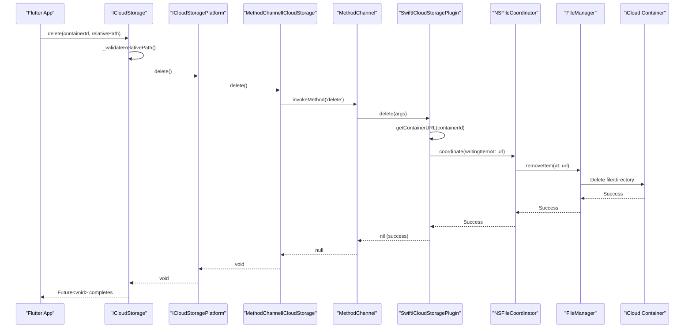
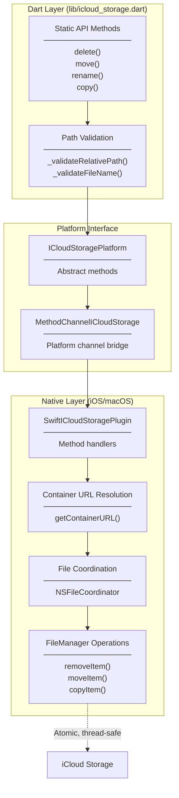
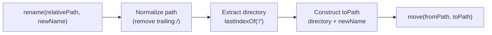
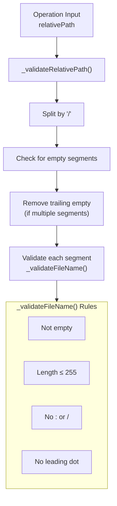
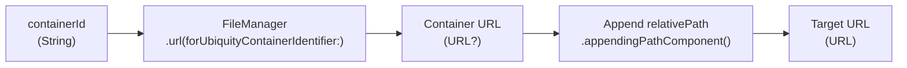

# File Management Operations

<details>
<summary>Relevant source files</summary>

The following files were used as context for generating this wiki page:

- [CHANGELOG.md](../../CHANGELOG.md)
- [README.md](../../README.md)
- [lib/icloud_storage.dart](../../lib/icloud_storage.dart)

</details>


This page documents the file management operations provided by `ICloudStorage`: `delete()`, `move()`, `rename()`, and `copy()`. These operations perform atomic modifications to files and directories within the iCloud container using coordinated access through `NSFileCoordinator` and `FileManager`.

For file transfer operations (copy-in/copy-out between local and iCloud storage), see [File Transfer Operations](#3.1). For direct content access within the container, see [In-Place Access Operations](#3.2). For querying file information, see [Metadata Operations](#3.3).

**Sources:** [README.md:117-161](), [lib/icloud_storage.dart:326-430]()

---

## Overview

The plugin provides four file management operations:

| Operation | Purpose | Parameters | Directory Support |
|-----------|---------|------------|-------------------|
| `delete` | Remove a file or directory | `containerId`, `relativePath` | Yes |
| `move` | Move/rename to a different path | `containerId`, `fromRelativePath`, `toRelativePath` | Yes |
| `rename` | Rename in the same directory | `containerId`, `relativePath`, `newName` | Yes |
| `copy` | Duplicate a file | `containerId`, `fromRelativePath`, `toRelativePath` | Yes (source only) |

All operations:
- Execute synchronously (return `Future<void>` when complete)
- Use coordinated access via `NSFileCoordinator`
- Accept trailing slashes in paths for directories
- Throw `PlatformException` on errors
- Operate on both files and directories (except `copy` which is file-only)

**Sources:** [lib/icloud_storage.dart:326-430](), [README.md:424-483]()

---

## Architecture and Data Flow



This diagram shows the complete flow for a `delete` operation. The other operations (`move`, `copy`) follow the same pattern but with different `FileManager` methods.

**Sources:** [lib/icloud_storage.dart:326-342](), [CHANGELOG.md:123-128]()

---

## Implementation Pattern



File management operations use a consistent three-layer pattern:

1. **Dart Validation Layer**: Validates paths before native interaction
2. **Platform Channel Layer**: Marshals method calls across the platform boundary
3. **Native Coordination Layer**: Uses `NSFileCoordinator` + `FileManager` for safe operations

**Sources:** [lib/icloud_storage.dart:326-430](), [CHANGELOG.md:123-128]()

---

## Delete Operation

### API Signature

```dart
static Future<void> delete({
  required String containerId,
  required String relativePath,
}) async
```

Defined in [lib/icloud_storage.dart:326-342]().

### Behavior

Removes a file or directory from the iCloud container. The operation:
- Works on both files and directories
- Accepts trailing slashes for directory paths
- Recursively deletes directory contents
- Uses coordinated access to prevent conflicts with iCloud sync

### Path Validation

The `delete` operation accepts trailing slashes because directory paths from `gather()` metadata may include them:

```dart
// Both forms are valid for delete:
await ICloudStorage.delete(
  containerId: 'iCloud.com.yourapp.container',
  relativePath: 'Documents/folder',      // File or directory
);

await ICloudStorage.delete(
  containerId: 'iCloud.com.yourapp.container', 
  relativePath: 'Documents/folder/',     // Directory with trailing slash
);
```

Validation rules:
- Path must not be empty after trimming
- Each path segment validated by `_validateFileName()` (no colons, no leading dots, max 255 chars)
- Trailing slashes are allowed and normalized

**Sources:** [lib/icloud_storage.dart:326-342](), [CHANGELOG.md:143-146]()

### Error Handling

Common errors:

| Error Code | Condition | Description |
|------------|-----------|-------------|
| `E_ARG` | Invalid path | Path validation failed (empty, invalid characters) |
| `E_CTR` | Container access | Invalid `containerId` or iCloud unavailable |
| `E_FNF` | Not found | File or directory does not exist |
| `E_NAT` | Native error | Underlying `FileManager` or coordination error |

**Sources:** [README.md:519-531](), [lib/icloud_storage.dart:334-336]()

---

## Move Operation

### API Signature

```dart
static Future<void> move({
  required String containerId,
  required String fromRelativePath,
  required String toRelativePath,
}) async
```

Defined in [lib/icloud_storage.dart:344-370]().

### Behavior

Moves or renames a file or directory within the iCloud container:
- Atomic operation (coordinated)
- Works on both files and directories
- Can move between different parent directories
- Accepts trailing slashes on both paths
- Creates parent directories for `toRelativePath` if they don't exist

### Path Considerations

Both `fromRelativePath` and `toRelativePath` are validated independently:

```dart
// Move file to different directory
await ICloudStorage.move(
  containerId: 'iCloud.com.yourapp.container',
  fromRelativePath: 'Documents/draft.txt',
  toRelativePath: 'Documents/Archive/draft.txt',
);

// Move directory
await ICloudStorage.move(
  containerId: 'iCloud.com.yourapp.container',
  fromRelativePath: 'Documents/Temp/',
  toRelativePath: 'Documents/Archive/Temp/',
);
```

If the destination path exists, the operation will fail with an error.

**Sources:** [lib/icloud_storage.dart:344-370](), [README.md:143-148]()

### Validation

Both paths validated by `_validateRelativePath()`:
- [lib/icloud_storage.dart:353-363]()
- Each throws `InvalidArgumentException` with clear indication of which path failed ("(from)" or "(to)")

---

## Rename Operation

### API Signature

```dart
static Future<void> rename({
  required String containerId,
  required String relativePath,
  required String newName,
}) async
```

Defined in [lib/icloud_storage.dart:372-402]().

### Behavior

The `rename` operation is a convenience wrapper around `move()` that renames a file or directory in its current location:
- Extracts the parent directory from `relativePath`
- Validates `newName` as a single filename (no slashes)
- Constructs the new full path and delegates to `move()`
- Handles trailing slashes by normalizing before extracting directory

### Implementation Details



The implementation at [lib/icloud_storage.dart:389-401]() shows:

1. **Normalization**: Remove trailing slash if present
2. **Directory extraction**: Find last `/` to separate directory from filename
3. **Path construction**: Combine directory with new name
4. **Delegation**: Call `move()` with constructed paths

### Example Usage

```dart
// Rename file in Documents/
await ICloudStorage.rename(
  containerId: 'iCloud.com.yourapp.container',
  relativePath: 'Documents/oldname.txt',
  newName: 'newname.txt',
);

// Rename directory (trailing slash handled)
await ICloudStorage.rename(
  containerId: 'iCloud.com.yourapp.container',
  relativePath: 'Documents/OldFolder/',
  newName: 'NewFolder',
);
```

### Validation

- `relativePath` validated by `_validateRelativePath()`
- `newName` validated by `_validateFileName()` to ensure it's a single name component
- Invalid `newName` examples: `"sub/dir"` (contains slash), `":invalid"` (colon), `".hidden"` (leading dot)

**Sources:** [lib/icloud_storage.dart:372-402](), [README.md:464-472]()

---

## Copy Operation

### API Signature

```dart
static Future<void> copy({
  required String containerId,
  required String fromRelativePath,
  required String toRelativePath,
}) async
```

Defined in [lib/icloud_storage.dart:404-430]().

### Behavior

Creates a duplicate of a file within the iCloud container:
- Copies file contents and metadata
- Preserves timestamps and attributes
- Destination parent directory must exist (or will be created by FileManager)
- Fails if destination file already exists
- **File-only operation** (directories not supported for copy destination)

### Path Validation

Both paths validated similarly to `move()`:

```dart
// Copy file to new location
await ICloudStorage.copy(
  containerId: 'iCloud.com.yourapp.container',
  fromRelativePath: 'Documents/template.json',
  toRelativePath: 'Documents/instances/instance-1.json',
);
```

The source path may be a directory with trailing slash (from metadata), but the copy operation at the native layer handles files only.

**Sources:** [lib/icloud_storage.dart:404-430](), [README.md:474-482]()

---

## Path Validation Rules

All file management operations use the same validation infrastructure:



### Validation Implementation

From [lib/icloud_storage.dart:484-499]():

**`_validateRelativePath(String path)`**:
1. Split path by `/`
2. If multiple segments and last is empty (trailing slash), remove it
3. Validate each remaining segment with `_validateFileName()`

**`_validateFileName(String name)`**:
- Rejects if empty
- Rejects if length > 255
- Rejects if contains `:` or `/`
- Rejects if starts with `.`

### Trailing Slash Handling

File management operations accept trailing slashes because:
1. Metadata queries return directory paths with trailing slashes
2. Operations like `delete` and `move` work on directories
3. Users should be able to pass metadata paths directly to these operations

This differs from transfer operations (`uploadFile`, `downloadFile`) and in-place operations, which reject trailing slashes because they are file-specific.

**Sources:** [lib/icloud_storage.dart:484-499](), [CHANGELOG.md:143-146]()

---

## Native Implementation

### Container URL Resolution

All operations first resolve the container URL:



If container URL is `nil`, the operation fails with `E_CTR` error.

### Coordinated FileManager Operations

Each operation uses `NSFileCoordinator` for thread-safe access:

| Dart Operation | FileManager Method | Coordination Intent |
|----------------|-------------------|---------------------|
| `delete` | `removeItem(at:)` | `.forDeleting` |
| `move` | `moveItem(at:to:)` | `.forMoving` from, `.forWriting` to |
| `copy` | `copyItem(at:to:)` | `.forReading` from, `.forWriting` to |

The coordination pattern prevents conflicts when iCloud sync is accessing the same files concurrently.

**Sources:** [CHANGELOG.md:123-128](), [README.md:594-604]()

### Error Mapping

Native errors from `FileManager` are mapped to platform exception codes:

| NSError Domain | Code | Platform Exception |
|----------------|------|-------------------|
| `NSCocoaErrorDomain` | 4 (file not found) | `E_FNF` |
| `NSCocoaErrorDomain` | 257 (permission) | `E_NAT` |
| Any other error | Various | `E_NAT` with details |

**Sources:** [README.md:519-531]()

---

## Usage Examples

### Delete Files and Directories

```dart
// Delete a file
await ICloudStorage.delete(
  containerId: 'iCloud.com.yourapp.container',
  relativePath: 'Documents/temp.txt',
);

// Delete a directory and all contents
await ICloudStorage.delete(
  containerId: 'iCloud.com.yourapp.container',
  relativePath: 'Documents/TempFolder/',
);
```

### Move/Rename Operations

```dart
// Rename a file in place
await ICloudStorage.rename(
  containerId: 'iCloud.com.yourapp.container',
  relativePath: 'Documents/draft.txt',
  newName: 'final.txt',
);

// Move to different directory
await ICloudStorage.move(
  containerId: 'iCloud.com.yourapp.container',
  fromRelativePath: 'Documents/draft.txt',
  toRelativePath: 'Documents/Archive/2024/draft.txt',
);

// Move entire directory
await ICloudStorage.move(
  containerId: 'iCloud.com.yourapp.container',
  fromRelativePath: 'Documents/Drafts/',
  toRelativePath: 'Documents/Archive/Drafts/',
);
```

### Copy Files

```dart
// Create a backup copy
await ICloudStorage.copy(
  containerId: 'iCloud.com.yourapp.container',
  fromRelativePath: 'Documents/config.json',
  toRelativePath: 'Documents/Backups/config-backup.json',
);

// Duplicate for editing
await ICloudStorage.copy(
  containerId: 'iCloud.com.yourapp.container',
  fromRelativePath: 'Documents/template.txt',
  toRelativePath: 'Documents/new-document.txt',
);
```

### Error Handling Pattern

```dart
import 'package:flutter/services.dart';
import 'package:icloud_storage_plus/icloud_storage.dart';

Future<void> safeDelete(String containerId, String path) async {
  try {
    await ICloudStorage.delete(
      containerId: containerId,
      relativePath: path,
    );
    print('Successfully deleted: $path');
  } on PlatformException catch (e) {
    switch (e.code) {
      case PlatformExceptionCode.fileNotFound:
        print('File not found: $path');
        break;
      case PlatformExceptionCode.iCloudConnectionOrPermission:
        print('iCloud access error - check container ID and permissions');
        break;
      case PlatformExceptionCode.argumentError:
        print('Invalid path: $path');
        break;
      default:
        print('Error deleting file: ${e.message}');
    }
  }
}
```

**Sources:** [README.md:117-161](), [README.md:534-573]()

---

## Comparison with Other Operation Types

| Aspect | File Management | File Transfer | In-Place Access | Metadata |
|--------|----------------|---------------|-----------------|----------|
| **Progress Monitoring** | No | Yes | No | Optional |
| **Trailing Slash Support** | Yes | No | No | Yes |
| **Directory Support** | Yes | No | No | Yes |
| **Coordination Method** | `NSFileCoordinator` | `UIDocument`/`NSDocument` | `UIDocument`/`NSDocument` | `NSMetadataQuery` |
| **Memory Usage** | Minimal | Streaming (64KB) | Full file in memory | Metadata only |
| **Use Case** | Organize files | Import/export | Edit small files | Query/list files |

File management operations are designed for structural changes (organizing, cleanup) rather than content transfer or modification.

**Sources:** [README.md:1-661](), [CHANGELOG.md:14-155]()

---

## Related Pages

- [File Transfer Operations](#3.1) - Upload and download with progress monitoring
- [In-Place Access Operations](#3.2) - Coordinated read/write of file contents
- [Metadata Operations](#3.3) - Query file information and list contents
- [Error Handling](#3.6) - Exception types and error codes
- [File Coordination](#5.4) - Native implementation of `NSFileCoordinator` usage
- [Path Validation and Directory Handling](#6.4) - Detailed path validation rules

**Sources:** [README.md:1-661]()