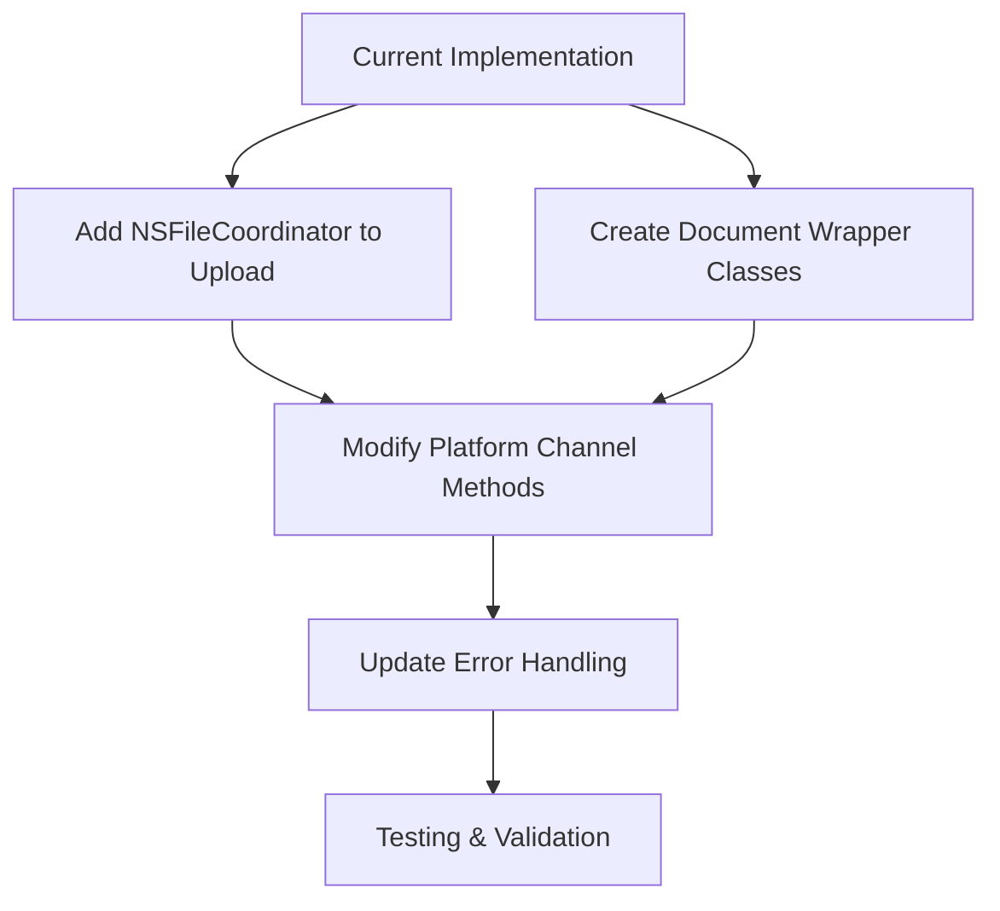

# Implementation Plan: Improving iCloud File Coordination

This document outlines a comprehensive plan to enhance the iCloud Storage Plus Flutter plugin by properly implementing UIDocument/NSDocument and NSFileCoordinator without changing the overall functionality.

## 1. Implementation Strategy Overview



## 2. Detailed Implementation Plan

### Phase 1: Add NSFileCoordinator to Upload Method

#### iOS Implementation (`SwiftIcloudStoragePlugin.swift`)

```swift
private func upload(_ call: FlutterMethodCall, _ result: @escaping FlutterResult) {
  guard let args = call.arguments as? Dictionary<String, Any>,
        let containerId = args["containerId"] as? String,
        let localFilePath = args["localFilePath"] as? String,
        let cloudFileName = args["cloudFileName"] as? String,
        let eventChannelName = args["eventChannelName"] as? String
  else {
    result(argumentError)
    return
  }
  
  guard let containerURL = FileManager.default.url(forUbiquityContainerIdentifier: containerId)
  else {
    result(containerError)
    return
  }
  DebugHelper.log("containerURL: \(containerURL.path)")
  
  let cloudFileURL = containerURL.appendingPathComponent(cloudFileName)
  let localFileURL = URL(fileURLWithPath: localFilePath)
  
  // Create a file coordinator for proper iCloud coordination
  let fileCoordinator = NSFileCoordinator(filePresenter: nil)
  var coordinationError: NSError?
  
  fileCoordinator.coordinate(writingItemAt: cloudFileURL, options: .forReplacing, error: &coordinationError) { writingURL in
    do {
      // Create parent directories if needed
      let cloudFileDirURL = writingURL.deletingLastPathComponent()
      if !FileManager.default.fileExists(atPath: cloudFileDirURL.path) {
        try FileManager.default.createDirectory(at: cloudFileDirURL, withIntermediateDirectories: true, attributes: nil)
      }
      
      // Remove existing file if it exists
      if FileManager.default.fileExists(atPath: writingURL.path) {
        try FileManager.default.removeItem(at: writingURL)
      }
      
      // Copy the file to iCloud
      try FileManager.default.copyItem(at: localFileURL, to: writingURL)
      
      // Set up progress monitoring if needed
      if !eventChannelName.isEmpty {
        self.setupUploadProgressMonitoring(cloudFileURL: cloudFileURL, eventChannelName: eventChannelName)
      }
      
      result(nil)
    } catch {
      result(self.nativeCodeError(error))
    }
  }
  
  if let error = coordinationError {
    result(nativeCodeError(error))
  }
}

private func setupUploadProgressMonitoring(cloudFileURL: URL, eventChannelName: String) {
  let query = NSMetadataQuery.init()
  query.operationQueue = .main
  query.searchScopes = querySearchScopes
  query.predicate = NSPredicate(format: "%K == %@", NSMetadataItemPathKey, cloudFileURL.path)
  
  let uploadStreamHandler = self.streamHandlers[eventChannelName]!
  uploadStreamHandler.onCancelHandler = { [self] in
    removeObservers(query)
    query.stop()
    removeStreamHandler(eventChannelName)
  }
  addUploadObservers(query: query, eventChannelName: eventChannelName)
  
  query.start()
}
```

#### macOS Implementation (`IcloudStoragePlugin.swift`)
The same changes would be applied to the macOS implementation of the `upload` method.

### Phase 2: Create Document Wrapper Classes

#### iOS Document Wrapper (`ICloudDocument.swift`)

```swift
import UIKit

class ICloudDocument: UIDocument {
    var data: Data?
    
    override func contents(forType typeName: String) throws -> Any {
        guard let data = data else {
            return Data()
        }
        return data
    }
    
    override func load(fromContents contents: Any, ofType typeName: String?) throws {
        guard let data = contents as? Data else {
            throw NSError(domain: NSCocoaErrorDomain, code: NSFileReadUnknownError, userInfo: nil)
        }
        self.data = data
    }
}

// Extension to SwiftIcloudStoragePlugin to handle document operations
extension SwiftIcloudStoragePlugin {
    func readDocumentAt(url: URL, completion: @escaping (Data?, Error?) -> Void) {
        let document = ICloudDocument(fileURL: url)
        document.open { success in
            if success {
                completion(document.data, nil)
                document.close(completionHandler: nil)
            } else {
                completion(nil, NSError(domain: NSCocoaErrorDomain, code: NSFileReadUnknownError, userInfo: nil))
            }
        }
    }
    
    func writeDocument(at url: URL, data: Data, completion: @escaping (Error?) -> Void) {
        let document = ICloudDocument(fileURL: url)
        document.data = data
        document.save(to: url, for: .forOverwriting) { success in
            if success {
                document.close { success in
                    completion(nil)
                }
            } else {
                completion(NSError(domain: NSCocoaErrorDomain, code: NSFileWriteUnknownError, userInfo: nil))
            }
        }
    }
}
```

#### macOS Document Wrapper (`ICloudDocument.swift`)

```swift
import Cocoa

class ICloudDocument: NSDocument {
    var data: Data?
    
    override func data(ofType typeName: String) throws -> Data {
        guard let data = data else {
            return Data()
        }
        return data
    }
    
    override func read(from data: Data, ofType typeName: String) throws {
        self.data = data
    }
}

// Extension to IcloudStoragePlugin to handle document operations
extension IcloudStoragePlugin {
    func readDocumentAt(url: URL, completion: @escaping (Data?, Error?) -> Void) {
        let document = ICloudDocument()
        document.autosavesInPlace = true
        
        NSDocumentController.shared.openDocument(withContentsOf: url, display: false) { (document, documentWasAlreadyOpen, error) in
            if let error = error {
                completion(nil, error)
                return
            }
            
            guard let document = document as? ICloudDocument else {
                completion(nil, NSError(domain: NSCocoaErrorDomain, code: NSFileReadUnknownError, userInfo: nil))
                return
            }
            
            completion(document.data, nil)
            document.close()
        }
    }
    
    func writeDocument(at url: URL, data: Data, completion: @escaping (Error?) -> Void) {
        let document = ICloudDocument()
        document.data = data
        document.autosavesInPlace = true
        
        document.save(to: url, ofType: "public.data", for: .saveAsOperation) { (error) in
            if let error = error {
                completion(error)
                return
            }
            
            document.close()
            completion(nil)
        }
    }
}
```

### Phase 3: Modify Platform Channel Methods

#### Enhanced Download Method (iOS)

```swift
private func download(_ call: FlutterMethodCall, _ result: @escaping FlutterResult) {
    guard let args = call.arguments as? Dictionary<String, Any>,
          let containerId = args["containerId"] as? String,
          let cloudFileName = args["cloudFileName"] as? String,
          let eventChannelName = args["eventChannelName"] as? String
    else {
        result(argumentError)
        return
    }
    
    guard let containerURL = FileManager.default.url(forUbiquityContainerIdentifier: containerId)
    else {
        result(containerError)
        return
    }
    
    let cloudFileURL = containerURL.appendingPathComponent(cloudFileName)
    
    // Start downloading the file
    do {
        try FileManager.default.startDownloadingUbiquitousItem(at: cloudFileURL)
    } catch {
        result(nativeCodeError(error))
        return
    }
    
    // Set up a query to monitor download progress
    let query = NSMetadataQuery.init()
    query.operationQueue = .main
    query.searchScopes = querySearchScopes
    query.predicate = NSPredicate(format: "%K == %@", NSMetadataItemPathKey, cloudFileURL.path)
    
    let downloadStreamHandler = self.streamHandlers[eventChannelName]
    downloadStreamHandler?.onCancelHandler = { [self] in
        removeObservers(query)
        query.stop()
        removeStreamHandler(eventChannelName)
    }
    
    // Add observers for download progress
    NotificationCenter.default.addObserver(forName: NSNotification.Name.NSMetadataQueryDidFinishGathering, object: query, queue: query.operationQueue) { [weak self] (notification) in
        self?.handleDownloadProgress(query: query, cloudFileURL: cloudFileURL, eventChannelName: eventChannelName, result: result)
    }
    
    NotificationCenter.default.addObserver(forName: NSNotification.Name.NSMetadataQueryDidUpdate, object: query, queue: query.operationQueue) { [weak self] (notification) in
        self?.handleDownloadProgress(query: query, cloudFileURL: cloudFileURL, eventChannelName: eventChannelName, result: result)
    }
    
    query.start()
}

private func handleDownloadProgress(query: NSMetadataQuery, cloudFileURL: URL, eventChannelName: String, result: @escaping FlutterResult) {
    if query.results.count == 0 {
        result(false)
        return
    }
    
    guard let fileItem = query.results.first as? NSMetadataItem,
          let fileURL = fileItem.value(forAttribute: NSMetadataItemURLKey) as? URL,
          let fileURLValues = try? fileURL.resourceValues(forKeys: [.ubiquitousItemDownloadingErrorKey, .ubiquitousItemDownloadingStatusKey]) else {
        return
    }
    
    let streamHandler = self.streamHandlers[eventChannelName]
    
    // Handle download errors
    if let error = fileURLValues.ubiquitousItemDownloadingError {
        streamHandler?.setEvent(nativeCodeError(error))
        result(nativeCodeError(error))
        return
    }
    
    // Report download progress
    if let progress = fileItem.value(forAttribute: NSMetadataUbiquitousItemPercentDownloadedKey) as? Double {
        streamHandler?.setEvent(progress)
    }
    
    // When download is complete, read the file using UIDocument
    if fileURLValues.ubiquitousItemDownloadingStatus == URLUbiquitousItemDownloadingStatus.current {
        // Use NSFileCoordinator to read the file
        let fileCoordinator = NSFileCoordinator(filePresenter: nil)
        var coordinationError: NSError?
        
        fileCoordinator.coordinate(readingItemAt: cloudFileURL, options: .withoutChanges, error: &coordinationError) { (readingURL) in
            // File is now available for reading
            streamHandler?.setEvent(FlutterEndOfEventStream)
            removeStreamHandler(eventChannelName)
            result(true)
        }
        
        if let error = coordinationError {
            streamHandler?.setEvent(nativeCodeError(error))
            result(nativeCodeError(error))
        }
    }
}
```

Similar changes would be applied to the macOS implementation.

### Phase 4: Add Document-Based File Operations

#### New Method for Document Reading (iOS/macOS)

```swift
private func readDocument(_ call: FlutterMethodCall, _ result: @escaping FlutterResult) {
    guard let args = call.arguments as? Dictionary<String, Any>,
          let containerId = args["containerId"] as? String,
          let relativePath = args["relativePath"] as? String
    else {
        result(argumentError)
        return
    }
    
    guard let containerURL = FileManager.default.url(forUbiquityContainerIdentifier: containerId)
    else {
        result(containerError)
        return
    }
    
    let fileURL = containerURL.appendingPathComponent(relativePath)
    
    readDocumentAt(url: fileURL) { (data, error) in
        if let error = error {
            result(self.nativeCodeError(error))
            return
        }
        
        guard let data = data else {
            result(FlutterError(code: "E_READ", message: "Failed to read document data", details: nil))
            return
        }
        
        // Return the data as a FlutterStandardTypedData
        result(FlutterStandardTypedData(bytes: data))
    }
}
```

#### New Method for Document Writing (iOS/macOS)

```swift
private func writeDocument(_ call: FlutterMethodCall, _ result: @escaping FlutterResult) {
    guard let args = call.arguments as? Dictionary<String, Any>,
          let containerId = args["containerId"] as? String,
          let relativePath = args["relativePath"] as? String,
          let flutterData = args["data"] as? FlutterStandardTypedData
    else {
        result(argumentError)
        return
    }
    
    guard let containerURL = FileManager.default.url(forUbiquityContainerIdentifier: containerId)
    else {
        result(containerError)
        return
    }
    
    let fileURL = containerURL.appendingPathComponent(relativePath)
    let data = flutterData.data
    
    // Create parent directories if needed
    let dirURL = fileURL.deletingLastPathComponent()
    do {
        if !FileManager.default.fileExists(atPath: dirURL.path) {
            try FileManager.default.createDirectory(at: dirURL, withIntermediateDirectories: true, attributes: nil)
        }
    } catch {
        result(nativeCodeError(error))
        return
    }
    
    writeDocument(at: fileURL, data: data) { (error) in
        if let error = error {
            result(self.nativeCodeError(error))
            return
        }
        
        result(nil)
    }
}
```

### Phase 5: Update Flutter Platform Interface

While we don't need to change the existing API, we'll need to add the document-based methods to the platform interface:

```dart
// In icloud_storage_platform_interface.dart
abstract class ICloudStoragePlatform extends PlatformInterface {
  // Existing methods...
  
  /// Read a document from iCloud using UIDocument/NSDocument
  Future<Uint8List?> readDocument({
    required String containerId,
    required String relativePath,
  }) async {
    throw UnimplementedError('readDocument() has not been implemented.');
  }
  
  /// Write a document to iCloud using UIDocument/NSDocument
  Future<void> writeDocument({
    required String containerId,
    required String relativePath,
    required Uint8List data,
  }) async {
    throw UnimplementedError('writeDocument() has not been implemented.');
  }
}
```

```dart
// In icloud_storage_method_channel.dart
class MethodChannelICloudStorage extends ICloudStoragePlatform {
  // Existing methods...
  
  @override
  Future<Uint8List?> readDocument({
    required String containerId,
    required String relativePath,
  }) async {
    final data = await methodChannel.invokeMethod<Uint8List>('readDocument', {
      'containerId': containerId,
      'relativePath': relativePath,
    });
    return data;
  }
  
  @override
  Future<void> writeDocument({
    required String containerId,
    required String relativePath,
    required Uint8List data,
  }) async {
    await methodChannel.invokeMethod('writeDocument', {
      'containerId': containerId,
      'relativePath': relativePath,
      'data': data,
    });
  }
}
```

```dart
// In icloud_storage.dart
class ICloudStorage {
  // Existing methods...
  
  /// Read a document from iCloud using UIDocument/NSDocument
  static Future<Uint8List?> readDocument({
    required String containerId,
    required String relativePath,
  }) async {
    if (!_validateRelativePath(relativePath)) {
      throw InvalidArgumentException('invalid relativePath: $relativePath');
    }
    
    return await ICloudStoragePlatform.instance.readDocument(
      containerId: containerId,
      relativePath: relativePath,
    );
  }
  
  /// Write a document to iCloud using UIDocument/NSDocument
  static Future<void> writeDocument({
    required String containerId,
    required String relativePath,
    required Uint8List data,
  }) async {
    if (!_validateRelativePath(relativePath)) {
      throw InvalidArgumentException('invalid relativePath: $relativePath');
    }
    
    await ICloudStoragePlatform.instance.writeDocument(
      containerId: containerId,
      relativePath: relativePath,
      data: data,
    );
  }
}
```

## 3. Implementation Benefits

This implementation plan provides several key benefits:

1. **Proper File Coordination**: Using NSFileCoordinator for all file operations ensures data integrity and prevents conflicts.

2. **Document-Based API**: Adding UIDocument/NSDocument support provides:
   - Automatic conflict resolution
   - Better integration with iCloud
   - Proper version tracking
   - Improved data consistency

3. **Backward Compatibility**: The existing API remains unchanged, allowing current users to migrate gradually.

4. **Enhanced Reliability**: Proper file coordination reduces the risk of data corruption or loss.

5. **Future-Proofing**: The document-based approach aligns with Apple's recommended practices for iCloud integration.

## 4. Testing Strategy

To ensure the implementation works correctly:

1. **Unit Tests**:
   - Test NSFileCoordinator integration
   - Test UIDocument/NSDocument operations
   - Verify error handling

2. **Integration Tests**:
   - Test file operations in real iCloud environment
   - Verify conflict resolution
   - Test performance under various conditions

3. **Edge Cases**:
   - Test with large files
   - Test with special characters in filenames
   - Test with network interruptions

## 5. Implementation Timeline

1. **Phase 1** (1-2 days): Add NSFileCoordinator to upload method
2. **Phase 2** (2-3 days): Create document wrapper classes
3. **Phase 3** (2-3 days): Modify platform channel methods
4. **Phase 4** (1-2 days): Add document-based file operations
5. **Phase 5** (1 day): Update Flutter platform interface
6. **Testing** (2-3 days): Comprehensive testing of all changes

Total estimated time: 9-14 days
