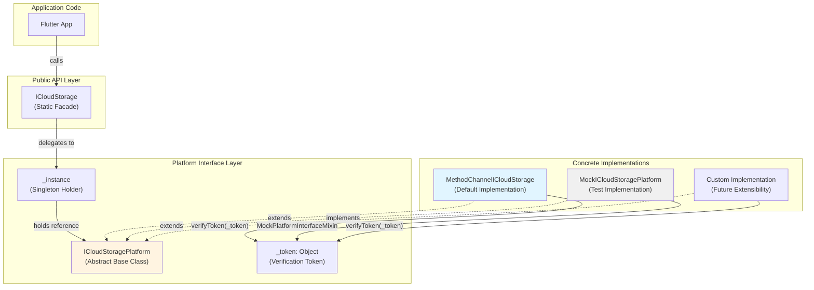
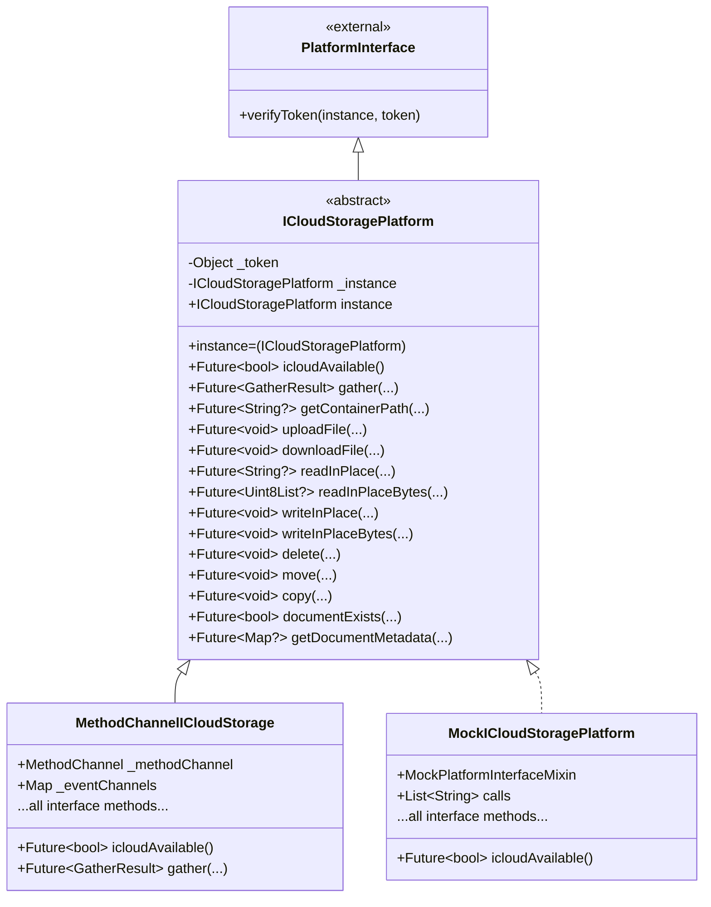
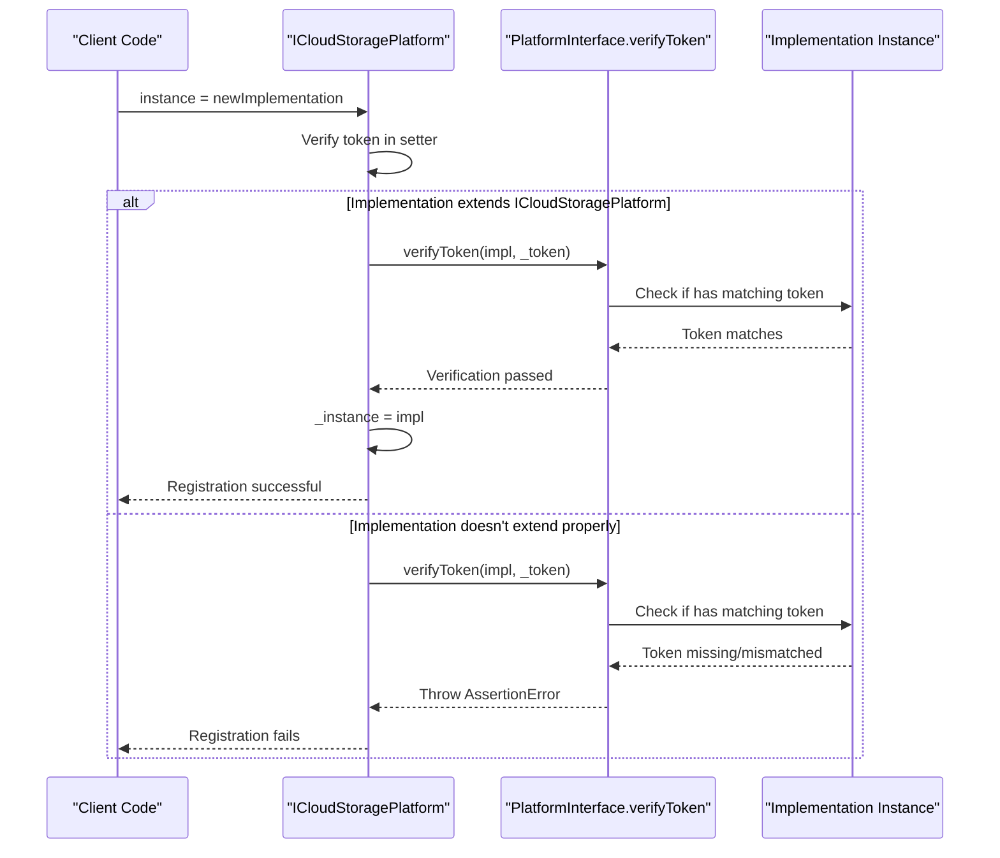
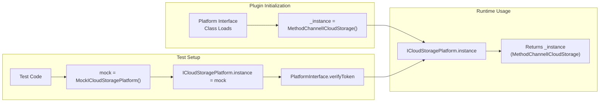
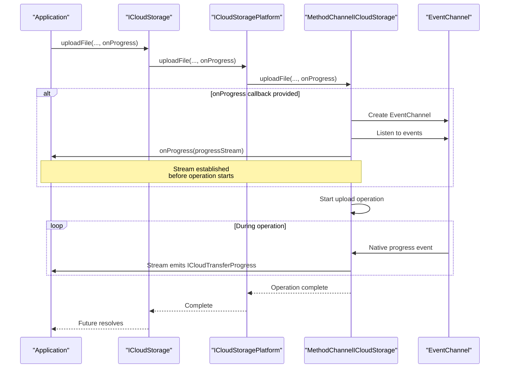
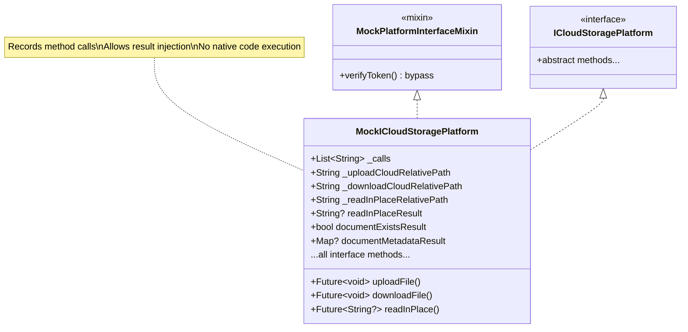
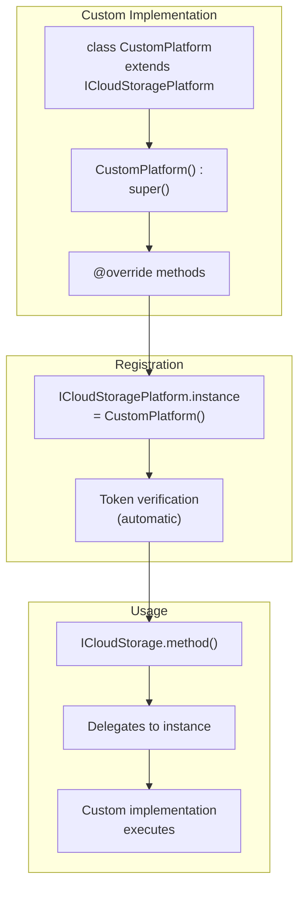

# Platform Interface Pattern

<details>
<summary>Relevant source files</summary>

The following files were used as context for generating this wiki page:

- [AGENTS.md](../../AGENTS.md)
- [lib/icloud_storage_platform_interface.dart](../../lib/icloud_storage_platform_interface.dart)
- [test/icloud_storage_test.dart](../../test/icloud_storage_test.dart)

</details>


## Purpose and Scope

This document explains the platform interface pattern used in `icloud_storage_plus`, specifically the `ICloudStoragePlatform` abstract class and the federated plugin architecture. This pattern provides a contract for platform-specific implementations and enables testability through dependency injection.

For implementation details of the default platform channel-based implementation, see [Method Channel Implementation](#4.2). For information about the native iOS and macOS implementations, see [Native Layer Overview](#4.4).

**Sources:** [lib/icloud_storage_platform_interface.dart:1-306]()

---

## Overview of the Federated Plugin Architecture

The plugin uses a **federated plugin architecture** with three distinct layers:

1. **Public API Layer** (`ICloudStorage`) - Static facade providing developer-facing API
2. **Platform Interface Layer** (`ICloudStoragePlatform`) - Abstract contract defining operations
3. **Platform Implementation Layer** (`MethodChannelICloudStorage`) - Concrete implementation using platform channels

This separation allows platform-specific implementations to be swapped, mocked for testing, or extended without modifying the public API.



**Diagram: Federated Plugin Architecture Layers**

The `ICloudStoragePlatform` abstract class serves as the contract that all implementations must fulfill. The singleton instance can be replaced at runtime, enabling different implementations for production vs. testing.

**Sources:** [lib/icloud_storage_platform_interface.dart:12-31](), [test/icloud_storage_test.dart:9-11]()

---

## ICloudStoragePlatform Abstract Class

The `ICloudStoragePlatform` class defines the complete contract for iCloud operations. It extends `PlatformInterface` from the `plugin_platform_interface` package to enable token verification.

### Class Structure



**Diagram: ICloudStoragePlatform Class Hierarchy**

**Sources:** [lib/icloud_storage_platform_interface.dart:12-31](), [lib/icloud_storage_method_channel.dart:13-15](), [test/icloud_storage_test.dart:9-11]()

### Method Categories

The platform interface defines 14 abstract methods organized into functional categories:

| Category | Methods | Purpose |
|----------|---------|---------|
| **Availability** | `icloudAvailable()`, `getContainerPath()` | Check iCloud status and access container |
| **File Transfer** | `uploadFile()`, `downloadFile()` | Copy files in/out with progress streaming |
| **In-Place Access** | `readInPlace()`, `readInPlaceBytes()`, `writeInPlace()`, `writeInPlaceBytes()` | Direct coordinated file access |
| **Metadata** | `gather()`, `documentExists()`, `getDocumentMetadata()` | Query file information |
| **File Management** | `delete()`, `move()`, `copy()` | Atomic file operations |

Each method signature includes comprehensive documentation about parameters, behavior, and error conditions.

**Sources:** [lib/icloud_storage_platform_interface.dart:33-304]()

---

## Token Verification Pattern

The platform interface uses a **token verification pattern** to ensure type safety and prevent invalid implementations from being registered. This pattern is provided by the `plugin_platform_interface` package.

### Token Verification Flow



**Diagram: Token Verification Sequence**

### Implementation Details

The token is a private static `Object` instance created at class initialization:

```dart
static final Object _token = Object();
```

When setting a new platform instance, the setter verifies the token:

```dart
static set instance(ICloudStoragePlatform instance) {
  PlatformInterface.verifyToken(instance, _token);
  _instance = instance;
}
```

The `verifyToken` method ensures:
1. The implementation extends `ICloudStoragePlatform` (inherits the token)
2. The implementation wasn't created with a different token

For test implementations, the `MockPlatformInterfaceMixin` bypasses token verification while still maintaining type safety.

**Sources:** [lib/icloud_storage_platform_interface.dart:14-31](), [test/icloud_storage_test.dart:9-11]()

---

## Default Implementation Registration

The platform interface establishes `MethodChannelICloudStorage` as the default implementation through static initialization:

```dart
static ICloudStoragePlatform _instance = MethodChannelICloudStorage();
```

This default is set when the platform interface class loads, before any application code runs.

### Implementation Registration Patterns



**Diagram: Implementation Registration Lifecycle**

### Production Usage

In production, the public `ICloudStorage` class accesses the platform through the singleton:

```dart
static Future<GatherResult> gather({
  required String containerId,
  StreamHandler<GatherResult>? onUpdate,
}) {
  return ICloudStoragePlatform.instance.gather(
    containerId: containerId,
    onUpdate: onUpdate,
  );
}
```

This delegation pattern is used throughout the `ICloudStorage` class for all operations.

### Test Usage

In tests, the platform instance can be replaced with a mock:

```dart
final fakePlatform = MockICloudStoragePlatform();
ICloudStoragePlatform.instance = fakePlatform;

// Now all ICloudStorage calls use the mock
await ICloudStorage.gather(containerId: 'test');
expect(fakePlatform.calls.last, 'gather');
```

**Sources:** [lib/icloud_storage_platform_interface.dart:18-23](), [test/icloud_storage_test.dart:193-194](), [lib/icloud_storage.dart:97-104]()

---

## StreamHandler Type Alias

The platform interface defines a `StreamHandler<T>` type alias for progress and update callbacks:

```dart
typedef StreamHandler<T> = void Function(Stream<T>);
```

This pattern allows methods to accept optional callbacks that receive a `Stream` rather than requiring callers to create event channels directly. The implementation creates and manages the event channels internally.

### StreamHandler Usage Pattern



**Diagram: StreamHandler Callback Flow**

### Methods Using StreamHandler

| Method | StreamHandler Parameter | Stream Type | Purpose |
|--------|------------------------|-------------|---------|
| `uploadFile()` | `onProgress` | `ICloudTransferProgress` | Upload progress (percent, done, error) |
| `downloadFile()` | `onProgress` | `ICloudTransferProgress` | Download progress (percent, done, error) |
| `gather()` | `onUpdate` | `GatherResult` | Real-time metadata updates |

**Sources:** [lib/icloud_storage_platform_interface.dart:8-9](), [lib/icloud_storage_platform_interface.dart:53-58](), [lib/icloud_storage_platform_interface.dart:88-95]()

---

## Method Signatures and Contracts

Each abstract method in `ICloudStoragePlatform` defines a clear contract through its signature, parameters, and documentation.

### Parameter Patterns

```mermaid
graph TB
    subgraph Required["Required Parameters"]
        ContainerID["containerId: String<br/>(iCloud container identifier)"]
        RelPath["relativePath: String<br/>(path inside container)"]
        LocalPath["localPath: String<br/>(local filesystem path)"]
        Contents["contents: String | Uint8List<br/>(data to write)"]
    end
    
    subgraph Optional["Optional Parameters"]
        Progress["onProgress: StreamHandler?<br/>(transfer progress callback)"]
        Update["onUpdate: StreamHandler?<br/>(metadata update callback)"]
        Timeouts["idleTimeouts: List<Duration>?<br/>(retry timing)"]
        Backoff["retryBackoff: List<Duration>?<br/>(retry delays)"]
    end
    
    subgraph PathValidation["Path Validation Rules"]
        NoTrailing["No trailing slash for files<br/>(uploadFile, downloadFile,<br/>readInPlace, writeInPlace)"]
        AllowTrailing["Allow trailing slash for dirs<br/>(delete, move, copy,<br/>getDocumentMetadata)"]
    end
    
    ContainerID --> Methods["All Methods"]
    RelPath --> FileMethods["File Operations"]
    LocalPath --> TransferMethods["Transfer Operations"]
    Contents --> WriteMethods["Write Operations"]
    
    Progress --> TransferMethods
    Update --> GatherMethod["gather()"]
    Timeouts --> ReadMethods["readInPlace*()"]
    Backoff --> ReadMethods
    
    NoTrailing -.->|"enforced by"| FileMethods
    AllowTrailing -.->|"allowed by"| DirMethods["Directory Operations"]
```



**Diagram: Parameter Organization and Validation Rules**

### Common Parameter Constraints

All methods accept a `containerId` parameter that must be a valid iCloud container identifier (e.g., `"iCloud.com.example.app"`).

Path parameters have specific validation rules:
- **File operations** (`uploadFile`, `downloadFile`, `readInPlace*`, `writeInPlace*`): Reject trailing slashes
- **Directory-aware operations** (`delete`, `move`, `copy`, `getDocumentMetadata`): Allow trailing slashes for directories
- **All operations**: Reject empty paths, double slashes, and invalid characters

**Sources:** [lib/icloud_storage_platform_interface.dart:70-95](), [lib/icloud_storage_platform_interface.dart:125-147](), [lib/icloud_storage_platform_interface.dart:210-227]()

### Return Type Patterns

| Return Type | Methods | Semantics |
|-------------|---------|-----------|
| `Future<void>` | `uploadFile`, `downloadFile`, `writeInPlace*`, `delete`, `move`, `copy` | Operation completes successfully or throws |
| `Future<bool>` | `icloudAvailable`, `documentExists` | Simple boolean status check |
| `Future<String?>` | `getContainerPath`, `readInPlace` | Nullable string result |
| `Future<Uint8List?>` | `readInPlaceBytes` | Nullable binary data |
| `Future<GatherResult>` | `gather` | Complex data structure with files list |
| `Future<Map<String, dynamic>?>` | `getDocumentMetadata` | Nullable metadata dictionary |

Methods returning nullable types (`String?`, `Uint8List?`, `Map?`) return `null` when the requested resource doesn't exist, rather than throwing an exception.

**Sources:** [lib/icloud_storage_platform_interface.dart:33-304]()

---

## Exception Handling Contract

All platform interface methods use exceptions to signal errors. The contract specifies:

1. **Argument validation** occurs at the public API layer (`ICloudStorage`) and throws `InvalidArgumentException`
2. **Platform errors** are wrapped in `PlatformException` with standardized codes
3. **Implementations must not return error values** - all errors must be thrown

### Platform Exception Codes

The platform interface documentation references standard error codes defined in `PlatformExceptionCode`:

| Code | Condition | Example Methods |
|------|-----------|-----------------|
| `E_CTR` | iCloud unavailable or container access denied | All methods |
| `E_FNF`, `E_FNF_READ`, `E_FNF_WRITE` | File not found | `downloadFile`, `readInPlace*`, `delete` |
| `E_TIMEOUT` | Download stalled | `downloadFile`, `readInPlace*` |
| `E_NAT` | Native operation failed | All methods |
| `E_ARG` | Invalid argument (pre-validated in public API) | All methods |

**Sources:** [lib/icloud_storage_platform_interface.dart:220-221](), [lib/icloud_storage_platform_interface.dart:240-241](), [lib/models/exceptions.dart:1-76]()

---

## Testing with Mock Implementations

The platform interface pattern enables comprehensive testing through mock implementations.

### MockICloudStoragePlatform Structure



**Diagram: Mock Implementation Class Structure**

### Mock Features

The `MockICloudStoragePlatform` in the test suite demonstrates the testing pattern:

1. **Call Recording**: Tracks all method invocations in `_calls` list
2. **Parameter Capture**: Stores specific parameters for verification (e.g., `_uploadCloudRelativePath`)
3. **Result Injection**: Allows tests to control return values (e.g., `readInPlaceResult`)
4. **No Native Code**: Implements pure Dart behavior without platform channels

### Test Example

```dart
final fakePlatform = MockICloudStoragePlatform();
ICloudStoragePlatform.instance = fakePlatform;

// Configure mock behavior
fakePlatform.readInPlaceResult = 'test data';

// Execute operation through public API
final result = await ICloudStorage.readInPlace(
  containerId: 'test',
  relativePath: 'Documents/file.txt',
);

// Verify behavior
expect(result, 'test data');
expect(fakePlatform.calls.last, 'readInPlace');
expect(fakePlatform.readInPlaceRelativePath, 'Documents/file.txt');
```

This pattern allows testing the public API layer (`ICloudStorage`) in isolation without requiring native code execution or actual iCloud connectivity.

**Sources:** [test/icloud_storage_test.dart:9-182](), [test/icloud_storage_test.dart:184-189](), [test/icloud_storage_test.dart:309-317]()

---

## Extension Points for Custom Implementations

While `MethodChannelICloudStorage` is the default implementation, the platform interface pattern allows custom implementations for specific use cases:

### Custom Implementation Requirements



**Diagram: Custom Implementation Flow**

### Use Cases for Custom Implementations

| Use Case | Example Implementation | Benefit |
|----------|----------------------|---------|
| **Offline Development** | In-memory file system | Develop without iCloud access |
| **Integration Testing** | Fake with controlled failures | Test error handling paths |
| **Performance Profiling** | Wrapper with timing metrics | Measure operation latency |
| **Alternative Backend** | Custom cloud storage adapter | Support non-Apple platforms |

Any custom implementation must:
1. Extend `ICloudStoragePlatform` (not just implement)
2. Call `super()` in constructor to inherit the verification token
3. Override all abstract methods
4. Follow the documented contracts for parameters and exceptions

**Sources:** [lib/icloud_storage_platform_interface.dart:12-31](), [AGENTS.md:34-36]()