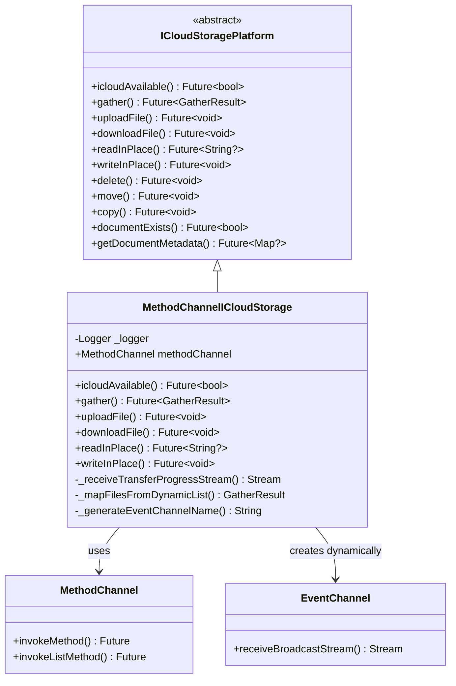
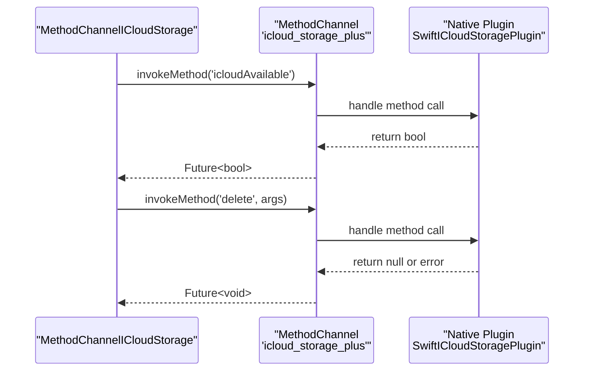
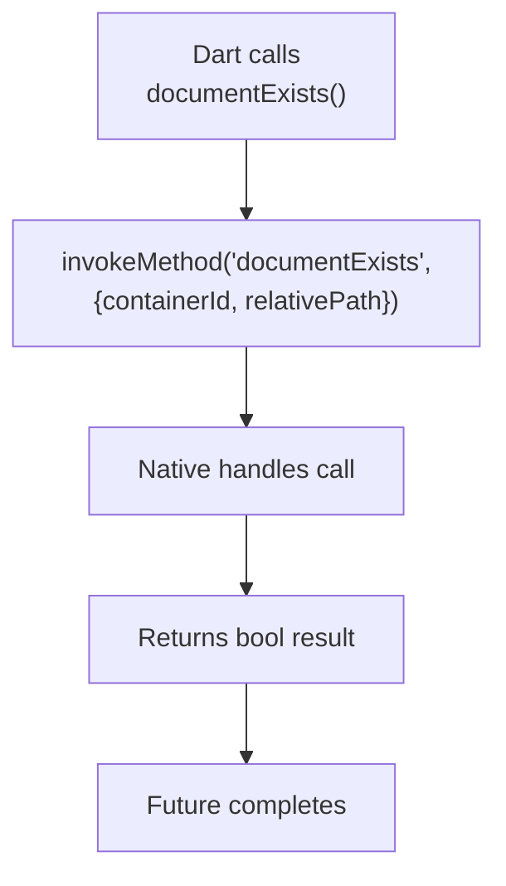
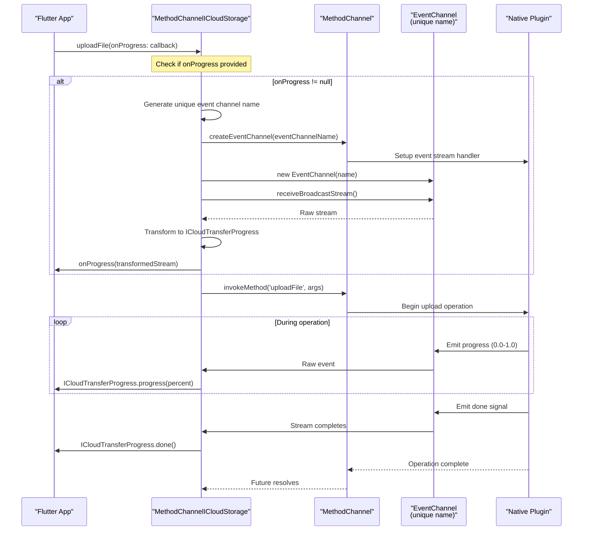
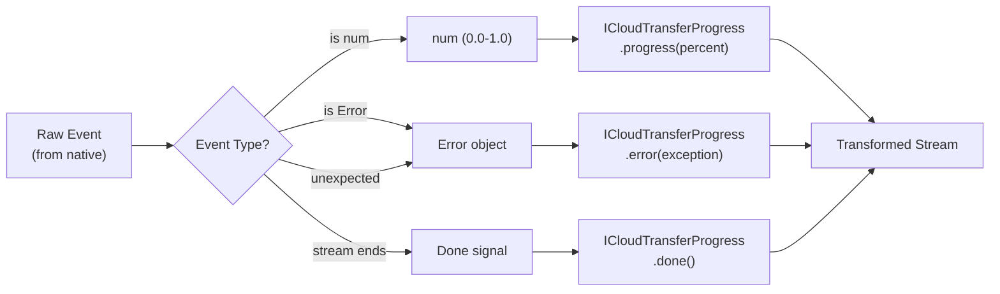
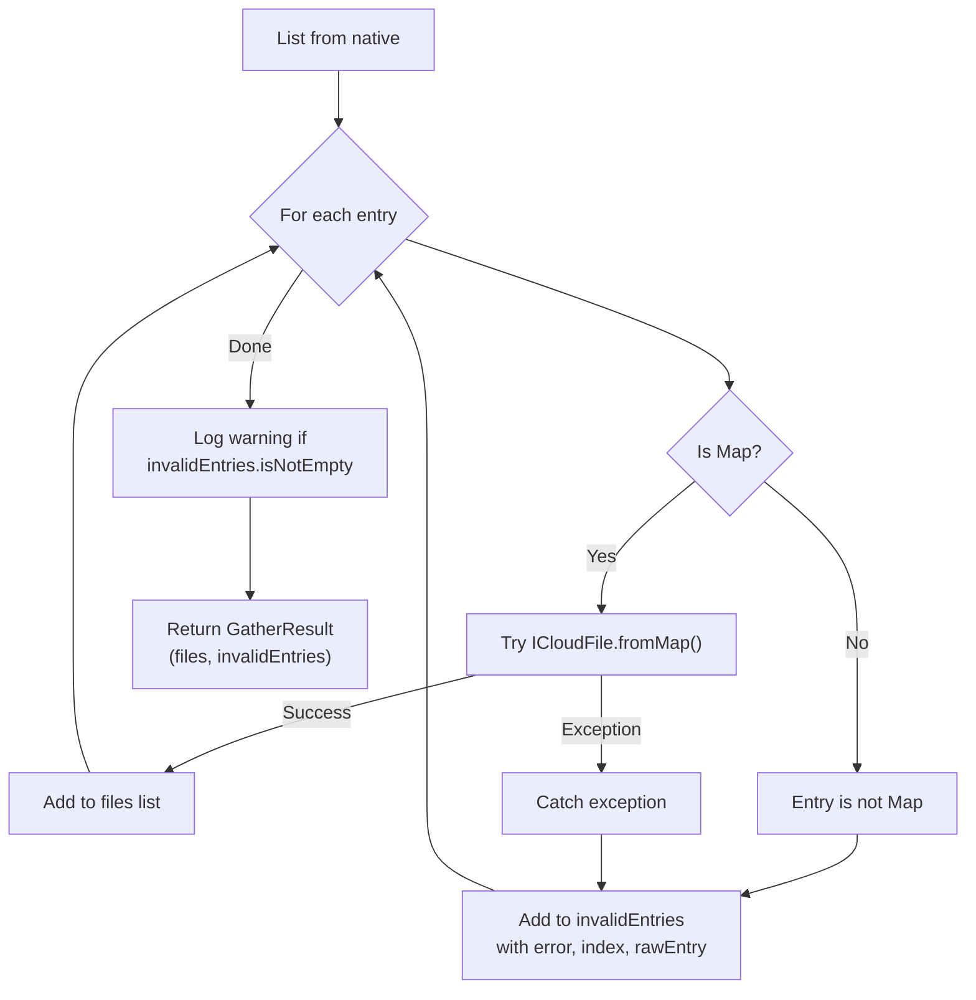
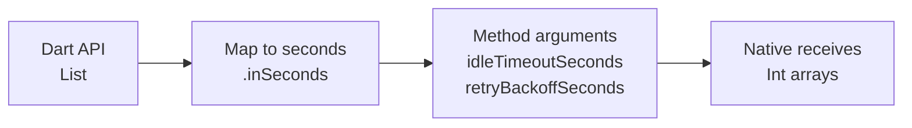
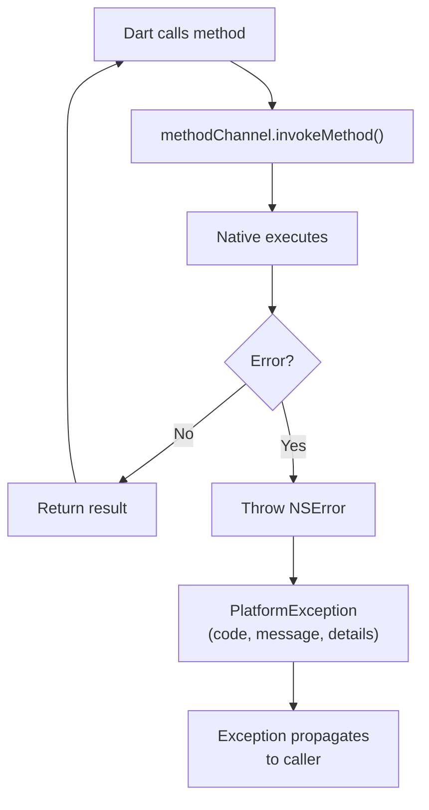
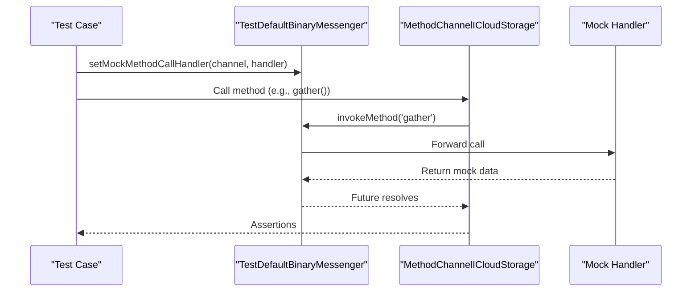

# Method Channel Implementation

<details>
<summary>Relevant source files</summary>

The following files were used as context for generating this wiki page:

- [lib/icloud_storage_method_channel.dart](../../lib/icloud_storage_method_channel.dart)
- [lib/icloud_storage_platform_interface.dart](../../lib/icloud_storage_platform_interface.dart)
- [test/icloud_storage_method_channel_test.dart](../../test/icloud_storage_method_channel_test.dart)

</details>


## Purpose and Scope

This document describes how `MethodChannelICloudStorage` bridges the Dart API to native iOS and macOS implementations using Flutter's platform channels. This class implements the abstract `ICloudStoragePlatform` interface and serves as the default communication layer between Dart and native code.

For information about the abstract platform interface pattern, see [Platform Interface Pattern](#4.1). For details on event streaming mechanics, see [Event Channels and Streaming](#4.3). For the native iOS/macOS implementation that receives these calls, see [Native Layer Overview](#4.4).

**Sources:** [lib/icloud_storage_method_channel.dart:1-407](), [lib/icloud_storage_platform_interface.dart:1-305]()

---

## Class Structure and Registration

`MethodChannelICloudStorage` is the concrete implementation of `ICloudStoragePlatform` that uses Flutter's `MethodChannel` and `EventChannel` APIs for communication with native code.

### Class Definition



The class is registered as the default implementation via the static `instance` property in `ICloudStoragePlatform`:

[lib/icloud_storage_platform_interface.dart:18-23]()

**Sources:** [lib/icloud_storage_method_channel.dart:12-18](), [lib/icloud_storage_platform_interface.dart:11-31]()

---

## MethodChannel for Synchronous Operations

The primary `MethodChannel` with the name `'icloud_storage_plus'` handles all request-response style operations. Each Dart method invokes a corresponding native method with typed arguments.

### Simple Request-Response Pattern



**Sources:** [lib/icloud_storage_method_channel.dart:16-24](), [lib/icloud_storage_method_channel.dart:209-218]()

### Operation Categories

| Operation Category | Methods | Return Type | Method Channel Arguments |
|-------------------|---------|-------------|-------------------------|
| **Availability Check** | `icloudAvailable` | `Future<bool>` | None |
| **Container Path** | `getContainerPath` | `Future<String?>` | `containerId` |
| **File Transfers** | `uploadFile`, `downloadFile` | `Future<void>` | `containerId`, paths, `eventChannelName` |
| **In-Place Access** | `readInPlace`, `readInPlaceBytes`, `writeInPlace`, `writeInPlaceBytes` | `Future<String?>` / `Future<Uint8List?>` / `Future<void>` | `containerId`, `relativePath`, contents, timeout configs |
| **File Management** | `delete`, `move`, `copy` | `Future<void>` | `containerId`, path(s) |
| **Metadata** | `gather`, `documentExists`, `getDocumentMetadata` | Various | `containerId`, `relativePath`, optional `eventChannelName` |

**Sources:** [lib/icloud_storage_method_channel.dart:20-273]()

### Example: Simple Operation Flow

For operations without streaming, the flow is straightforward:



[lib/icloud_storage_method_channel.dart:247-256]()

**Sources:** [lib/icloud_storage_method_channel.dart:247-256]()

---

## EventChannel for Streaming Operations

For operations that report progress or updates over time, `MethodChannelICloudStorage` dynamically creates `EventChannel` instances with unique names.

### Event Channel Lifecycle



**Sources:** [lib/icloud_storage_method_channel.dart:69-98](), [lib/icloud_storage_method_channel.dart:100-129]()

### Event Channel Creation Pattern

All streaming operations follow this pattern:

1. **Generate unique name**: Use `_generateEventChannelName()` with operation type, container ID, and timestamp/random suffix
2. **Create channel early**: Call `createEventChannel` method before starting the operation
3. **Setup stream**: Create `EventChannel` instance and call `receiveBroadcastStream()`
4. **Transform events**: Apply `StreamTransformer` to convert raw events to typed models
5. **Deliver to caller**: Invoke `onProgress` or `onUpdate` callback with transformed stream

[lib/icloud_storage_method_channel.dart:390-405]()

The naming strategy ensures no collisions:

```
Pattern: icloud_storage_plus/event/{operationType}/{containerId}/{timestamp}_{random}

Examples:
- icloud_storage_plus/event/uploadFile/iCloud.com.example/1234567890_123
- icloud_storage_plus/event/gather/iCloud.com.example/1234567891_456
```

**Sources:** [lib/icloud_storage_method_channel.dart:390-405]()

### Operations with Event Channels

| Operation | Stream Type | Events Emitted |
|-----------|-------------|----------------|
| `uploadFile` | `ICloudTransferProgress` | Progress (0.0-1.0), done, error |
| `downloadFile` | `ICloudTransferProgress` | Progress (0.0-1.0), done, error |
| `gather` | `GatherResult` | Updated file lists when metadata changes |

**Sources:** [lib/icloud_storage_method_channel.dart:69-98](), [lib/icloud_storage_method_channel.dart:100-129](), [lib/icloud_storage_method_channel.dart:27-58]()

---

## Stream Transformation

### Transfer Progress Transformation

The `_receiveTransferProgressStream` method transforms raw platform events into typed `ICloudTransferProgress` objects:



**Sources:** [lib/icloud_storage_method_channel.dart:275-336]()

The transformer uses three handlers:

#### handleData

Transforms numeric events (0.0-1.0) to progress objects. Invalid event types trigger an error with code `PlatformExceptionCode.invalidEvent`:

[lib/icloud_storage_method_channel.dart:291-305]()

#### handleError

Wraps platform errors in `ICloudTransferProgress.error()`. Unexpected errors are logged and wrapped with code `PlatformExceptionCode.pluginInternal`:

[lib/icloud_storage_method_channel.dart:306-327]()

#### handleDone

Emits a final `ICloudTransferProgress.done()` event when the stream completes:

[lib/icloud_storage_method_channel.dart:328-332]()

**Important:** Errors are delivered as **data events** with `type == ICloudTransferProgressType.error`, not via the stream's error channel. Consumers must check `event.isError` in the data listener.

**Sources:** [lib/icloud_storage_method_channel.dart:275-336]()

---

## Data Mapping and Transformation

### Gather Result Mapping

The `_mapFilesFromDynamicList` method converts native metadata arrays to `GatherResult` objects with proper error handling:



Key aspects:

- **Defensive**: Never throws on malformed entries; collects them in `invalidEntries`
- **Traceable**: Each invalid entry includes the error message, raw data, and array index
- **Logged**: Warnings are logged with counts of skipped entries
- **Typed**: Returns structured `GatherResult` with both valid files and diagnostics

[lib/icloud_storage_method_channel.dart:338-388]()

**Sources:** [lib/icloud_storage_method_channel.dart:338-388]()

### Type Conversions

| Native Type | Dart Type | Conversion Location |
|-------------|-----------|---------------------|
| `NSNumber` (bool) | `bool` | Direct via `invokeMethod<bool>` |
| `NSString` | `String` | Direct via `invokeMethod<String>` |
| `NSData` | `Uint8List` | Direct via `invokeMethod<Uint8List>` |
| `NSArray<NSDictionary>` | `List<dynamic>` | Via `invokeListMethod`, then `_mapFilesFromDynamicList` |
| `NSDictionary` | `Map<dynamic, dynamic>` | Converted to `Map<String, dynamic>` explicitly |
| Progress double | `num` | In stream, converted to `double` via `.toDouble()` |

[lib/icloud_storage_method_channel.dart:258-273]() shows explicit map type conversion for metadata:

```dart
// Convert dynamic map to properly typed map
return result.map((key, value) => MapEntry(key.toString(), value));
```

**Sources:** [lib/icloud_storage_method_channel.dart:20-273](), [lib/icloud_storage_method_channel.dart:338-388]()

---

## Timeout and Retry Parameter Passing

For in-place access operations, timeout and retry configurations are serialized as integer arrays:



Example from `readInPlace`:

[lib/icloud_storage_method_channel.dart:143-151]()

The native side receives arrays like `[60, 90, 180]` for idle timeouts and `[2, 4]` for retry backoff, representing seconds. Sub-second precision is intentionally ignored.

**Sources:** [lib/icloud_storage_method_channel.dart:131-181]()

---

## Error Handling at Channel Boundary

### Exception Propagation

All `MethodChannel` calls can throw `PlatformException`. The method channel layer does **not** catch or transform these exceptions—they propagate directly to the caller:



The method channel implementation is **thin**: it focuses on communication, not error transformation. Error code standardization happens at the native layer, which maps iOS errors to `PlatformExceptionCode` constants.

**Sources:** [lib/icloud_storage_method_channel.dart:20-273]()

### Stream Error Handling

For progress streams, errors are handled specially:

1. **Platform errors** in the stream are caught by `handleError` and converted to `ICloudTransferProgress.error()` data events
2. **Invalid data types** from native are caught by `handleData` and converted to error events with code `E_INVALID_EVENT`
3. **Unexpected errors** are logged and wrapped with code `E_PLUGIN_INTERNAL`

All error variants close the stream after emitting the error event.

[lib/icloud_storage_method_channel.dart:306-327]()

**Sources:** [lib/icloud_storage_method_channel.dart:275-336]()

---

## Testing and Mock Support

The `methodChannel` field is marked `@visibleForTesting` to enable test harnesses to inject mock handlers:

[lib/icloud_storage_method_channel.dart:16-18]()

Test setup example from the test suite:



The test suite covers:
- All operation methods with correct argument passing
- Event channel creation for streaming operations
- Stream transformation for progress events
- Data mapping for gather results
- Type conversions for metadata

[test/icloud_storage_method_channel_test.dart:1-440]()

**Sources:** [lib/icloud_storage_method_channel.dart:16-18](), [test/icloud_storage_method_channel_test.dart:1-440]()

---

## Summary of Key Implementation Patterns

### Pattern 1: Simple Method Invocation
```
Dart method → methodChannel.invokeMethod(methodName, args) → Native handler → Future<T>
```
Used by: `icloudAvailable`, `delete`, `move`, `copy`, `documentExists`, `getContainerPath`

### Pattern 2: Event Channel Setup + Method Invocation
```
1. Generate unique event channel name
2. Call createEventChannel via MethodChannel
3. Create EventChannel instance
4. Setup stream transformation
5. Deliver stream via callback
6. Invoke main operation via MethodChannel
```
Used by: `uploadFile`, `downloadFile`, `gather` (when `onProgress`/`onUpdate` provided)

### Pattern 3: List Data Transformation
```
Native array → invokeListMethod → _mapFilesFromDynamicList → GatherResult
```
Used by: `gather`

### Pattern 4: Duration Array Serialization
```
List<Duration> → .map(d => d.inSeconds) → Native receives Int array
```
Used by: `readInPlace`, `readInPlaceBytes`

**Sources:** [lib/icloud_storage_method_channel.dart:1-407]()