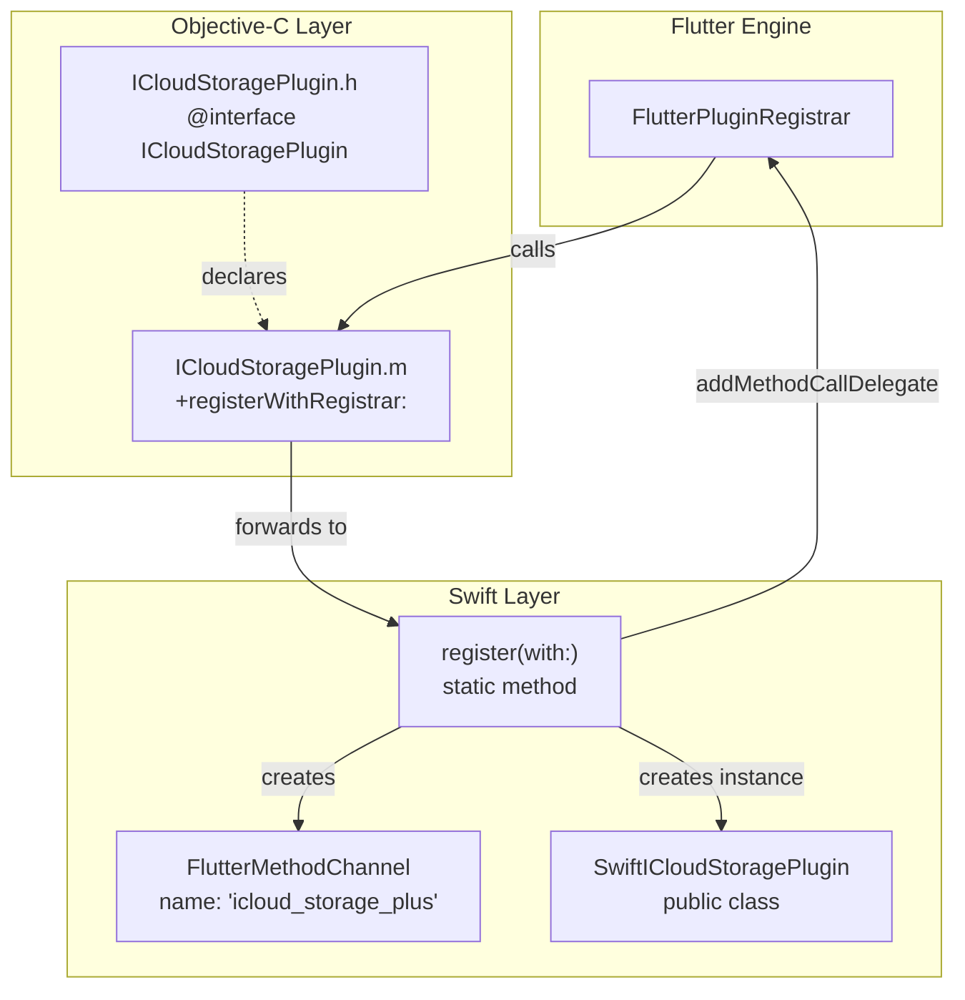
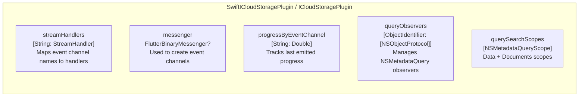
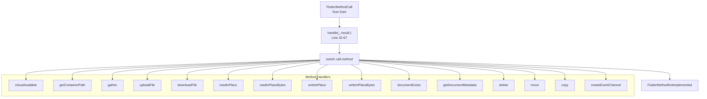
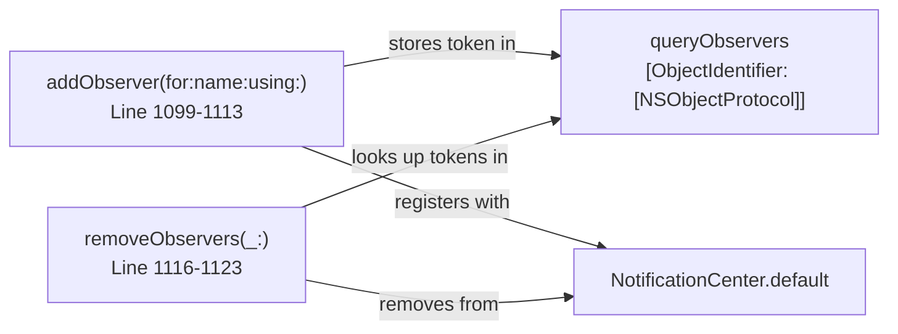
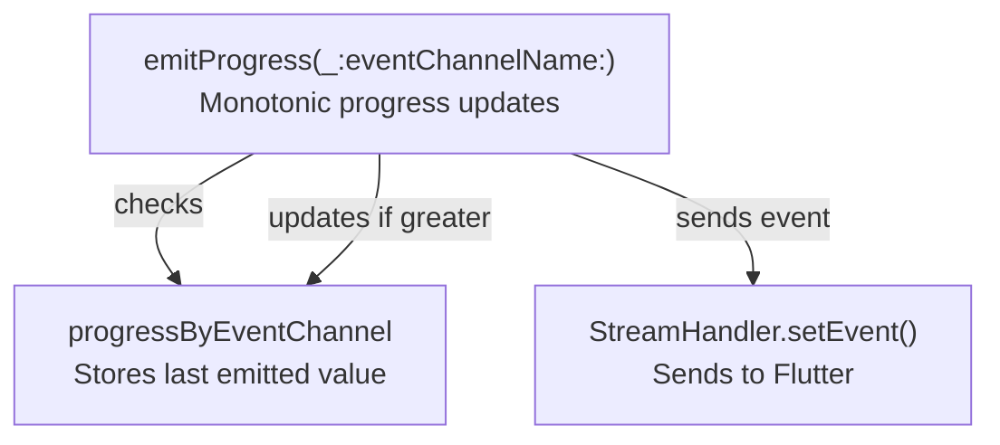

# Native Layer Overview

<details>
<summary>Relevant source files</summary>

The following files were used as context for generating this wiki page:

- [ios/Classes/ICloudStoragePlugin.h](../../ios/Classes/ICloudStoragePlugin.h)
- [ios/Classes/ICloudStoragePlugin.m](../../ios/Classes/ICloudStoragePlugin.m)
- [ios/Classes/iOSICloudStoragePlugin.swift](../../ios/Classes/iOSICloudStoragePlugin.swift)
- [macos/Classes/macOSICloudStoragePlugin.swift](../../macos/Classes/macOSICloudStoragePlugin.swift)
- [pubspec.yaml](../../pubspec.yaml)

</details>


## Purpose and Scope

This page introduces the native iOS and macOS implementations of the icloud_storage_plus plugin. It covers the plugin entry points, registration mechanism, and high-level structure of the native layer. For detailed implementation of specific features, see:
- Document classes and file operations: [5.2](#5.2)
- Streaming I/O implementation: [5.3](#5.3)
- File coordination: [5.4](#5.4)
- Metadata queries: [5.5](#5.5)

The native layer is responsible for interfacing directly with Apple's iCloud frameworks and translating Dart method calls into native operations.

**Sources:**
- [ios/Classes/iOSICloudStoragePlugin.swift:1-67]()
- [macos/Classes/macOSICloudStoragePlugin.swift:1-66]()

---

## Plugin Registration Architecture

The plugin uses a two-layer registration pattern: an Objective-C bridge that delegates to Swift implementations. This is necessary because Flutter's plugin system expects Objective-C entry points, but the implementation is written in Swift.

### iOS Registration Flow



**Sources:**
- [ios/Classes/ICloudStoragePlugin.h:1-6]()
- [ios/Classes/ICloudStoragePlugin.m:1-14]()
- [ios/Classes/iOSICloudStoragePlugin.swift:22-29]()

### Registration Implementation

The Objective-C bridge in `ICloudStoragePlugin.m` imports the Swift generated header and forwards registration to the Swift class:

```
ICloudStoragePlugin.m:
  Line 9-11: Forwards registerWithRegistrar to SwiftICloudStoragePlugin
```

The Swift implementation creates the method channel and registers the plugin instance as the delegate:

```
iOSICloudStoragePlugin.swift:
  Line 23-29: Creates channel with name "icloud_storage_plus"
              Creates plugin instance
              Registers as method call delegate
              Stores messenger for event channels
```

**Platform Registration in pubspec.yaml:**

| Platform | Plugin Class |
|----------|-------------|
| iOS | `ICloudStoragePlugin` (Objective-C entry point) |
| macOS | `ICloudStoragePlugin` (direct Swift registration) |

**Sources:**
- [pubspec.yaml:23-28]()
- [ios/Classes/ICloudStoragePlugin.m:8-12]()
- [ios/Classes/iOSICloudStoragePlugin.swift:22-29]()
- [macos/Classes/macOSICloudStoragePlugin.swift:22-28]()

---

## Platform-Specific Implementations

### iOS: SwiftICloudStoragePlugin

The iOS implementation is defined in `SwiftICloudStoragePlugin` class, which conforms to Flutter's `FlutterPlugin` protocol.

**Class Declaration:**
```
Line 4: public class SwiftICloudStoragePlugin: NSObject, FlutterPlugin
```

### macOS: ICloudStoragePlugin

The macOS implementation uses the class name `ICloudStoragePlugin` (without the "Swift" prefix) and follows the same structure as iOS. The implementations are nearly identical, with minor platform-specific differences in framework imports.

**Class Declaration:**
```
Line 4: public class ICloudStoragePlugin: NSObject, FlutterPlugin
```

### Implementation Parity

Both platforms share identical implementation structure with ~99% code overlap:

| Aspect | iOS | macOS |
|--------|-----|-------|
| Base class | `SwiftICloudStoragePlugin` | `ICloudStoragePlugin` |
| Frameworks | `UIKit` | `Cocoa` |
| Document base class | `UIDocument` | `NSDocument` |
| Core logic | Identical | Identical |
| Method handlers | Identical | Identical |

**Sources:**
- [ios/Classes/iOSICloudStoragePlugin.swift:1-4]()
- [macos/Classes/macOSICloudStoragePlugin.swift:1-4]()

---

## Plugin Class Structure

### State Properties

The plugin class maintains several state dictionaries and properties for managing asynchronous operations:



**Key Properties:**

| Property | Type | Purpose |
|----------|------|---------|
| `streamHandlers` | `[String: StreamHandler]` | Maps event channel names to stream handler instances |
| `messenger` | `FlutterBinaryMessenger?` | Messenger for creating new event channels dynamically |
| `progressByEventChannel` | `[String: Double]` | Caches last progress value to enforce monotonic updates |
| `queryObservers` | `[ObjectIdentifier: [NSObjectProtocol]]` | Tracks notification observers for cleanup |
| `querySearchScopes` | `[NSMetadataQueryScope]` | Default scopes for metadata queries |

**Pre-defined Error Objects:**

The plugin pre-creates common `FlutterError` objects for file-not-found scenarios:

```
Line 11-14: fileNotFoundReadError with code "E_FNF_READ"
Line 16-19: fileNotFoundWriteError with code "E_FNF_WRITE"
```

**Sources:**
- [ios/Classes/iOSICloudStoragePlugin.swift:5-20]()
- [macos/Classes/macOSICloudStoragePlugin.swift:5-20]()

---

## Method Routing System

### Handle Method Dispatcher

The `handle(_:result:)` method acts as the central router for all method calls from Dart:



**Routing Table:**

| Method Name | Handler Function | Line Numbers |
|-------------|------------------|--------------|
| `icloudAvailable` | `icloudAvailable(_:)` | 34-35, 72-75 |
| `getContainerPath` | `getContainerPath(_:_:)` | 58-59, 78-92 |
| `gather` | `gather(_:_:)` | 36-37, 95-134 |
| `uploadFile` | `uploadFile(_:_:)` | 38-39, 236-285 |
| `downloadFile` | `downloadFile(_:_:)` | 40-41, 378-482 |
| `readInPlace` | `readInPlace(_:_:)` | 42-43, 485-539 |
| `readInPlaceBytes` | `readInPlaceBytes(_:_:)` | 44-45, 585-643 |
| `writeInPlace` | `writeInPlace(_:_:)` | 46-47, 542-582 |
| `writeInPlaceBytes` | `writeInPlaceBytes(_:_:)` | 48-49, 646-686 |
| `documentExists` | `documentExists(_:_:)` | 60-61, 870-887 |
| `getDocumentMetadata` | `getDocumentMetadata(_:_:)` | 62-63, 890-932 |
| `delete` | `delete(_:_:)` | 50-51, 947-984 |
| `move` | `move(_:_:)` | 52-53, 987-1035 |
| `copy` | `copy(_:_:)` | 54-55, 1038-1096 |
| `createEventChannel` | `createEventChannel(_:_:)` | 56-57, 1126-1145 |

**Sources:**
- [ios/Classes/iOSICloudStoragePlugin.swift:31-67]()
- [macos/Classes/macOSICloudStoragePlugin.swift:30-66]()

---

## Method Handler Categories

The native implementations organize operations into functional categories based on their purpose and implementation patterns.

### 1. Container and Availability Operations

**icloudAvailable:**
- Returns whether iCloud is available for the current user
- Checks `FileManager.default.ubiquityIdentityToken`
- Simple boolean result, no error cases

**getContainerPath:**
- Returns filesystem path for an iCloud container
- Validates container access
- Returns `containerError` if container unavailable

**Sources:**
- [ios/Classes/iOSICloudStoragePlugin.swift:69-92]()

### 2. File Transfer Operations

**uploadFile and downloadFile:**
- Copy-in/copy-out pattern for large files
- Use document-based streaming (see [5.2](#5.2), [5.3](#5.3))
- Support optional progress monitoring via event channels
- Create parent directories automatically

**Sources:**
- [ios/Classes/iOSICloudStoragePlugin.swift:234-285]()
- [ios/Classes/iOSICloudStoragePlugin.swift:377-482]()

### 3. In-Place Access Operations

**readInPlace, readInPlaceBytes, writeInPlace, writeInPlaceBytes:**
- Direct coordinated access to iCloud files (see [5.4](#5.4))
- Include download retry logic with idle watchdog (see [6.2](#6.2))
- Load full file content into memory
- Create parent directories for write operations

**Sources:**
- [ios/Classes/iOSICloudStoragePlugin.swift:484-539]()
- [ios/Classes/iOSICloudStoragePlugin.swift:542-582]()
- [ios/Classes/iOSICloudStoragePlugin.swift:584-643]()
- [ios/Classes/iOSICloudStoragePlugin.swift:645-686]()

### 4. Metadata Operations

**gather:**
- Lists all items in container using `NSMetadataQuery` (see [5.5](#5.5))
- Supports optional real-time update streaming
- Maps metadata to Flutter-friendly dictionaries

**documentExists:**
- Checks file existence without downloading
- Simple filesystem check using `FileManager`

**getDocumentMetadata:**
- Retrieves metadata for specific file/directory
- Returns nil if item doesn't exist
- Includes iCloud sync status, size, dates, conflicts

**Sources:**
- [ios/Classes/iOSICloudStoragePlugin.swift:94-134]()
- [ios/Classes/iOSICloudStoragePlugin.swift:869-887]()
- [ios/Classes/iOSICloudStoragePlugin.swift:889-932]()

### 5. File Management Operations

**delete, move, copy:**
- Use `NSFileCoordinator` for safe concurrent access (see [5.4](#5.4))
- Atomic operations with proper coordination options
- Create parent directories for move/copy destinations
- Remove destination files before copy/move if they exist

**Sources:**
- [ios/Classes/iOSICloudStoragePlugin.swift:946-984]()
- [ios/Classes/iOSICloudStoragePlugin.swift:986-1035]()
- [ios/Classes/iOSICloudStoragePlugin.swift:1037-1096]()

### 6. Event Channel Management

**createEventChannel:**
- Dynamically creates event channels for progress/update streaming
- Stores `StreamHandler` instances in `streamHandlers` dictionary
- Used by gather, upload, and download operations

**Sources:**
- [ios/Classes/iOSICloudStoragePlugin.swift:1126-1145]()

---

## Helper Functions and Utilities

The plugin class includes numerous private helper functions that support the main operations:

### Observer Management



**Functions:**

| Function | Purpose | Lines |
|----------|---------|-------|
| `addObserver(for:name:using:)` | Registers notification observer for metadata query | 1098-1113 |
| `removeObservers(_:)` | Removes all observers for a query and cleans up | 1115-1123 |
| `removeStreamHandler(_:)` | Cleans up stream handler and progress cache | 1147-1150 |

**Sources:**
- [ios/Classes/iOSICloudStoragePlugin.swift:1098-1123]()
- [ios/Classes/iOSICloudStoragePlugin.swift:1147-1150]()

### Progress Monitoring



The `emitProgress` function ensures monotonic progress updates by caching the last value sent for each channel.

**Sources:**
- [ios/Classes/iOSICloudStoragePlugin.swift:1152-1162]()

### Metadata Mapping

| Function | Purpose | Lines |
|----------|---------|-------|
| `mapFileAttributesFromQuery(query:containerURL:)` | Converts query results to array of dictionaries | 165-175 |
| `mapMetadataItem(_:containerURL:)` | Maps NSMetadataItem to Flutter dictionary | 177-198 |
| `mapResourceValues(fileURL:values:containerURL:)` | Maps URLResourceValues to Flutter dictionary | 201-218 |
| `relativePath(for:containerURL:)` | Computes container-relative path | 220-232 |

**Sources:**
- [ios/Classes/iOSICloudStoragePlugin.swift:164-232]()

### Error Handling

| Function | Purpose | Lines |
|----------|---------|-------|
| `mapFileNotFoundError(_:)` | Maps specific errors to E_FNF codes | Extensions file |
| `mapTimeoutError(_:)` | Maps timeout errors to E_TIMEOUT | Extensions file |
| `nativeCodeError(_:)` | Wraps NSError in FlutterError with E_NAT code | Extensions file |

These functions provide consistent error mapping from native errors to Flutter exception codes (see [3.6](#3.6)).

**Sources:**
- [ios/Classes/iOSICloudStoragePlugin.swift:1164-1278]()

---

## Summary

The native layer provides the platform-specific implementation of iCloud operations through a well-structured plugin architecture:

1. **Dual-layer registration**: Objective-C bridge to Swift implementation
2. **Unified implementation**: iOS and macOS share ~99% of code
3. **Central routing**: Single `handle` method dispatches to specialized handlers
4. **Stateful management**: Tracks event channels, observers, and progress
5. **Helper utilities**: Consistent metadata mapping and error handling

The plugin delegates complex operations to specialized classes (document classes, file coordination) covered in subsequent sections.

**Sources:**
- [ios/Classes/iOSICloudStoragePlugin.swift:1-1390]()
- [macos/Classes/macOSICloudStoragePlugin.swift:1-1390]()