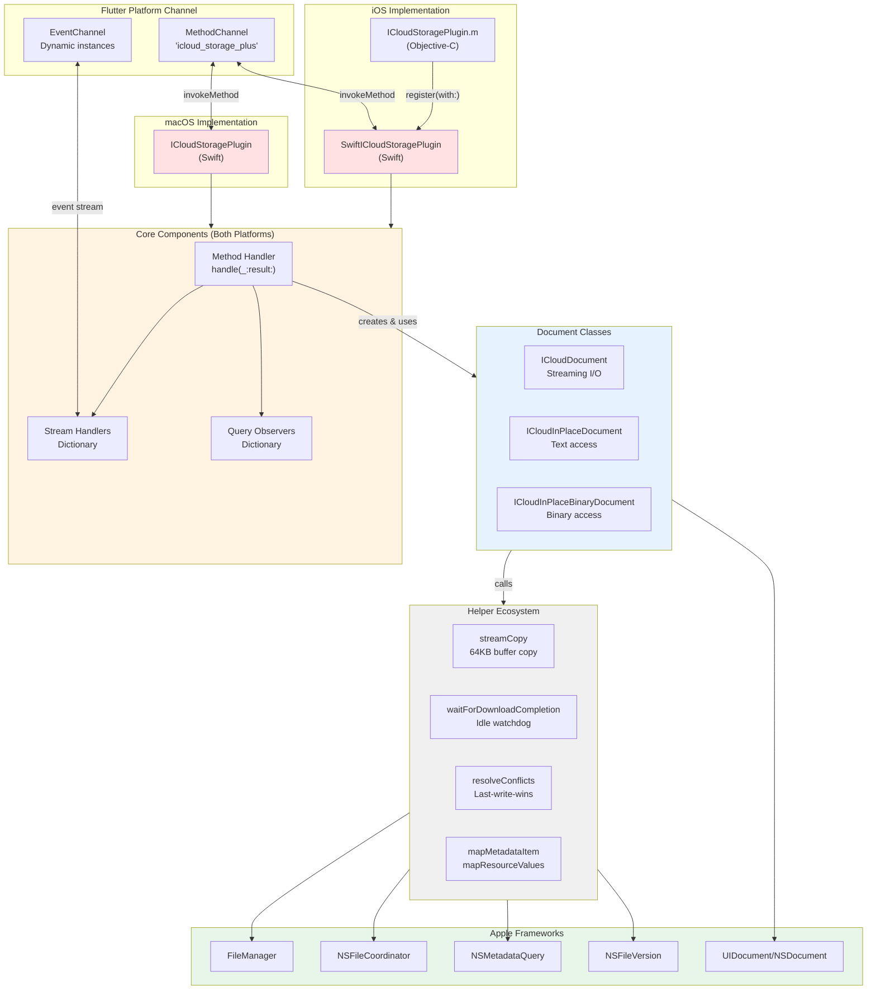
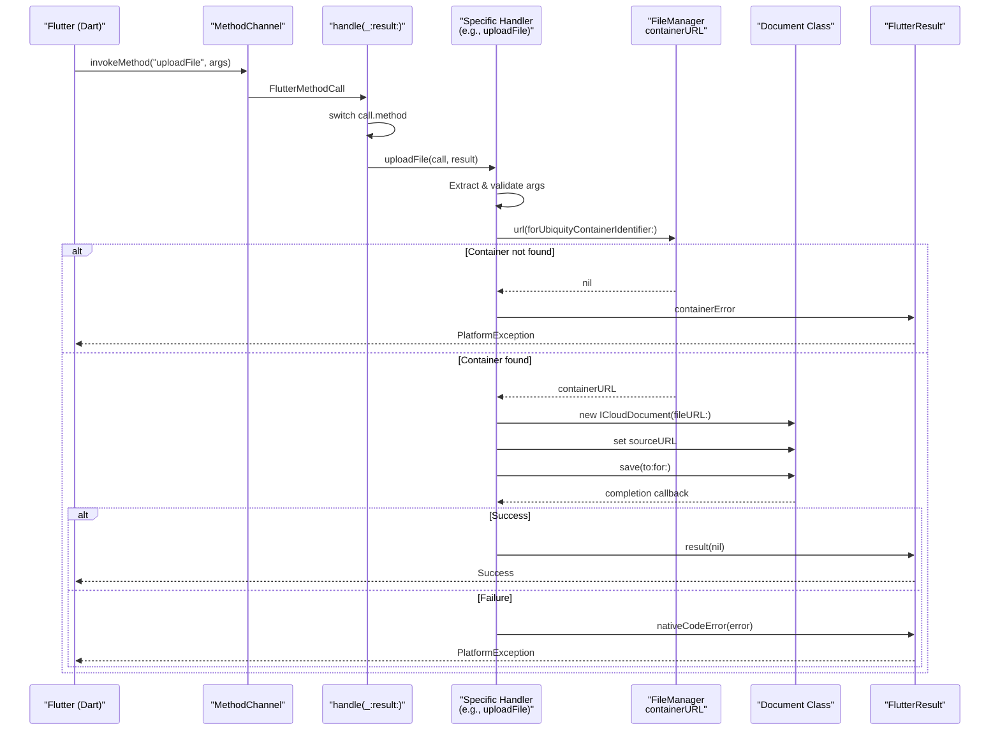
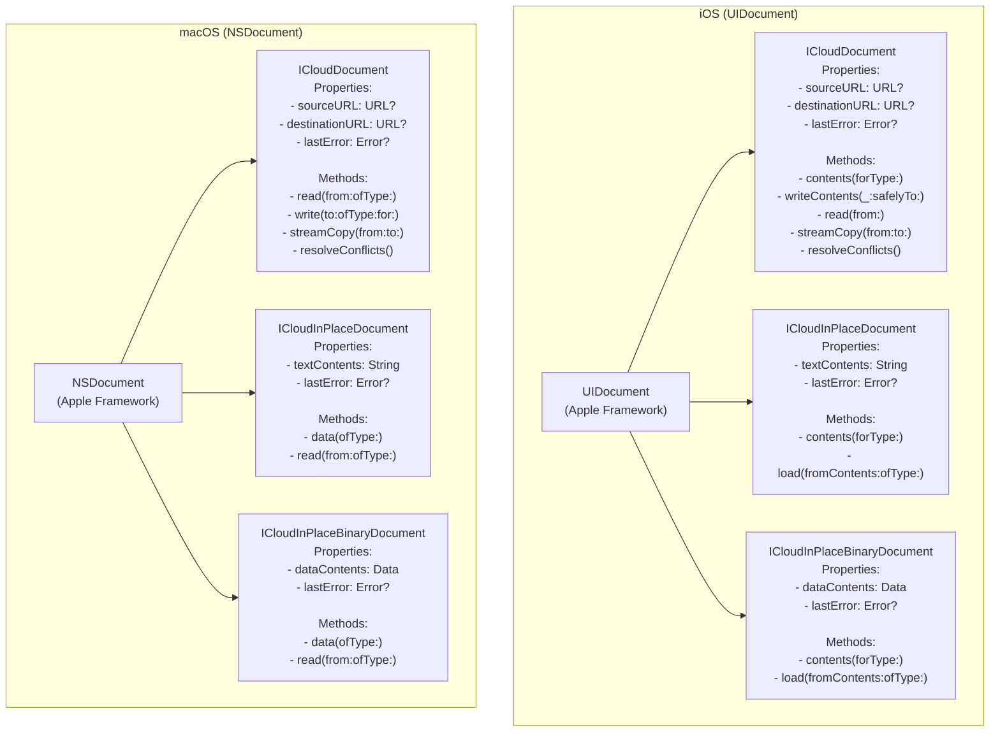
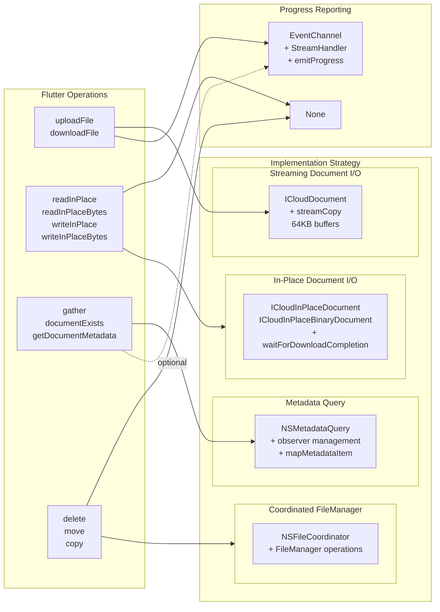
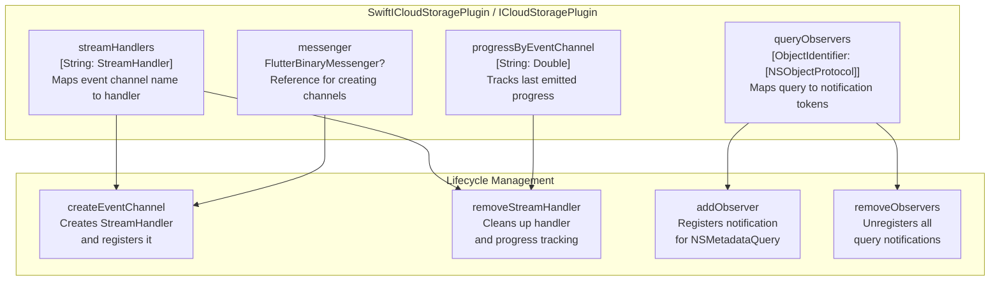
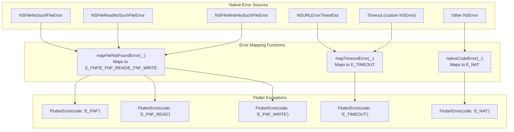

# Native Implementation Deep Dive

<details>
<summary>Relevant source files</summary>

The following files were used as context for generating this wiki page:

- [docs/notes/download_flow.md](../notes/download_flow.md)
- [ios/Classes/ICloudDocument.swift](../../ios/Classes/ICloudDocument.swift)
- [ios/Classes/iOSICloudStoragePlugin.swift](../../ios/Classes/iOSICloudStoragePlugin.swift)
- [macos/Classes/ICloudDocument.swift](../../macos/Classes/ICloudDocument.swift)
- [macos/Classes/macOSICloudStoragePlugin.swift](../../macos/Classes/macOSICloudStoragePlugin.swift)

</details>


This page provides a comprehensive overview of the iOS and macOS native implementation for the icloud_storage_plus plugin. It covers the Swift code architecture, key classes, method routing, and integration with Apple's iCloud frameworks. 

**Scope**: This page focuses on the structure and organization of the native layer. For specific implementation details, see:
- Plugin registration and Objective-C bridging: [#5.1](#5.1)
- Document class implementations: [#5.2](#5.2)
- Streaming I/O mechanics: [#5.3](#5.3)
- File coordination patterns: [#5.4](#5.4)
- Metadata query handling: [#5.5](#5.5)
- Conflict resolution logic: [#5.6](#5.6)

---

## Platform Implementation Structure

The plugin maintains separate but nearly identical implementations for iOS and macOS. Both platforms share the same operation semantics but use platform-specific APIs where necessary.

### Platform Differences

| Aspect | iOS | macOS |
|--------|-----|-------|
| **Plugin class** | `SwiftICloudStoragePlugin` | `ICloudStoragePlugin` |
| **Document base class** | `UIDocument` | `NSDocument` |
| **File path** | `ios/Classes/` | `macos/Classes/` |
| **Registration** | Via Objective-C `ICloudStoragePlugin` | Direct Swift registration |
| **Document lifecycle** | Async open/save with callbacks | Synchronous read/write with threading |

Both implementations expose identical method names and argument structures through the Flutter method channel, ensuring consistent behavior across platforms.

**Sources**: [ios/Classes/iOSICloudStoragePlugin.swift:4-29](), [macos/Classes/macOSICloudStoragePlugin.swift:4-28]()

---

## Native Layer Architecture



**Description**: The native layer consists of platform-specific plugin classes that handle method calls from Flutter. Both implementations share identical core logic: method routing, stream management, and observer tracking. They instantiate document classes for operations and use helper functions to interact with Apple's frameworks.

**Sources**: [ios/Classes/iOSICloudStoragePlugin.swift:4-67](), [macos/Classes/macOSICloudStoragePlugin.swift:4-66](), [ios/Classes/ICloudDocument.swift:1-533](), [macos/Classes/ICloudDocument.swift:1-480]()

---

## Method Routing and Handler Functions

The plugin's `handle(_:result:)` method routes incoming method calls to specialized handler functions. Each Flutter operation maps to a private handler function in the plugin class.

### Method Call Routing Table

| Method Name | Handler Function | Purpose |
|-------------|------------------|---------|
| `icloudAvailable` | `icloudAvailable(_:)` | Check if user is logged into iCloud |
| `getContainerPath` | `getContainerPath(_:_:)` | Get filesystem path for container |
| `gather` | `gather(_:_:)` | List files with NSMetadataQuery |
| `uploadFile` | `uploadFile(_:_:)` | Copy local file to iCloud |
| `downloadFile` | `downloadFile(_:_:)` | Copy iCloud file to local |
| `readInPlace` | `readInPlace(_:_:)` | Read text without copying out |
| `readInPlaceBytes` | `readInPlaceBytes(_:_:)` | Read binary without copying out |
| `writeInPlace` | `writeInPlace(_:_:)` | Write text directly to iCloud |
| `writeInPlaceBytes` | `writeInPlaceBytes(_:_:)` | Write binary directly to iCloud |
| `delete` | `delete(_:_:)` | Remove file with coordination |
| `move` | `move(_:_:)` | Move file with coordination |
| `copy` | `copy(_:_:)` | Copy file with coordination |
| `documentExists` | `documentExists(_:_:)` | Check file existence |
| `getDocumentMetadata` | `getDocumentMetadata(_:_:)` | Get file metadata |
| `createEventChannel` | `createEventChannel(_:_:)` | Set up progress stream |

**Sources**: [ios/Classes/iOSICloudStoragePlugin.swift:32-67](), [macos/Classes/macOSICloudStoragePlugin.swift:31-66]()

---

## Method Handler Flow



**Description**: Every method call follows a consistent pattern: validate arguments, resolve the iCloud container URL, perform the operation (often via a document class), and return results or errors via `FlutterResult`. The `containerError` is thrown if the container identifier is invalid or iCloud is unavailable. The `nativeCodeError` helper maps Swift errors to Flutter exceptions.

**Sources**: [ios/Classes/iOSICloudStoragePlugin.swift:236-285](), [macos/Classes/macOSICloudStoragePlugin.swift:236-285]()

---

## Document Class Hierarchy

The plugin uses three specialized document classes, each inheriting from the platform's base document class (`UIDocument` on iOS, `NSDocument` on macOS).



**Description**: 

- **`ICloudDocument`**: Used for `uploadFile` and `downloadFile`. Streams data in 64KB chunks to avoid memory issues with large files. Includes automatic conflict resolution via `NSFileVersion`.

- **`ICloudInPlaceDocument`**: Used for `readInPlace` and `writeInPlace`. Loads entire file content into memory as a UTF-8 string. Suitable for small text files.

- **`ICloudInPlaceBinaryDocument`**: Used for `readInPlaceBytes` and `writeInPlaceBytes`. Loads entire file content into memory as binary data. Suitable for small binary files.

All document classes leverage the platform's native coordination mechanisms (via `UIDocument.open`/`save` or `NSDocument.read`/`write`), which automatically use `NSFileCoordinator` for safe concurrent access.

**Sources**: [ios/Classes/ICloudDocument.swift:5-315](), [macos/Classes/ICloudDocument.swift:4-260]()

---

## Operation-to-Implementation Mapping

Different operation types use different implementation strategies based on their requirements.



**Description**: 

- **File Transfer**: Uses streaming document I/O to handle arbitrarily large files. Progress is monitored via `NSMetadataQuery` tracking upload/download percentages.

- **In-Place Access**: Uses specialized document classes that load full content into memory. Downloads are awaited via `waitForDownloadCompletion` with idle watchdog timeouts. No progress reporting.

- **Metadata Operations**: Uses `NSMetadataQuery` for live monitoring. Can optionally stream updates if `eventChannelName` is provided.

- **File Management**: Uses `NSFileCoordinator` for atomic operations. No progress reporting.

**Sources**: [ios/Classes/iOSICloudStoragePlugin.swift:236-285,378-482,485-686,947-1096](), [docs/notes/download_flow.md:1-54]()

---

## Core Helper Functions

The plugin uses several key helper functions shared between iOS and macOS implementations.

### Helper Function Reference

| Function | Location | Purpose |
|----------|----------|---------|
| `streamCopy(from:to:)` | ICloudDocument classes | Copies data in 64KB chunks between URLs |
| `waitForDownloadCompletion(fileURL:idleTimeouts:retryBackoff:completion:)` | Plugin classes | Waits for iCloud download with idle watchdog |
| `evaluateDownloadStatus(query:fileURL:)` | Plugin classes | Checks if file is fully downloaded |
| `resolveConflicts()` | ICloudDocument classes | Automatically resolves version conflicts |
| `mapMetadataItem(_:containerURL:)` | Plugin classes | Converts NSMetadataItem to dictionary |
| `mapResourceValues(fileURL:values:containerURL:)` | Plugin classes | Converts URLResourceValues to dictionary |
| `relativePath(for:containerURL:)` | Plugin classes | Computes container-relative path |
| `emitProgress(_:eventChannelName:)` | Plugin classes | Emits monotonic progress to stream |
| `addObserver(for:name:using:)` | Plugin classes | Adds notification observer for query |
| `removeObservers(_:)` | Plugin classes | Removes all observers for query |

**Sources**: [ios/Classes/ICloudDocument.swift:142-213](), [ios/Classes/iOSICloudStoragePlugin.swift:728-867](), [ios/Classes/iOSICloudStoragePlugin.swift:1099-1123]()

---

## State Management

The plugin maintains several internal state dictionaries to manage ongoing operations.



**Description**: 

- **`streamHandlers`**: Stores `StreamHandler` instances by event channel name. Created by `createEventChannel` method call from Dart. Cleaned up when stream is cancelled or operation completes.

- **`queryObservers`**: Tracks notification observers for each `NSMetadataQuery` instance using `ObjectIdentifier` as key. Observers are removed when query stops.

- **`progressByEventChannel`**: Stores the last emitted progress value per event channel to ensure monotonic progress (never emit a lower value).

- **`messenger`**: Reference to Flutter's binary messenger, needed to create `FlutterEventChannel` instances dynamically.

**Sources**: [ios/Classes/iOSICloudStoragePlugin.swift:5-10,1099-1157](), [macos/Classes/macOSICloudStoragePlugin.swift:6-10,1098-1156]()

---

## Error Handling and Mapping

The native layer maps Swift/Cocoa errors to standardized Flutter exceptions with consistent error codes.



**Description**: The plugin defines pre-constructed `FlutterError` instances for common errors (`fileNotFoundReadError`, `fileNotFoundWriteError`, `fileNotFoundError`, `containerError`, `argumentError`, `initializationError`). Helper functions map native errors:

- **`mapFileNotFoundError`**: Checks `NSError` code against `NSFileNoSuchFileError`, `NSFileReadNoSuchFileError`, `NSFileWriteNoSuchFileError` and returns appropriate Flutter error. Returns `nil` if not a file-not-found error.

- **`mapTimeoutError`**: Checks if error is a timeout (custom domain or `NSURLErrorTimedOut`). Returns `E_TIMEOUT` or `nil`.

- **`nativeCodeError`**: Generic mapper that wraps any `NSError` in a `FlutterError` with code `E_NAT`, preserving the original error message and code as details.

All handler functions attempt specific error mapping before falling back to `nativeCodeError`.

**Sources**: [ios/Classes/iOSICloudStoragePlugin.swift:11-20,1159-1217](), [macos/Classes/macOSICloudStoragePlugin.swift:11-20]()

---

## Integration with Apple Frameworks

The plugin directly uses several Apple frameworks for iCloud integration.

### Framework Usage Table

| Framework/Class | Used By | Purpose |
|----------------|---------|---------|
| `FileManager.default.ubiquityIdentityToken` | `icloudAvailable` | Check if user is logged into iCloud |
| `FileManager.default.url(forUbiquityContainerIdentifier:)` | All operations | Resolve container URL |
| `FileManager.default.startDownloadingUbiquitousItem(at:)` | Downloads, in-place reads | Trigger iCloud download |
| `NSFileCoordinator` | `delete`, `move`, `copy` | Coordinate safe file operations |
| `NSMetadataQuery` | `gather`, progress monitoring | Query and monitor iCloud files |
| `UIDocument`/`NSDocument` | Document classes | Coordinate reads/writes with iCloud |
| `NSFileVersion` | Conflict resolution | Access file version history |
| `InputStream`/`OutputStream` | `streamCopy` | Stream data in chunks |
| `URLResourceValues` | `getDocumentMetadata` | Access file metadata |

**Sources**: [ios/Classes/iOSICloudStoragePlugin.swift:72-75,86-91,399,508,947-1096](), [ios/Classes/ICloudDocument.swift:73-76,152-213]()

---

## Thread Safety and Concurrency

The native implementation manages concurrency carefully to avoid blocking the main thread and ensure safe access to shared state.

### Concurrency Patterns

1. **Main Queue Operations**: `NSMetadataQuery` operations run on the main queue (`query.operationQueue = .main`). Observer callbacks also execute on the main queue.

2. **Background Document Operations**: On macOS, document read/write operations use `DispatchQueue.global(qos: .userInitiated)` to avoid blocking the main thread, then dispatch completion callbacks back to the main queue.

3. **Completion Guarantees**: Many operations use `didComplete` flags and `completeOnce` closures to ensure completion callbacks fire exactly once, even if multiple async paths resolve simultaneously.

4. **Synchronized State Access**: State dictionaries (`streamHandlers`, `queryObservers`, `progressByEventChannel`) are accessed from the main queue, avoiding race conditions.

5. **Document Lifecycle**: Document classes automatically close themselves after operations complete, cleaning up file presenters and coordination resources.

**Sources**: [ios/Classes/iOSICloudStoragePlugin.swift:406-413,755-762,775-837](), [macos/Classes/ICloudDocument.swift:274-286,298-318]()

---

## Extension Methods for Document Operations

Both plugin classes define extension methods that encapsulate common document operation patterns.

### Extension Method Signatures

```swift
// iOS (SwiftICloudStoragePlugin extension)
func readDocumentAt(url: URL, destinationURL: URL, completion: @escaping (Error?) -> Void)
func writeDocument(at: URL, sourceURL: URL, completion: @escaping (Error?) -> Void)
func checkDocumentState(at: URL, completion: @escaping ([String: Any]?, Error?) -> Void)
func readInPlaceDocument(at: URL, completion: @escaping (String?, Error?) -> Void)
func readInPlaceBinaryDocument(at: URL, completion: @escaping (Data?, Error?) -> Void)
func writeInPlaceDocument(at: URL, contents: String, completion: @escaping (Error?) -> Void)
func writeInPlaceBinaryDocument(at: URL, contents: Data, completion: @escaping (Error?) -> Void)

// macOS (ICloudStoragePlugin extension)
// Same signatures as iOS
```

These extension methods provide a clean API for handler functions to work with documents without dealing with document lifecycle details directly.

**Sources**: [ios/Classes/ICloudDocument.swift:319-532](), [macos/Classes/ICloudDocument.swift:264-479]()

---

## Summary

The native implementation consists of:

- **Platform-specific plugin classes** (`SwiftICloudStoragePlugin`, `ICloudStoragePlugin`) that handle method routing and state management
- **Three document class types** for different access patterns (streaming, text in-place, binary in-place)
- **Helper functions** for common operations (streaming, download waiting, conflict resolution, metadata mapping)
- **Consistent error mapping** to Flutter exception codes
- **Direct integration** with Apple frameworks (`FileManager`, `NSFileCoordinator`, `NSMetadataQuery`, `UIDocument`/`NSDocument`, `NSFileVersion`)
- **Careful concurrency management** to ensure thread safety and avoid blocking

The implementations for iOS and macOS are nearly identical in logic, differing only in platform-specific APIs (`UIDocument` vs `NSDocument`) and threading patterns (async callbacks vs explicit threading).

**Sources**: [ios/Classes/iOSICloudStoragePlugin.swift:1-1417](), [macos/Classes/macOSICloudStoragePlugin.swift:1-1316](), [ios/Classes/ICloudDocument.swift:1-533](), [macos/Classes/ICloudDocument.swift:1-480]()
