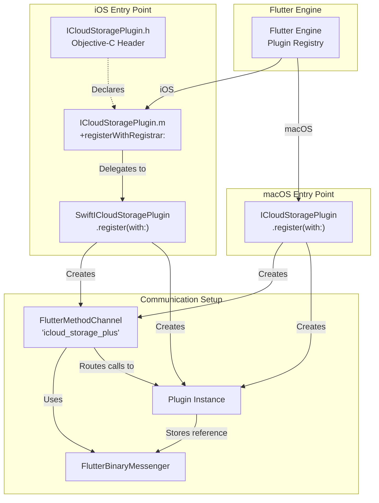
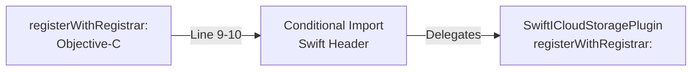
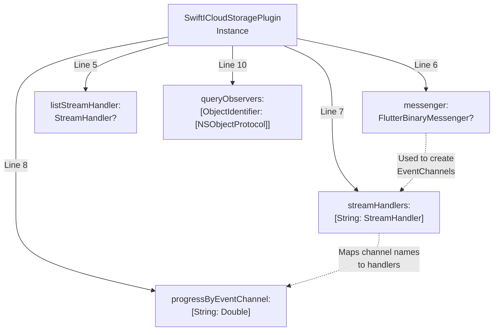
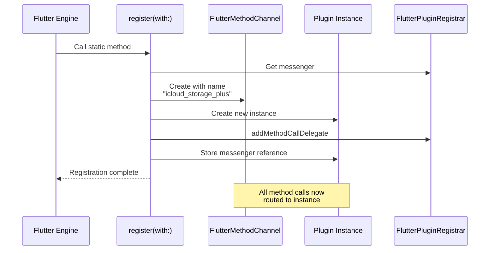
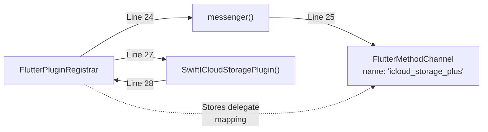
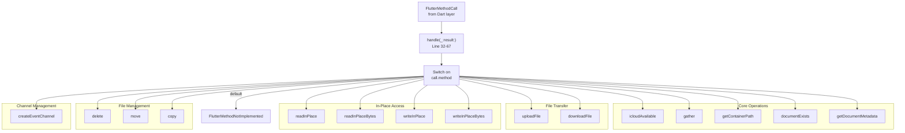
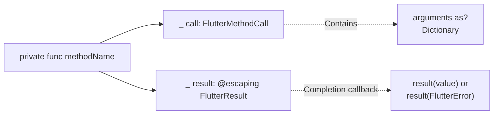

# Plugin Registration and Entry Points

Relevant source files

The following files were used as context for generating this wiki page:

- [ios/Classes/ICloudStoragePlugin.h](../../ios/Classes/ICloudStoragePlugin.h)
- [ios/Classes/ICloudStoragePlugin.m](../../ios/Classes/ICloudStoragePlugin.m)
- [ios/Classes/iOSICloudStoragePlugin.swift](../../ios/Classes/iOSICloudStoragePlugin.swift)
- [macos/Classes/macOSICloudStoragePlugin.swift](../../macos/Classes/macOSICloudStoragePlugin.swift)

## Purpose and Scope

This document explains how the `icloud_storage_plus` plugin registers itself with the Flutter engine and establishes the initial communication channels between Dart and native code. It covers the Objective-C bridging layer used on iOS, the Swift plugin entry point classes on both iOS and macOS, and the method routing mechanism that dispatches incoming platform channel calls to the appropriate native handlers.

For an overview of the native implementation architecture, see [Native Layer Overview](#4.4). For details on the document classes used to implement file operations, see [Document Classes](#5.2).

---

## Registration Architecture Overview

The plugin uses Flutter's standard plugin registration pattern with platform-specific entry points. On iOS, an Objective-C bridging layer delegates to a Swift implementation, while macOS uses Swift directly.

**Sources:** [ios/Classes/ICloudStoragePlugin.h](), [ios/Classes/ICloudStoragePlugin.m](), [ios/Classes/iOSICloudStoragePlugin.swift:1-29](), [macos/Classes/macOSICloudStoragePlugin.swift:1-28]()

---

## iOS Objective-C Bridging Layer

iOS requires an Objective-C entry point because Flutter's plugin registration mechanism expects Objective-C-compatible classes. The plugin uses a thin bridging layer that immediately delegates to Swift.

### Header Declaration

The header file declares the plugin class and conforms to the `FlutterPlugin` protocol:

**File:** [ios/Classes/ICloudStoragePlugin.h]()

| Line | Content | Purpose |
|------|---------|---------|
| 1 | `#import <Flutter/Flutter.h>` | Imports Flutter plugin framework |
| 3 | `@interface ICloudStoragePlugin : NSObject<FlutterPlugin>` | Declares plugin class conforming to `FlutterPlugin` |

### Bridging Implementation

The implementation file bridges to the Swift class using conditional imports to support different build configurations:

**File:** [ios/Classes/ICloudStoragePlugin.m]()

The conditional import at [ios/Classes/ICloudStoragePlugin.m:2-6]() handles two build scenarios:
- Framework build: `<icloud_storage_plus/icloud_storage_plus-Swift.h>`
- Static library build: `"icloud_storage_plus-Swift.h"`

The Objective-C `+registerWithRegistrar:` method at [ios/Classes/ICloudStoragePlugin.m:9-11]() immediately delegates to the Swift implementation.

**Sources:** [ios/Classes/ICloudStoragePlugin.h](), [ios/Classes/ICloudStoragePlugin.m]()

---

## Swift Plugin Entry Point Classes

### iOS: SwiftICloudStoragePlugin

The iOS plugin uses the `SwiftICloudStoragePlugin` class as the Swift entry point:

**File:** [ios/Classes/iOSICloudStoragePlugin.swift:4-29]()

| Component | Description |
|-----------|-------------|
| Class name | `SwiftICloudStoragePlugin` |
| Inheritance | `NSObject` |
| Protocol | `FlutterPlugin` |
| Channel name | `"icloud_storage_plus"` |

Key properties stored in the plugin instance:

**Sources:** [ios/Classes/iOSICloudStoragePlugin.swift:4-20]()

### macOS: ICloudStoragePlugin

The macOS plugin uses `ICloudStoragePlugin` (without the "Swift" prefix) but has an identical structure:

**File:** [macos/Classes/macOSICloudStoragePlugin.swift:4-28]()

| Component | Description |
|-----------|-------------|
| Class name | `ICloudStoragePlugin` |
| Inheritance | `NSObject` |
| Protocol | `FlutterPlugin` |
| Channel name | `"icloud_storage_plus"` |

The macOS version has identical instance properties and structure to the iOS version. The only differences are:
- Class name (no "Swift" prefix)
- Import statement: `import FlutterMacOS` instead of `import Flutter`

**Sources:** [macos/Classes/macOSICloudStoragePlugin.swift:1-20]()

---

## Plugin Registration Method

Both iOS and macOS plugins implement the static `register(with:)` method required by the `FlutterPlugin` protocol. This method is called by the Flutter engine during app initialization.

### Registration Sequence

**Sources:** [ios/Classes/iOSICloudStoragePlugin.swift:22-29](), [macos/Classes/macOSICloudStoragePlugin.swift:22-28]()

### iOS Implementation Details

**File:** [ios/Classes/iOSICloudStoragePlugin.swift:22-29]()

The registration process:
1. **Line 24**: Extract the binary messenger from the registrar
2. **Line 25**: Create a `FlutterMethodChannel` named `"icloud_storage_plus"`
3. **Line 26**: Instantiate the plugin class
4. **Line 27**: Register the instance as the method call delegate for the channel
5. **Line 28**: Store the messenger reference in the instance for later use (creating event channels)

**Sources:** [ios/Classes/iOSICloudStoragePlugin.swift:22-29]()

### macOS Implementation Details

**File:** [macos/Classes/macOSICloudStoragePlugin.swift:22-28]()

The macOS implementation is nearly identical, with one difference: the registrar property access uses `registrar.messenger` (direct property access) instead of `registrar.messenger()` (method call).

**Sources:** [macos/Classes/macOSICloudStoragePlugin.swift:22-28]()

---

## Method Call Routing

After registration, all method calls from Dart arrive at the `handle(_:result:)` method, which routes them to appropriate handlers.

### Routing Architecture

**Sources:** [ios/Classes/iOSICloudStoragePlugin.swift:31-67](), [macos/Classes/macOSICloudStoragePlugin.swift:31-66]()

### Method Routing Table

**File:** [ios/Classes/iOSICloudStoragePlugin.swift:32-66]()

| Method Name | Handler | Purpose | Line |
|-------------|---------|---------|------|
| `icloudAvailable` | `icloudAvailable(_:)` | Check if iCloud is available | 34-35 |
| `gather` | `gather(_:_:)` | List files using NSMetadataQuery | 36-37 |
| `uploadFile` | `uploadFile(_:_:)` | Copy local file to iCloud | 38-39 |
| `downloadFile` | `downloadFile(_:_:)` | Copy iCloud file to local | 40-41 |
| `readInPlace` | `readInPlace(_:_:)` | Read text file in-place | 42-43 |
| `readInPlaceBytes` | `readInPlaceBytes(_:_:)` | Read binary file in-place | 44-45 |
| `writeInPlace` | `writeInPlace(_:_:)` | Write text file in-place | 46-47 |
| `writeInPlaceBytes` | `writeInPlaceBytes(_:_:)` | Write binary file in-place | 48-49 |
| `delete` | `delete(_:_:)` | Delete file with coordination | 50-51 |
| `move` | `move(_:_:)` | Move file within container | 52-53 |
| `copy` | `copy(_:_:)` | Copy file within container | 54-55 |
| `createEventChannel` | `createEventChannel(_:_:)` | Set up event streaming | 56-57 |
| `getContainerPath` | `getContainerPath(_:_:)` | Get container filesystem path | 58-59 |
| `documentExists` | `documentExists(_:_:)` | Check if file exists | 60-61 |
| `getDocumentMetadata` | `getDocumentMetadata(_:_:)` | Get metadata without downloading | 62-63 |
| `default` | `result(FlutterMethodNotImplemented)` | Unknown method | 64-65 |

The switch statement provides a clean dispatch mechanism where each case extracts the method name from the `FlutterMethodCall` and invokes the corresponding private handler method.

**Sources:** [ios/Classes/iOSICloudStoragePlugin.swift:31-67](), [macos/Classes/macOSICloudStoragePlugin.swift:31-66]()

### Handler Method Signature Pattern

All handler methods follow a consistent signature pattern:

Pattern structure:
- **Access level**: `private` - handlers are internal to the plugin
- **Parameter 1**: `FlutterMethodCall` - contains method name and arguments dictionary
- **Parameter 2**: `@escaping FlutterResult` - completion callback for async results
- **Arguments**: Extracted via `call.arguments as? Dictionary<String, Any>`
- **Return**: Results sent via `result(value)` or `result(FlutterError)`

**Sources:** [ios/Classes/iOSICloudStoragePlugin.swift:32-67]()

---

## Platform Differences Summary

While the iOS and macOS implementations share identical structure and logic, there are key differences in setup:

| Aspect | iOS | macOS |
|--------|-----|-------|
| **Class name** | `SwiftICloudStoragePlugin` | `ICloudStoragePlugin` |
| **Bridging layer** | Required (Objective-C → Swift) | Not required |
| **Import statement** | `import Flutter`, `import UIKit` | `import FlutterMacOS`, `import Cocoa` |
| **Registrar messenger access** | `registrar.messenger()` (method) | `registrar.messenger` (property) |
| **Document base class** | `UIDocument` | `NSDocument` |

The differences stem from:
1. **iOS plugin discovery**: Flutter's iOS plugin architecture requires Objective-C entry points
2. **Framework APIs**: iOS uses UIKit/UIDocument while macOS uses AppKit/NSDocument
3. **Platform conventions**: Different property/method access patterns between iOS and macOS frameworks

Despite these differences, the core registration flow, method routing, and operation implementations are functionally identical.

**Sources:** [ios/Classes/ICloudStoragePlugin.m](), [ios/Classes/iOSICloudStoragePlugin.swift:1-29](), [macos/Classes/macOSICloudStoragePlugin.swift:1-28]()

---

## Error Handling Constants

Both plugin classes define standardized error constants used throughout the implementation:

**File:** [ios/Classes/iOSICloudStoragePlugin.swift:11-20, 1163-1171]()

| Error Constant | Code | Message | Usage |
|----------------|------|---------|-------|
| `argumentError` | `E_ARG` | "Invalid Arguments" | Missing/invalid method arguments |
| `containerError` | `E_CTR` | "Invalid containerId, or user is not signed in, or user disabled iCloud permission" | Container access failures |
| `fileNotFoundError` | `E_FNF` | "The file does not exist" | Generic file not found |
| `fileNotFoundReadError` | `E_FNF_READ` | "The file could not be read because it does not exist" | Read operation file not found |
| `fileNotFoundWriteError` | `E_FNF_WRITE` | "The file could not be written because it does not exist" | Write operation file not found |
| `initializationError` | `E_INIT` | "Plugin not properly initialized" | Messenger not set |
| `timeoutError` | `E_TIMEOUT` | "The download did not make progress before timing out" | Download idle timeout |

These constants are defined as instance properties so they can be referenced throughout the plugin implementation using `self.argumentError`, `self.containerError`, etc.

**Sources:** [ios/Classes/iOSICloudStoragePlugin.swift:11-20, 1163-1171](), [macos/Classes/macOSICloudStoragePlugin.swift:11-20, 1162-1170]()