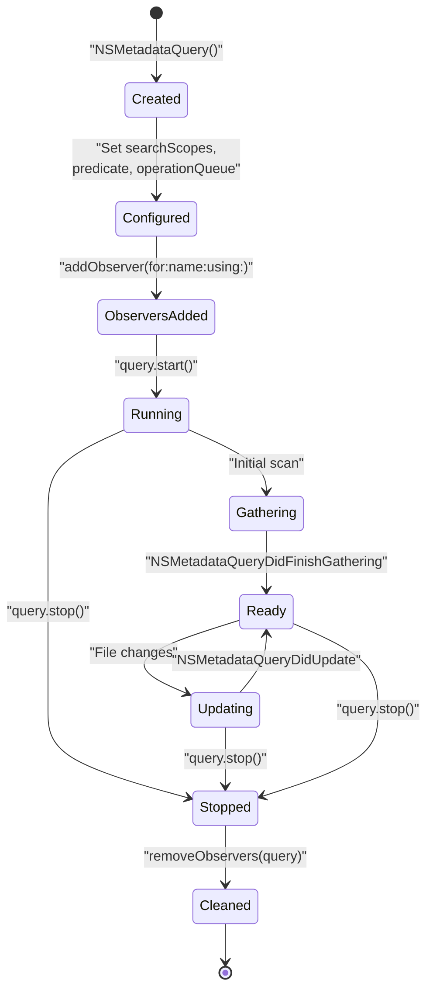
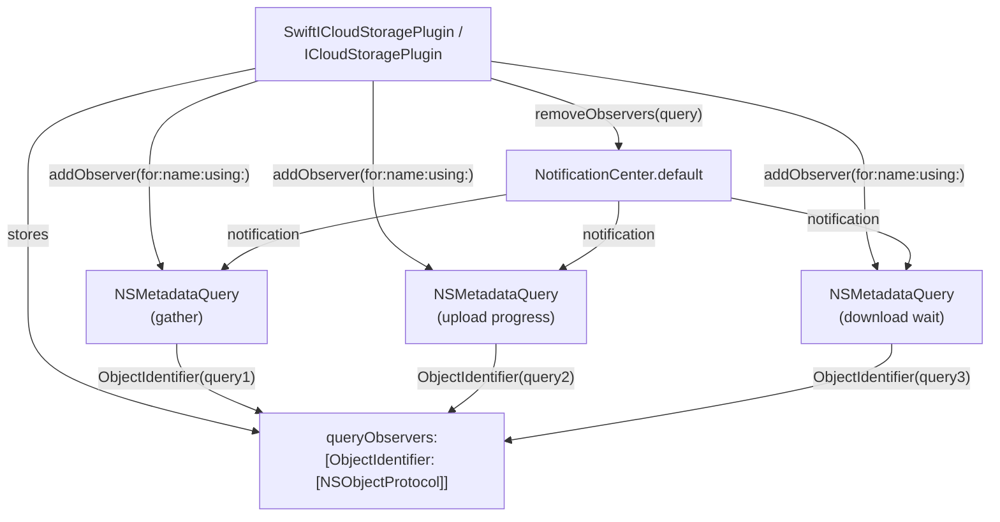
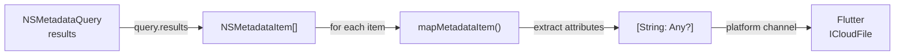
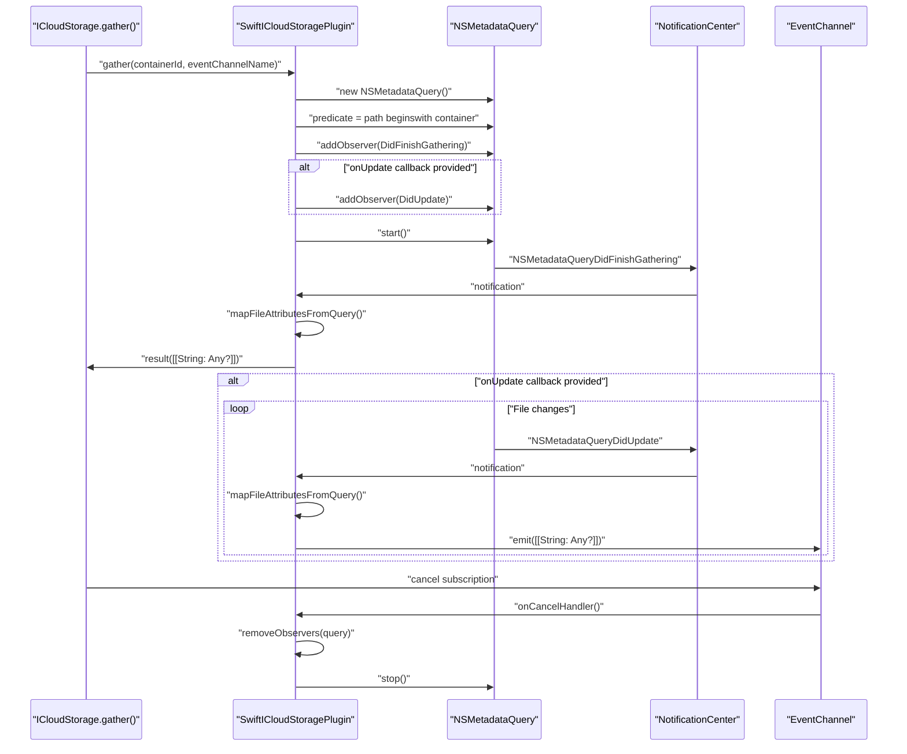
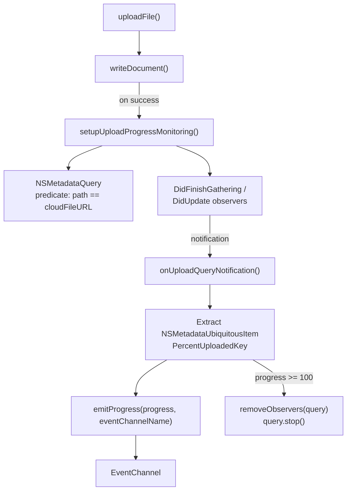
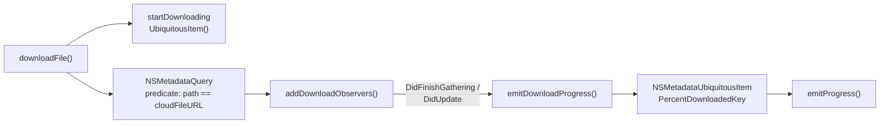
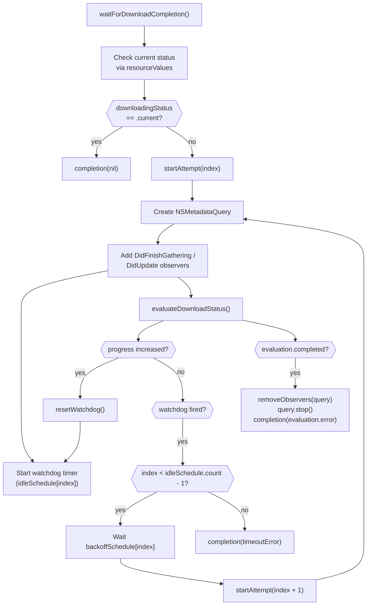

# Metadata Queries

<details>
<summary>Relevant source files</summary>

The following files were used as context for generating this wiki page:

- [README.md](../../README.md)
- [ios/Classes/iOSICloudStoragePlugin.swift](../../ios/Classes/iOSICloudStoragePlugin.swift)
- [macos/Classes/macOSICloudStoragePlugin.swift](../../macos/Classes/macOSICloudStoragePlugin.swift)

</details>


## Purpose and Scope

This document describes how the plugin uses Apple's `NSMetadataQuery` API to monitor iCloud files, track sync progress, and provide real-time metadata updates. It covers query configuration, observer management, metadata attribute extraction, and the four distinct use cases: file listing (`gather`), upload progress monitoring, download progress monitoring, and download completion detection.

For information about file coordination mechanisms, see [File Coordination](#5.4). For conflict resolution that uses metadata to detect conflicts, see [Conflict Resolution](#5.6). For how progress updates are streamed to Dart, see [Event Channels and Streaming](#4.3).

---

## Overview

`NSMetadataQuery` provides live monitoring of iCloud files without polling. The plugin uses it to observe file metadata changes, sync progress, and container contents. All queries operate on the main queue and search both `NSMetadataQueryUbiquitousDataScope` and `NSMetadataQueryUbiquitousDocumentsScope` to capture all container files.

The native layer maintains a registry of active queries and their associated observers, ensuring proper cleanup when queries are cancelled or complete.

**Sources**: [ios/Classes/iOSICloudStoragePlugin.swift:9](), [macos/Classes/macOSICloudStoragePlugin.swift:9]()

---

## Query Lifecycle

### State Diagram



**Sources**: [ios/Classes/iOSICloudStoragePlugin.swift:119-134](), [macos/Classes/macOSICloudStoragePlugin.swift:119-134]()

### Configuration Pattern

Every metadata query follows this initialization pattern:

```swift
let query = NSMetadataQuery()
query.operationQueue = .main
query.searchScopes = [NSMetadataQueryUbiquitousDataScope, 
                      NSMetadataQueryUbiquitousDocumentsScope]
query.predicate = NSPredicate(/* filtering logic */)
```

The plugin uses two predicate patterns:

1. **Container-wide**: `format: "%K beginswith %@", NSMetadataItemPathKey, containerURL.path` - Lists all files
2. **Single file**: `format: "%K == %@", NSMetadataItemPathKey, fileURL.path` - Monitors one file

**Sources**: [ios/Classes/iOSICloudStoragePlugin.swift:119-123](), [ios/Classes/iOSICloudStoragePlugin.swift:289-293]()

---

## Observer Management System

### Architecture



**Sources**: [ios/Classes/iOSICloudStoragePlugin.swift:10](), [ios/Classes/iOSICloudStoragePlugin.swift:1098-1124]()

### Observer Registration

The `addObserver(for:name:using:)` method registers notification handlers and tracks them for cleanup:

**Implementation Location**: [ios/Classes/iOSICloudStoragePlugin.swift:1098-1114](), [macos/Classes/macOSICloudStoragePlugin.swift:1097-1113]()

**Registration Flow**:

1. Call `NotificationCenter.default.addObserver(forName:object:queue:using:)` with the query's operation queue
2. Receive observer token
3. Use `ObjectIdentifier(query)` as dictionary key
4. Append token to existing array or create new array
5. Store in `queryObservers` registry

**Cleanup Flow**:

The `removeObservers(_:)` method removes all observers for a query:

**Implementation Location**: [ios/Classes/iOSICloudStoragePlugin.swift:1116-1124](), [macos/Classes/macOSICloudStoragePlugin.swift:1115-1123]()

1. Retrieve tokens using `ObjectIdentifier(query)`
2. Call `NotificationCenter.default.removeObserver(token)` for each
3. Remove entry from `queryObservers` dictionary

This prevents memory leaks and ensures observers don't fire after queries are stopped.

**Sources**: [ios/Classes/iOSICloudStoragePlugin.swift:1098-1124](), [macos/Classes/macOSICloudStoragePlugin.swift:1097-1123]()

---

## Metadata Attribute Mapping

### Extraction Pipeline



**Sources**: [ios/Classes/iOSICloudStoragePlugin.swift:164-175](), [ios/Classes/iOSICloudStoragePlugin.swift:179-198]()

### Attribute Table

The `mapMetadataItem(_:containerURL:)` method extracts these attributes from each `NSMetadataItem`:

| Attribute Key | Metadata Key | Type | Purpose |
|---------------|--------------|------|---------|
| `relativePath` | `NSMetadataItemURLKey` | `String` | Container-relative file path |
| `isDirectory` | (URL property) | `Bool` | Directory vs file distinction |
| `sizeInBytes` | `NSMetadataItemFSSizeKey` | `Int?` | File size (null for directories) |
| `creationDate` | `NSMetadataItemFSCreationDateKey` | `Double?` | Unix timestamp |
| `contentChangeDate` | `NSMetadataItemFSContentChangeDateKey` | `Double?` | Last modification timestamp |
| `hasUnresolvedConflicts` | `NSMetadataUbiquitousItemHasUnresolvedConflictsKey` | `Bool` | Conflict detection flag |
| `downloadStatus` | `NSMetadataUbiquitousItemDownloadingStatusKey` | `String?` | "Current", "NotDownloaded", etc. |
| `isDownloading` | `NSMetadataUbiquitousItemIsDownloadingKey` | `Bool` | Active download flag |
| `isUploaded` | `NSMetadataUbiquitousItemIsUploadedKey` | `Bool` | Upload complete flag |
| `isUploading` | `NSMetadataUbiquitousItemIsUploadingKey` | `Bool` | Active upload flag |

**Implementation Location**: [ios/Classes/iOSICloudStoragePlugin.swift:179-198](), [macos/Classes/macOSICloudStoragePlugin.swift:179-198]()

**Fallback Strategy**:

When metadata is unavailable (rare edge cases), the plugin falls back to `URLResourceValues`:

**Implementation Location**: [ios/Classes/iOSICloudStoragePlugin.swift:200-218](), [macos/Classes/macOSICloudStoragePlugin.swift:200-218]()

The `mapResourceValues(fileURL:values:containerURL:)` method extracts the same attributes using `URLResourceKeys` like `.fileSizeKey`, `.creationDateKey`, `.ubiquitousItemDownloadingStatusKey`, etc.

**Sources**: [ios/Classes/iOSICloudStoragePlugin.swift:179-218](), [macos/Classes/macOSICloudStoragePlugin.swift:179-218]()

---

## Use Case: File Listing (gather)

### Query Configuration

The `gather()` method uses a container-wide predicate to list all files:



**Sources**: [ios/Classes/iOSICloudStoragePlugin.swift:94-134](), [macos/Classes/macOSICloudStoragePlugin.swift:94-134]()

### Observer Setup

The `addGatherFilesObservers()` method registers two notification handlers:

**Implementation Location**: [ios/Classes/iOSICloudStoragePlugin.swift:136-162](), [macos/Classes/macOSICloudStoragePlugin.swift:136-162]()

1. **DidFinishGathering**: Returns initial file list, stops query if no streaming requested
2. **DidUpdate** (optional): Streams full file list on every container change

The update observer is only registered when `eventChannelName` is non-empty, enabling continuous monitoring.

**Cleanup Trigger**: When Flutter cancels the event stream, `onCancelHandler` is invoked, which calls `removeObservers(query)` and `query.stop()`.

**Sources**: [ios/Classes/iOSICloudStoragePlugin.swift:136-162](), [macos/Classes/macOSICloudStoragePlugin.swift:136-162]()

---

## Use Case: Upload Progress Monitoring

### Query Configuration

The `setupUploadProgressMonitoring()` method monitors a single file's upload progress:



**Sources**: [ios/Classes/iOSICloudStoragePlugin.swift:287-306](), [ios/Classes/iOSICloudStoragePlugin.swift:309-375]()

### Progress Extraction

The `onUploadQueryNotification()` method extracts progress from query results:

**Implementation Location**: [ios/Classes/iOSICloudStoragePlugin.swift:331-375](), [macos/Classes/macOSICloudStoragePlugin.swift:331-375]()

**Steps**:

1. Verify query is running and has results
2. Extract `NSMetadataUbiquitousItemPercentUploadedKey` from first result
3. Check for upload errors via `ubiquitousItemUploadingError`
4. Emit progress value (0-100) to event channel
5. Stop query and cleanup observers when progress reaches 100

**Error Handling**: If `ubiquitousItemUploadingError` is present, emit the error to the stream, then emit `FlutterEndOfEventStream` to close it.

**Sources**: [ios/Classes/iOSICloudStoragePlugin.swift:331-375](), [macos/Classes/macOSICloudStoragePlugin.swift:331-375]()

---

## Use Case: Download Progress Monitoring

### Query Configuration

Download progress monitoring follows the same pattern as uploads but uses `NSMetadataUbiquitousItemPercentDownloadedKey`:

**Implementation Location**: [ios/Classes/iOSICloudStoragePlugin.swift:688-726](), [macos/Classes/macOSICloudStoragePlugin.swift:688-726]()



**Sources**: [ios/Classes/iOSICloudStoragePlugin.swift:415-451](), [ios/Classes/iOSICloudStoragePlugin.swift:688-726]()

### Progress Emission

The `emitDownloadProgress()` method is simpler than upload progress because it only reports the percentage:

**Implementation Location**: [ios/Classes/iOSICloudStoragePlugin.swift:714-726](), [macos/Classes/macOSICloudStoragePlugin.swift:714-726]()

1. Check query is running
2. Extract `NSMetadataUbiquitousItemPercentDownloadedKey` from first result
3. Call `emitProgress(progress, eventChannelName)` to update stream

The query remains active throughout the download. Cleanup occurs in the `readDocumentAt()` completion handler, not in the progress observer.

**Sources**: [ios/Classes/iOSICloudStoragePlugin.swift:714-726](), [macos/Classes/macOSICloudStoragePlugin.swift:714-726]()

---

## Use Case: Download Completion Detection

### Watchdog Timer Strategy

The `waitForDownloadCompletion()` method uses metadata queries with idle watchdog timers for in-place read operations:



**Sources**: [ios/Classes/iOSICloudStoragePlugin.swift:733-837](), [macos/Classes/macOSICloudStoragePlugin.swift:733-837]()

### Implementation Details

**Idle Timeout Schedule**: [ios/Classes/iOSICloudStoragePlugin.swift:752]()

Default: `[60, 90, 180]` seconds. The watchdog timer resets only when progress advances, not on every notification. This avoids false timeouts for large files with slow download speeds.

**Retry Backoff**: [ios/Classes/iOSICloudStoragePlugin.swift:753]()

Default: `[2, 4]` seconds between retry attempts.

**Evaluation Strategy**: [ios/Classes/iOSICloudStoragePlugin.swift:839-867]()

The `evaluateDownloadStatus()` method uses a two-stage resolution:

1. **Index check**: Use URL from `NSMetadataItemURLKey` if available (handles recent moves/renames)
2. **Filesystem fallback**: Use original `fileURL` if metadata query returns no results (avoids metadata indexing delays)

This dual approach ensures reliability even when metadata indexing lags behind filesystem changes.

**Completion Conditions**:

- `downloadingStatus == .current`: Download complete, proceed with read
- `downloadingError != nil`: Report error immediately
- All retries exhausted: Report timeout error (`E_TIMEOUT`)

**Sources**: [ios/Classes/iOSICloudStoragePlugin.swift:733-867](), [macos/Classes/macOSICloudStoragePlugin.swift:733-867]()

---

## Lifecycle Management

### Cleanup Patterns

Every query follows this cleanup pattern:

| Trigger | Actions |
|---------|---------|
| Operation complete | `removeObservers(query)` → `query.stop()` → remove from tracking |
| Stream cancelled | `onCancelHandler()` → `removeObservers(query)` → `query.stop()` |
| Error occurs | emit error → `FlutterEndOfEventStream` → cleanup |
| Progress reaches 100% | emit final progress → cleanup |
| Download timeout | `watchdogTimer.invalidate()` → cleanup |

**Implementation Locations**:

- Gather cleanup: [ios/Classes/iOSICloudStoragePlugin.swift:127-131]()
- Upload cleanup: [ios/Classes/iOSICloudStoragePlugin.swift:356-360](), [ios/Classes/iOSICloudStoragePlugin.swift:369-372]()
- Download cleanup: [ios/Classes/iOSICloudStoragePlugin.swift:463-468](), [ios/Classes/iOSICloudStoragePlugin.swift:474-478]()
- Wait cleanup: [ios/Classes/iOSICloudStoragePlugin.swift:784-804]()

**Sources**: [ios/Classes/iOSICloudStoragePlugin.swift:127-131](), [ios/Classes/iOSICloudStoragePlugin.swift:356-372](), [ios/Classes/iOSICloudStoragePlugin.swift:463-478](), [ios/Classes/iOSICloudStoragePlugin.swift:784-804]()

### Query Tracking

The plugin maintains these tracking structures:

**Structure** | **Purpose** | **Location**
-------------|-------------|-------------
`queryObservers: [ObjectIdentifier: [NSObjectProtocol]]` | Observer tokens per query | [ios/Classes/iOSICloudStoragePlugin.swift:10]()
`streamHandlers: [String: StreamHandler]` | Event channel handlers | [ios/Classes/iOSICloudStoragePlugin.swift:7]()
`progressByEventChannel: [String: Double]` | Monotonic progress tracking | [ios/Classes/iOSICloudStoragePlugin.swift:8]()

When queries are cleaned up, the plugin removes entries from `queryObservers` but delegates stream handler cleanup to `removeStreamHandler(_:)`, which clears both `streamHandlers` and `progressByEventChannel`.

**Sources**: [ios/Classes/iOSICloudStoragePlugin.swift:7-10](), [ios/Classes/iOSICloudStoragePlugin.swift:1116-1124](), [ios/Classes/iOSICloudStoragePlugin.swift:1148-1152]()