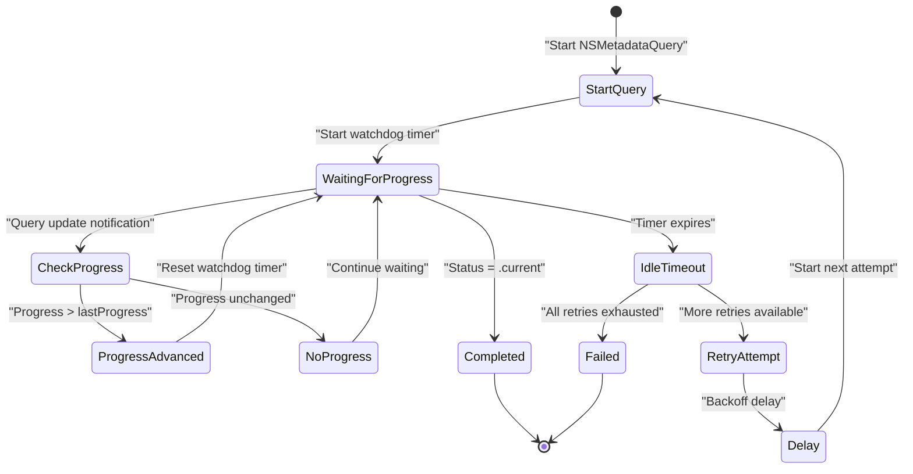
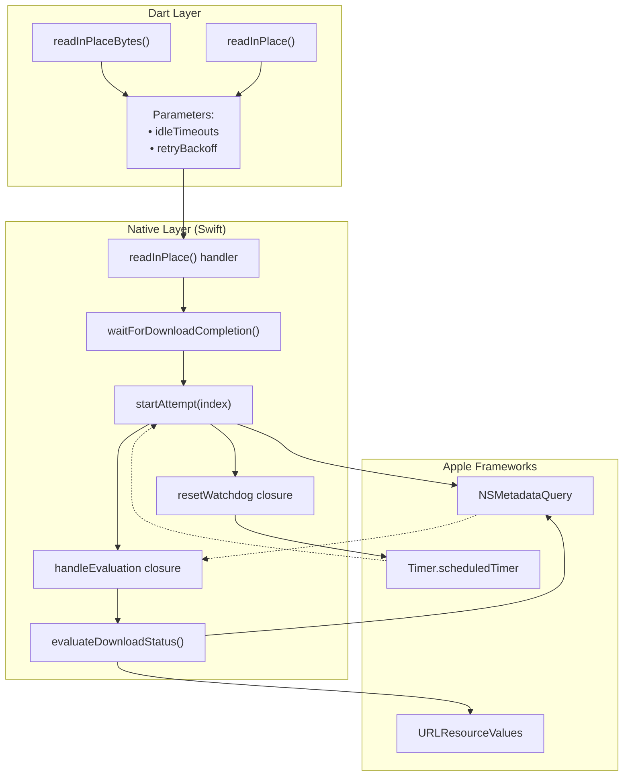
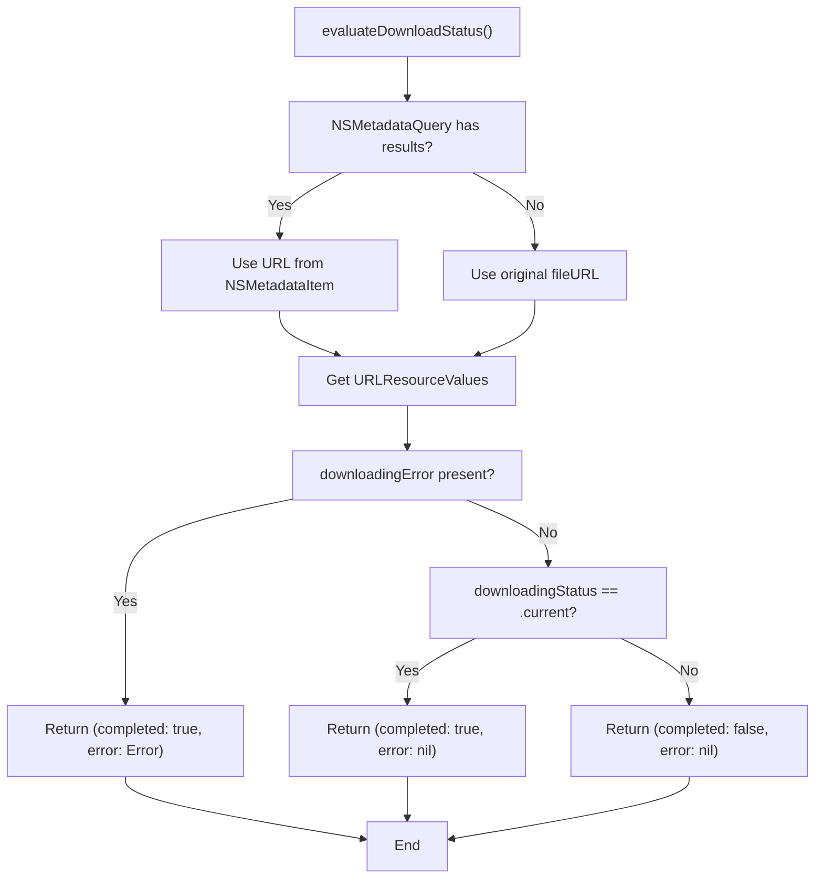
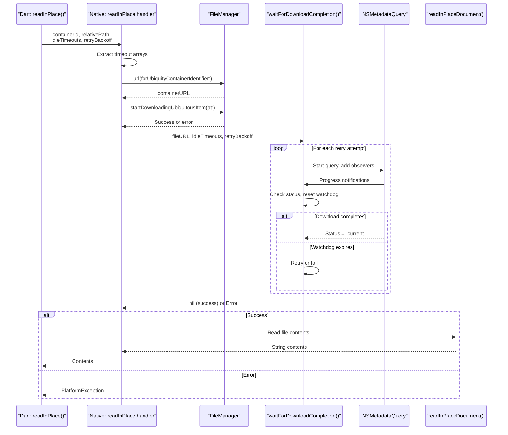
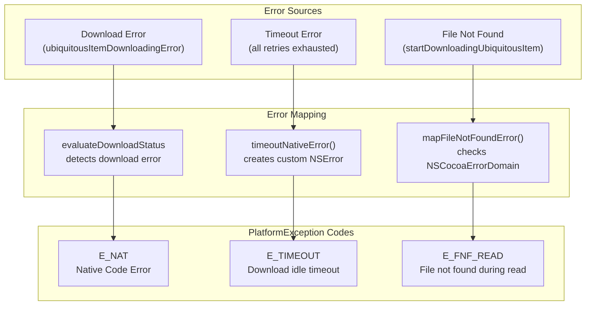
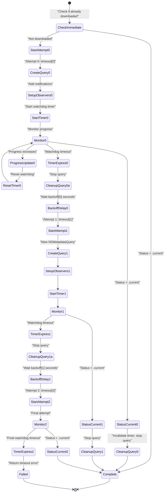

# Download Retry Logic

<details>
<summary>Relevant source files</summary>

The following files were used as context for generating this wiki page:

- [README.md](../../README.md)
- [ios/Classes/iOSICloudStoragePlugin.swift](../../ios/Classes/iOSICloudStoragePlugin.swift)
- [lib/icloud_storage.dart](../../lib/icloud_storage.dart)
- [macos/Classes/macOSICloudStoragePlugin.swift](../../macos/Classes/macOSICloudStoragePlugin.swift)

</details>


## Purpose and Scope

This page documents the download retry logic used by the `readInPlace` and `readInPlaceBytes` operations to reliably wait for iCloud downloads to complete. The system implements an **idle watchdog pattern** with automatic retry and exponential backoff to handle network stalls and temporary failures.

For general information about in-place access operations, see [In-Place Access Operations](#3.2). For progress monitoring during file transfers, see [Progress Monitoring](#6.1).

**Sources:** [README.md:80-84](), [lib/icloud_storage.dart:183-208]()

## Overview

The download retry logic solves a critical problem: iCloud downloads can stall indefinitely without failing. The plugin cannot use hard timeouts (e.g., "fail after 60 seconds") because large files on slow connections may take longer than any fixed timeout. Instead, the system uses an **idle watchdog** that only triggers when download progress stops advancing.

The retry mechanism is exclusively used by coordinated in-place reads (`readInPlace` and `readInPlaceBytes`), which must wait for files to download before reading their contents. Upload operations and file transfers do not use this mechanism.

**Key Features:**
- Idle watchdog timer that resets when progress advances
- Configurable retry schedule with exponential backoff
- Fallback to filesystem checks when metadata query is slow
- Automatic conflict resolution during download

**Sources:** [ios/Classes/iOSICloudStoragePlugin.swift:728-837](), [README.md:76-100]()

## Idle Watchdog Pattern

### How It Works

Unlike traditional timeouts that measure absolute elapsed time, the idle watchdog only fires when the download **stops making progress**. Every time the download progress percentage increases, the watchdog timer resets.



**Sources:** [ios/Classes/iOSICloudStoragePlugin.swift:733-837](), [macos/Classes/macOSICloudStoragePlugin.swift:733-837]()

### Watchdog Timer Lifecycle

The watchdog timer behavior is implemented in the `waitForDownloadCompletion` function's `resetWatchdog` closure:

| Event | Action |
|-------|--------|
| Query starts | Initialize timer with `idleSchedule[attemptIndex]` |
| Progress increases | Invalidate old timer, create new timer with same duration |
| Timer expires | Stop query, either retry with backoff or fail |
| Download completes | Invalidate timer, stop query, complete successfully |

The timer invalidation ensures that only the most recent timer can fire, preventing race conditions when multiple progress updates occur rapidly.

**Sources:** [ios/Classes/iOSICloudStoragePlugin.swift:775-796](), [macos/Classes/macOSICloudStoragePlugin.swift:775-796]()

## Retry Schedule Configuration

### Default Schedules

The plugin provides sensible defaults that balance responsiveness with resilience:

```dart
// Default idle timeouts for each retry attempt
idleTimeouts: [60, 90, 180]  // seconds

// Default backoff delays between retry attempts
retryBackoff: [2, 4]  // seconds
```

This configuration means:
- **Attempt 1:** 60-second idle timeout
- **Delay:** 2 seconds
- **Attempt 2:** 90-second idle timeout  
- **Delay:** 4 seconds
- **Attempt 3:** 180-second idle timeout (final)

**Sources:** [ios/Classes/iOSICloudStoragePlugin.swift:752-753](), [README.md:82-83]()

### Custom Configuration

Callers can override both schedules via Dart parameters:

```dart
final contents = await ICloudStorage.readInPlace(
  containerId: 'iCloud.com.yourapp',
  relativePath: 'Documents/file.txt',
  idleTimeouts: [30, 60, 120],  // More aggressive
  retryBackoff: [1, 2, 4],       // Faster retries
);
```

The schedules are independent:
- **Idle timeouts** control when to give up on each attempt
- **Retry backoff** controls the delay between attempts
- If backoff schedule is shorter than timeout schedule, the last backoff value is reused

**Sources:** [lib/icloud_storage.dart:186-187](), [lib/icloud_storage.dart:223-224]()

## Implementation Architecture

### Core Components



**Sources:** [ios/Classes/iOSICloudStoragePlugin.swift:484-538](), [ios/Classes/iOSICloudStoragePlugin.swift:733-867]()

### Function Call Hierarchy

The retry logic spans multiple nested functions with closures for state management:

| Function | Lines (iOS) | Responsibility |
|----------|-------------|----------------|
| `readInPlace` / `readInPlaceBytes` | 484-538, 584-642 | Entry point, parameter extraction |
| `waitForDownloadCompletion` | 733-837 | Outer loop, retry orchestration |
| `startAttempt(index:)` | 764-834 | Single attempt execution |
| `resetWatchdog` closure | 778-796 | Watchdog timer management |
| `handleEvaluation` closure | 798-816 | Progress checking, timer reset |
| `evaluateDownloadStatus` | 845-867 | Status inspection via URLResourceValues |

**Sources:** [ios/Classes/iOSICloudStoragePlugin.swift:733-867]()

## Download Status Evaluation

### Two-Stage Resolution Strategy

The `evaluateDownloadStatus` function uses a fallback strategy to handle metadata indexing latency:



**Sources:** [ios/Classes/iOSICloudStoragePlugin.swift:845-867]()

### Why Two-Stage Resolution?

The metadata query can lag behind filesystem changes, especially for recently moved or renamed files. The two-stage approach ensures:

1. **Index check:** Resolve via `NSMetadataQuery` results when available (handles recent moves/renames)
2. **Filesystem fallback:** Use the original `fileURL` if query returns no results (avoids hanging on indexing latency)

This prevents rare hangs where the file exists and is downloading, but the metadata index hasn't caught up yet.

**Sources:** [ios/Classes/iOSICloudStoragePlugin.swift:839-844](), [macos/Classes/macOSICloudStoragePlugin.swift:839-844]()

### Resource Keys Inspected

```swift
// Keys checked in evaluateDownloadStatus
.ubiquitousItemDownloadingStatusKey  // Current, notDownloaded, or downloading
.ubiquitousItemDownloadingErrorKey   // Any download failure
```

**Download Status Values:**
- `.current` → File fully downloaded and ready
- `.notDownloaded` → File not yet downloaded
- `.downloading` → Download in progress

**Sources:** [ios/Classes/iOSICloudStoragePlugin.swift:853-854](), [macos/Classes/macOSICloudStoragePlugin.swift:852-853]()

## Progress Tracking and Watchdog Reset

### Progress Attribute

The system tracks download progress using `NSMetadataUbiquitousItemPercentDownloadedKey`, which returns a `Double` between 0.0 and 100.0. The watchdog only resets when this value **increases**:

```swift
if let item = query.results.first as? NSMetadataItem,
   let progress = item.value(
     forAttribute: NSMetadataUbiquitousItemPercentDownloadedKey
   ) as? Double,
   progress > lastProgress {
  lastProgress = progress
  resetWatchdog()
}
```

**Sources:** [ios/Classes/iOSICloudStoragePlugin.swift:808-815]()

### Monotonic Progress Requirement

By requiring `progress > lastProgress` (strict inequality), the system ensures the watchdog only resets for actual forward progress. If the same progress value is reported multiple times, the watchdog continues counting down. This prevents infinite hangs when iCloud reports progress but doesn't actually advance.

**Sources:** [ios/Classes/iOSICloudStoragePlugin.swift:776-777](), [ios/Classes/iOSICloudStoragePlugin.swift:812-814]()

## Integration with In-Place Operations

### Call Flow for readInPlace



**Sources:** [ios/Classes/iOSICloudStoragePlugin.swift:484-538]()

### readInPlaceBytes Flow

The `readInPlaceBytes` operation follows an identical retry flow but calls `readInPlaceBinaryDocument` instead of `readInPlaceDocument` to return binary data:

| Operation | Document Reader | Return Type |
|-----------|----------------|-------------|
| `readInPlace` | `readInPlaceDocument(at:)` | `String?` |
| `readInPlaceBytes` | `readInPlaceBinaryDocument(at:)` | `FlutterStandardTypedData` (Uint8List) |

Both operations share the same `waitForDownloadCompletion` implementation and retry logic.

**Sources:** [ios/Classes/iOSICloudStoragePlugin.swift:584-642](), [macos/Classes/macOSICloudStoragePlugin.swift:584-642]()

## Error Handling

### Error Types and Mapping

The retry logic handles three categories of errors:



**Sources:** [ios/Classes/iOSICloudStoragePlugin.swift:1174-1207]()

### Timeout Error Creation

When all retry attempts are exhausted, the plugin creates a custom timeout error:

```swift
private func timeoutNativeError() -> NSError {
  return NSError(
    domain: "ICloudStorageTimeout",
    code: 1,
    userInfo: [NSLocalizedDescriptionKey: "Download idle timeout"]
  )
}

private func mapTimeoutError(_ error: Error) -> FlutterError? {
  let nsError = error as NSError
  guard nsError.domain == "ICloudStorageTimeout" else { return nil }
  return timeoutError  // "E_TIMEOUT"
}
```

This custom domain allows the plugin to distinguish timeout errors from other native errors and map them to the `E_TIMEOUT` platform exception code.

**Sources:** [ios/Classes/iOSICloudStoragePlugin.swift:1194-1207](), [ios/Classes/iOSICloudStoragePlugin.swift:1167-1171]()

### Error Handling in Dart

From the Dart perspective, timeout errors are thrown as `PlatformException`:

```dart
try {
  final contents = await ICloudStorage.readInPlace(
    containerId: containerId,
    relativePath: 'Documents/file.txt',
  );
} on PlatformException catch (e) {
  if (e.code == PlatformExceptionCode.timeout) {
    // Handle timeout: download stalled
  } else if (e.code == PlatformExceptionCode.fileNotFoundRead) {
    // Handle file not found
  }
}
```

**Sources:** [lib/icloud_storage.dart:183-208](), [README.md:519-573]()

## Retry Attempt Flow

### Complete Attempt Lifecycle



**Sources:** [ios/Classes/iOSICloudStoragePlugin.swift:764-836]()

### Backoff Delay Implementation

The backoff delay is implemented using `DispatchQueue.main.asyncAfter`:

```swift
if index < idleSchedule.count - 1 {
  let delayIndex = min(index, backoffSchedule.count - 1)
  let delay = backoffSchedule[delayIndex]
  DispatchQueue.main.asyncAfter(deadline: .now() + delay) {
    startAttempt(index: index + 1)
  }
  return
}
```

If the backoff schedule is shorter than the idle timeout schedule, the last backoff value is reused for remaining attempts.

**Sources:** [ios/Classes/iOSICloudStoragePlugin.swift:786-792]()

## Configuration Best Practices

### Choosing Timeout Schedules

| Use Case | Recommended Idle Timeouts | Rationale |
|----------|---------------------------|-----------|
| Small files (< 1 MB) | `[30, 45, 60]` | Fast networks should complete quickly |
| Medium files (1-10 MB) | `[60, 90, 180]` (default) | Balance between responsiveness and reliability |
| Large files (> 10 MB) | `[120, 180, 300]` | Allow time for slow connections |
| Development/testing | `[10, 15, 20]` | Fail fast to surface issues |

### Choosing Backoff Schedules

| Use Case | Recommended Retry Backoff | Rationale |
|----------|---------------------------|-----------|
| Transient network issues | `[1, 2, 4]` | Quick retry for temporary glitches |
| Stable networks | `[2, 4]` (default) | Standard exponential backoff |
| Unreliable networks | `[5, 10, 15]` | Give network time to recover |
| Rate-limited APIs | `[10, 30, 60]` | Avoid hammering services |

**Sources:** [README.md:82-83](), [lib/icloud_storage.dart:172-175]()

### Anti-Patterns to Avoid

**❌ Single Long Timeout:**
```dart
// Bad: No retry, one long wait
idleTimeouts: [600]  // 10 minutes
```
If the download stalls at 1%, you wait the full 10 minutes before failing.

**✅ Multiple Shorter Timeouts:**
```dart
// Good: Multiple attempts with reasonable timeouts
idleTimeouts: [60, 90, 120]
```
Each stall only waits up to its timeout before retrying.

**❌ Zero Backoff:**
```dart
// Bad: No delay between retries
retryBackoff: [0, 0, 0]
```
Can overwhelm metadata query system with rapid retries.

**✅ Gradual Backoff:**
```dart
// Good: Exponential backoff
retryBackoff: [2, 4, 8]
```
Gives the system time to recover between attempts.

**Sources:** [lib/icloud_storage.dart:186-187](), [lib/icloud_storage.dart:223-224]()

## Platform Differences

The retry logic implementation is **identical** on iOS and macOS. Both platforms use:
- Same Swift code structure
- Same `NSMetadataQuery` APIs
- Same `URLResourceValues` keys
- Same timer and backoff mechanisms

The only differences are in the containing classes:
- iOS: `SwiftICloudStoragePlugin`
- macOS: `ICloudStoragePlugin`

**Sources:** [ios/Classes/iOSICloudStoragePlugin.swift:733-867](), [macos/Classes/macOSICloudStoragePlugin.swift:733-867]()

## Key Takeaways

1. **Idle watchdog, not hard timeout:** The timer only triggers when progress stops, not based on absolute time
2. **Automatic retry:** Failed attempts are retried with exponential backoff automatically
3. **Configurable resilience:** Both timeout schedule and backoff schedule can be customized per call
4. **Two-stage resolution:** Uses metadata query with filesystem fallback to avoid indexing latency hangs
5. **Only for reads:** This mechanism is exclusively used by `readInPlace` and `readInPlaceBytes`

**Sources:** [README.md:76-100](), [ios/Classes/iOSICloudStoragePlugin.swift:728-837]()