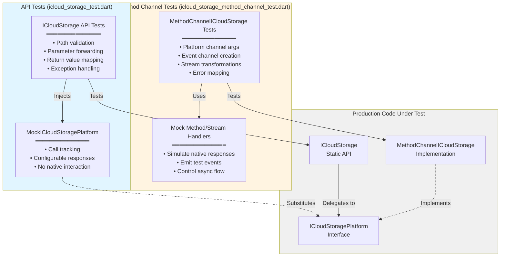
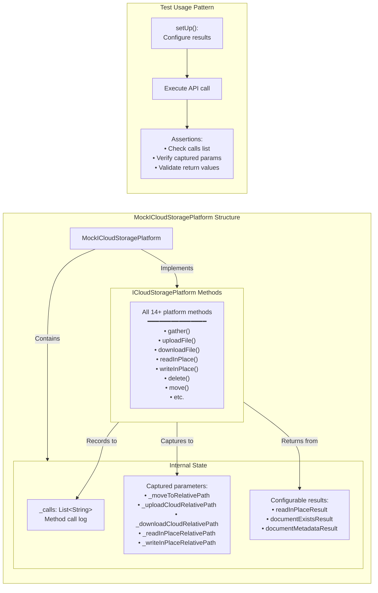
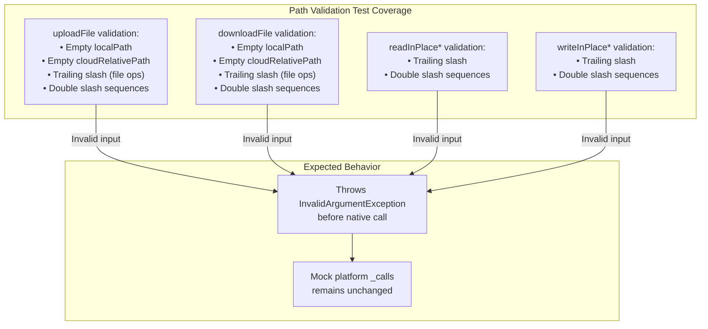
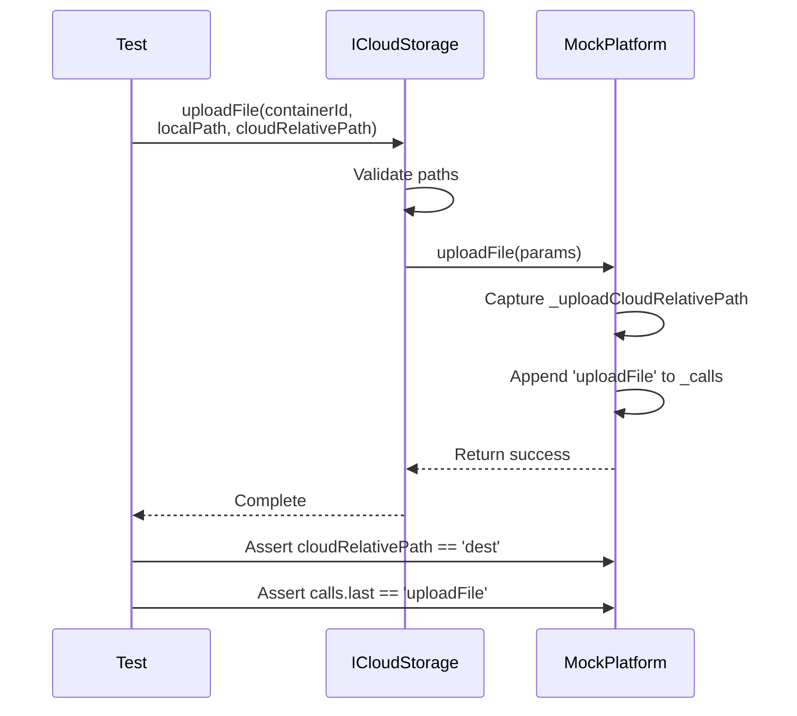
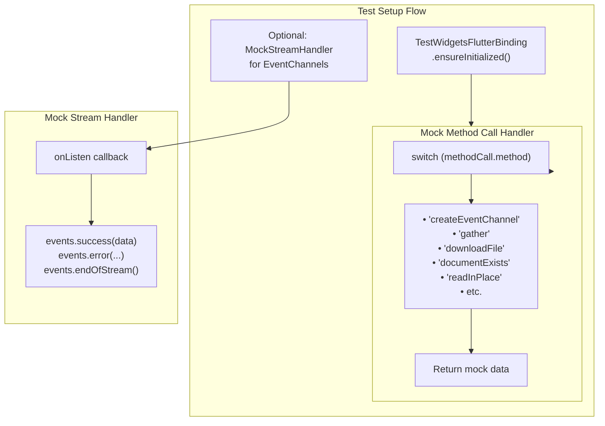
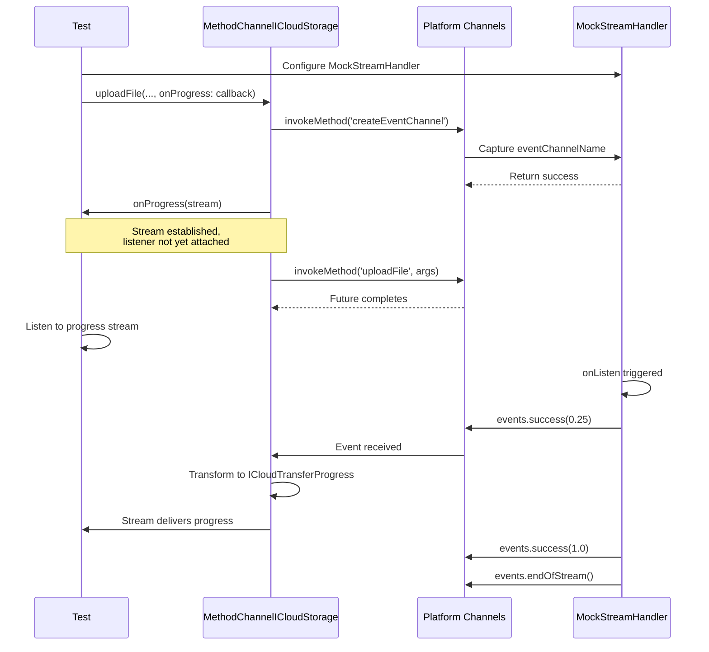
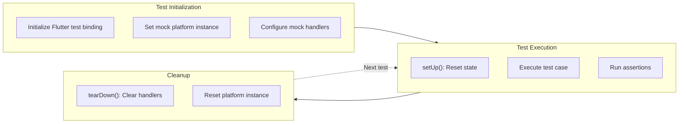

# Testing Guide

<details>
<summary>Relevant source files</summary>

The following files were used as context for generating this wiki page:

- [AGENTS.md](../../AGENTS.md)
- [test/icloud_storage_method_channel_test.dart](../../test/icloud_storage_method_channel_test.dart)
- [test/icloud_storage_test.dart](../../test/icloud_storage_test.dart)

</details>


## Overview

This document describes the test suite for the `icloud_storage_plus` plugin. The tests validate the Dart API layer, platform channel communication, and data transformations between Dart and native code. The tests do **not** cover native iOS/macOS implementations—those require integration testing on actual devices with iCloud configured.

For information about the overall architecture being tested, see [Architecture Overview](#4). For details about specific API operations, see [API Reference](#3).

**Sources**: [test/icloud_storage_test.dart](), [test/icloud_storage_method_channel_test.dart](), [AGENTS.md:110-121]()

---

## Test Architecture

The plugin uses a two-layer testing strategy that mirrors the architecture's separation of concerns:



**Layer 1: API Tests** validate the public `ICloudStorage` API by injecting a mock platform implementation. These tests verify path validation, parameter transformation, and high-level logic without invoking platform channels.

**Layer 2: Method Channel Tests** validate the `MethodChannelICloudStorage` implementation by mocking Flutter's platform channels. These tests verify correct argument encoding, event channel setup, and stream transformations.

**Sources**: [test/icloud_storage_test.dart:1-498](), [test/icloud_storage_method_channel_test.dart:1-440]()

---

## Test File Organization

| File | Purpose | Key Components | Test Count |
|------|---------|----------------|------------|
| `test/icloud_storage_test.dart` | API surface validation | `MockICloudStoragePlatform`, path validation tests, parameter passing tests | ~40 tests |
| `test/icloud_storage_method_channel_test.dart` | Platform channel communication | Mock method/stream handlers, argument encoding tests, progress stream tests | ~25 tests |

**Sources**: [test/icloud_storage_test.dart](), [test/icloud_storage_method_channel_test.dart]()

---

## MockICloudStoragePlatform

The `MockICloudStoragePlatform` class is the primary test double used in API tests. It implements `ICloudStoragePlatform` and uses `MockPlatformInterfaceMixin` to satisfy token verification requirements.



### Key Features

1. **Call Tracking**: Every method appends its name to the `_calls` list ([test/icloud_storage_test.dart:12-13]())
2. **Parameter Capture**: Specific parameters are stored in instance variables for assertion ([test/icloud_storage_test.dart:15-36]())
3. **Configurable Responses**: Test setup can configure return values before execution ([test/icloud_storage_test.dart:30-47]())
4. **Token Verification**: Uses `MockPlatformInterfaceMixin` to satisfy `plugin_platform_interface` requirements ([test/icloud_storage_test.dart:10]())

### Example Usage

```dart
// Setup (from test file)
final fakePlatform = MockICloudStoragePlatform();
ICloudStoragePlatform.instance = fakePlatform;

fakePlatform.readInPlaceResult = 'custom content';

// Execute
final result = await ICloudStorage.readInPlace(
  containerId: 'containerId',
  relativePath: 'Documents/test.json',
);

// Assert
expect(fakePlatform.calls.last, 'readInPlace');
expect(fakePlatform.readInPlaceRelativePath, 'Documents/test.json');
expect(result, 'custom content');
```

**Sources**: [test/icloud_storage_test.dart:9-182](), [test/icloud_storage_test.dart:193-209]()

---

## API Test Patterns

The API tests in `icloud_storage_test.dart` follow consistent patterns for different operation types.

### Path Validation Tests

Every file operation includes tests for invalid paths. The plugin validates paths at the Dart layer before native invocation.



**Test Examples**:
- `uploadFile rejects trailing slash cloudRelativePath` ([test/icloud_storage_test.dart:228-237]())
- `downloadFile with invalid cloudRelativePath` ([test/icloud_storage_test.dart:296-305]())
- `readInPlace rejects trailing slash relativePath` ([test/icloud_storage_test.dart:330-338]())
- `writeInPlace with invalid relativePath` ([test/icloud_storage_test.dart:404-413]())

### Parameter Forwarding Tests

These tests verify that parameters pass correctly from the static API to the platform interface.



**Test Examples**:
- `uploadFile` forwards `cloudRelativePath` ([test/icloud_storage_test.dart:218-226]())
- `downloadFile` captures both `cloudRelativePath` and `localPath` ([test/icloud_storage_test.dart:263-272]())
- `move` captures `toRelativePath` ([test/icloud_storage_test.dart:147-154]())

### Special Logic Tests

The `rename` operation is implemented as a convenience wrapper around `move`, requiring special testing.

**Rename Test Cases**:
1. **File rename**: Preserves parent directory ([test/icloud_storage_test.dart:416-423]())
2. **Directory rename**: Strips trailing slash from source path ([test/icloud_storage_test.dart:425-432]())
3. **Root-level rename**: Handles files without parent directory ([test/icloud_storage_test.dart:434-441]())

**Sources**: [test/icloud_storage_test.dart:191-497]()

---

## Method Channel Test Patterns

The method channel tests use Flutter's test infrastructure to mock platform channel communication.

### Mock Handler Setup



The setup code ([test/icloud_storage_method_channel_test.dart:19-72]()) configures a mock handler that:
1. Captures the `MethodCall` for inspection
2. Returns appropriate mock data based on method name
3. Optionally sets up event channels for streaming tests

### Event Channel Testing

Testing progress streams requires coordinating event channel creation with mock stream handlers.



**Key Test Cases**:
- `maps numeric events and completion` ([test/icloud_storage_method_channel_test.dart:297-325]())
- `maps error events to error progress` ([test/icloud_storage_method_channel_test.dart:327-356]())
- `delivers events after listener attaches` ([test/icloud_storage_method_channel_test.dart:358-383]())

**Sources**: [test/icloud_storage_method_channel_test.dart:296-384]()

### Data Mapping Tests

Method channel tests verify correct transformation of native data structures to Dart models.

**Example: `gather` metadata mapping** ([test/icloud_storage_method_channel_test.dart:86-106]())
```dart
test('maps meta data correctly', () async {
  final result = await platform.gather(containerId: containerId);
  final file = result.files.last;
  
  expect(file.relativePath, 'relativePath');
  expect(file.isDirectory, false);
  expect(file.sizeInBytes, 100);
  expect(file.creationDate, DateTime.fromMillisecondsSinceEpoch(1000));
  expect(file.downloadStatus, DownloadStatus.notDownloaded);
  // ... etc
});
```

**Directory Path Preservation** ([test/icloud_storage_method_channel_test.dart:108-133]()): Verifies that trailing slashes in directory paths are preserved through the transformation.

**Sources**: [test/icloud_storage_method_channel_test.dart:7-440]()

---

## Running Tests

### Command Line

```bash
# Run all tests
flutter test

# Run specific test file
flutter test test/icloud_storage_test.dart

# Run with coverage (if configured)
flutter test --coverage
```

### Test Execution Flow



**Test Lifecycle**:
1. **Global Setup**: Binding initialization and initial platform capture ([test/icloud_storage_test.dart:185-189]())
2. **Per-Test Setup**: Reset mock state and configure return values ([test/icloud_storage_test.dart:196-209]())
3. **Per-Test Teardown**: Clear mock handlers to prevent interference ([test/icloud_storage_method_channel_test.dart:74-84]())

**Sources**: [test/icloud_storage_test.dart:185-209](), [test/icloud_storage_method_channel_test.dart:17-84](), [AGENTS.md:110-115]()

---

## Test Coverage Summary

| Category | Coverage | Notes |
|----------|----------|-------|
| **Path Validation** | Complete | All file operations validate paths before native calls |
| **Parameter Forwarding** | Complete | All operations verify correct parameter passing |
| **Return Value Mapping** | Complete | Tests verify native-to-Dart transformations |
| **Event Channels** | Complete | Progress streams, gather updates, error events |
| **Special Logic** | Complete | `rename` path derivation, directory handling |
| **Exception Handling** | Partial | Mock layer tests `InvalidArgumentException`; native errors require integration tests |

### What Is NOT Tested

The unit tests **do not cover**:

1. **Native iOS/macOS implementations**: The Swift code in `ios/Classes/` and `macos/Classes/` is not tested by these unit tests
2. **Actual iCloud interaction**: No real network calls or iCloud sync behavior
3. **NSFileCoordinator logic**: Coordinated access patterns require integration tests
4. **NSMetadataQuery behavior**: Query observers and real-time updates need device testing
5. **Conflict resolution**: `NSFileVersion` logic requires multi-device scenarios
6. **Download retry logic**: `waitForDownloadCompletion` timeout behavior

These aspects require integration tests on physical devices or simulators with iCloud configured. The unit tests focus on the **Dart layer boundary** to ensure correct API behavior and channel communication.

**Sources**: [test/icloud_storage_test.dart](), [test/icloud_storage_method_channel_test.dart](), [AGENTS.md:62-66]()

---

## Testing Best Practices

Based on the codebase conventions ([AGENTS.md:117-121]()):

### Test Structure

**Arrange-Act-Assert Pattern**: All tests follow this structure:
```dart
test('description', () async {
  // Arrange: Configure mock responses
  fakePlatform.readInPlaceResult = 'contents';
  
  // Act: Execute operation
  final result = await ICloudStorage.readInPlace(...);
  
  // Assert: Verify behavior
  expect(fakePlatform.calls.last, 'readInPlace');
  expect(result, 'contents');
});
```

### Test Organization

**Group Related Tests**: Use `group()` to organize related test cases:
```dart
group('uploadFile tests:', () {
  test('uploadFile', () async { ... });
  test('uploadFile rejects trailing slash', () async { ... });
  test('uploadFile with invalid localPath', () async { ... });
});
```

### Mock Strategy

**Prefer Fakes Over Mocks**: `MockICloudStoragePlatform` is a fake—it provides working implementations rather than verification-based mocking. This approach makes tests more resilient to refactoring.

**Sources**: [test/icloud_storage_test.dart:191-498](), [test/icloud_storage_method_channel_test.dart:1-440](), [AGENTS.md:117-121]()

---

## Related Documentation

- For details on the platform interface being tested, see [Platform Interface Pattern](#4.1)
- For information about the method channel implementation, see [Method Channel Implementation](#4.2)
- For specifics on event channel usage, see [Event Channels and Streaming](#4.3)
- For API-level documentation, see [API Reference](#3)