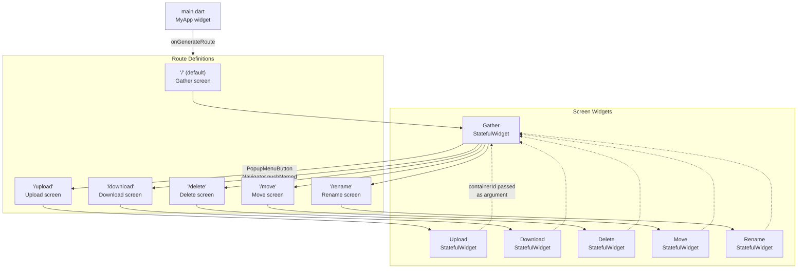
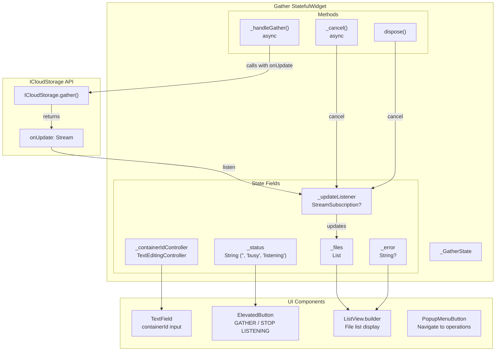
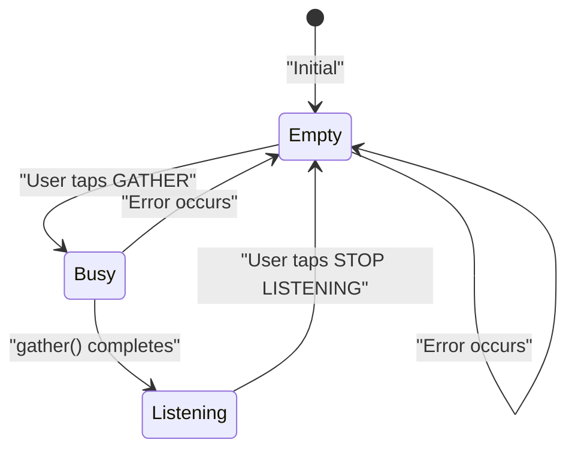
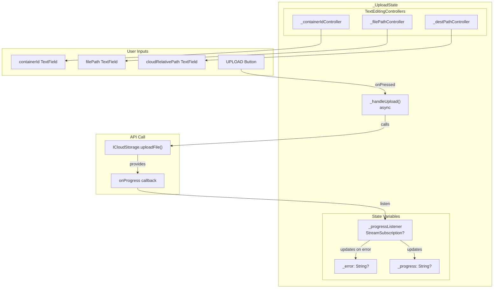
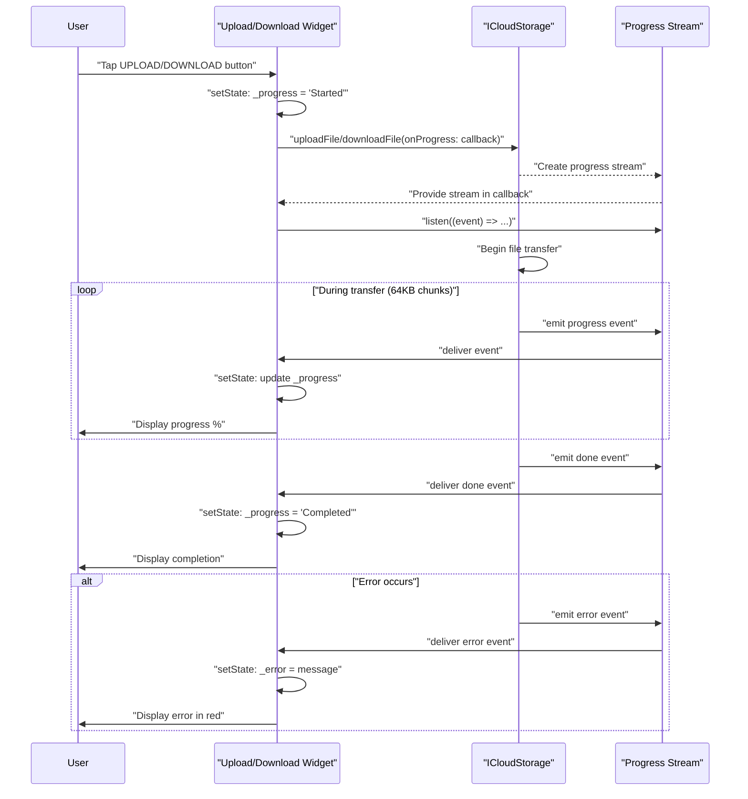
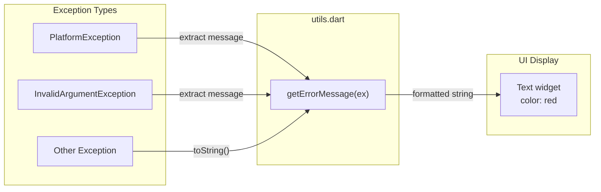

# Example Application

<details>
<summary>Relevant source files</summary>

The following files were used as context for generating this wiki page:

- [example/lib/download.dart](../../example/lib/download.dart)
- [example/lib/gather.dart](../../example/lib/gather.dart)
- [example/lib/main.dart](../../example/lib/main.dart)
- [example/lib/upload.dart](../../example/lib/upload.dart)
- [example/pubspec.yaml](../../example/pubspec.yaml)

</details>


This document provides a comprehensive tour of the example application located in the `example/` directory. The example app demonstrates practical usage of all major plugin operations through an interactive Flutter UI. Each screen showcases a specific operation with proper error handling, progress monitoring, and state management patterns that can be adopted in production applications.

For detailed documentation of the API methods being demonstrated, see [API Reference](#3). For information about testing these operations, see [Testing Guide](#7).

---

## Application Structure

The example application is organized as a multi-screen Flutter app with navigation between different operation demonstrations. The entry point is the gather screen, which serves as both a useful operation and a navigation hub to other operations.

### Application Flow



**Sources**: [example/lib/main.dart:1-44]()

The application uses Flutter's named route navigation pattern. The `MyApp` widget defines routes in `onGenerateRoute` [example/lib/main.dart:20-42](), creating appropriate screen widgets based on the route name. The container ID entered on the gather screen is passed as an argument when navigating to other screens [example/lib/gather.dart:97-101]().

### Project Configuration

| Configuration | Value |
|--------------|-------|
| Package name | `icloud_storage_example` |
| SDK constraint | `>=2.18.2 <3.0.0` |
| Plugin dependency | Path dependency to `../` (parent directory) |
| UI framework | Material Design |

**Sources**: [example/pubspec.yaml:1-27]()

The example uses a path dependency to the plugin [example/pubspec.yaml:21-27]() rather than a pub.dev version, allowing it to always use the latest local plugin code during development.

---

## Main Screen: Gather Operation

The gather screen serves as both the application entry point and a demonstration of the metadata query operation with real-time updates.

### Gather Screen Architecture



**Sources**: [example/lib/gather.dart:1-161]()

### State Management Pattern

The gather screen implements a three-state lifecycle:

1. **Empty state** (`_status = ''`): Initial state, button shows "GATHER"
2. **Busy state** (`_status = 'busy'`): During initial gather operation, button disabled showing "GATHERING"
3. **Listening state** (`_status = 'listening'`): After gather completes, actively listening to updates, button shows "STOP LISTENING TO UPDATE"



**Sources**: [example/lib/gather.dart:23-58]()

The `_handleGather` method [example/lib/gather.dart:23-51]() demonstrates the proper pattern for using the `onUpdate` callback:

1. Set status to 'busy' [example/lib/gather.dart:24-26]()
2. Call `ICloudStorage.gather` with `onUpdate` callback [example/lib/gather.dart:29-38]()
3. In the callback, store the `StreamSubscription` and listen for updates [example/lib/gather.dart:31-36]()
4. Display initial results immediately [example/lib/gather.dart:40-44]()
5. Update status to 'listening' [example/lib/gather.dart:41]()

### File List Display

The file list is rendered using a `ListView.builder` [example/lib/gather.dart:133-153]() that displays:
- Error message (if present) as the first item in red text
- File relative paths as selectable text items

Each file from the `GatherResult` is mapped to its `relativePath` property [example/lib/gather.dart:34,43]().

**Sources**: [example/lib/gather.dart:133-161]()

### Navigation Menu

The gather screen includes a `PopupMenuButton` in the app bar [example/lib/gather.dart:74-103]() with menu items for all file operations:
- Upload
- Download  
- Delete
- Move
- Rename

When a menu item is selected, the app navigates to the corresponding route, passing the current container ID as an argument [example/lib/gather.dart:97-101]().

**Sources**: [example/lib/gather.dart:74-103]()

---

## File Transfer Screens

The upload and download screens demonstrate the streaming transfer operations with progress monitoring.

### Upload Screen



**Sources**: [example/lib/upload.dart:1-132]()

The `_handleUpload` method [example/lib/upload.dart:23-64]() demonstrates the complete pattern for progress monitoring:

1. Initialize progress message [example/lib/upload.dart:25-28]()
2. Call `ICloudStorage.uploadFile` with `onProgress` callback [example/lib/upload.dart:30-57]()
3. Listen to the progress stream [example/lib/upload.dart:35-55]()
4. Handle three event types:
   - `ICloudTransferProgressType.progress`: Update percentage [example/lib/upload.dart:38-42]()
   - `ICloudTransferProgressType.done`: Show completion message [example/lib/upload.dart:43-46]()
   - `ICloudTransferProgressType.error`: Display error [example/lib/upload.dart:47-52]()

### Download Screen

The download screen follows an identical pattern to upload, with the same state management structure and progress handling logic.

**Data Flow Pattern**:



**Sources**: [example/lib/upload.dart:23-64](), [example/lib/download.dart:23-64]()

The download screen structure is nearly identical to upload, with only the field labels and API method changed. Both screens:
- Initialize container ID from navigation arguments [example/lib/upload.dart:67-70](), [example/lib/download.dart:67-70]()
- Properly dispose of stream listeners [example/lib/upload.dart:73-78](), [example/lib/download.dart:73-78]()
- Display progress and error states conditionally [example/lib/upload.dart:116-125](), [example/lib/download.dart:116-125]()

---

## File Management Screens

The example application includes screens for delete, move, and rename operations (imported in [example/lib/main.dart:5-7]()). While the source files for these screens are not provided in the current view, they follow the same architectural patterns established by the transfer screens.

### Expected Screen Structure

Based on the navigation setup, these screens likely implement:

| Screen | Route | Primary Operation | Input Fields |
|--------|-------|------------------|--------------|
| Delete | `/delete` | `ICloudStorage.delete()` | containerId, cloudRelativePath |
| Move | `/move` | `ICloudStorage.move()` | containerId, sourcePath, destinationPath |
| Rename | `/rename` | `ICloudStorage.rename()` | containerId, sourcePath, newName |

All three operations are synchronous (return `Future<void>` without progress streams), so their implementations would be simpler than the transfer screens, focusing on:
- Input validation
- Error display
- Success confirmation

**Sources**: [example/lib/main.dart:5-7,30-38]()

---

## Common Implementation Patterns

### Error Handling Pattern

All example screens use a consistent error handling pattern through a utility function:



**Sources**: [example/lib/gather.dart:4](), [example/lib/upload.dart:4](), [example/lib/download.dart:4]()

The `getErrorMessage` utility function (imported from `utils.dart`) provides consistent error message extraction across all screens. Errors are displayed using red text [example/lib/gather.dart:138-143](), [example/lib/upload.dart:116-120](), [example/lib/download.dart:116-120]().

### Stream Subscription Lifecycle

All screens that use streams (`Gather`, `Upload`, `Download`) follow the same lifecycle pattern:

1. **Declaration**: Nullable `StreamSubscription` field [example/lib/gather.dart:17](), [example/lib/upload.dart:19](), [example/lib/download.dart:19]()
2. **Subscription**: Store subscription in callback [example/lib/gather.dart:32](), [example/lib/upload.dart:35](), [example/lib/download.dart:35]()
3. **Disposal**: Cancel in `dispose()` method [example/lib/gather.dart:63](), [example/lib/upload.dart:74](), [example/lib/download.dart:74]()

This ensures streams are properly cleaned up when widgets are destroyed, preventing memory leaks.

### Progress Display Pattern

Both upload and download screens use conditional rendering to display mutually exclusive states:

```dart
if (_error != null)
  Text(_error!, style: TextStyle(color: Colors.red))
if (_progress != null)  
  Text(_progress!, style: TextStyle(color: Theme.of(context).primaryColor))
```

This pattern ensures:
- Errors are shown in red
- Progress messages are shown in theme primary color
- Only one message appears at a time (error takes precedence in rendering order)

**Sources**: [example/lib/upload.dart:116-125](), [example/lib/download.dart:116-125]()

### TextField Controller Pattern

All screens consistently use `TextEditingController` for input management:
- Controllers declared as final fields [example/lib/gather.dart:16](), [example/lib/upload.dart:16-18]()
- Pre-populated when navigating from gather screen [example/lib/upload.dart:68](), [example/lib/download.dart:68]()
- Disposed properly in `dispose()` method [example/lib/gather.dart:64](), [example/lib/upload.dart:75-77]()

---

## Running the Example

### Prerequisites

The example application requires:
- Flutter SDK 2.18.2 or higher
- iOS or macOS device/simulator with iCloud configured
- Proper entitlements configured in Xcode (see [Getting Started](#2) for setup)

### Building and Running

From the `example/` directory:

```bash
# Run on iOS simulator
flutter run

# Run on macOS
flutter run -d macos

# Build release version
flutter build ios --release
```

### Testing Operations

A typical workflow to explore all operations:

1. **Start with Gather**: Enter a container ID (e.g., `iCloud.com.yourcompany.app`) and tap GATHER
2. **View File List**: See all files in the iCloud container with real-time updates
3. **Upload a File**: Navigate to Upload screen via menu, specify local file path and cloud destination
4. **Monitor Progress**: Observe real-time progress updates during upload
5. **Download the File**: Navigate to Download screen, specify the uploaded file's cloud path
6. **Manage Files**: Use Delete, Move, and Rename screens to manipulate cloud files
7. **Observe Updates**: Return to Gather screen to see changes reflected in real-time

The streaming update feature on the gather screen makes it easy to verify that operations completed successfully by watching the file list update automatically.

**Sources**: [example/lib/main.dart:1-44](), [example/lib/gather.dart:1-161]()

---

## Key Takeaways for Integration

The example application demonstrates several best practices that should be adopted when integrating the plugin:

| Pattern | Implementation | Benefit |
|---------|----------------|---------|
| Stream cleanup | Cancel subscriptions in `dispose()` | Prevents memory leaks |
| Progress monitoring | Listen before operation completes | Captures all progress events |
| Error handling | Centralized error message extraction | Consistent UX across screens |
| State management | Clear state transitions with status flags | Predictable UI behavior |
| Path validation | Validate inputs before API calls | Fail fast with clear messages |
| Container ID reuse | Pass between screens via navigation args | Better UX, fewer input errors |

These patterns are production-ready and can be directly adapted to real applications requiring iCloud storage functionality.

**Sources**: All example screen files [example/lib/gather.dart:1-161](), [example/lib/upload.dart:1-132](), [example/lib/download.dart:1-132]()