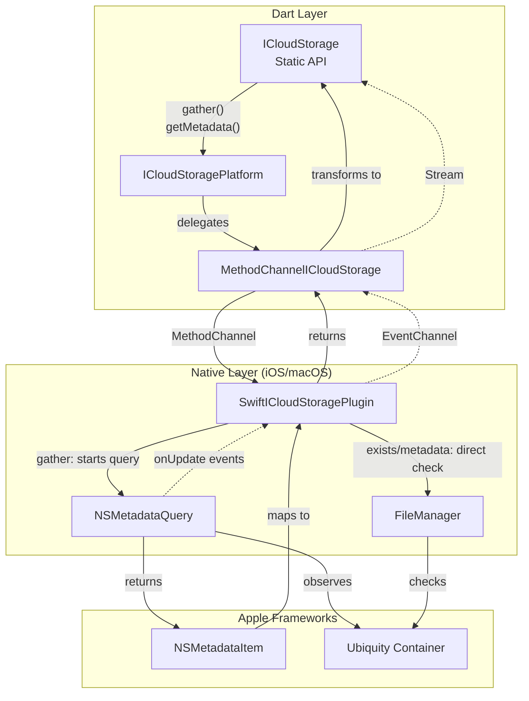
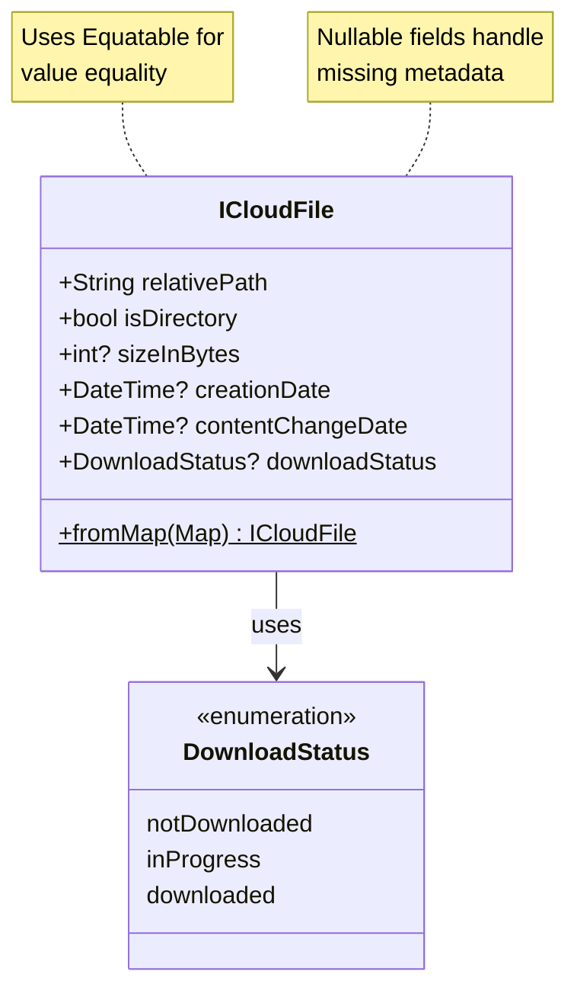
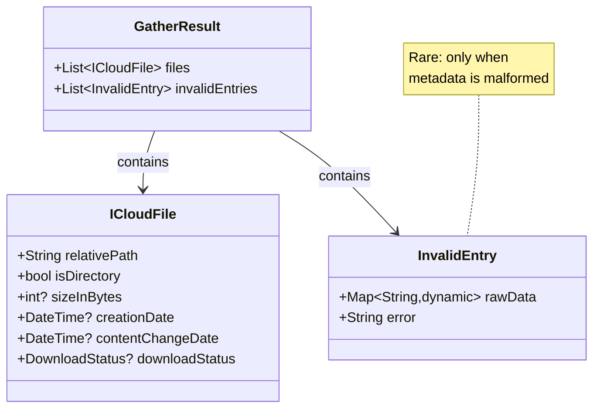
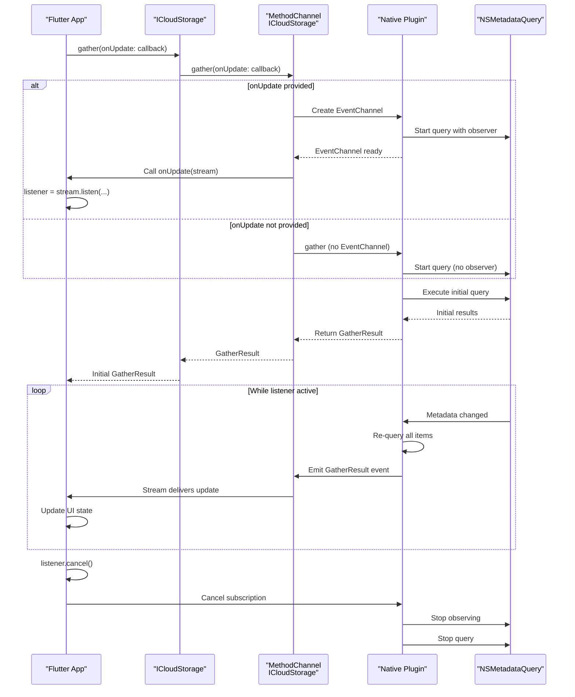
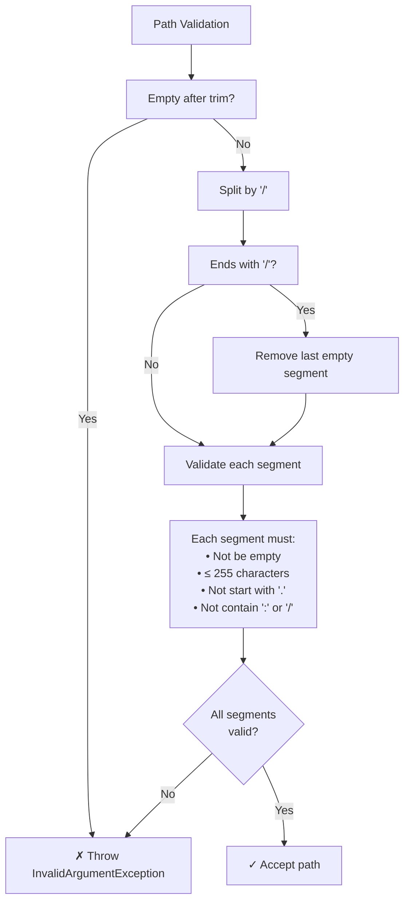

# Metadata Operations

<details>
<summary>Relevant source files</summary>

The following files were used as context for generating this wiki page:

- [README.md](../../README.md)
- [example/lib/gather.dart](../../example/lib/gather.dart)
- [lib/icloud_storage.dart](../../lib/icloud_storage.dart)

</details>


## Purpose and Scope

This page documents the metadata operations in the iCloud Storage Plus plugin. These operations allow querying file information, checking existence, and monitoring changes in the iCloud container **without downloading file contents**. The metadata operations use Apple's `NSMetadataQuery` framework to access file attributes, directory structure, and synchronization status.

For file transfer operations (upload/download), see [File Transfer Operations](#3.1). For direct content access without copying, see [In-Place Access Operations](#3.2). For modifying files and directories, see [File Management Operations](#3.4).

## Overview

The plugin provides four metadata operations:

| Operation | Return Type | Purpose | Supports Streaming |
|-----------|-------------|---------|-------------------|
| `gather()` | `GatherResult` | List all files in container | Yes (optional) |
| `documentExists()` | `bool` | Check if path exists | No |
| `getMetadata()` | `ICloudFile?` | Get typed metadata | No |
| `getDocumentMetadata()` | `Map<String, dynamic>?` | Get raw metadata | No |

All metadata operations work with both files and directories. They respect trailing slash conventions where directory paths may end with `/` (as returned by `gather()`), but validate path structure before execution.

**Sources:** [lib/icloud_storage.dart:46-482](), [README.md:117-161]()

## Operation Flow: Metadata Query Pattern



**Sources:** [lib/icloud_storage.dart:46-58](), [lib/icloud_storage_method_channel.dart](), architecture diagrams

## Core Operations

### gather()

Lists all files and directories in the iCloud container with optional real-time monitoring.

#### Method Signature

[lib/icloud_storage.dart:46-58]()

```dart
static Future<GatherResult> gather({
  required String containerId,
  StreamHandler<GatherResult>? onUpdate,
})
```

#### Parameters

- **`containerId`** (`String`): The iCloud container identifier (e.g., `iCloud.com.yourapp.container`)
- **`onUpdate`** (`StreamHandler<GatherResult>?`): Optional callback receiving a stream of `GatherResult` whenever files change

#### Return Value

Returns `Future<GatherResult>` containing:
- **`files`** (`List<ICloudFile>`): All valid files and directories
- **`invalidEntries`** (`List<InvalidEntry>`): Entries that failed to parse (rare, but exposed for debugging)

#### Behavior

The `gather()` operation uses `NSMetadataQuery` on the native layer to enumerate all items in the container. The query discovers:
- Files at any depth in the directory tree
- Directories (marked with `isDirectory: true`)
- Files that exist remotely but are not yet downloaded (placeholders)
- Hidden files outside `Documents/` that still sync

When `onUpdate` is provided, the stream remains active indefinitely, delivering the **complete** file list whenever any change occurs. The stream continues until the subscription is canceled.

**Important:** Always dispose the update listener when no longer needed to prevent resource leaks.

[lib/icloud_storage.dart:46-58]()

#### Usage Example

```dart
// Basic gather without updates
final result = await ICloudStorage.gather(
  containerId: 'iCloud.com.yourapp.container',
);

for (final file in result.files) {
  print('${file.relativePath}: ${file.isDirectory ? "DIR" : "FILE"}');
}

// Optional: Check for malformed entries
if (result.invalidEntries.isNotEmpty) {
  debugPrint('Found ${result.invalidEntries.length} invalid entries');
}
```

```dart
// Gather with real-time monitoring
StreamSubscription<GatherResult>? listener;

final result = await ICloudStorage.gather(
  containerId: 'iCloud.com.yourapp.container',
  onUpdate: (stream) {
    listener = stream.listen((updatedResult) {
      setState(() {
        files = updatedResult.files;
      });
    });
  },
);

// Initial file list
files = result.files;

// Later: Cancel monitoring
await listener?.cancel();
```

[example/lib/gather.dart:23-51]()

#### Error Handling

- **`E_CTR`**: Container ID invalid or iCloud unavailable
- **`E_ARG`**: Invalid `containerId` (validated at Dart layer)
- **`E_NAT`**: Native query setup failure

**Sources:** [lib/icloud_storage.dart:46-58](), [example/lib/gather.dart:1-162](), [README.md:150-161]()

### documentExists()

Checks whether a file or directory exists at the specified path **without downloading content**.

#### Method Signature

[lib/icloud_storage.dart:435-447]()

```dart
static Future<bool> documentExists({
  required String containerId,
  required String relativePath,
})
```

#### Parameters

- **`containerId`** (`String`): The iCloud container identifier
- **`relativePath`** (`String`): Path within the container (e.g., `Documents/notes.txt` or `Documents/Archive/`)

#### Return Value

Returns `Future<bool>`:
- `true`: Path exists (file or directory)
- `false`: Path does not exist

#### Behavior

This operation uses `FileManager.fileExists(atPath:)` on the native layer to check existence. It returns `true` for:
- Files that are fully downloaded
- Files that exist as placeholders (remote but not yet downloaded)
- Directories (including those with trailing `/`)

The operation does **not** force a download. It checks the local filesystem state maintained by iCloud.

Trailing slashes are allowed because directory paths from metadata may include them.

[lib/icloud_storage.dart:435-447]()

#### Usage Example

```dart
final exists = await ICloudStorage.documentExists(
  containerId: 'iCloud.com.yourapp.container',
  relativePath: 'Documents/notes.txt',
);

if (exists) {
  // File exists, proceed with operation
} else {
  // File not found
}
```

```dart
// Check directory existence
final dirExists = await ICloudStorage.documentExists(
  containerId: 'iCloud.com.yourapp.container',
  relativePath: 'Documents/Archive/',
);
```

#### Error Handling

- **`E_CTR`**: Container ID invalid or iCloud unavailable
- **`E_ARG`**: Invalid path structure (empty, invalid characters, etc.)

**Sources:** [lib/icloud_storage.dart:435-447](), [README.md:120-124]()

### getMetadata()

Retrieves typed metadata for a specific file or directory as an `ICloudFile` object.

#### Method Signature

[lib/icloud_storage.dart:452-465]()

```dart
static Future<ICloudFile?> getMetadata({
  required String containerId,
  required String relativePath,
})
```

#### Parameters

- **`containerId`** (`String`): The iCloud container identifier
- **`relativePath`** (`String`): Path within the container (trailing slashes allowed)

#### Return Value

Returns `Future<ICloudFile?>`:
- `ICloudFile`: Metadata object if path exists
- `null`: Path does not exist

#### Behavior

This operation internally calls `getDocumentMetadata()` and transforms the raw map into a typed `ICloudFile` object. It uses `NSMetadataQuery` to retrieve attributes including:
- File size (nullable for directories/undownloaded files)
- Creation and modification dates (nullable when unavailable)
- Download status (nullable for local-only files)
- Directory flag

The operation does **not** download file content.

[lib/icloud_storage.dart:452-465]()

#### Usage Example

```dart
final metadata = await ICloudStorage.getMetadata(
  containerId: 'iCloud.com.yourapp.container',
  relativePath: 'Documents/notes.txt',
);

if (metadata != null) {
  if (!metadata.isDirectory) {
    final size = metadata.sizeInBytes ?? 0;
    final modified = metadata.contentChangeDate;
    print('File size: $size bytes, modified: $modified');
  } else {
    print('Path is a directory');
  }
} else {
  print('File not found');
}
```

#### Error Handling

- **`E_CTR`**: Container ID invalid or iCloud unavailable
- **`E_ARG`**: Invalid path structure

**Sources:** [lib/icloud_storage.dart:452-465](), [README.md:126-135]()

### getDocumentMetadata()

Retrieves raw metadata as a `Map<String, dynamic>` for a specific file or directory.

#### Method Signature

[lib/icloud_storage.dart:470-482]()

```dart
static Future<Map<String, dynamic>?> getDocumentMetadata({
  required String containerId,
  required String relativePath,
})
```

#### Parameters

- **`containerId`** (`String`): The iCloud container identifier
- **`relativePath`** (`String`): Path within the container

#### Return Value

Returns `Future<Map<String, dynamic>?>`:
- `Map`: Raw metadata dictionary if path exists
- `null`: Path does not exist

#### Behavior

This is the low-level metadata operation that returns the raw dictionary from the native layer. The map contains the same fields as `ICloudFile` but without type safety. Most users should prefer `getMetadata()` for the typed model.

The raw map keys match `ICloudFile` field names:
- `relativePath`
- `isDirectory`
- `sizeInBytes`
- `creationDate`
- `contentChangeDate`
- `downloadStatus`

[lib/icloud_storage.dart:470-482]()

#### Usage Example

```dart
final metadata = await ICloudStorage.getDocumentMetadata(
  containerId: 'iCloud.com.yourapp.container',
  relativePath: 'Documents/notes.txt',
);

if (metadata != null) {
  final path = metadata['relativePath'] as String;
  final isDir = metadata['isDirectory'] as bool;
  final size = metadata['sizeInBytes'] as int?;
  // Process raw map
}
```

#### Error Handling

- **`E_CTR`**: Container ID invalid or iCloud unavailable
- **`E_ARG`**: Invalid path structure

**Sources:** [lib/icloud_storage.dart:470-482](), [README.md:415-422]()

## Data Models

### ICloudFile

The `ICloudFile` class represents metadata for a file or directory in the iCloud container.

#### Class Structure



#### Field Descriptions

| Field | Type | Nullable | Description |
|-------|------|----------|-------------|
| `relativePath` | `String` | No | Path within container (e.g., `Documents/file.txt`) |
| `isDirectory` | `bool` | No | `true` for directories, `false` for files |
| `sizeInBytes` | `int?` | Yes | File size; `null` for directories or undownloaded files |
| `creationDate` | `DateTime?` | Yes | Creation timestamp; `null` when metadata unavailable |
| `contentChangeDate` | `DateTime?` | Yes | Last modification timestamp; `null` when unavailable |
| `downloadStatus` | `DownloadStatus?` | Yes | Sync status; `null` for local-only or unknown |

#### Nullability Rationale

Four fields are nullable to handle real-world iCloud behavior:

1. **`sizeInBytes`**: Directories have no meaningful size. Files that exist remotely but aren't downloaded yet may not report size.
2. **`creationDate`** / **`contentChangeDate`**: Metadata may be incomplete during initial sync or for certain file types.
3. **`downloadStatus`**: Local-only files (created but not yet synced) may not have a download status.

#### Value Equality

`ICloudFile` uses the `equatable` package for value-based equality. Two instances with identical field values are considered equal, making comparisons predictable in tests and UI state management.

#### Factory Constructor

```dart
ICloudFile.fromMap(Map<String, dynamic> map)
```

Converts a raw metadata map from `getDocumentMetadata()` into a typed `ICloudFile` instance.

**Sources:** [lib/models/icloud_file.dart](), [README.md:197-237](), [README.md:502-516]()

### GatherResult

The `GatherResult` class wraps the output of the `gather()` operation, separating valid files from malformed metadata entries.

#### Class Structure



#### Fields

| Field | Type | Description |
|-------|------|-------------|
| `files` | `List<ICloudFile>` | All successfully parsed files and directories |
| `invalidEntries` | `List<InvalidEntry>` | Entries that failed to parse (rare) |

#### InvalidEntry

When `NSMetadataQuery` returns a metadata item that cannot be parsed into an `ICloudFile` (missing required fields, type mismatches, etc.), it's captured as an `InvalidEntry` containing:
- **`rawData`**: The original metadata map from native layer
- **`error`**: Description of the parsing failure

Invalid entries are rare in normal operation. They indicate:
- Corrupted metadata in iCloud's local cache
- Unexpected file types or attributes
- Race conditions during file sync

Exposing invalid entries allows developers to debug edge cases without silently discarding data.

#### Usage Pattern

```dart
final result = await ICloudStorage.gather(
  containerId: 'iCloud.com.yourapp.container',
);

// Process valid files
for (final file in result.files) {
  print(file.relativePath);
}

// Optional: Log invalid entries for debugging
if (result.invalidEntries.isNotEmpty) {
  for (final invalid in result.invalidEntries) {
    debugPrint('Skipped entry: ${invalid.error}');
    debugPrint('Raw data: ${invalid.rawData}');
  }
}
```

**Sources:** [lib/models/gather_result.dart](), [README.md:211-231]()

## Real-Time Update Mechanism

### Stream Lifecycle



### Implementation Details

The `gather()` operation uses `NSMetadataQuery` with observer pattern:

1. **Initial Query**: When `gather()` is called, the native plugin starts an `NSMetadataQuery` and waits for the first batch of results.

2. **Observer Setup**: If `onUpdate` is provided, the plugin registers an observer for `NSMetadataQueryDidUpdateNotification`. This observer fires whenever files are added, removed, or modified.

3. **Full List Emission**: Each update delivers the **complete** file list, not incremental changes. The app receives a fresh `GatherResult` every time.

4. **Stream Closure**: The update stream remains open until explicitly canceled. The app must call `listener.cancel()` to stop monitoring and release resources.

5. **EventChannel Pattern**: The update stream uses Flutter's `EventChannel` for continuous event delivery from native to Dart.

### Best Practices

**Always dispose listeners:**

```dart
StreamSubscription<GatherResult>? listener;

@override
void dispose() {
  // Prevent resource leak
  listener?.cancel();
  super.dispose();
}
```

**Attach listener immediately:**

The `onUpdate` callback receives a broadcast stream that starts emitting when the first listener attaches. To avoid missing events, call `listen()` immediately inside the callback:

```dart
// ✅ Correct: Immediate subscription
await ICloudStorage.gather(
  containerId: containerId,
  onUpdate: (stream) {
    listener = stream.listen((result) {
      // Handle update
    });
  },
);

// ❌ Incorrect: Delayed subscription may miss events
Stream<GatherResult>? updateStream;
await ICloudStorage.gather(
  containerId: containerId,
  onUpdate: (stream) {
    updateStream = stream;
  },
);
// ... some async work ...
listener = updateStream?.listen(...); // May have missed events
```

**Sources:** [lib/icloud_storage.dart:46-58](), [lib/icloud_storage_method_channel.dart](), [example/lib/gather.dart:17-58](), [README.md:266-270]()

## Path Validation

All metadata operations validate paths before calling the native layer.

### Validation Rules



### Implementation

[lib/icloud_storage.dart:484-499]()

```dart
static bool _validateRelativePath(String path) {
  final fileOrDirNames = path.split('/');
  if (fileOrDirNames.isEmpty) return false;

  if (fileOrDirNames.length > 1 && fileOrDirNames.last.isEmpty) {
    fileOrDirNames.removeLast();
  }

  return fileOrDirNames.every(_validateFileName);
}

static bool _validateFileName(String name) => !(name.isEmpty ||
    name.length > 255 ||
    RegExp(r'([:/]+)|(^[.].*$)').hasMatch(name));
```

### Trailing Slash Semantics

Metadata operations **allow** trailing slashes because:
- Directory paths from `gather()` may include trailing `/`
- `FileManager` operations handle directories with or without trailing slash
- `documentExists()` and `getMetadata()` work for both files and directories

This differs from file transfer operations (`uploadFile`, `downloadFile`) and in-place access operations (`readInPlace`, `writeInPlace`), which **reject** trailing slashes because they are file-specific and use document coordination APIs that don't support directories.

### Examples

| Path | Valid for Metadata? | Reason |
|------|---------------------|--------|
| `Documents/notes.txt` | ✅ | Standard file path |
| `Documents/Archive/` | ✅ | Directory with trailing slash |
| `Documents/` | ✅ | Documents directory |
| `.hidden/file.txt` | ❌ | Segment starts with `.` |
| `Documents//notes.txt` | ❌ | Empty segment |
| `path:with:colons` | ❌ | Contains `:` |
| `` (empty) | ❌ | Empty path |
| `very/long/${'a' * 256}` | ❌ | Segment exceeds 255 chars |

**Sources:** [lib/icloud_storage.dart:484-499](), [lib/icloud_storage.dart:434-447]()

## Error Handling

### Common Error Codes

| Code | Constant | Scenario | Recovery |
|------|----------|----------|----------|
| `E_CTR` | `PlatformExceptionCode.iCloudConnectionOrPermission` | Invalid container ID or iCloud unavailable | Check `icloudAvailable()`, verify container ID matches Xcode config |
| `E_ARG` | `PlatformExceptionCode.argumentError` | Invalid path structure | Fix path format (see validation rules) |
| `E_NAT` | `PlatformExceptionCode.nativeCodeError` | Native layer error | Check console logs for underlying NSError |

### Error Handling Pattern

```dart
import 'package:flutter/services.dart';
import 'package:icloud_storage_plus/icloud_storage.dart';

try {
  final result = await ICloudStorage.gather(
    containerId: 'iCloud.com.yourapp.container',
  );
  
  // Process result.files
  
} on PlatformException catch (e) {
  switch (e.code) {
    case PlatformExceptionCode.iCloudConnectionOrPermission:
      // Show message: "iCloud is unavailable. Please sign in to iCloud."
      break;
      
    case PlatformExceptionCode.argumentError:
      // Programming error: invalid containerId
      debugPrint('Invalid arguments: ${e.message}');
      break;
      
    case PlatformExceptionCode.nativeCodeError:
      // Unexpected native error
      debugPrint('Native error: ${e.message}');
      break;
      
    default:
      // Unknown error
      debugPrint('Unexpected error: ${e.code} - ${e.message}');
  }
}
```

### Handling Invalid Entries in GatherResult

```dart
final result = await ICloudStorage.gather(
  containerId: containerId,
);

// Process valid files
final filePaths = result.files.map((f) => f.relativePath).toList();

// Optional: Report invalid entries
if (result.invalidEntries.isNotEmpty) {
  logger.warning(
    'Skipped ${result.invalidEntries.length} invalid metadata entries',
  );
  
  for (final invalid in result.invalidEntries) {
    logger.debug('Invalid entry: ${invalid.error}');
    logger.debug('Raw data: ${invalid.rawData}');
  }
}
```

**Sources:** [lib/models/exceptions.dart](), [README.md:518-573](), [README.md:225-230]()

## Performance Considerations

### Metadata Query Cost

- **`gather()`**: Queries all files in the container. Performance scales with total file count.
  - Up to ~1,000 files: Negligible overhead
  - 1,000-10,000 files: Expect 100-500ms initial query
  - 10,000+ files: May take 1-2 seconds

- **`documentExists()` / `getMetadata()`**: Direct filesystem check via `FileManager`. Very fast (< 10ms) regardless of container size.

### Update Stream Overhead

When using `gather()` with `onUpdate`, the stream re-queries all files on **every change**. For containers with frequent modifications:
- Each change triggers a full re-query
- Large file counts (10,000+) may cause update delays
- Consider debouncing updates in the app layer if needed

### Memory Usage

- **`GatherResult`**: Each `ICloudFile` is ~200 bytes. 10,000 files ≈ 2 MB in memory.
- **Update streams**: Each update delivers a complete new list. Old lists are GC'd when no longer referenced.

### Optimization Tips

1. **Avoid polling**: Use `gather()` with `onUpdate` instead of repeatedly calling `gather()` without updates.

2. **Cancel unused listeners**: Always dispose update subscriptions to prevent memory leaks and unnecessary query overhead.

3. **Filter in Dart layer**: If you only need specific file types, query everything with `gather()` and filter in Dart. The native query doesn't support predicates beyond "all files in container."

4. **Cache when possible**: If metadata doesn't change frequently, cache the `GatherResult` and only refresh on user action or periodic intervals.

**Sources:** [lib/icloud_storage.dart:46-58](), architecture context

## Relationship to Other Operations

### Metadata vs File Transfer

| Aspect | Metadata Operations | File Transfer |
|--------|-------------------|---------------|
| Downloads content? | ❌ No | ✅ Yes |
| Checks existence | ✅ `documentExists()` | Uses metadata internally |
| Works with directories | ✅ Yes | ❌ Files only |
| Trailing slash allowed | ✅ Yes | ❌ No (rejected) |
| Implementation | `NSMetadataQuery` | `UIDocument`/`NSDocument` |

### Metadata vs In-Place Access

| Aspect | Metadata Operations | In-Place Access |
|--------|-------------------|-----------------|
| Downloads content? | ❌ No | ✅ Yes (if needed) |
| Reads file content | ❌ No | ✅ Yes |
| Works with directories | ✅ Yes | ❌ Files only |
| Trailing slash allowed | ✅ Yes | ❌ No (rejected) |
| Implementation | `NSMetadataQuery` | `UIDocument`/`NSDocument` |

### Common Pattern: Check Before Access

```dart
// Pattern: Check metadata before downloading
final metadata = await ICloudStorage.getMetadata(
  containerId: containerId,
  relativePath: 'Documents/large-video.mp4',
);

if (metadata != null && !metadata.isDirectory) {
  final size = metadata.sizeInBytes ?? 0;
  
  if (size > 100 * 1024 * 1024) {
    // Show warning for 100MB+ files
    final proceed = await showDialog(...);
    if (!proceed) return;
  }
  
  // Proceed with download
  await ICloudStorage.downloadFile(
    containerId: containerId,
    cloudRelativePath: 'Documents/large-video.mp4',
    localPath: localPath,
    onProgress: (stream) {
      // Show progress
    },
  );
}
```

**Sources:** [lib/icloud_storage.dart](), architecture context