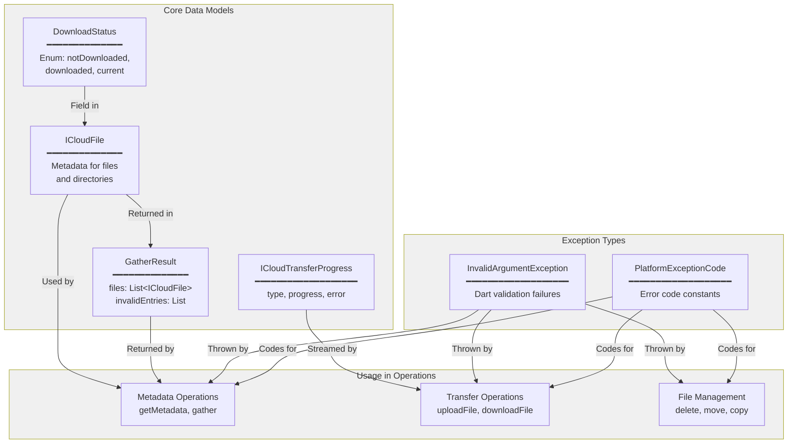
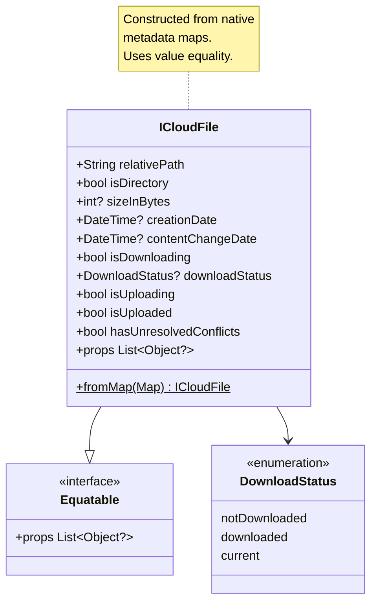
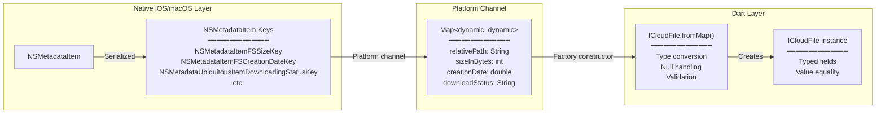
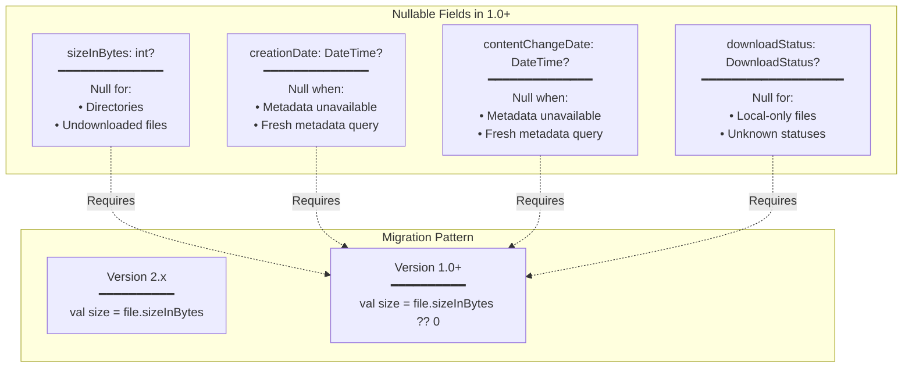
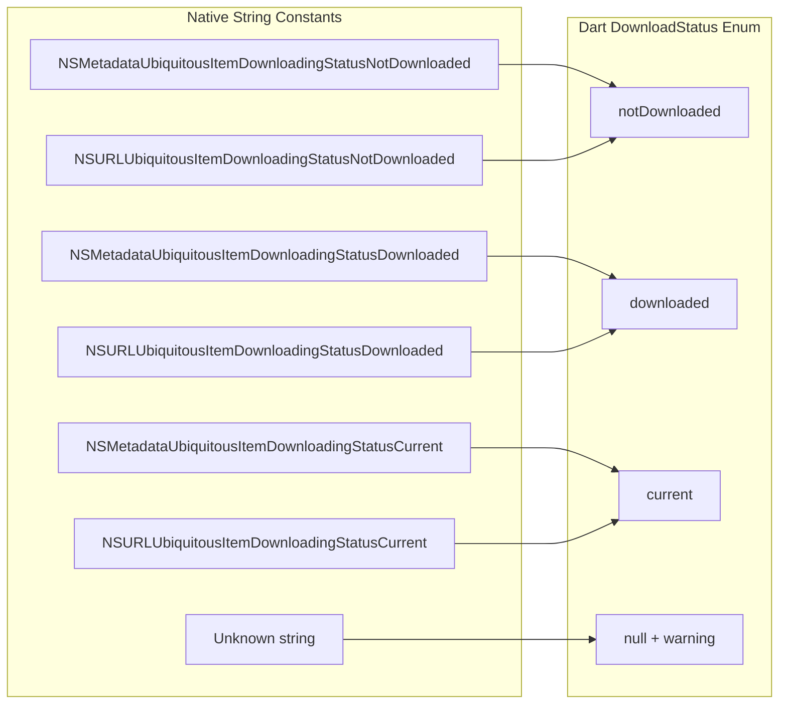
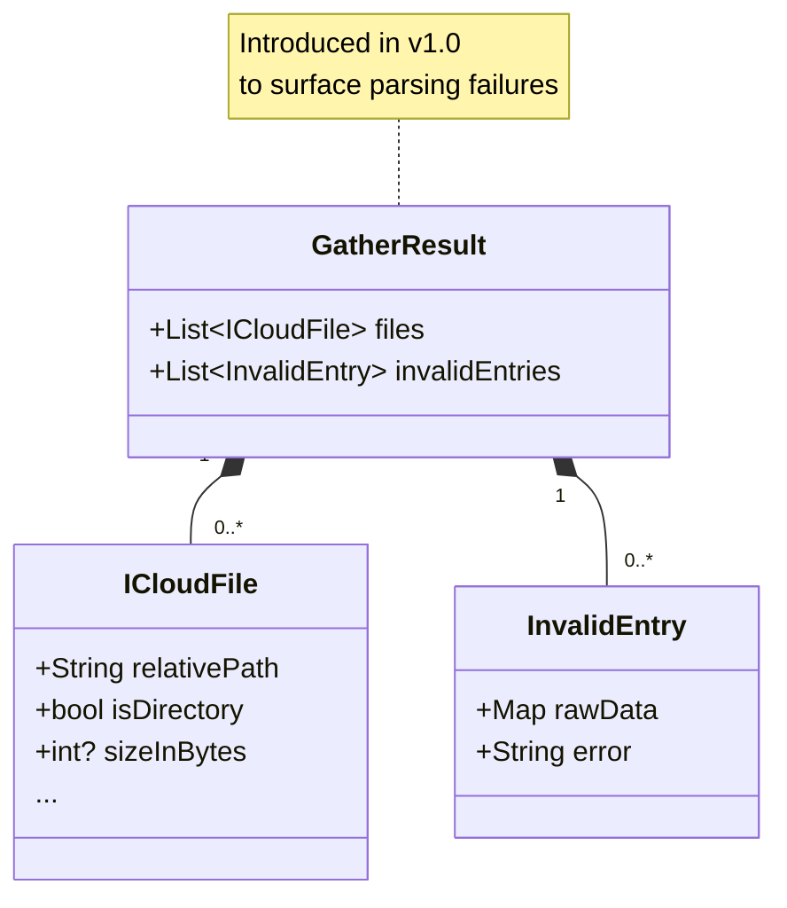
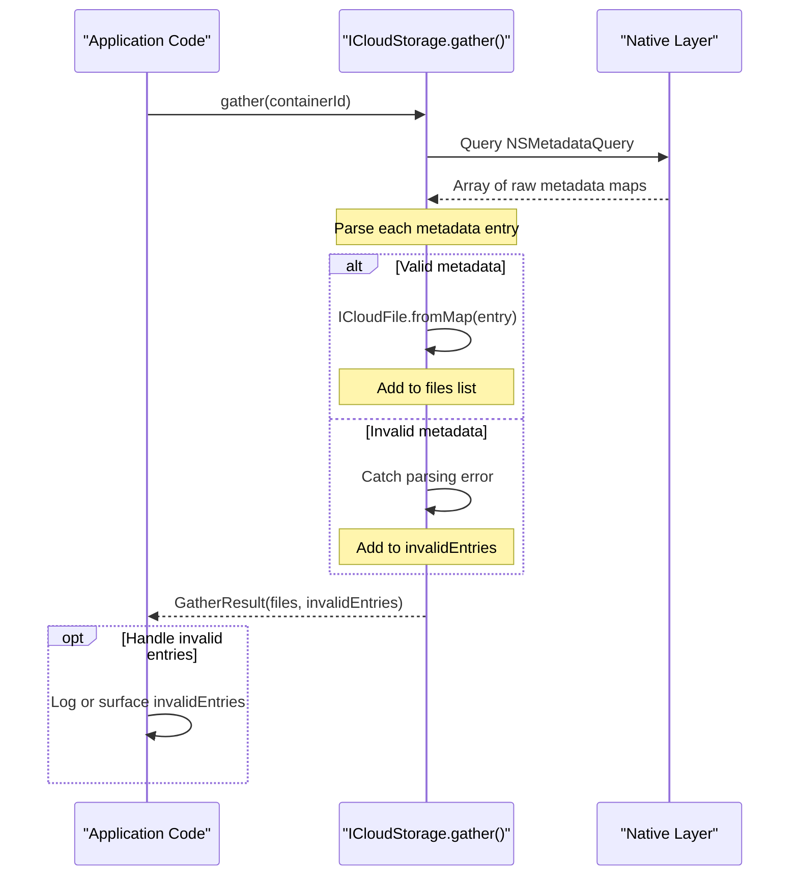
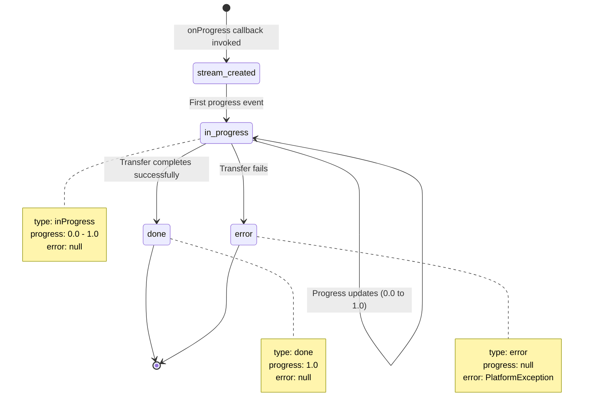
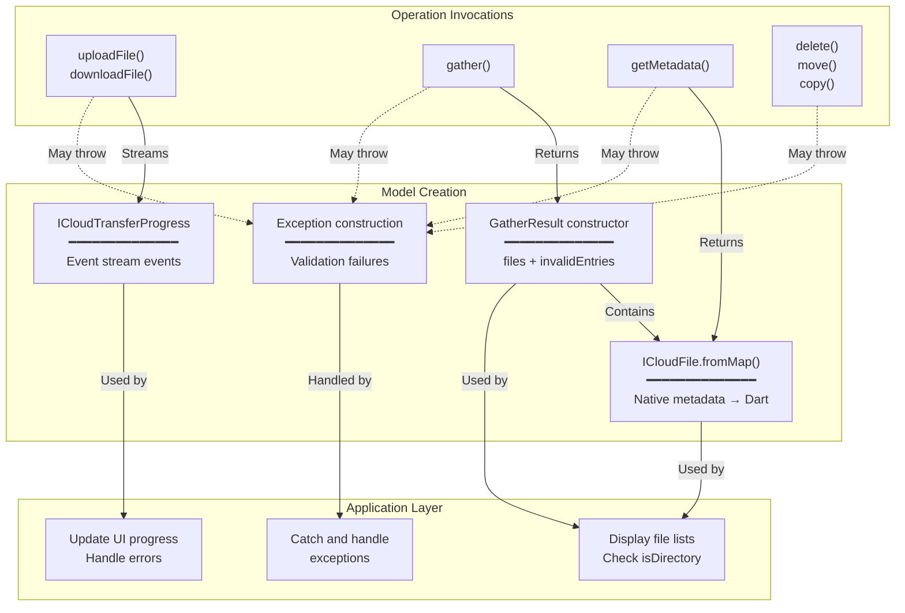
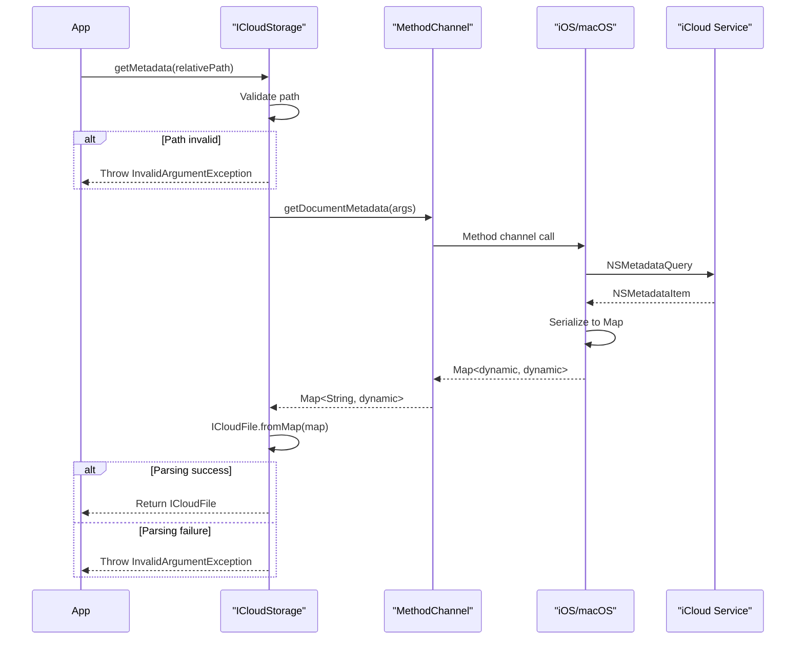

# Data Models

<details>
<summary>Relevant source files</summary>

The following files were used as context for generating this wiki page:

- [README.md](../../README.md)
- [lib/icloud_storage.dart](../../lib/icloud_storage.dart)
- [lib/models/icloud_file.dart](../../lib/models/icloud_file.dart)

</details>


## Purpose and Scope

This page documents the Dart data models used by the icloud_storage_plus plugin to represent iCloud file metadata, operation results, progress updates, and errors. These models provide the type-safe interface between the Flutter application layer and the native iOS/macOS platform.

For error handling patterns and exception usage, see [Error Handling](#3.6). For how these models are used in specific operations, see [File Transfer Operations](#3.1), [Metadata Operations](#3.3), and [File Management Operations](#3.4).

**Sources:** [lib/icloud_storage.dart:1-13]()

---

## Model Overview

The plugin defines five primary data structures:

| Model | Purpose | Mutability | Equality |
|-------|---------|------------|----------|
| `ICloudFile` | File/directory metadata | Immutable | Value-based (via Equatable) |
| `DownloadStatus` | Download state enum | Immutable | Enum |
| `GatherResult` | Listing operation results | Immutable | Not implemented |
| `ICloudTransferProgress` | Transfer progress events | Immutable | Not implemented |
| Exception types | Error reporting | Immutable | Not applicable |



**Sources:** [lib/models/icloud_file.dart:1-134](), [lib/icloud_storage.dart:1-13](), [README.md:502-516]()

---

## ICloudFile

`ICloudFile` represents metadata for a single file or directory in the iCloud container. It maps directly to iOS/macOS `NSMetadataItem` attributes.

### Class Structure



**Field Descriptions:**

| Field | Type | Nullable | Native Source | Description |
|-------|------|----------|---------------|-------------|
| `relativePath` | `String` | No | N/A | Path relative to container root |
| `isDirectory` | `bool` | No | File type check | `true` for directories |
| `sizeInBytes` | `int?` | Yes | `NSMetadataItemFSSizeKey` | File size; `null` for directories/undownloaded |
| `creationDate` | `DateTime?` | Yes | `NSMetadataItemFSCreationDateKey` | Creation timestamp |
| `contentChangeDate` | `DateTime?` | Yes | `NSMetadataItemFSContentChangeDateKey` | Last modification timestamp |
| `isDownloading` | `bool` | No | `NSMetadataUbiquitousItemIsDownloadingKey` | Currently downloading |
| `downloadStatus` | `DownloadStatus?` | Yes | `NSMetadataUbiquitousItemDownloadingStatusKey` | Download state |
| `isUploading` | `bool` | No | `NSMetadataUbiquitousItemIsUploadingKey` | Currently uploading |
| `isUploaded` | `bool` | No | `NSMetadataUbiquitousItemIsUploadedKey` | Upload complete |
| `hasUnresolvedConflicts` | `bool` | No | `NSMetadataUbiquitousItemHasUnresolvedConflictsKey` | Conflicts exist |

**Sources:** [lib/models/icloud_file.dart:5-116](), [README.md:502-516]()

### Native Metadata Mapping

The `fromMap` factory constructor [lib/models/icloud_file.dart:10-22]() transforms raw platform channel data into typed Dart objects:



**Type Conversions:**

- **Numeric values:** `_mapToInt()` [lib/models/icloud_file.dart:103-108]() handles `int`, `double`, and `num` types
- **Timestamps:** `_mapToDateTime()` [lib/models/icloud_file.dart:110-115]() converts Unix timestamps (seconds) to `DateTime`
- **Download status:** `_mapToDownloadStatusFromNSKeys()` [lib/models/icloud_file.dart:83-101]() maps native string constants to `DownloadStatus` enum

**Sources:** [lib/models/icloud_file.dart:10-115]()

### Value Equality

`ICloudFile` extends `Equatable` [lib/models/icloud_file.dart:6]() to provide value-based equality. Two instances are equal if all their fields match [lib/models/icloud_file.dart:68-80]():

```dart
// Example: Testing file equality
final file1 = ICloudFile.fromMap({'relativePath': 'Documents/test.txt', ...});
final file2 = ICloudFile.fromMap({'relativePath': 'Documents/test.txt', ...});
assert(file1 == file2);  // Value equality, not reference equality
```

This enables reliable comparisons in tests and UI updates when checking if metadata has changed.

**Sources:** [lib/models/icloud_file.dart:1-2,68-80](), [README.md:515-516]()

### Nullable Fields (Version 1.0 Breaking Change)

Four fields became nullable in version 1.0 to accurately represent missing or
incomplete metadata:



**Sources:** [README.md:196-237](), [lib/models/icloud_file.dart:31-57]()

---

## DownloadStatus Enum

`DownloadStatus` represents the three-state download lifecycle for iCloud files [lib/models/icloud_file.dart:119-133]():

| Value | Native Constant | Meaning |
|-------|----------------|---------|
| `notDownloaded` | `NSMetadataUbiquitousItemDownloadingStatusNotDownloaded` | File not yet downloaded |
| `downloaded` | `NSMetadataUbiquitousItemDownloadingStatusDownloaded` | Local copy exists but may be stale |
| `current` | `NSMetadataUbiquitousItemDownloadingStatusCurrent` | Local copy is up-to-date |

### Native Constant Mapping

The mapping function [lib/models/icloud_file.dart:83-101]() handles both `NSMetadata...` and `NSURLUbiquitous...` variants:



Unknown status strings trigger a warning [lib/models/icloud_file.dart:96-98]() but gracefully return `null` rather than throwing.

**Sources:** [lib/models/icloud_file.dart:83-101,119-133]()

---

## GatherResult

`GatherResult` is returned by the `gather()` operation [lib/icloud_storage.dart:50-58]() and contains both valid file listings and any parsing failures.

### Structure



### Usage Pattern



**Breaking Change (v1.0):** Prior to version 1.0, `gather()` returned
`List<ICloudFile>` directly and silently dropped invalid entries. Now it
returns `GatherResult` to make failures visible [README.md:211-231]():

```dart
// Version 2.x
final files = await ICloudStorage.gather(...);

// Version 1.0+
final result = await ICloudStorage.gather(...);
final files = result.files;

if (result.invalidEntries.isNotEmpty) {
  debugPrint('Skipped ${result.invalidEntries.length} invalid entries.');
}
```

**Sources:** [lib/icloud_storage.dart:50-58](), [README.md:211-231,427-443]()

---

## ICloudTransferProgress

`ICloudTransferProgress` represents progress events streamed during `uploadFile` and `downloadFile` operations [lib/icloud_storage.dart:84-160]().

### Event Types



### Fields and Types

| Field | Type | Description |
|-------|------|-------------|
| `type` | `ICloudTransferProgressType` | Event type: `inProgress`, `done`, or `error` |
| `progress` | `double?` | Completion ratio (0.0-1.0); `null` for `error` |
| `error` | `PlatformException?` | Exception details; only present for `error` type |

**Progress Event Semantics:**

- **Listener-driven streaming:** Progress streams use lazy subscription and only emit events when a listener is attached [README.md:265-270]()
- **Terminal events:** Both `done` and `error` are terminal—the stream emits the event then closes [README.md:386-388]()
- **Error delivery:** Failures emit `error` events (not stream `onError` callbacks) [README.md:386-388]()
- **Broadcast streams:** Multiple listeners can attach, but all receive the same events [README.md:383-384]()

### Usage Pattern

```dart
await ICloudStorage.uploadFile(
  containerId: 'iCloud.com.example.app',
  localPath: '/path/to/local/file.txt',
  cloudRelativePath: 'Documents/file.txt',
  onProgress: (stream) {
    // IMPORTANT: Attach listener immediately to avoid missing events
    stream.listen(
      (progress) {
        switch (progress.type) {
          case ICloudTransferProgressType.inProgress:
            print('Progress: ${(progress.progress! * 100).toInt()}%');
            break;
          case ICloudTransferProgressType.done:
            print('Upload complete');
            break;
          case ICloudTransferProgressType.error:
            print('Upload failed: ${progress.error}');
            break;
        }
      },
    );
  },
);
```

**Sources:** [lib/icloud_storage.dart:84-160](), [README.md:265-270,383-390]()

---

## Exception Types

### InvalidArgumentException

Thrown by Dart validation logic [lib/icloud_storage.dart:90-106]() before invoking platform code. Indicates invalid method arguments such as:

- Empty paths [lib/icloud_storage.dart:90-92,136-138]()
- Trailing slashes on file operations [lib/icloud_storage.dart:96-100,142-146]()
- Invalid path segments (e.g., containing `:` or `/`, starting with `.`) [lib/icloud_storage.dart:497-499]()
- Path segment length >255 characters [lib/icloud_storage.dart:497-499]()

**Example:**
```dart
try {
  await ICloudStorage.uploadFile(
    containerId: 'iCloud.com.example.app',
    localPath: '/local/file.txt',
    cloudRelativePath: 'Documents/file.txt/',  // Trailing slash!
  );
} on InvalidArgumentException catch (e) {
  print('Invalid argument: ${e.message}');
}
```

**Sources:** [lib/icloud_storage.dart:90-106,136-146,485-499](), [lib/models/exceptions.dart]() (referenced but not shown)

### PlatformExceptionCode

Constants for `PlatformException.code` values [README.md:519-573]():

| Constant | Code String | Meaning |
|----------|-------------|---------|
| `iCloudConnectionOrPermission` | `E_CTR` | iCloud unavailable or invalid container |
| `fileNotFound` | `E_FNF` | File does not exist |
| `fileNotFoundRead` | `E_FNF_READ` | File not found during read |
| `fileNotFoundWrite` | `E_FNF_WRITE` | File not found during write |
| `nativeCodeError` | `E_NAT` | Native error (includes NSError details) |
| `argumentError` | `E_ARG` | Invalid arguments (rare, as Dart validates) |
| `readError` | `E_READ` | Failed to read file content |
| `canceled` | `E_CANCEL` | Operation canceled |
| `timeout` | `E_TIMEOUT` | Download idle timeout |
| `pluginInternal` | `E_PLUGIN_INTERNAL` | Internal Dart plugin error (bug) |
| `invalidEvent` | `E_INVALID_EVENT` | Invalid native event (bug) |

**Usage Pattern:**

```dart
try {
  await ICloudStorage.downloadFile(...);
} on PlatformException catch (e) {
  switch (e.code) {
    case PlatformExceptionCode.fileNotFound:
      // Handle missing file
      break;
    case PlatformExceptionCode.iCloudConnectionOrPermission:
      // Handle iCloud unavailable
      break;
    default:
      // Handle other errors
  }
}
```

**Sources:** [README.md:519-573](), [lib/models/exceptions.dart]() (referenced but not shown)

---

## Model Lifecycle and Relationships



### Data Flow: Metadata Query



**Sources:** [lib/icloud_storage.dart:452-465](), [lib/models/icloud_file.dart:10-22]()

---

## Summary Table: Model Usage by Operation

| Operation | Returns | Streams | May Throw |
|-----------|---------|---------|-----------|
| `gather()` | `GatherResult` | `GatherResult` (optional) | `InvalidArgumentException`, `PlatformException` |
| `getMetadata()` | `ICloudFile?` | - | `InvalidArgumentException`, `PlatformException` |
| `getDocumentMetadata()` | `Map<String, dynamic>?` | - | `InvalidArgumentException`, `PlatformException` |
| `uploadFile()` | `void` | `ICloudTransferProgress` | `InvalidArgumentException`, `PlatformException` |
| `downloadFile()` | `void` | `ICloudTransferProgress` | `InvalidArgumentException`, `PlatformException` |
| `readInPlace()` | `String?` | - | `InvalidArgumentException`, `PlatformException` |
| `readInPlaceBytes()` | `Uint8List?` | - | `InvalidArgumentException`, `PlatformException` |
| `writeInPlace()` | `void` | - | `InvalidArgumentException`, `PlatformException` |
| `writeInPlaceBytes()` | `void` | - | `InvalidArgumentException`, `PlatformException` |
| `delete()` | `void` | - | `InvalidArgumentException`, `PlatformException` |
| `move()` | `void` | - | `InvalidArgumentException`, `PlatformException` |
| `copy()` | `void` | - | `InvalidArgumentException`, `PlatformException` |
| `rename()` | `void` | - | `InvalidArgumentException`, `PlatformException` |
| `documentExists()` | `bool` | - | `InvalidArgumentException`, `PlatformException` |

**Sources:** [lib/icloud_storage.dart:42-482](), [README.md:342-483]()
