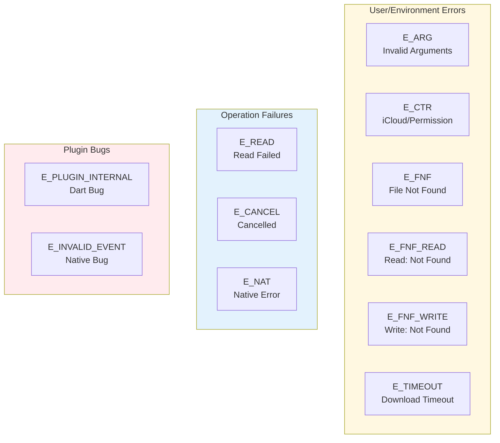
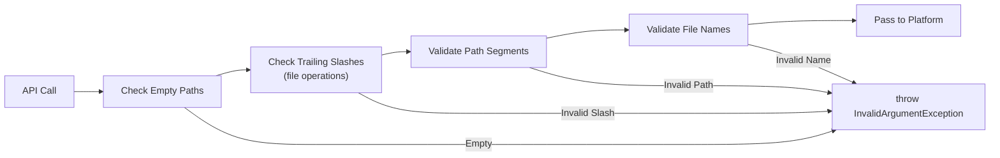
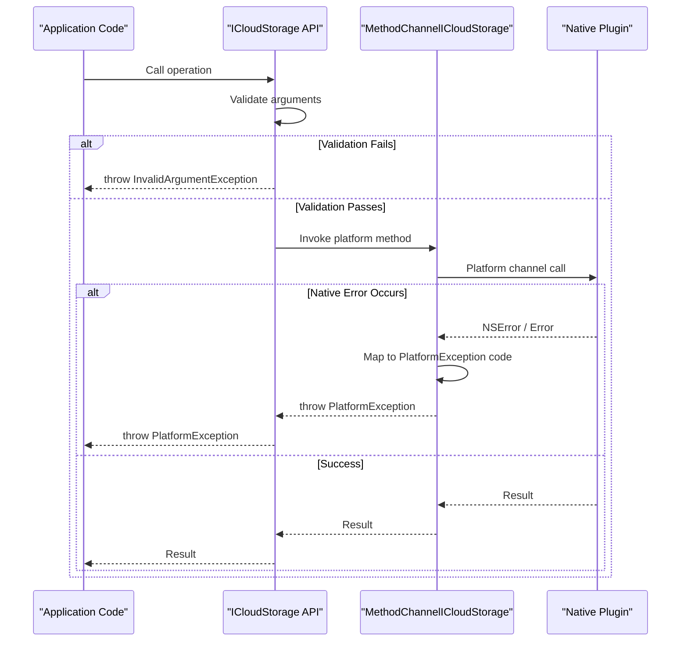
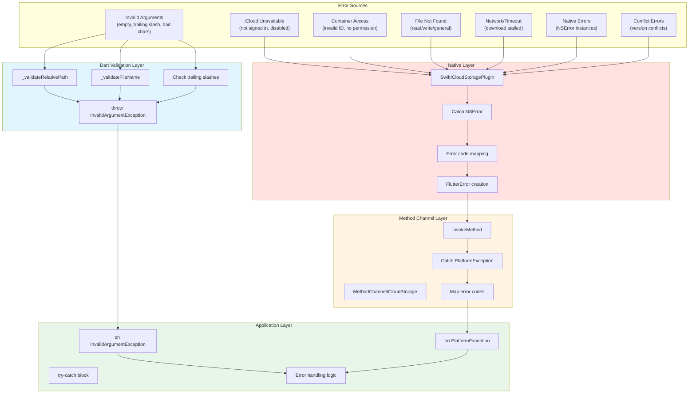

# Error Handling

<details>
<summary>Relevant source files</summary>

The following files were used as context for generating this wiki page:

- [README.md](../../README.md)
- [lib/icloud_storage.dart](../../lib/icloud_storage.dart)
- [lib/models/exceptions.dart](../../lib/models/exceptions.dart)

</details>


## Purpose and Scope

This document describes the error handling mechanisms in the icloud_storage_plus plugin, including exception types, error codes, validation strategies, and error propagation across platform boundaries. It covers how errors are detected, reported, and should be handled in application code.

For information about specific API operations that may throw these exceptions, see [API Reference](#3). For details on the native implementation of error handling, see [Native Implementation Deep Dive](#5).

---

## Overview

The plugin implements a **three-tier error handling strategy** to catch issues early and provide clear, actionable error information:

1. **Dart Validation Layer**: Pre-validates arguments before native interaction
2. **Platform Channel Layer**: Maps native errors to standardized codes
3. **Native Layer**: Handles iOS/macOS-specific errors and edge cases

All errors surface to application code as either `InvalidArgumentException` (for argument validation failures) or `PlatformException` (for runtime errors from the native layer).

**Sources**: [lib/models/exceptions.dart:1-50](), [README.md:518-573]()

---

## Exception Types

### InvalidArgumentException

A Dart-side exception thrown when invalid arguments are passed to API methods. This exception is thrown **before** any platform channel communication occurs, providing fast failure with clear messages.

```dart
class InvalidArgumentException implements Exception {
  InvalidArgumentException(String message);
  
  @override
  String toString() => 'InvalidArgumentException: $_message';
}
```

**Common Triggers**:
- Empty or whitespace-only paths
- Trailing slashes on file-centric operations (`uploadFile`, `downloadFile`, `readInPlace`, `writeInPlace`)
- Invalid file names (empty, >255 chars, containing `:` or `/`, starting with `.`)
- Paths with invalid segments

**Example**:
```dart
try {
  await ICloudStorage.uploadFile(
    containerId: 'iCloud.com.example',
    localPath: '/path/to/file.txt',
    cloudRelativePath: 'Documents/',  // ❌ Trailing slash not allowed
  );
} on InvalidArgumentException catch (e) {
  print(e); // InvalidArgumentException: invalid cloudRelativePath: Documents/
}
```

**Sources**: [lib/models/exceptions.dart:1-11](), [lib/icloud_storage.dart:90-106]()

### PlatformException

A Flutter framework exception thrown by the native platform when runtime errors occur. The plugin uses standardized error codes (defined in `PlatformExceptionCode`) to distinguish different failure scenarios.

**Structure**:
```dart
class PlatformException {
  final String code;       // Error code (see PlatformExceptionCode)
  final String? message;   // Human-readable description
  final dynamic details;   // Additional error context
}
```

**Handling Pattern**:
```dart
try {
  await ICloudStorage.downloadFile(...);
} on PlatformException catch (e) {
  switch (e.code) {
    case PlatformExceptionCode.iCloudConnectionOrPermission:
      // Handle iCloud unavailable
      break;
    case PlatformExceptionCode.fileNotFound:
      // Handle missing file
      break;
    default:
      // Handle other errors
  }
}
```

**Sources**: [README.md:535-572](), [lib/models/exceptions.dart:13-49]()

---

## Error Codes Reference

The `PlatformExceptionCode` class defines constants for all error codes returned by the plugin. These codes provide structured error information that applications can use to implement appropriate error handling logic.



**Error Code Categories**

**Sources**: [lib/models/exceptions.dart:13-49](), [README.md:520-531]()

### Complete Error Code Reference

| Code | Constant | Meaning | When Thrown | Recommended Action |
|------|----------|---------|-------------|-------------------|
| `E_CTR` | `iCloudConnectionOrPermission` | iCloud container/permission issue | Invalid container ID, user not signed in, iCloud disabled, or permission denied | Check iCloud availability with `icloudAvailable()`, verify container ID matches Xcode configuration |
| `E_FNF` | `fileNotFound` | File not found | General file-not-found scenario | Check if file exists with `documentExists()` before operation |
| `E_FNF_READ` | `fileNotFoundRead` | File not found during read | Attempting to read non-existent file | Verify file exists, handle gracefully if optional |
| `E_FNF_WRITE` | `fileNotFoundWrite` | File not found during write | Attempting to write to non-existent location | Ensure parent directory exists, handle creation |
| `E_NAT` | `nativeCodeError` | Native platform error | Underlying iOS/macOS error | Log error details, potentially retry, report if persistent |
| `E_ARG` | `argumentError` | Invalid arguments | Invalid arguments passed to native | Fix argument values, should not occur if Dart validation passes |
| `E_READ` | `readError` | Read operation failed | Unable to read file content | Check file permissions, disk space, retry |
| `E_CANCEL` | `canceled` | Operation canceled | User or system canceled operation | Handle cancellation gracefully |
| `E_TIMEOUT` | (Not in code, but mentioned in CHANGELOG) | Download timeout | Download stalled/idle for too long | Retry with increased timeout, check network |
| `E_PLUGIN_INTERNAL` | `pluginInternal` | Internal plugin error (Dart) | Bug in Dart layer | Report to GitHub with stack trace |
| `E_INVALID_EVENT` | `invalidEvent` | Invalid event from native | Bug in native layer | Report to GitHub with reproduction steps |

**Sources**: [lib/models/exceptions.dart:14-49](), [README.md:520-531]()

---

## Error Handling Layers

### Dart Validation Layer

The Dart layer performs **pre-validation** of all arguments before invoking platform methods. This catches common mistakes early and provides immediate feedback without the overhead of platform channel communication.



**Validation Rules**

**Path Validation** (`_validateRelativePath`):
- Path cannot be empty after trimming
- Path segments are split by `/`
- Trailing slashes are removed for validation (but may be rejected by specific operations)
- Each segment must pass file name validation

**File Name Validation** (`_validateFileName`):
- Cannot be empty
- Cannot exceed 255 characters
- Cannot contain `:` or `/`
- Cannot start with `.` (hidden files)
- Pattern: `!RegExp(r'([:/]+)|(^[.].*$)').hasMatch(name)`

**Operation-Specific Rules**:

| Operation | Trailing Slash Allowed? | Reason |
|-----------|------------------------|--------|
| `uploadFile`, `downloadFile` | ❌ No | File-centric, uses UIDocument/NSDocument |
| `readInPlace`, `readInPlaceBytes` | ❌ No | File-centric coordination |
| `writeInPlace`, `writeInPlaceBytes` | ❌ No | File-centric coordination |
| `delete`, `move`, `copy` | ✅ Yes | FileManager operations support directories |
| `documentExists`, `getMetadata` | ✅ Yes | Can query directories |
| `rename` | ✅ Yes (normalized) | Handles both files and directories |

**Sources**: [lib/icloud_storage.dart:484-499](), [lib/icloud_storage.dart:90-106](), [lib/icloud_storage.dart:136-152]()

### Platform Channel Error Mapping

The method channel layer (`MethodChannelICloudStorage`) transforms native platform exceptions into standardized `PlatformException` instances with appropriate error codes. This layer ensures consistent error handling across iOS and macOS platforms.



**Error Mapping Strategy**:
1. Native layer catches all NSError instances
2. Inspects error domain and code
3. Maps to appropriate `PlatformExceptionCode`
4. Includes original error message in `message` field
5. Includes error details in `details` field when available

**Sources**: [lib/icloud_storage_method_channel.dart]() (implied from architecture)

### Native Error Handling

The native iOS/macOS implementation handles platform-specific errors and maps them to standardized codes:

**Error Sources**:
- **Container Access Failures**: Invalid container ID, iCloud disabled, no permission → `E_CTR`
- **File Not Found**: NSCocoaErrorDomain Code=4 → `E_FNF`, `E_FNF_READ`, or `E_FNF_WRITE`
- **Coordination Errors**: NSFileCoordinator errors → `E_NAT`
- **Document Save Failures**: UIDocument/NSDocument save errors → `E_NAT`
- **Conflict Resolution**: NSFileVersion errors → `E_NAT`
- **Timeout Errors**: Download idle watchdog timeout → `E_TIMEOUT`

**Special Handling**:
- **Conflict Resolution**: Automatically resolves conflicts using last-write-wins strategy before surfacing errors (see [Conflict Resolution](#5.6))
- **Download Retries**: Implements retry logic with exponential backoff for transient download failures (see [Download Retry Logic](#6.2))
- **Coordinated Access**: Uses NSFileCoordinator to prevent permission errors during concurrent iCloud sync

**Sources**: [ios/Classes/iOSICloudStoragePlugin.swift]() (implied from architecture), [README.md:594-604]()

---

## Error Flow: Complete Path

The following diagram shows how errors flow from various sources through the plugin layers to application code:



**Error Flow Steps**:

1. **Dart Validation** (earliest): Arguments validated in `ICloudStorage` methods
   - Invalid paths, names, trailing slashes → `InvalidArgumentException`
   - Happens **before** platform channel call

2. **Native Execution**: Platform method invoked via `MethodChannelICloudStorage`
   - Container access, file operations, coordination performed
   - NSError instances caught and categorized

3. **Error Mapping**: Native errors converted to Flutter error format
   - NSError mapped to appropriate `PlatformExceptionCode`
   - Error message and details preserved

4. **Application Handling**: Errors surface to application code
   - `InvalidArgumentException` for argument failures
   - `PlatformException` for runtime failures

**Sources**: [lib/icloud_storage.dart:84-114](), [lib/models/exceptions.dart:1-49]()

---

## Common Error Scenarios

### Scenario 1: iCloud Not Available

**Trigger**: User not signed in, iCloud disabled, or container ID mismatch

**Error Code**: `E_CTR` (`iCloudConnectionOrPermission`)

**Handling**:
```dart
try {
  await ICloudStorage.uploadFile(
    containerId: 'iCloud.com.example',
    localPath: localPath,
    cloudRelativePath: 'Documents/file.txt',
  );
} on PlatformException catch (e) {
  if (e.code == PlatformExceptionCode.iCloudConnectionOrPermission) {
    // Check if iCloud is available
    final available = await ICloudStorage.icloudAvailable();
    if (!available) {
      showDialog(context, 'Please sign in to iCloud in Settings');
    } else {
      showDialog(context, 'Check container ID configuration');
    }
  }
}
```

**Sources**: [README.md:538-542](), [lib/models/exceptions.dart:15-17]()

### Scenario 2: File Not Found

**Trigger**: Attempting to access non-existent file

**Error Codes**: 
- `E_FNF` (general)
- `E_FNF_READ` (during read operations)
- `E_FNF_WRITE` (during write operations)

**Handling**:
```dart
// Check before access
final exists = await ICloudStorage.documentExists(
  containerId: 'iCloud.com.example',
  relativePath: 'Documents/file.txt',
);

if (exists) {
  try {
    final content = await ICloudStorage.readInPlace(
      containerId: 'iCloud.com.example',
      relativePath: 'Documents/file.txt',
    );
  } on PlatformException catch (e) {
    if (e.code == PlatformExceptionCode.fileNotFoundRead) {
      // File was deleted between check and read
      // Handle gracefully
    }
  }
} else {
  // Create file first
  await ICloudStorage.writeInPlace(
    containerId: 'iCloud.com.example',
    relativePath: 'Documents/file.txt',
    contents: 'Initial content',
  );
}
```

**Sources**: [README.md:543-549](), [lib/models/exceptions.dart:19-26]()

### Scenario 3: Invalid Path Arguments

**Trigger**: Invalid file names, empty paths, or incorrect trailing slashes

**Error**: `InvalidArgumentException` (thrown immediately)

**Handling**:
```dart
// ❌ Bad: trailing slash on file operation
try {
  await ICloudStorage.uploadFile(
    containerId: 'iCloud.com.example',
    localPath: '/tmp/file.txt',
    cloudRelativePath: 'Documents/',  // Error!
  );
} on InvalidArgumentException catch (e) {
  print(e); // InvalidArgumentException: invalid cloudRelativePath: Documents/
}

// ✅ Good: no trailing slash
await ICloudStorage.uploadFile(
  containerId: 'iCloud.com.example',
  localPath: '/tmp/file.txt',
  cloudRelativePath: 'Documents/file.txt',
);

// ✅ Also good: trailing slash allowed for directory operations
await ICloudStorage.delete(
  containerId: 'iCloud.com.example',
  relativePath: 'Documents/Archive/',  // OK for delete
);
```

**Sources**: [lib/icloud_storage.dart:96-99](), [lib/icloud_storage.dart:142-145]()

### Scenario 4: Plugin Internal Errors

**Trigger**: Bugs in plugin code (should not occur in normal use)

**Error Codes**:
- `E_PLUGIN_INTERNAL` - Dart layer bug
- `E_INVALID_EVENT` - Native layer event bug

**Handling**:
```dart
try {
  await ICloudStorage.downloadFile(
    containerId: 'iCloud.com.example',
    cloudRelativePath: 'Documents/file.txt',
    localPath: '/tmp/output.txt',
  );
} on PlatformException catch (e) {
  if (e.code == PlatformExceptionCode.pluginInternal ||
      e.code == PlatformExceptionCode.invalidEvent) {
    // These indicate plugin bugs
    // Report to GitHub with stack trace and reproduction steps
    reportBug(e);
  }
}
```

**Sources**: [lib/models/exceptions.dart:40-48](), [README.md:564-571]()

---

## Error Code to Native Error Mapping

The following table shows how common native errors map to plugin error codes:

| Native Error | Domain/Code | Plugin Code | Context |
|-------------|-------------|-------------|---------|
| Container not found | Custom | `E_CTR` | Invalid container ID |
| iCloud disabled | Custom | `E_CTR` | User settings |
| File not found | NSCocoaErrorDomain 4 | `E_FNF` | General |
| File not found | NSCocoaErrorDomain 4 | `E_FNF_READ` | During read |
| File not found | NSCocoaErrorDomain 4 | `E_FNF_WRITE` | During write |
| Permission denied | NSCocoaErrorDomain 257 | `E_NAT` | Coordination needed |
| Disk full | NSCocoaErrorDomain 640 | `E_NAT` | Storage issue |
| Operation canceled | NSUserCancelledError | `E_CANCEL` | User/system cancel |
| Download timeout | Custom | `E_TIMEOUT` | Idle watchdog |
| Unknown NSError | Any | `E_NAT` | Unexpected error |

**Note**: The plugin's use of coordinated access (UIDocument/NSDocument and NSFileCoordinator) prevents most permission denied errors (Code 257) that occur when directly accessing iCloud files during sync.

**Sources**: [README.md:594-604](), Implied from architecture diagrams

---

## Best Practices

### 1. Always Check iCloud Availability First

```dart
final available = await ICloudStorage.icloudAvailable();
if (!available) {
  // Show appropriate UI
  return;
}

// Proceed with operations
```

### 2. Use Specific Error Code Handling

```dart
try {
  await ICloudStorage.readInPlace(...);
} on PlatformException catch (e) {
  switch (e.code) {
    case PlatformExceptionCode.iCloudConnectionOrPermission:
      // Specific handling for iCloud issues
      break;
    case PlatformExceptionCode.fileNotFoundRead:
      // Specific handling for missing file
      break;
    case PlatformExceptionCode.nativeCodeError:
      // Log and potentially retry
      logger.error('Native error: ${e.message}');
      break;
    default:
      // Generic error handling
      showError('Operation failed: ${e.message}');
  }
}
```

### 3. Validate Paths Before API Calls

The API validates paths automatically, but you can perform additional validation:

```dart
// Additional business logic validation
if (!relativePath.startsWith('Documents/')) {
  // Warn user that file won't be visible in Files app
}

if (relativePath.contains('..')) {
  // Reject path traversal attempts
  throw ArgumentError('Invalid path');
}

// API will validate format
await ICloudStorage.uploadFile(...);
```

### 4. Handle InvalidArgumentException Separately

```dart
try {
  await ICloudStorage.uploadFile(...);
} on InvalidArgumentException catch (e) {
  // These are programming errors - fix the call site
  developer.log('Invalid arguments: $e', level: Level.SEVERE);
  rethrow; // Or handle gracefully
} on PlatformException catch (e) {
  // These are runtime errors - handle gracefully
  handleRuntimeError(e);
}
```

### 5. Check File Existence for Optional Operations

```dart
// For operations where file might not exist
final exists = await ICloudStorage.documentExists(
  containerId: containerId,
  relativePath: path,
);

if (exists) {
  await ICloudStorage.readInPlace(
    containerId: containerId,
    relativePath: path,
  );
} else {
  // Provide default or create file
  await ICloudStorage.writeInPlace(
    containerId: containerId,
    relativePath: path,
    contents: 'default content',
  );
}
```

### 6. Report Plugin Internal Errors

```dart
try {
  await ICloudStorage.gather(...);
} on PlatformException catch (e) {
  if (e.code == PlatformExceptionCode.pluginInternal ||
      e.code == PlatformExceptionCode.invalidEvent) {
    // Report to GitHub issues
    reportBugToGitHub(
      errorCode: e.code,
      message: e.message,
      stackTrace: e.stacktrace,
    );
  }
}
```

### 7. Handle Progress Stream Errors Separately

For operations with progress callbacks, errors are delivered as progress events, not as stream errors:

```dart
await ICloudStorage.downloadFile(
  containerId: containerId,
  cloudRelativePath: path,
  localPath: localPath,
  onProgress: (stream) {
    stream.listen(
      (progress) {
        if (progress.type == ICloudTransferProgressType.error) {
          // Handle error from progress event
          handleProgressError(progress);
        } else if (progress.type == ICloudTransferProgressType.done) {
          // Success
          onComplete();
        } else {
          // Update progress UI
          updateProgress(progress.percentage);
        }
      },
      onError: (error) {
        // This should not normally occur
        // Errors are delivered as progress events
        logger.warning('Unexpected stream error: $error');
      },
    );
  },
);
```

**Sources**: [README.md:386-389](), For progress handling see [Progress Monitoring](#6.1)

---

## Summary

The icloud_storage_plus plugin provides robust error handling through:

1. **Early validation** in Dart layer for immediate feedback
2. **Standardized error codes** for consistent handling across platforms
3. **Clear error categories** distinguishing user errors, operation failures, and plugin bugs
4. **Detailed error information** with messages and context
5. **Coordinated access** preventing common permission errors

All errors ultimately surface as either `InvalidArgumentException` (argument validation) or `PlatformException` (runtime errors), allowing applications to implement appropriate error recovery strategies.

**Sources**: [lib/models/exceptions.dart:1-49](), [lib/icloud_storage.dart:84-500](), [README.md:518-573]()