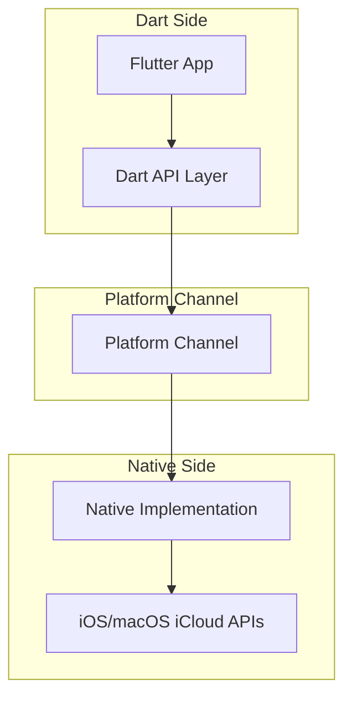
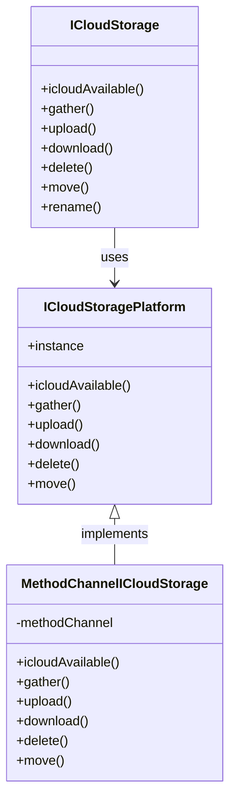
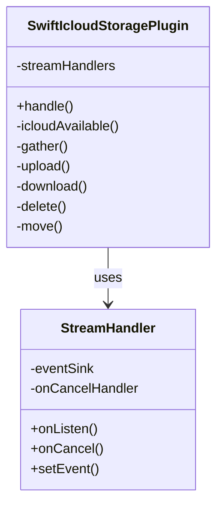
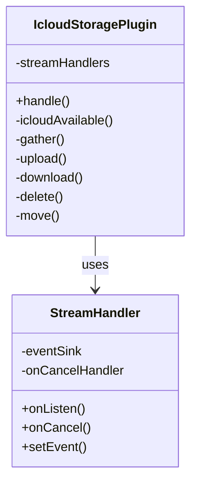
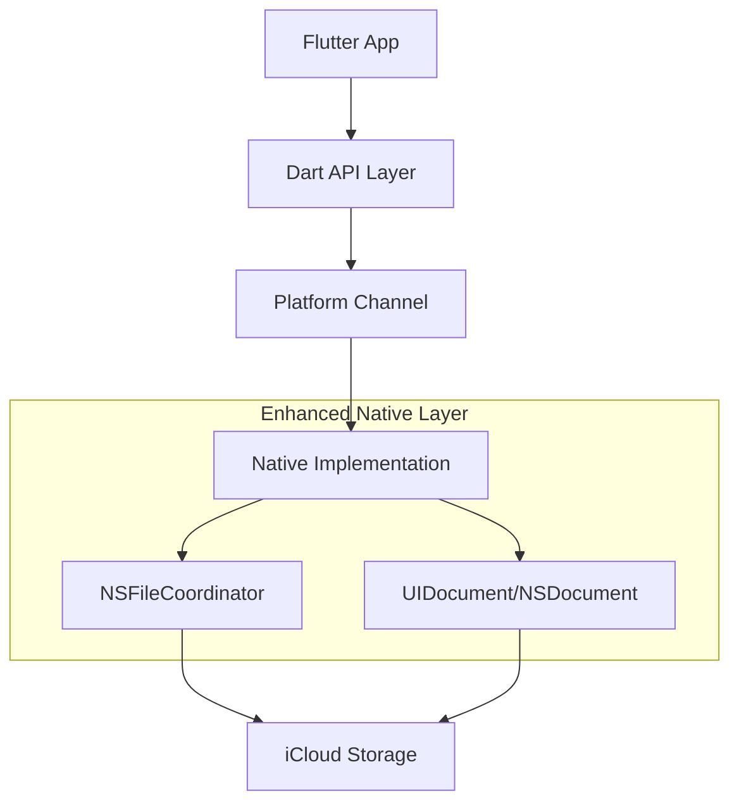

# iCloud Storage Plus System Patterns

## System Architecture

iCloud Storage Plus follows a layered architecture pattern that bridges Flutter applications with Apple's native iCloud storage system:

### Key Components

1. **Dart API Layer**
   - `ICloudStorage` class: Main entry point for developers
   - `ICloudStoragePlatform`: Platform interface defining the contract
   - `MethodChannelICloudStorage`: Implementation of the platform interface using method channels

2. **Platform Channel**
   - Method channel for function calls
   - Event channels for progress monitoring

3. **Native Implementation**
   - iOS: `SwiftIcloudStoragePlugin.swift`
   - macOS: `IcloudStoragePlugin.swift`

4. **iCloud APIs**
   - NSFileManager for basic file operations
   - NSFileCoordinator for coordinated file access
   - NSMetadataQuery for file discovery and monitoring
   - UIDocument/NSDocument for document-based operations (planned)

## Key Technical Decisions

### 1. Platform Channel Architecture

The plugin uses Flutter's platform channel mechanism to communicate between Dart and native code. This follows the standard Flutter plugin architecture pattern:

- **Method Channel**: Used for one-time operations like upload, download, delete
- **Event Channel**: Used for continuous events like progress monitoring

### 2. File Coordination Strategy

The plugin uses NSFileCoordinator for file operations that modify iCloud content:

- **Current Implementation**: Used for delete and move operations
- **Planned Improvement**: Add to upload method and enhance download method
- **Future Enhancement**: Implement document-based approach with UIDocument/NSDocument

### 3. Progress Monitoring

The plugin uses NSMetadataQuery to monitor file upload and download progress:

- Queries are set up to track specific files
- Progress updates are sent through event channels
- Observers are properly cleaned up when operations complete

### 4. Error Handling

The plugin uses a consistent error handling pattern:

- Native errors are wrapped in FlutterError objects
- Error codes are standardized across operations
- Detailed error messages are provided for debugging

## Design Patterns

### 1. Facade Pattern

The `ICloudStorage` class provides a simplified interface to the complex subsystem of iCloud storage operations, hiding the implementation details from the developer.

### 2. Platform Interface Pattern

The plugin uses Flutter's platform interface pattern to allow for alternative implementations:

- `ICloudStoragePlatform` defines the interface
- `MethodChannelICloudStorage` provides the default implementation
- Alternative implementations can be registered if needed

### 3. Observer Pattern

The plugin uses the observer pattern for monitoring file operations:

- NSMetadataQuery observers for file status changes
- Event channels to stream updates to Dart code

### 4. Factory Method Pattern

The plugin uses factory methods to create appropriate instances based on the platform:

- Platform-specific implementations are selected at runtime
- Common interface ensures consistent behavior

## Component Relationships

### Dart Side Components

### Native Side Components (iOS)

### Native Side Components (macOS)

## Future Architecture (with Document-Based Approach)

This architecture will provide better integration with iCloud's document-based storage system, improving reliability and conflict handling.
